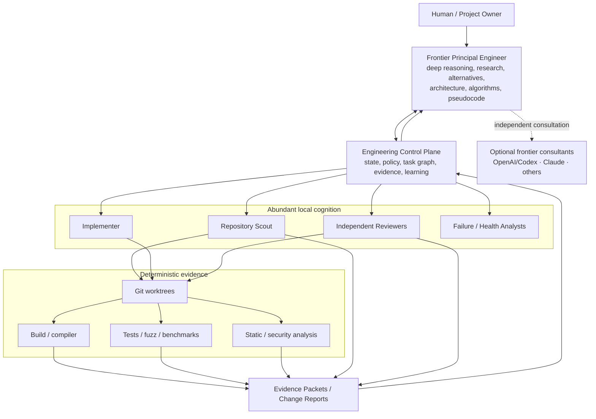
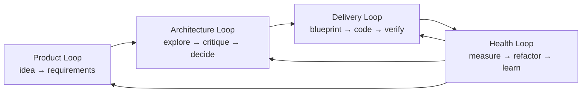

# DevCadience

**DevCadience is a local-first intelligent software-development control plane.** It combines scarce frontier-model reasoning with abundant local-model cognition through explicit engineering protocols, evidence-backed project state, deterministic verification, independent review, and risk-based escalation.

The central idea is simple:

> Spend frontier intelligence on the decisions where intelligence has the greatest leverage. Spend local inference on the high-volume work of repository exploration, implementation, testing, critique, and repeated verification.

DevCadience is not intended to be another chat-based coding assistant. It is designed as a persistent engineering organization that can accompany a project from a vague idea through research, architecture, implementation, refactoring, long-term evolution, and learning from previous mistakes.

## Core thesis

Modern frontier models are valuable because they can reason deeply, compare alternatives, research current external knowledge, consult other models, design interfaces and algorithms, and produce detailed implementation guidance. Their weakness in long coding sessions is economic and contextual: repeatedly ingesting large repositories, compiler output, logs, test failures, and nearly identical source revisions wastes limited context and paid or quota-bound inference.

Strong local models have the complementary profile. On modern Apple Silicon they can repeatedly inspect source, search a repository, implement detailed plans, compile, test, debug, and review changes at essentially zero marginal token cost. They should not routinely be asked to rediscover architecture while coding.

DevCadience creates a strict information boundary between those roles.

## The intelligence hierarchy



Frontier consultants such as OpenAI/Codex or Claude may be invoked through provider adapters when independent reasoning, adversarial review, or escalation is warranted.

## Non-goals

DevCadience is not:
- a system that blindly replaces engineers;
- a prompt wrapper around one model;
- an attempt to minimize all frontier-model calls;
- a mechanism that lets local agents silently modify architecture;
- a self-modifying agent that rewrites its own rules without review;
- a benchmark-chasing coding demo optimized for shortest wall-clock latency.

Time is intentionally a secondary optimization target. For important work, hours of research, critique, alternative analysis, prototypes, and consultant review before implementation are acceptable. Durable design errors are usually more expensive than slow deliberation.

## Four continuous loops

DevCadience treats software engineering as four coupled loops:

1. **Product loop** — idea, problem framing, requirements, non-goals, constraints, research, validation.
2. **Architecture loop** — alternatives, assumptions, critique, consultant review, ADRs, invariants, baseline.
3. **Delivery loop** — scouting, frontier-authored Engineering Work Packages, local implementation, verification, independent review, integration.
4. **Health loop** — code-health measurement, refactoring epochs, architecture reconciliation, postmortems, learning and policy improvement.

The loops continuously feed one another:



See [docs/LIFECYCLE.md](docs/LIFECYCLE.md).

## Discovery before architecture

DevCadience does not assume a human arrives with a complete specification. A dedicated **Discovery Principal** collaborates with the human, local evidence, current external research, experiments, and independent consultants to turn a fuzzy idea into a versioned ProblemModel and evidence-backed requirements.

The Discovery Principal maintains an **Ambiguity Ledger**, asks only the highest-impact questions that require human authority, reflects its current interpretation back to the human, and runs an independent specification red-team before architecture begins.

Architecture is gated by **Specification Readiness**: remaining unknowns must either be resolved or explicitly safe to defer.

See [docs/DISCOVERY_AND_SPECIFICATION.md](docs/DISCOVERY_AND_SPECIFICATION.md).

## The most important artifact: Engineering Work Package

A local coding model should receive more than a task title. For non-trivial work, the frontier principal produces a detailed Engineering Work Package containing:
- objective and architectural intent;
- verified assumptions and evidence references;
- alternatives considered and why they were rejected;
- required interfaces and contracts;
- recommended implementation strategy;
- algorithms and pseudocode;
- code/interface sketches where useful;
- existing repository patterns to follow;
- edge cases and failure modes;
- MUST / SHOULD / SUGGESTED / LOCAL_DISCRETION guidance;
- acceptance criteria;
- verification plan;
- forbidden changes;
- explicit escalation conditions.

The Work Package is a compiled form of frontier reasoning. It should reduce the amount of architectural invention left to smaller models without over-specifying repository mechanics that local agents can observe more accurately.

## Canonical project state

The principal does not rely on a huge chat transcript as project memory. DevCadience maintains a compact, versioned Engineering State Model containing:
- current revision and baseline commit;
- product intent and active milestone;
- component state and public contracts;
- invariants and ADRs;
- completed, active and blocked tasks;
- semantic changes since the previous known state;
- verification health;
- code-health signals;
- open questions, risks and required decisions;
- agent/model capability state;
- provenance to raw evidence when deeper inspection is needed.

The state is derived from append-only engineering events where practical so that decisions are auditable and state can be reconstructed.

## Evidence before confidence

Model confidence is not evidence. DevCadience distinguishes:
- deterministic facts from tools and tests;
- repository observations with exact provenance;
- model interpretations;
- assumptions;
- disagreements;
- unknowns.

Local scouts return structured Evidence Packets, not vague summaries. Frontier models can request progressively deeper evidence only when needed.

## Deliberate self-challenge

The principal engineer is required to assume it can be confidently wrong. For systemic and architectural decisions it must:
- identify assumptions explicitly;
- verify material assumptions;
- generate credible alternatives;
- challenge the preferred approach;
- search for counterexamples and hidden failure modes;
- consult current external sources when facts may have changed;
- seek independent consultant views when disagreement is useful;
- revisit its conclusion after new evidence;
- document unresolved uncertainty before implementation begins.

The first plausible solution is not automatically the final solution.

## Local execution philosophy

Local inference is treated as abundant. DevCadience may intentionally use:
- repeated repository scouting;
- independent clean-context reviewers;
- different models for different review vectors;
- N-version implementation for risky work;
- adversarial test generation;
- long fuzz/property/mutation-test runs;
- repeated refactoring reviews;
- overnight execution and verification.

The scheduler optimizes primarily for correctness and durable quality, not lowest latency.

## Planned refactoring

Long-running LLM implementation can accumulate the same local optimizations and global smells seen in human development, amplified by autonomous repetition. Refactoring is therefore a planned lifecycle phase rather than optional cleanup.

DevCadience schedules **Refactoring Epochs** and periodic **Architecture Reconciliation** to detect:
- duplicated or overlapping abstractions;
- layer leakage;
- API growth;
- inconsistent domain vocabulary;
- configuration proliferation;
- unnecessary wrappers;
- excessive defensive code;
- dead code;
- dependency cycles;
- test architecture degradation;
- divergence between documented architecture and implemented reality.

See [docs/REFACTORING_AND_HEALTH.md](docs/REFACTORING_AND_HEALTH.md).

## Repository documentation

Start here:

| Document | Purpose |
| --- | --- |
| [AGENTS.md](AGENTS.md) | Mandatory operating instructions for coding agents |
| [INVARIANTS.md](INVARIANTS.md) | Non-negotiable system and engineering invariants |
| [ENGINEERING_STANDARDS.md](ENGINEERING_STANDARDS.md) | Coding, protocol, testing, and change-management standards |
| [docs/README.md](docs/README.md) | Visual documentation map and recommended reading paths |
| [docs/VISION.md](docs/VISION.md) | Product vision, goals, philosophy, success criteria |
| [docs/DISCOVERY_AND_SPECIFICATION.md](docs/DISCOVERY_AND_SPECIFICATION.md) | Day-0 human collaboration, ambiguity resolution, requirements provenance, spec red-team and readiness |
| [docs/REQUIREMENTS.md](docs/REQUIREMENTS.md) | Functional/non-functional requirements and bootstrap acceptance |
| [docs/ARCHITECTURE.md](docs/ARCHITECTURE.md) | System architecture and component boundaries |
| [docs/LIFECYCLE.md](docs/LIFECYCLE.md) | Day-0 through long-term project lifecycle |
| [docs/PRINCIPAL_ENGINEER.md](docs/PRINCIPAL_ENGINEER.md) | Frontier-model cognition and challenge protocol |
| [docs/PROTOCOLS.md](docs/PROTOCOLS.md) | Typed semantic contracts and state transitions |
| [docs/PROJECT_STATE.md](docs/PROJECT_STATE.md) | Canonical Engineering State Model |
| [docs/LOCAL_AGENTS.md](docs/LOCAL_AGENTS.md) | Scout, implementer, reviewer and validator roles |
| [docs/MCP_API.md](docs/MCP_API.md) | Semantic principal-facing MCP surface |
| [docs/ANTIGRAVITY_INTEGRATION.md](docs/ANTIGRAVITY_INTEGRATION.md) | Concrete Antigravity workspace, MCP, plugin, skill, rules and permissions setup |
| [docs/MODEL_RUNTIME.md](docs/MODEL_RUNTIME.md) | Ollama/MLX-style local runtime and resource management |
| [docs/CONSULTANTS.md](docs/CONSULTANTS.md) | Frontier consultant adapters and independent-review rules |
| [docs/VERIFICATION.md](docs/VERIFICATION.md) | Deterministic and model-assisted verification |
| [docs/REFACTORING_AND_HEALTH.md](docs/REFACTORING_AND_HEALTH.md) | Code-health model and refactoring epochs |
| [docs/LEARNING.md](docs/LEARNING.md) | Trajectories, lesson candidates, evaluation and promotion |
| [docs/SECURITY.md](docs/SECURITY.md) | Trust boundaries, permissions, credentials and sandboxing |
| [docs/OBSERVABILITY.md](docs/OBSERVABILITY.md) | Audit trail, metrics, tracing and operational visibility |
| [docs/IMPLEMENTATION_PLAN.md](docs/IMPLEMENTATION_PLAN.md) | Milestones and bootstrap plan |
| [docs/SETUP.md](docs/SETUP.md) | Proposed local setup and development environment |
| [docs/adr/0000-template.md](docs/adr/0000-template.md) | Architecture Decision Record template |
| [docs/adr/](docs/adr/) | Accepted ADRs (0001–0005 were decided during M1) |

Machine-readable schema definitions live under [schemas/](schemas/). Frontier behavior sources include [skills/antigravity-discovery/](skills/antigravity-discovery/) for Day-0 specification work and [skills/antigravity-principal/](skills/antigravity-principal/) for architecture/delivery. The installable Antigravity adapter skeleton lives under [integrations/antigravity/devcadience/](integrations/antigravity/devcadience/). Local role templates are under [prompts/](prompts/) and an illustrative project policy is in [config/project.example.yaml](config/project.example.yaml).

## Proposed implementation shape

The initial implementation is expected to use:
- a local daemon/control plane, preferably Go;
- SQLite for durable control-plane state and event metadata;
- Git and isolated worktrees for concurrent change execution;
- MCP as the semantic interface exposed to Antigravity or other principal frontends;
- Ollama and/or MLX-LM adapters for local model execution;
- pluggable worker harnesses rather than a hard dependency on one coding agent;
- optional consultant adapters for Codex, Claude, or other frontier systems;
- deterministic test/lint/build/static-analysis runners;
- a CLI first, with a web dashboard later.

These are architectural defaults, not unchangeable dogma. Changes require evidence and an ADR when they affect durable boundaries.

## Bootstrap success criterion

The first important experiment is intentionally narrow:

> Can a frontier principal successfully drive several real implementation tasks through DevCadience while consuming compact state/evidence and almost no raw repository source, with the resulting changes matching a detailed frontier-authored Work Package and passing deterministic plus independent local review?

If that hypothesis fails, the architecture must be revised before adding autonomous campaigns or self-improvement.

## Running the control plane

M1 is implemented, so the control plane can be built and driven locally. No
model runtime is required and none is contacted.

```bash
go build -o bin/devcadience ./cmd/devcadience

# Initialise a project. The database lives at
# $DEVCADIENCE_HOME/state/control-plane.db (default ~/.devcadience); pass
# -db to override it.
bin/devcadience project init -id demo -name Demo   -milestone-id M1 -milestone-title "Domain core"

bin/devcadience task create -project demo -alias DC-001   -title "Bounded journal reads" -class systemic

bin/devcadience state show   -project demo      # canonical ProjectState
bin/devcadience events list  -project demo      # the engineering journal
bin/devcadience task show    -project demo -task DC-001
bin/devcadience task states                     # the lifecycle
bin/devcadience event types                     # the event vocabulary
```

Engineering events are appended as typed payloads, which is how a synthetic
project is driven through its lifecycle:

```bash
bin/devcadience event append -project demo -type TaskDesignStarted   -task DC-001 -payload '{"reason":"initial design"}'
```

The materialised state is derived, never authoritative. It can be destroyed
and rebuilt from the journal alone:

```bash
bin/devcadience state rebuild -project demo
bin/devcadience state show -project demo -at 4   # any historical revision
```

Verification:

```bash
make verify        # go vet ./... && go test ./... && schema validation
make race          # the suite under the race detector
```

## Status

DevCadience has completed **M0 (normative baseline)** and **M1 (domain core
and canonical state)**: typed protocol records — including the Day-0 discovery
and specification contracts — an append-only engineering event journal, a
deterministic ProjectState reducer, the task and attempt state machines,
SQLite persistence with explicit migrations, JSON Schema validation tooling
and a CLI.

The discovery *records* are typed and persisted; the discovery *workflow*
that produces them is not part of M1.

Everything above the control-plane core — repository and worktree execution,
local model runtimes, the semantic MCP surface, consultants, health and
learning — remains unimplemented and belongs to
[M2 onward](docs/IMPLEMENTATION_PLAN.md).

