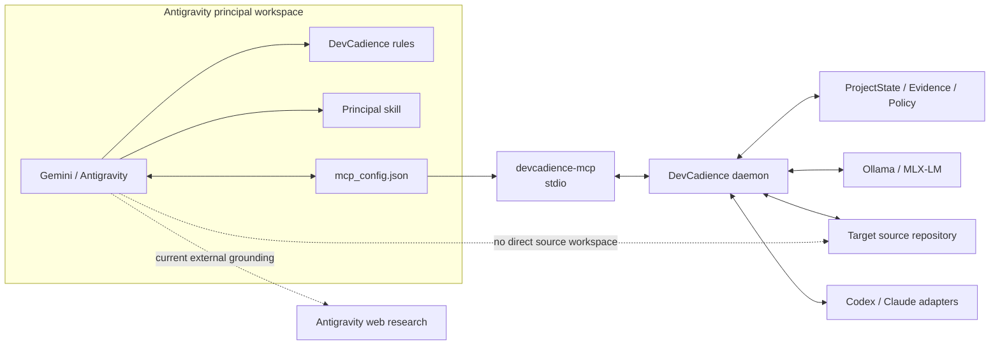
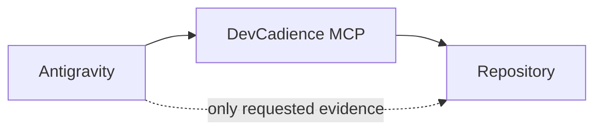
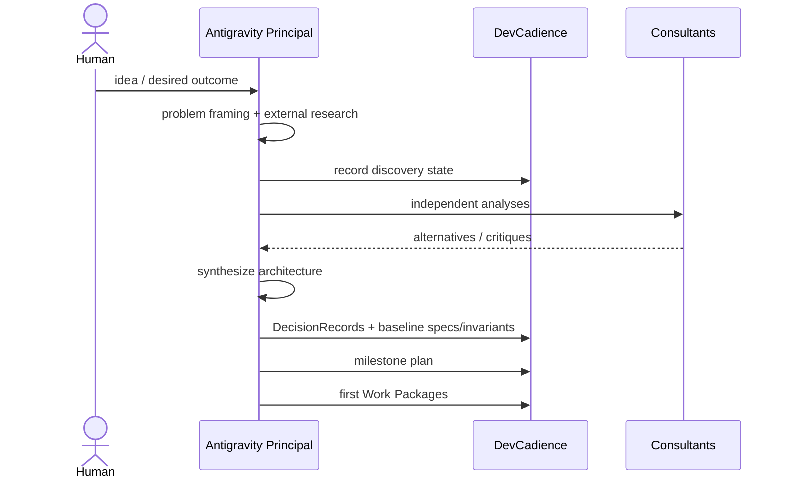
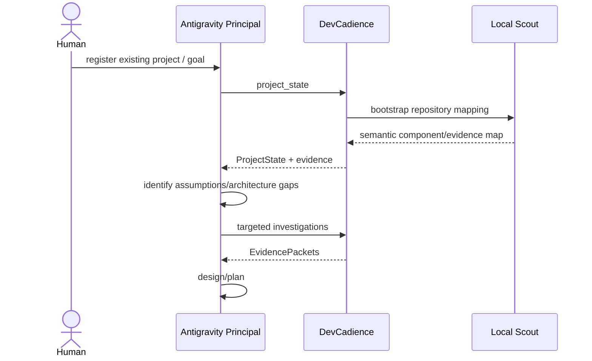

# Antigravity Integration

## Scope

This document defines the concrete integration between Google Antigravity and DevCadience.

Antigravity is the first supported **frontier principal frontend**. It is not the DevCadience control plane and should not normally act as the repository implementation worker.

This document is intentionally product-specific. The core DevCadience architecture remains provider/frontend independent.

## 1. Supported Antigravity concepts

Current Antigravity supports the exact primitives DevCadience needs:

- workspace-local or global MCP servers through `mcp_config.json`;
- local `stdio` MCP servers using `command` + optional `args`, `env`, and `cwd`;
- workspace skills under `.agents/skills/<skill>/SKILL.md`;
- workspace rules under `.agents/rules/`;
- plugins that bundle `plugin.json`, `mcp_config.json`, `skills/`, `rules/`, hooks and agents;
- fine-grained permissions for MCP tools, files, commands and web access.

Current upstream documentation:
- https://antigravity.google/docs/mcp
- https://antigravity.google/docs/skills
- https://antigravity.google/docs/rules-workflows
- https://antigravity.google/docs/plugins
- https://antigravity.google/docs/permissions

Because Antigravity can evolve independently, treat this directory as a versioned adapter. Update it when upstream configuration changes; do not leak Antigravity-specific syntax into DevCadience core protocols.

## 2. Recommended topology

The recommended production-like configuration is **strict principal workspace mode**.



The target source repository is **not opened as the Antigravity workspace** in strict mode.

Antigravity sees:
- DevCadience semantic MCP tools;
- compact ProjectState;
- EvidencePackets;
- Work Packages and decisions;
- selected evidence requested through MCP;
- internet/browser research when permitted.

The DevCadience daemon owns direct repository access.

## 3. Why use a separate principal workspace

Opening the target source repository directly in Antigravity weakens the information firewall because workspace files are normally visible to the agent.

A separate principal workspace:
- prevents accidental whole-repository ingestion;
- makes semantic MCP usage the path of least resistance;
- preserves frontier quota/context;
- makes direct source escalation deliberate;
- reduces the chance that repository prompt injection gains principal-level authority;
- makes the architecture testable: we can measure whether the principal succeeds without ambient source access.

This is the recommended mode for the M5 central-hypothesis experiment.

## 4. Workspace layout

A principal workspace may be nearly empty:

```text
~/devcadience-workspaces/hearthmind-principal/
  PROJECT.md
  .agents/
    mcp_config.json
    rules/
      devcadience-principal.md
    skills/
      devcadience-principal/
        SKILL.md
```

Alternatively, install the bundled DevCadience plugin globally and keep only `PROJECT.md` in the workspace.

`PROJECT.md` should contain human-facing project identity and operator goals, not a copied source tree.

Example:

```markdown
# HearthMind Principal Workspace

DevCadience project ID: hearthmind

The authoritative source repository is managed by DevCadience.
Use the DevCadience MCP tools for project state, repository evidence,
implementation delegation, validation, review and acceptance.

Current operator objective:
Complete milestone M1 while preserving all active invariants.
```

## 5. MCP configuration

Antigravity currently discovers workspace MCP configuration at:

```text
<workspace>/.agents/mcp_config.json
```

and global MCP configuration at:

```text
~/.gemini/config/mcp_config.json
```

The standard format contains one `mcpServers` object.

DevCadience defines this bootstrap executable contract:

> Running `devcadience-mcp` with no arguments starts the stdio MCP server.

Therefore the workspace configuration is:

```json
{
  "mcpServers": {
    "devcadience": {
      "command": "devcadience-mcp",
      "env": {
        "DEVCADIENCE_PROJECT_ID": "hearthmind"
      }
    }
  }
}
```

If the binary is not on PATH:

```json
{
  "mcpServers": {
    "devcadience": {
      "command": "/absolute/path/to/devcadience-mcp",
      "env": {
        "DEVCADIENCE_PROJECT_ID": "hearthmind"
      }
    }
  }
}
```

Optional `cwd` may be set to a DevCadience runtime/configuration directory. It SHOULD NOT need to be the target source repository.

## 6. MCP server responsibilities

The Antigravity-facing MCP server exposes semantic tools, not source primitives.

Bootstrap tools:

```text
project_state
investigate
create_work_package
delegate
task_status
validate
review
request_evidence
record_decision
accept
reject
```

Later:

```text
consult
classify_change
health_report
plan_refactoring_epoch
architecture_reconcile
lesson_candidates
promote_lesson
integration_plan
cancel_attempt
```

See [MCP_API.md](MCP_API.md).

## 7. Plugin packaging

DevCadience includes a plugin skeleton under:

```text
integrations/antigravity/devcadience/
  plugin.json
  mcp_config.json
  skills/
    devcadience-principal/
      SKILL.md
  rules/
    principal-boundary.md
```

Antigravity supports:
- workspace plugins under `.agents/plugins/`;
- global plugins under `~/.gemini/config/plugins/`;
- CLI installation using `agy plugin install /path/to/plugin`.

### Development install

After building `devcadience-mcp` and placing it on PATH:

```bash
agy plugin install ./integrations/antigravity/devcadience
agy plugin list
```

For the standalone IDE, the plugin directory may instead be copied to:

```text
~/.gemini/config/plugins/devcadience/
```

or workspace-local:

```text
<principal-workspace>/.agents/plugins/devcadience/
```

## 8. Skill behavior

The plugin skill teaches Antigravity to:
- behave as a patient frontier principal;
- verify assumptions;
- generate alternatives;
- use external/current grounding;
- consult independent frontier systems;
- produce detailed implementation guidance;
- include pseudocode and code/interface sketches;
- classify MUST / SHOULD / SUGGESTED / LOCAL_DISCRETION;
- delegate repository-heavy work;
- request progressive evidence;
- schedule refactoring and architecture reconciliation.

The skill is not merely a “save tokens” instruction.

Its core objective is:

> maximize the quality and durability of frontier reasoning while minimizing low-value frontier context ingestion.

## 9. Rule behavior

The plugin rule is an always-applicable principal boundary in plugin deployments.

It states that normal engineering work should go through DevCadience semantic tools and that Antigravity must not silently become the implementation worker.

Rules are deliberately shorter than the full skill. They enforce durable boundaries; the skill describes the richer procedure.

## 10. Permissions

Antigravity's current permission engine can separately control:
- `mcp(server/tool)`;
- `read_file(path)`;
- `write_file(path)`;
- `command(prefix)`;
- `read_url(domain)` / web actions.

Deny rules take precedence over Ask and Allow.

### Recommended development permissions

Start conservatively:

- permission preset: **Default** or **Request Review**, not Turbo;
- allow DevCadience read/analysis MCP tools without repeated prompts once trusted;
- optionally Ask for higher-authority DevCadience tools such as `accept`, `record_decision`, and future destructive/integration operations;
- do not grant arbitrary command execution merely to make orchestration convenient;
- do not enable non-workspace access to the target repository in strict mode;
- allow web reading/search as appropriate because current external grounding is part of the principal role.

Conceptual permission policy:

```text
ALLOW:
  mcp(devcadience/project_state)
  mcp(devcadience/investigate)
  mcp(devcadience/task_status)
  mcp(devcadience/request_evidence)
  mcp(devcadience/validate)
  mcp(devcadience/review)

ASK initially:
  mcp(devcadience/create_work_package)
  mcp(devcadience/delegate)
  mcp(devcadience/record_decision)
  mcp(devcadience/accept)
  mcp(devcadience/reject)
  mcp(devcadience/consult)

DENY / avoid:
  arbitrary repository filesystem access outside principal workspace
  arbitrary unsandboxed shell
  destructive Git operations outside DevCadience
```

Exact permission-list persistence syntax is intentionally not hard-coded here unless validated against the installed Antigravity version. Configure through Antigravity Settings/Permissions or `/permissions`; the resource names above are the stable policy intent.

## 11. Two operating modes

### Strict mode — recommended for evaluation and normal autonomous work



Properties:
- target repo not in workspace;
- no ambient source access;
- semantic MCP first;
- progressive evidence;
- strongest measurement of frontier-context savings.

### Assisted mode — emergency / bootstrap convenience

Antigravity may open the target repository and use native file tools.

Use when:
- DevCadience itself is incomplete;
- debugging the MCP/control plane;
- an architecture escalation explicitly requires broad direct inspection.

Assisted mode weakens the central architecture and should be visible in trajectory metadata.

## 12. External web grounding

The principal is expected to use Antigravity's browser/web abilities for material current facts.

The design protocol should distinguish:
- current external fact;
- source and date;
- inference;
- recommendation.

External research should not bypass DevCadience project decisions. Grounding informs the principal, which records durable conclusions as DecisionRecords/ADRs/Work Packages.

## 13. Consultants

Consultants should normally be invoked through DevCadience's semantic `consult` operation rather than by teaching Antigravity provider-specific CLI commands.

This enables:
- normalized requests/results;
- anti-anchoring blind first passes;
- quota tracking;
- privacy policy;
- trajectory capture;
- future provider replacement.

Examples:
- Codex/OpenAI consultant;
- Claude consultant;
- specialized remote model.

Antigravity remains the principal that reconciles competing analyses.

## 14. Starting a new greenfield project

A greenfield project does not need an existing source repository.



The project enters source implementation only after appropriate design readiness.

## 15. Starting on an existing repository



Do not ask the principal to ingest the entire repository merely because no prior DevCadience state exists.

## 16. Expected first conversation

A useful operator prompt after configuration is:

```text
Act as the DevCadience principal engineer for the configured project.

Read the canonical project state through DevCadience.
Do not begin implementation yet.

Assess the current milestone, unresolved risks and required decisions.
For any systemic work, verify assumptions through targeted local investigation,
consider alternatives, use current external grounding and independent consultants
when useful, and only then create detailed Engineering Work Packages.

Optimize for engineering quality, not response speed.
```

The plugin skill/rules should make most of this redundant, but it is a useful smoke test.

## 17. Verification checklist

Before declaring Antigravity integration functional:

- [ ] `devcadience-mcp` is on PATH or configured by absolute path.
- [ ] Antigravity shows the `devcadience` MCP server connected.
- [ ] Principal skill is discoverable.
- [ ] Principal rule is active.
- [ ] `project_state` works.
- [ ] `investigate` invokes local repository scouting.
- [ ] target source repository is not directly visible in strict mode.
- [ ] web research still works under chosen permission policy.
- [ ] `create_work_package` persists a schema-valid package.
- [ ] `delegate` starts an isolated local Attempt.
- [ ] principal receives compact status/evidence, not raw execution chatter.
- [ ] permission prompts match intended authority.
- [ ] all actions appear in DevCadience audit/trajectory records.

## 18. Version drift

Antigravity is an external product and configuration can change.

The integration layer MUST:
- record the upstream behavior/version it was tested against;
- keep product-specific files under `integrations/antigravity/`;
- avoid encoding Antigravity paths/formats in core domain types;
- update this guide and plugin together when upstream syntax changes.

The current baseline was written against Antigravity documentation available in September 2026.
