# DevCadence Architecture

## Scope and authority

This document defines the target architecture and durable component boundaries for DevCadence. It is normative for system structure but intentionally leaves replaceable model/provider choices to configuration and adapters.

## 1. Architectural thesis

DevCadence separates **high-value cognition** from **high-volume cognition**.

- Frontier principals spend context on product intent, architecture, alternatives, algorithms, current external grounding, consultant synthesis, and detailed Engineering Work Packages.
- Local agents spend abundant inference on repository exploration, implementation, debugging, repeated review, and verification.
- Deterministic tools establish facts wherever possible.
- The control plane keeps canonical project state, lineage, policy, task state, learning, and evidence outside any model conversation.

The principal should not be starved of reasoning. It should be starved of irrelevant repository noise.

## 2. System context

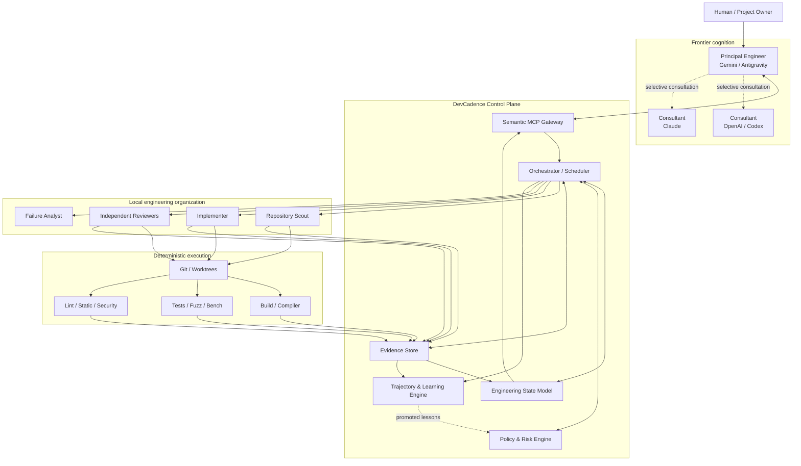

## 2A. Product-definition boundary

Before the architecture/delivery principal acts, DevCadence may be in Discovery mode.

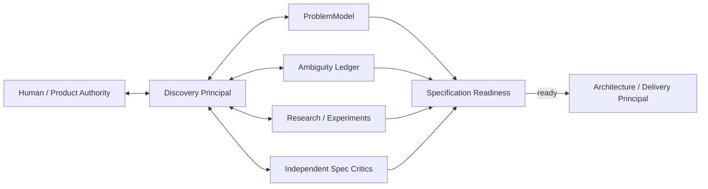

Discovery and architecture are different cognitive modes even if the same frontier model instance performs both.

The Discovery Principal owns interpretation and disambiguation; the Architecture Principal owns solution design after product semantics are sufficiently grounded.

The control plane persists both modes through the same project/event/evidence infrastructure.

## 3. Control-plane boundaries

The initial implementation is a **modular monolith**, not a fleet of network services.

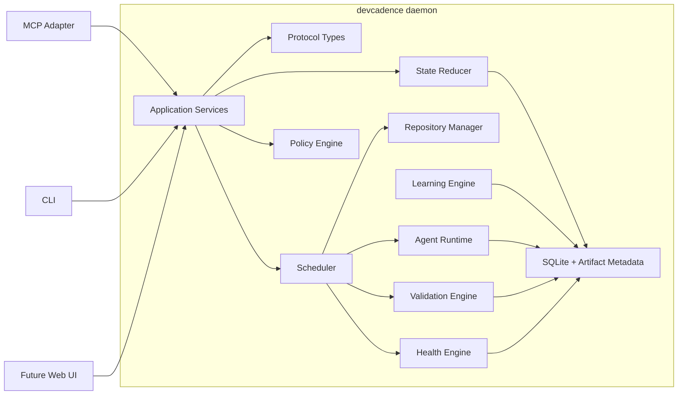

MCP, CLI, and future UI are adapters. They must not contain orchestration policy or durable business logic.

## 4. Semantic information firewall

The preferred principal interface is semantic rather than filesystem-shaped.

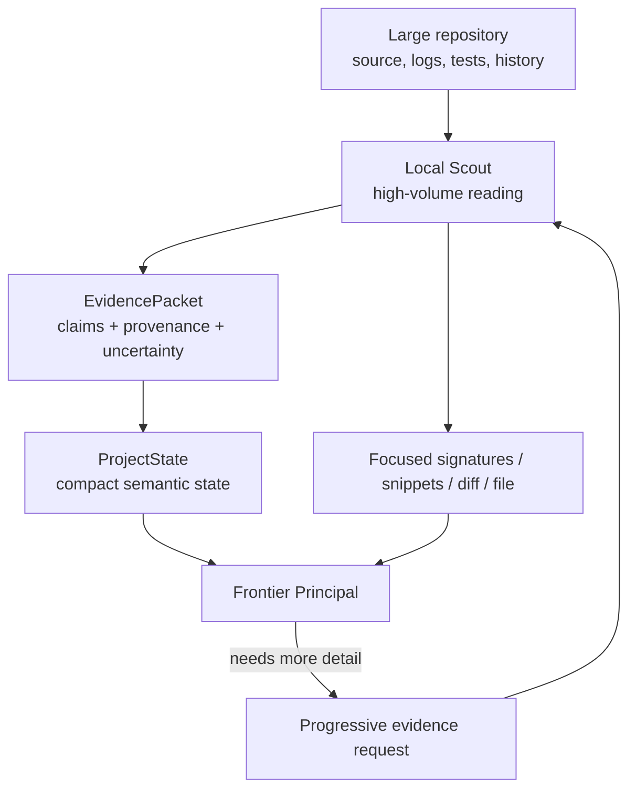

Normal operation should keep the principal at semantic depth levels 0–2:

1. state/metadata;
2. structured local conclusions with provenance;
3. signatures or focused snippets;
4. relevant diff;
5. complete selected files;
6. direct repository exploration.

Escalating evidence depth is permitted. Starting at maximum context is not preferred.

## 5. Adaptive cognition execution path

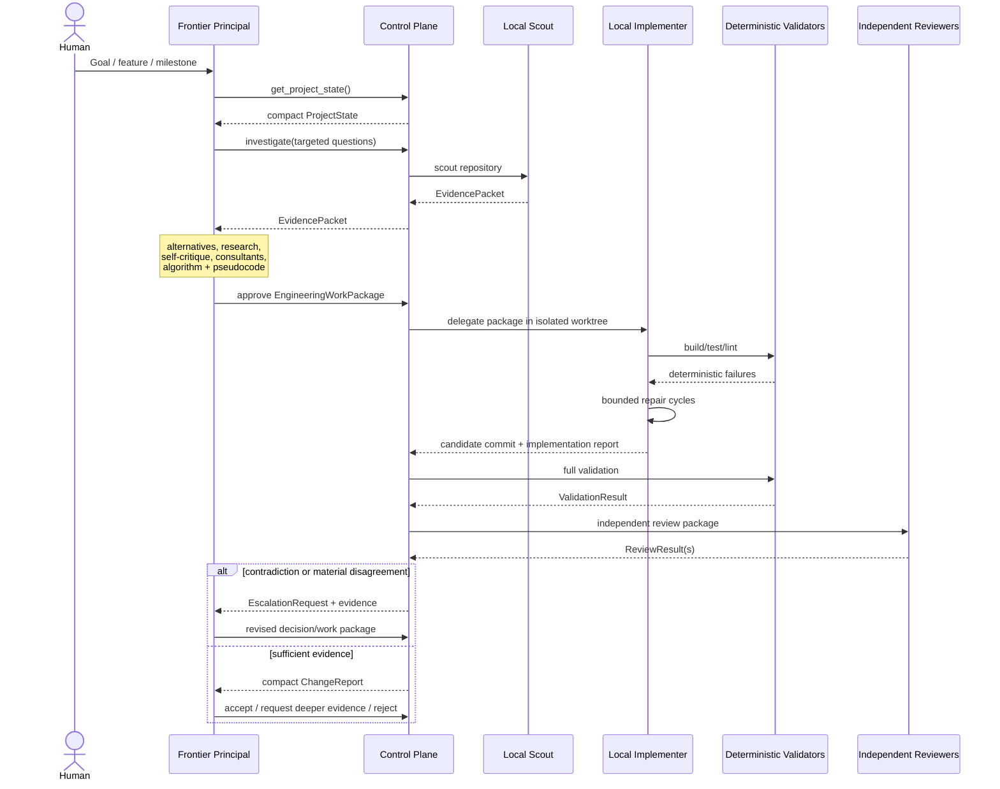

The sequence is illustrative, not a fixed topology. The Workflow Planner may collapse, expand or diversify cognition roles according to task risk, the validated Cognition Portfolio, user policy and current resource state. Deterministic validation and acceptance gates remain stable even when cognition topology changes.

## 6. Core domain components

### 6.1 Project registry
Tracks projects, repositories, configuration, capabilities, policies, baselines and active milestones.

### 6.1A Discovery and specification service
Stores ProblemModel revisions, Ambiguity Ledger entries, ProductDecisions, requirements with provenance, DiscoveryExperiments, specification-review results and SpecificationReadiness.

It provides compact discovery state to frontier sessions and keeps raw conversation from becoming the sole product-memory mechanism.

### 6.1B Project adoption service
Owns brownfield retrospective reconstruction and the transition from a merely registered repository to a DevCadence-managed project.

It coordinates:
- repository/document inventory;
- code/test/schema/history evidence;
- ambiguity and contradiction tracking;
- candidate canonical project documentation;
- isolated adoption-baseline materialization;
- Adoption Readiness;
- the accepted source/baseline commit boundary.

Registration alone does not imply readiness. Before adoption READY, normal managed implementation/acceptance/integration is gated.

The required canonical baseline and workflow are defined in [PROJECT_ADOPTION.md](PROJECT_ADOPTION.md).

### 6.2 Engineering State Model
A compact semantic representation of the current project. See [PROJECT_STATE.md](PROJECT_STATE.md).

### 6.3 Event journal
Stores durable engineering transitions. The current state is a materialized view/reduction over these facts plus Git-derived facts where appropriate.

### 6.4 Task graph
Represents milestones, tasks, dependencies, readiness, attempts, blockers and integration order.

### 6.5 Engineering Work Package service
Stores versioned frontier-authored implementation blueprints.

### 6.6 Evidence service
Stores structured claims and references to raw artifacts without forcing raw artifacts into every model context.

### 6.7 Cognition resource plane

The cognition resource plane exposes replaceable cognition endpoints and invocation/session drivers. Endpoints may be local runtimes, authenticated coding/agent CLIs or SDKs, remote APIs, or future policy-compatible workers. Roles are not endpoint kinds and provider/model identity does not imply role.

M3A remains the factual substrate:

```text
internal/environment    observed machine/software facts
        │
        ▼
internal/cognition      endpoint discovery, probes, capability evidence
        │
        ▼
runtime / codingcli / remoteapi adapters selected at the edge
```

`internal/principalhosts` remains orthogonal: a principal host is a human-facing frontend, not automatically a cognition endpoint.

### 6.7A Resource inventory and economics

A deterministic ResourceInventory combines hardware/accelerator facts, cognition endpoints and capability evidence, session features, credential/auth readiness, configured EconomicRegime/BudgetPool bindings, dynamic BudgetState where safely observable, and user/project privacy/spending policy.

Economics attach to access paths, not model families. The same model through a subscription CLI and a metered API is represented as distinct endpoints/budget bindings.

### 6.7B Cognition Portfolio Planner

Once a sufficiently capable policy-allowed endpoint exists, an AI-assisted Portfolio Planner may synthesize PortfolioRecommendations from ResourceInventory + project needs + user policy + historical outcome evidence.

The planner has no authority to activate arbitrary configuration. Typed output passes deterministic validation before becoming an active CognitionPortfolio.

### 6.7C Workflow Planner

The Workflow Planner compiles task/risk requirements plus the active CognitionPortfolio and current resource state into a WorkflowPlan. It may choose one bounded cognition session, distinct Principal/Implementer/Reviewer endpoints, abundant local repair loops with scarce subscription escalation, provider-diverse review for high-risk work, or deterministic-only behavior.

The workflow topology itself is routable. More model calls are not automatically better.

See [COGNITION_PORTFOLIO.md](COGNITION_PORTFOLIO.md) and [ADR-0018](adr/0018-adaptive-cognition-portfolio-and-workflow-synthesis.md).

### 6.7D Credential references and secret isolation

`internal/credentials` provides provider-neutral, opaque authorization locators (`CredentialRefKind`: `env_var`, `cli_session`, `keychain_ref`). DevCadence holds no custody of raw secrets.

Key architectural boundaries:
- `CredentialRef != CognitionEndpoint != AccessChannel != Session != Account != EconomicRegime != CognitionPortfolio`;
- environment variable resolution is presence-only via `os.LookupEnv` without value retention or length inspection;
- CLI session discovery: `--version` proves installation only, never authentication — `BoundedCLIAuthAdapter`'s probe argv can only be granted `cli_auth_call` authority via the closed `AuthProbeDefinition` type (constructed only by a validated function that refuses empty and version/help-shaped argv), so no arbitrary caller-supplied command, and no bare struct literal, can acquire that authority implicitly;
- CLI adapters separate the opaque logical CLI identity matched against `CredentialRef.locator` from the executable path/PATH-resolved name actually started, so `process.Runner`'s controlled environment (`docs/SECURITY.md` §5) applies to real CLI execution, not only to a test double;
- subprocess boundary: `process.Spec.Args` and `process.Spec.Env` are strictly guarded against secret injection, by prefix/keyword shape rather than length, so ordinary long values (e.g. `PATH`) are not misclassified as credentials;
- authentication operations emit zero raw output artifacts, and hostile probe output is discarded rather than logged.

### 6.8 Repository/worktree manager
Provides controlled repository reads, isolated mutations, commits, diffs and integration staging.

### 6.9 Validation engine
Executes deterministic commands and normalizes their evidence.

### 6.10 Review coordinator
Runs bounded ReviewCampaigns. It schedules clean-context review vectors against an immutable candidate, normalizes findings, applies reporting/reopen thresholds, coordinates focused revalidation, and records campaign/closure state.

The principal—not individual reviewers—adjudicates findings and creates the consolidated Repair Work Package. The coordinator must not default to serial unrestricted re-review after every repair.

### 6.11 Consultant service
Normalizes frontier consultant requests and results.

### 6.12 Health engine
Computes structural metrics, runs semantic code-health reviews, and schedules Refactoring Epoch candidates.

### 6.13 Learning engine
Stores trajectories, performs postmortems, proposes lessons and evaluates policy/prompt changes.

### 6.14 Policy engine
Decides:
- required design depth;
- required reviews;
- retry limits;
- escalation thresholds;
- consultant eligibility;
- destructive-operation approval;
- integration gates.

## 6A. Review convergence boundary

~~~mermaid
flowchart LR
    Candidate["Immutable candidate"]
    Reviews["Parallel review vectors"]
    Principal["Principal adjudication"]
    Disposition["FindingDisposition"]
    Repair["Repair Work Package"]
    Revalidate["Focused revalidation"]
    Closure["ClosureDecision"]
    Frozen["Frozen candidate"]

    Candidate --> Reviews --> Principal --> Disposition
    Disposition -->|"FIX_NOW"| Repair --> Revalidate --> Closure
    Disposition -->|"no current repair"| Closure
    Closure -->|"frozen"| Frozen
~~~

The control plane owns campaign state, thresholds, bounded rounds, and freeze/reopen policy. Reviewer models only produce evidence.

See [REVIEW_AND_CONVERGENCE.md](REVIEW_AND_CONVERGENCE.md).

## 7. Protocol object relationships

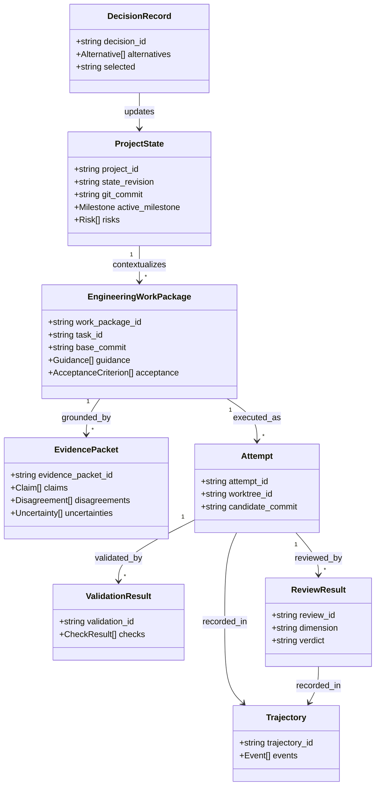

## 8. Agent role architecture

Models are not roles, and locality is not a role.

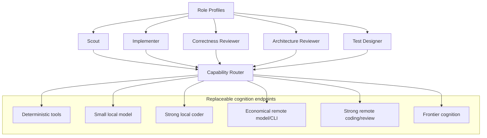

Role policy determines authority and required output. Cognition capability profiles determine routing.

A node with no strong local model may still run repository work, deterministic tools and validation locally while routing implementation cognition to an allowed remote endpoint.

## 9. Consultant architecture

Consultants are optional cognition endpoints selected from what is available and policy-allowed.

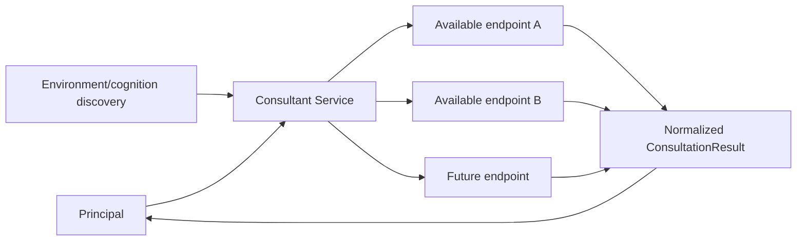

No particular vendor subscription is required. The control plane can issue independent consultant prompts before revealing the principal's candidate solution when avoiding anchoring is useful. If no consultant endpoint exists, the system remains operational with reduced cognitive diversity.

## 10. Storage architecture

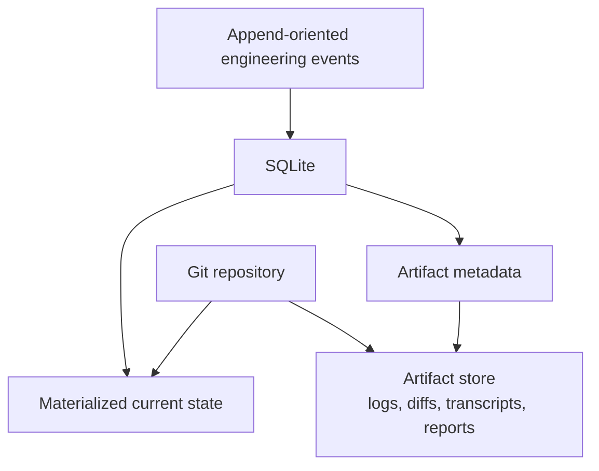

Git remains source of truth for code. SQLite is source of truth for DevCadence control-plane records. Large artifacts should be content-addressed or otherwise immutable where practical.

## 11. Worktree and integration architecture

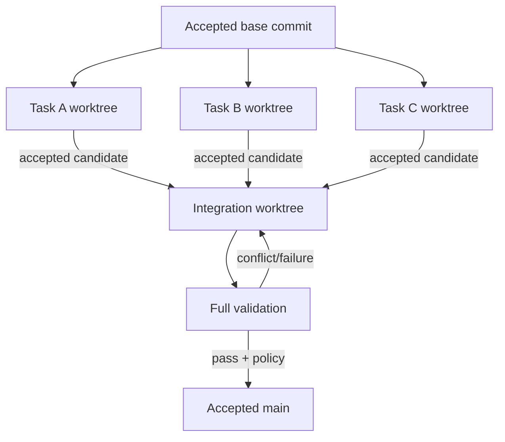

Parallel tasks cannot mutate one shared working directory.

## 11A. Monorepo modules and scoped worktrees

For repositories containing multiple components or languages (e.g. Go backend, TypeScript frontend, Flutter mobile), DevCadence models modules as first-class entities in project state (ADR-0015):

- **Reproducible Catalog:** Discovered manifests (`go.mod`, `package.json`, etc.) serve as discovery evidence; the confirmed module catalog is journaled in project state (`ModuleCatalogRecorded`).
- **Scoped Execution:** Validation profiles and commands execute with `process.Spec.Dir` bound to the module path within the isolated worktree, verifying containment and symlink boundaries.
- **Context Protection:** Reconnaissance tools default to module-local scopes while allowing explicit repository-root escalation.

## 12. Cognition resource plane

Local inference is managed infrastructure, but it is one endpoint class rather than the whole cognition architecture.

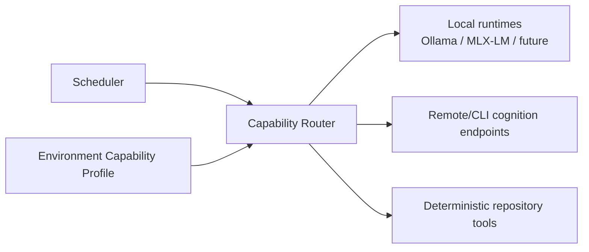

Routing accounts for:
- required role quality/risk;
- verified local acceleration and memory/context resources;
- provider/endpoint health;
- privacy/source-exposure policy;
- monetary/quota cost;
- historical evaluation outcomes.

The absence of local inference is a supported capability state.

## 12A. Supervised validation services and context compaction

Real-world integration and execution requires robust service management and context discipline (ADR-0016):

- **Supervised Services:** Auxiliary test services (Firebase emulators, dev preview servers) run under strict lifecycle supervision with dynamic port allocation, bounded lifetimes, and verified PID/process-group reaping (with full cross-platform executable resolution deferred to daemon execution).
- **Bounded Tools & Universal Pagination:** Process runner outputs are decoupled via `StdoutSink`/`StderrSink`, and `fetch_content` pages through immutable artifact snapshots with strict byte caps and contiguous pagination. Full validation live streaming into artifact storage with inline previews is scheduled with the background runner milestone.
- **Admission-Safe Context Compaction:** Execution sessions apply multi-tier compaction (Tier 1 deterministic tool pruning, Tier 2 episodic trajectory summarization) based on endpoint token limits without arbitrary capacity guessing, preserving the authorized assignment, workspace checkpoints, and privacy boundaries. Exact tokenizer integration and independent summarizer input admission are deferred to cognition host integrations.

## 13. Deployment topology: bootstrap

The bootstrap keeps local authority simple while allowing cognition placement to vary.

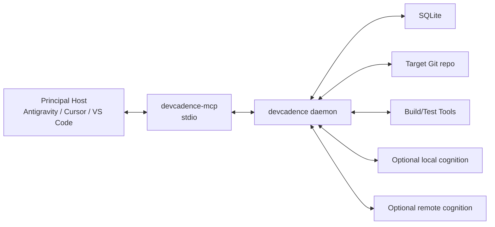

The initial first-class principal-host set is Antigravity, Cursor and Visual Studio Code. Antigravity is the reference integration, not a core dependency. See [PRINCIPAL_HOSTS.md](PRINCIPAL_HOSTS.md).

No DevCadence-hosted cloud service is required. Remote model cognition may be used only when configured/policy-allowed.

Supported bootstrap profiles include:
- strong-local;
- hybrid-thin;
- cloud-cognition with local control plane;
- offline deterministic operation.

## 14. Future topology

Future versions may support:
- multiple local machines;
- remote workers;
- remote artifact stores;
- organization-wide project registry;
- browser dashboard;
- centralized evaluation corpus.

Those are not bootstrap requirements and must not contaminate initial core abstractions with distributed-systems complexity that has not yet been justified.

## 15. Architectural quality criteria

A change improves this architecture when it:
- reduces accidental coupling;
- makes model/provider replacement easier;
- increases evidence quality;
- reduces unnecessary frontier context;
- increases deterministic verification;
- makes escalation more explicit;
- improves replay/auditability;
- preserves local worker bounded authority;
- makes project state more compact without losing provenance.

A change is suspicious when it:
- exposes generic shell/filesystem power to the principal as the primary API;
- stores essential state only in prompts/transcripts;
- binds protocols to one current model;
- lets local agents redefine architecture implicitly;
- treats consensus as truth;
- optimizes latency at the expense of design rigor.
