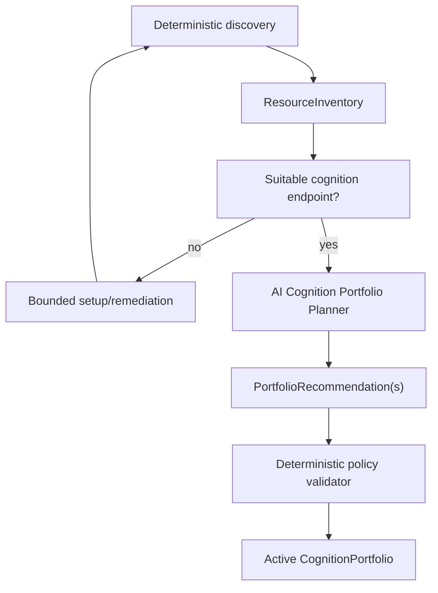

# Adaptive Cognition Portfolio

## Scope

This document defines how DevCadence turns discovered cognition resources into an explainable, policy-compliant engineering organization.

It separates five concerns that must not be conflated:

1. engineering **role**;
2. endpoint **capability/effectiveness**;
3. **access/session channel**;
4. **economic/budget regime**;
5. task-specific **workflow topology**.

The normative architecture decision is [ADR-0018](adr/0018-adaptive-cognition-portfolio-and-workflow-synthesis.md).

## 1. Product principle

DevCadence should bring value on substantially any supported configuration:

- no model cognition;
- one authenticated subscription CLI and no useful GPU;
- several subscriptions and no API spending;
- local MLX on Apple Silicon;
- NVIDIA/other local inference;
- a small Linux box plus remote cognition;
- metered APIs only;
- mixed local + subscription + API resources.

Missing resources reduce the available engineering organization; they do not redefine DevCadence around one reference stack.

## 2. Roles are not models

A role declares requirements. It does not name a provider. Principal, Implementer, Reviewer, Consultant, Scout and Summarizer are role abstractions.

A user may prefer Anthropic for architecture, OpenAI for architecture review, Gemini for code review, and Qwen/MLX or hosted Qwen for implementation. Another user may choose the inverse. DevCadence supports preferences and learns empirical outcomes; it ships no vendor doctrine.

## 3. Cognition endpoint identity

A CognitionEndpoint is a usable path to cognition, not merely a model name.

```yaml
id: codex-subscription-primary
identity:
  provider: openai
  model_family: optional
  model_id: optional
access:
  channel: authenticated_agent_cli
  driver: codex
  account_ref: personal-primary
capabilities:
  architecture: strong
  implementation: strong
  review: strong
economics:
  regime: subscription_quota
  budget_pool: openai-personal
policy:
  source_exposure: tool_mediated_worktree
```

The same underlying model through a direct API is a different endpoint when economics, permissions, tools/session behavior or accounting differ.

## 4. Access channels and session drivers

Representative access channels are local runtime, authenticated agent/coding CLI, official agent/runtime SDK, remote API, and future LAN/remote worker.

A session driver advertises capabilities instead of forcing core code to understand every CLI:
- non-interactive invocation;
- model selection;
- structured final output and streaming events;
- resumable/forkable sessions;
- cancellation;
- worktree binding;
- tool/shell/file-edit capability;
- MCP/tool configuration;
- usage and quota/rate-limit reporting.

Unsupported features fail closed. Principal hosts remain separate human-facing adapters even when one product exposes both a host and a session interface.

## 5. Economics

### EconomicRegime

Initial conceptual regimes:
- `local_compute`;
- `subscription_quota`;
- `metered_api`;
- `prepaid_credits`;
- `enterprise_allocation`;
- `unknown` / future custom regime.

This is not a model-quality hierarchy.

### BudgetPool

A BudgetPool represents the scarce resource consumed by one or more endpoints: a subscription usage pool, API-dollar budget, enterprise allocation, credits, or local compute.

A pool may define spending cap, overage policy, reserve percentage, preferred roles, concurrency and reset cadence even when exact remaining quota cannot be queried.

### BudgetState

BudgetState is current evidence, not configuration: quota/credits remaining if observable, reset time, rate/concurrency limit, local resource pressure, availability, or a coarse pressure class. Unknown values remain unknown.

## 6. User policy

Simple intent examples:
- do not spend API money;
- use existing subscriptions;
- prefer local where practical;
- keep source local;
- optimize quality over latency;
- preserve scarce quota for high-leverage work.

Expert policy may additionally specify preferred/excluded endpoints per role, provider/model-family diversity requirements, budget reserves, fallback/escalation order, source exposure, spend caps and task/risk overrides.

Templates are editable starting points, not hidden product beliefs.

## 7. Deterministic ResourceInventory

Before AI recommendation, DevCadence establishes facts deterministically: hardware/accelerators, verified local acceleration, runtimes/models, authenticated CLIs/SDKs, configured APIs through opaque credentials, endpoint health/auth, session-driver features, capability provenance, principal hosts, declared economic/budget bindings, resource observations and user/project policy.

No model is required for this stage.

## 8. Bootstrap and portfolio synthesis



The endpoint used to plan the portfolio need not be the endpoint ultimately preferred for Principal, implementation or review.

## 9. Portfolio recommendation

The planner reasons over ResourceInventory, DevCadence role requirements, project language/shape/risk/privacy, user policy/preferences, budget/resource state and evaluated historical outcomes.

Where useful, it presents materially different candidates such as minimum monetary spend, balanced, maximum quality within policy, or privacy-first. A recommendation explains tradeoffs and does not grant authority.

## 10. Deterministic validation

Before activation, validate that endpoints/budget pools exist, health/auth is sufficient, capability provenance is acceptable, required session features exist, source exposure and spending are authorized, credential handling stays opaque, resource claims are feasible, diversity claims are truthful, and setup/destructive authority is not expanded.

**AI proposes. Deterministic machinery authorizes.**

## 11. CognitionPortfolio

The active CognitionPortfolio is versioned configuration containing role eligibility/preferences/fallbacks, endpoint exclusions, budget policy/reserves, source-exposure constraints, escalation rules, diversity requirements, retry/review constraints and workflow defaults.

It is distinct from transient BudgetState and human-readable deployment labels.

## 12. Adaptive workflow topology

For each task, a Workflow Planner combines task/risk requirements, CognitionPortfolio, current resource/budget state, deterministic gates and historical effectiveness.

It may choose one capable session plus deterministic validation; distinct Principal/Implementer/Reviewer endpoints; many local repair loops with scarce remote escalation; provider-diverse review for high-risk work; or deterministic/manual operation.

The system is explicitly allowed to choose **less orchestration**.

## 13. Adaptation

A material resource change can trigger a PortfolioChangeProposal: a new or expired subscription, new CLI/SDK, API spending change, new GPU/runtime/model, changed policy, or meaningful evaluated outcome evidence.

The proposal is a diff with rationale. It is validated, auditable and reversible. DevCadence does not silently rewrite user policy.

## 14. Learning

Track effectiveness against the complete context:

```text
(task class, role, endpoint, access channel, economic regime,
 workflow topology, prompt/skill revision) -> outcomes/resources
```

Learned routing remains governed through LessonCandidate/evaluation/promotion, not opaque self-modification.

## 15. UI and configuration

The CLI is the first user experience. A later self-hosted UI/dashboard should visualize and edit the same canonical contracts: resources, endpoint health, budget state, role assignments, workflow history, effectiveness evidence and recommended configuration deltas.

The dashboard is not a second source of truth and is deliberately not built before the protocols are proven.

## 16. Success criterion

A new user should eventually be able to run one guided setup command and receive a safe, useful, explainable configuration that makes the best use of what they already have—without needing to understand model routing, accelerator stacks, subscription economics or provider integration details.

Advanced users retain full control over policy and role preferences.
