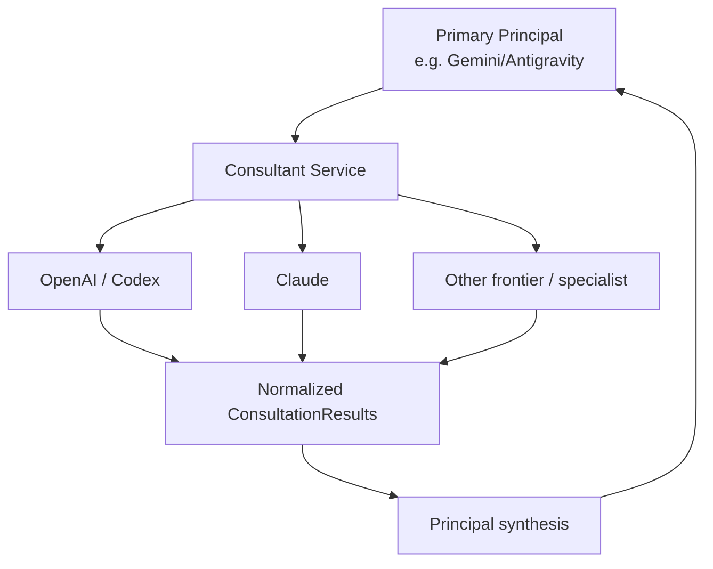
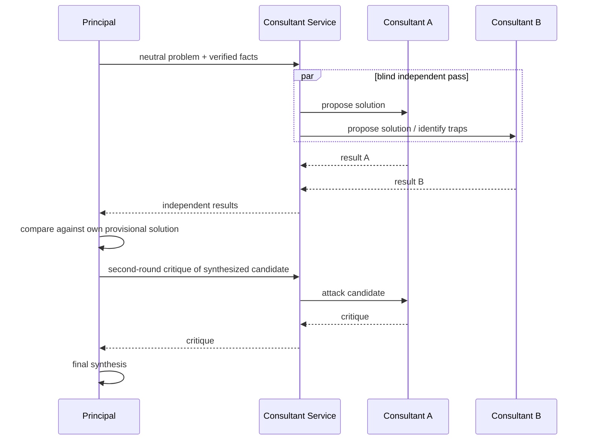

# Frontier Consultants

## Scope

Consultants provide independent high-capability reasoning beyond the primary principal. They are used to increase perspective diversity, challenge assumptions, verify important design choices, and help resolve high-risk uncertainty.

They are not automatic authorities.

## 1. Conceptual model

The consultant service hides provider-specific invocation mechanics.

## 2. Why consultants exist

Frontier models can share common failure modes:
- anchoring;
- plausible-but-false assumptions;
- overfitting to familiar architecture;
- confirmation bias after generating a design;
- underestimating operational cost;
- missing ecosystem-specific facts.

Independent analysis can expose those weaknesses.

## 3. Consultation modes

### Independent design
Consultant receives problem/facts but not the principal's preferred design.

Goal: produce a genuinely independent solution.

### Adversarial critique
Consultant receives candidate design and is instructed to find failure modes, hidden assumptions and simpler alternatives.

### Specialist review
Focused on security, database semantics, distributed consistency, language/runtime specifics, etc.

### Tie-break / disagreement analysis
Consultant examines a material disagreement among local reviewers or between evidence and blueprint.

### External-grounding verification
Consultant with suitable web/source capability checks current technical claims, but source evidence should still be preserved.

## 3A. Discovery consultant roles

Consultants are valuable before architecture because they can identify questions the primary principal failed to ask.

Useful Day-0 roles include:
- **Product Critic** — missing users, workflows, outcomes and value assumptions;
- **Architecture-Precursor Critic** — ambiguities whose answers materially change system structure;
- **Security/Privacy Critic** — data use, retention, identity, authority and abuse ambiguity;
- **Failure-Mode Critic** — undefined behavior under failure;
- **Operations/Scale Critic** — hidden workload, deployment and maintenance assumptions;
- **UX/Mental-Model Critic** — expectations a user may reasonably have but the specification does not define;
- **Simplicity Critic** — requirements likely to create unnecessary complexity;
- **Domain Researcher** — current ecosystem facts and standards.

A strong discovery prompt is often:

> Given this idea, verified facts and known constraints, what are the most consequential questions that must be answered before architecture, and who should resolve each one?

The principal should deduplicate and prioritize the resulting questions rather than forwarding them wholesale to the human.

See [DISCOVERY_AND_SPECIFICATION.md](DISCOVERY_AND_SPECIFICATION.md).

## 4. Anti-anchoring sequence

## 5. When to consult

Consultant usage is justified when expected cost of being wrong is high.

Signals:
- architecture boundary change;
- irreversible migration;
- security-sensitive design;
- public protocol compatibility;
- concurrency/distributed semantics;
- major dependency/platform decision;
- local reviewers materially disagree;
- principal has unresolved assumptions;
- repeated implementation failure suggests design weakness;
- architecture reconciliation;
- foundational Day-0 design.

It is also reasonable to use consultants more generously during initial design because design artifacts are compact relative to repository implementation context.

## 6. When not to consult

Do not consult merely because:
- the task is mechanically tedious;
- a local test failed with a clear cause;
- formatting/style is uncertain;
- deterministic documentation already answers the question;
- consultant output cannot change the decision.

## 7. Consultant budget model

Budget can be represented as:
- allowed providers;
- max consultations;
- max turns;
- token/quota class;
- latency tolerance;
- privacy scope;
- whether web grounding is allowed.

Time may be generous. Context remains curated.

## 8. ConsultationRequest

A good request contains:
- role;
- problem;
- verified facts;
- assumptions explicitly marked;
- constraints;
- relevant evidence;
- requested deliverable;
- whether principal candidate is hidden;
- source/evidence expectations;
- data-access constraints.

Avoid sending the whole repository by default.

## 9. ConsultationResult

Normalize:
- provider/model/runtime;
- answer;
- alternatives;
- assumptions;
- concerns;
- evidence/source references when available;
- uncertainty;
- recommended next investigation;
- usage metadata if available.

Normalization should not erase provider-specific strengths.

## 10. Disagreement policy

```mermaid
flowchart TD
    G["Principal position"]
    A["Consultant A"]
    B["Consultant B"]
    Compare["Compare claims & assumptions"]
    Fact{"Disagreement factual?"}
    Verify["Gather evidence / experiment"]
    Value{"Tradeoff/value judgment?"}
    Criteria["Apply project criteria"]
    Unknown["Preserve unresolved risk"]
    Decision["DecisionRecord"]

    G --> Compare
    A --> Compare
    B --> Compare
    Compare --> Fact
    Fact -->|"yes"| Verify --> Decision
    Fact -->|"no"| Value
    Value -->|"criteria sufficient"| Criteria --> Decision
    Value -->|"genuinely uncertain"| Unknown --> Decision
```

Do not resolve disagreement by majority vote alone.

## 11. Subscription and provider adapters

Provider adapters may invoke:
- authenticated coding CLIs;
- API clients;
- ACP-compatible systems;
- remote MCP services.

The domain layer should see only ConsultantRequest/Result.

Authentication must remain outside prompt payloads.

## 12. Failure behavior

If a consultant is unavailable:
- record unavailability;
- continue if policy permits;
- do not silently substitute a materially weaker path for a mandatory independent review;
- escalate to the principal/human when required.

## 13. Security

Consultants receive the minimum data necessary.

For private repositories, policy should define:
- whether source snippets may leave local machine;
- which providers are authorized;
- redaction requirements;
- data-retention implications;
- whether only semantic EvidencePackets may be sent.

## 14. Evaluation

Track whether consultants actually improve outcomes:
- defect discoveries;
- design changes caused by consultation;
- false alarms;
- later refactor correlation;
- cost/quota use;
- disagreement usefulness.

A provider that agrees frequently but rarely adds useful evidence may not be a useful consultant for that role.
