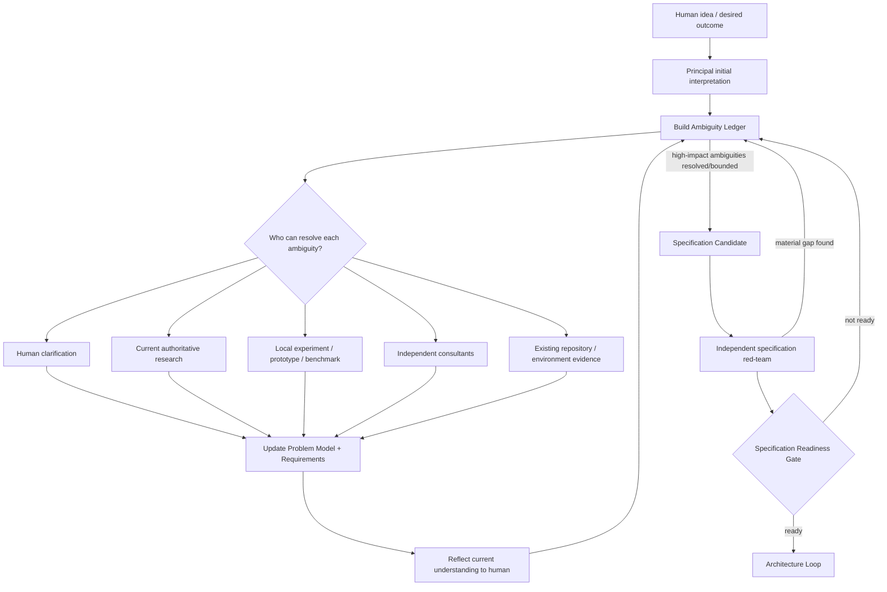
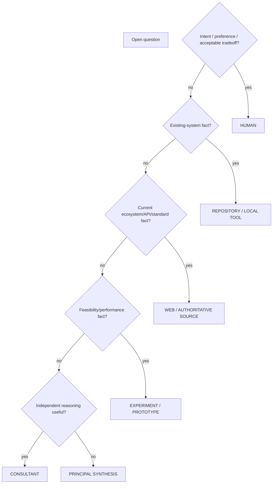
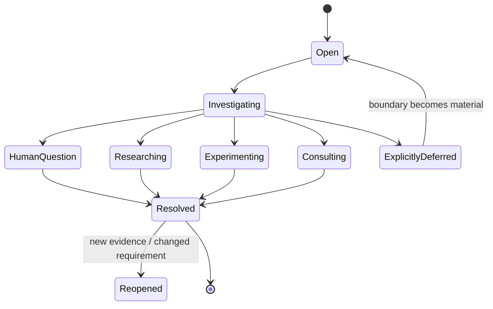
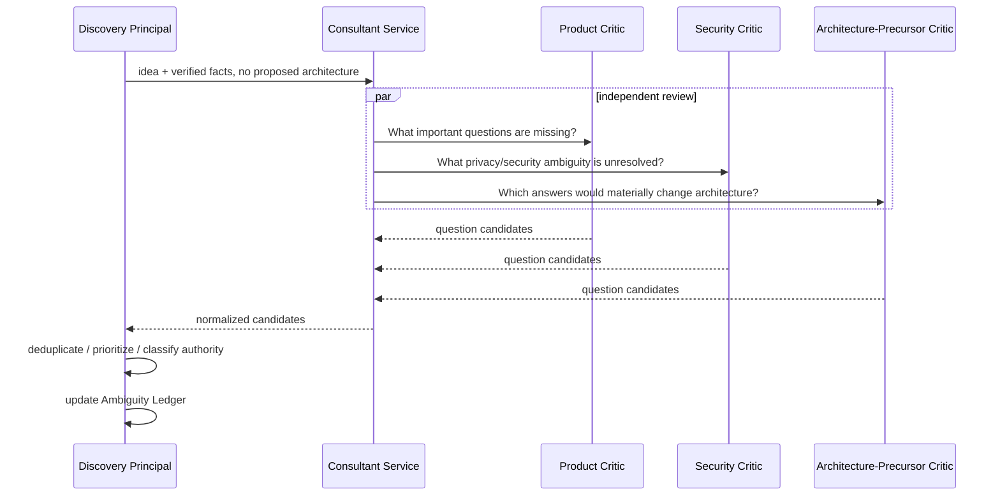
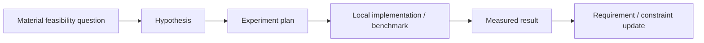
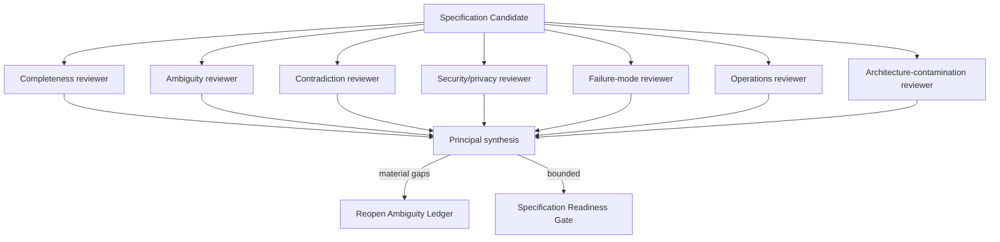
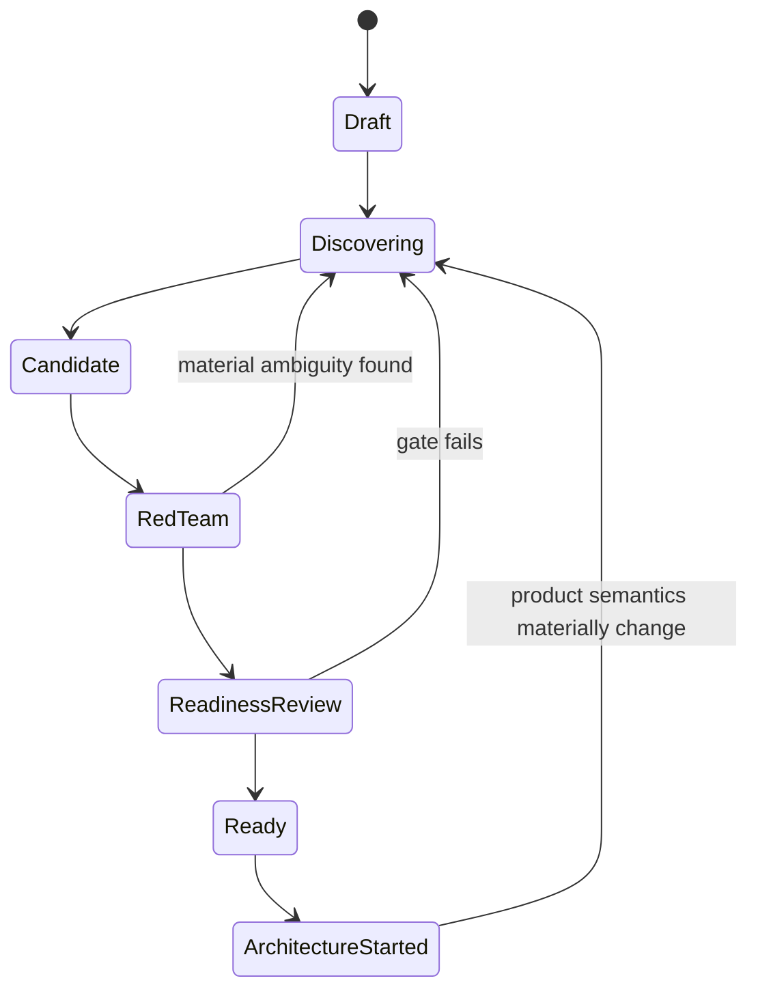

# Discovery and Specification

## Scope

This document defines DevCadience's Day-0 **Discovery & Specification subsystem**: the process that turns a fuzzy human idea into an evidence-backed, sufficiently unambiguous specification before architecture begins.

This is primarily the prospective/greenfield product-discovery path. Existing repositories use the separate [Project Adoption and Retrospective Reconstruction](PROJECT_ADOPTION.md) workflow. Brownfield adoption reuses the same authority/provenance principles—ambiguity ledgers, human product authority, evidence-backed requirements and explicit readiness—but begins from repository reality and must materialize the mandatory canonical project documentation baseline before normal managed work.

The goal is not to force every detail to be known. The goal is to prevent the engineering organization from silently resolving product ambiguity through accidental technical choices.

## 1. Core principle

> Never resolve ambiguity at a lower intelligence or authority layer than necessary.

Examples:

- A local implementer must not decide product semantics.
- A frontier principal must not silently invent human preferences.
- A human should not be asked to decide facts that research or experiments can establish.
- A consultant should not be treated as authority when deterministic evidence exists.
- A model's plausible assumption is not equivalent to a requirement.

The Discovery Principal must actively expose ambiguity before architecture hardens around it.

## 2. Why this phase exists

A short product idea can hide dozens of architecture-changing questions.

For example:

> Build a local system that understands home-camera events.

Important unresolved meanings may include:
- retrospective vs real-time processing;
- what "understands" means;
- whether raw media may leave the machine;
- whether derived embeddings may leave the machine;
- whether person identification is allowed;
- false-positive vs false-negative cost;
- retention expectations;
- multi-camera correlation;
- multi-household support;
- search latency;
- service availability;
- acceptable operational complexity.

A capable model can produce a coherent architecture while silently choosing answers to all of these. DevCadience considers that a failure of discovery.

## 3. Day-0 lifecycle



Architecture must not begin simply because the conversation has become long. It begins when the unresolved ambiguity is unlikely to materially alter architecture, or when remaining ambiguity has an explicit safe boundary.

## 4. Human/model collaboration contract

The Discovery Principal behaves like a patient product + principal engineering interviewer.

It should:
- interpret the human's idea;
- make its interpretation visible;
- identify high-impact ambiguity;
- ask a small batch of consequential questions;
- update the model of the problem;
- reflect the updated understanding back;
- research facts instead of asking the human to guess;
- use experiments where feasibility matters;
- ask independent consultants what important questions are missing;
- periodically challenge whether the specification is converging around an accidental assumption.

It should not:
- dump a giant fixed questionnaire;
- ask humans to choose technical implementation details unnecessarily;
- silently convert model preference into product requirement;
- treat unanswered low-impact details as blockers;
- start architecture because it is impatient.

## 5. Dynamic questioning, not a static questionnaire

Question priority should reflect expected impact.

Conceptually:

```text
question_priority ≈
    architectural_impact
  × uncertainty
  × irreversibility
  × cost_of_wrong_assumption
```

This is a prioritization model, not a required numeric formula.

### High-priority example

```yaml
question: Can raw video leave the local machine?
resolution_authority: human
architectural_impact: critical
privacy_impact: critical
irreversibility: high
status: unresolved
```

### Low-priority example

```yaml
question: Should CLI output use color?
architectural_impact: low
status: deferred
```

Ask high-impact questions first.

## 6. Conversational batches

The principal should normally ask 2–5 related questions at a time, then synthesize answers.

Good pattern:

> I see three decisions that materially change the architecture:
>
> 1. Must raw video remain entirely local, or may selected frames be processed externally?
> 2. Do you need near-real-time event understanding, or is delayed analysis acceptable?
> 3. Is V1 one household only, or is multi-household isolation a requirement?

After the human answers, update the durable state before asking the next batch.

## 7. Reflection protocol

Periodically show the human a compact interpretation.

Example:

```text
My current understanding

CONFIRMED
- Raw video remains local.
- Textual semantic summaries may be sent to approved frontier consultants.
- The primary workflow is retrospective event understanding.
- Multi-household support is not required for V1.

PROPOSED / NOT YET CONFIRMED
- Search response under ~2 seconds is desirable but not a hard requirement.

OPEN
- Whether derived image embeddings may leave the host.
- Raw-video retention duration.
- Whether cross-camera identity continuity is allowed.
```

Reflection is not ceremony. It is a defense against gradual semantic drift.

## 8. Resolution authority

Every ambiguity should identify the best resolution authority.



Do not ask the human to resolve facts that tools can establish.

## 9. ProblemModel

The ProblemModel is the canonical semantic representation of what is being built and why.

It should include:
- problem statement;
- desired outcomes;
- users/actors;
- primary workflows;
- success criteria;
- failure criteria;
- scope and non-goals;
- constraints;
- human product decisions;
- verified facts;
- assumptions;
- unknowns;
- risks;
- open questions.

The ProblemModel is compact project memory. The raw human conversation remains provenance, not the canonical specification.

## 10. Ambiguity Ledger

The Ambiguity Ledger is the active queue of unresolved meanings.

Each entry includes:
- question;
- origin;
- category;
- resolution authority;
- architectural/product/security impact;
- why it matters;
- possible interpretations;
- status;
- resolution;
- evidence/provenance.

### Lifecycle



An ambiguity may be explicitly deferred only if a safe boundary prevents it from silently becoming an architectural decision.

## 11. Human statements and Product Decisions

Not every sentence in a conversation is a requirement.

Discovery should distinguish:
- HumanStatement;
- Clarification;
- ProductDecision;
- Preference;
- Constraint;
- RejectedOption;
- OpenQuestion.

A ProductDecision is human-authoritative product intent.

Example:

```yaml
decision_id: PD-017
question: Can cloud models receive raw camera frames?
answer: No.
authority: human
consequences:
  - raw image/video inference must remain local
  - external consultants may receive textual semantic evidence only
```

Engineering models may explain consequences but cannot override the product decision without returning to the human.

## 12. Requirement epistemic state

Requirements must record where they came from and how established they are.

Suggested status:
- `confirmed` — explicitly human/product-authority confirmed;
- `evidence_backed` — established by experiment or authoritative fact;
- `proposed` — reasonable inference awaiting confirmation;
- `assumed` — temporary design assumption, visible and risky;
- `deferred` — intentionally unresolved behind a safe boundary;
- `rejected` — explicitly not part of the specification.

Examples:

```yaml
id: FR-018
statement: Raw video must never leave the local machine.
source:
  type: product_decision
  ref: PD-017
status: confirmed
strength: MUST
```

```yaml
id: NFR-009
statement: Interactive event search should usually respond within 2 seconds.
source:
  type: principal_inference
status: proposed
needs_human_confirmation: true
strength: SHOULD
```

```yaml
id: NFR-013
statement: One hour of representative video can be processed within 90 minutes on the target machine.
source:
  type: discovery_experiment
  ref: EXP-004
status: evidence_backed
strength: SHOULD
```

## 13. Consultants during discovery

Consultants are useful before architecture.

They may be asked:

> What are the most consequential ambiguities in this product idea that must be resolved before architecture?

or:

> Assume this specification is implemented literally. What important user expectations could still be violated?

Useful roles:
- Product Critic;
- Architecture-Precursor Critic;
- Security/Privacy Critic;
- Failure-Mode Critic;
- Operations/Scale Critic;
- UX/Mental-Model Critic;
- Simplicity Critic;
- Domain Researcher.

### Independent first-pass pattern



Consultants should help discover the question space, not merely answer architecture questions.

## 14. Web and authoritative research

Use current external research when uncertainty is a factual question.

Examples:
- current service/API capabilities;
- platform constraints;
- licensing;
- standards;
- regulations;
- hardware/model capability claims;
- supported integration mechanisms.

The principal should not ask the human whether a service supports a feature when authoritative documentation can answer it.

Research results become ExternalFact evidence with source/date.

## 15. Discovery Experiments

Some requirements depend on empirical feasibility.

A DiscoveryExperiment is a bounded prototype/benchmark designed to resolve one material question.



Examples:
- throughput of a local model on target hardware;
- memory footprint at target context;
- library behavior under concurrency;
- database size/query latency;
- integration feasibility.

An experiment should specify:
- question;
- hypothesis;
- environment;
- method;
- acceptance thresholds;
- raw evidence;
- limitations.

Do not generalize a benchmark beyond the measured population/environment.

## 16. Specification Candidate

When high-impact ambiguity is resolved or safely bounded, the principal produces a versioned Specification Candidate containing:
- ProblemModel;
- confirmed/proposed requirements;
- product decisions;
- non-goals;
- constraint model;
- unresolved low-impact questions;
- risks;
- discovery evidence;
- experiment summaries.

It is not architecture.

The specification describes **what/why/constraints**, not detailed implementation structure unless the product requirement itself demands it.

## 17. Specification red-team

Before architecture begins, independent reviewers attack the specification.

Review vectors:

### Completeness
What important user expectation is missing?

### Ambiguity
Which sentence permits materially different implementations?

### Contradiction
Which requirements cannot simultaneously hold?

### Architecture contamination
Which "requirement" is actually an unvalidated implementation preference?

### Security/privacy
What sensitive behavior or authority is undefined?

### Failure behavior
What happens when data, network, hardware, user input, or dependencies fail?

### Operability
Who operates this and what assumptions about maintenance are hidden?

### Scope
What feature is implicitly required but absent from scope?



Reviewers should not be asked merely “is the spec good?”

## 18. Specification Readiness Gate

Readiness is not model confidence.

The gate asks whether the remaining ambiguity is architecture-safe.

Suggested checks:
- problem/outcome understood;
- primary actors/workflows defined;
- success/failure criteria defined;
- in-scope/out-of-scope defined;
- architecture-sensitive product decisions resolved;
- security/privacy semantics defined;
- material external facts grounded;
- performance/feasibility assumptions tested where needed;
- no unresolved material contradiction;
- independent review found no unbounded missing dimension;
- remaining unknowns explicitly deferred behind safe boundaries;
- human has seen/reflected the current product interpretation.

### State machine



## 19. Readiness report

Do not report a fake single confidence percentage.

Prefer structured coverage:

```yaml
specification_readiness:
  problem_outcome:
    resolved: true
  primary_workflows:
    resolved: true
  scope_boundaries:
    unresolved_material: 0
  architecture_sensitive_questions:
    unresolved_material: 0
  security_privacy:
    unresolved_material: 0
  feasibility_assumptions:
    verified: 4
    accepted_risk: 1
    unverified_material: 0
  independent_reviews:
    completeness: complete
    ambiguity: complete
    security: complete
    failure_modes: complete
  contradictions:
    open_material: 0
  human_reflection:
    acknowledged: true
  verdict: ready_for_architecture
```

## 20. Existing projects

For an existing repository, discovery combines human intent with repository reality.

The local Scout can establish:
- current behavior;
- implicit workflows encoded in code/tests;
- existing constraints;
- architecture-sensitive legacy assumptions.

But repository behavior is not automatically product intent. Existing bugs and accidental behavior must not be promoted to requirements without validation.

## 21. Spec change after architecture starts

Specifications evolve.

A new feature or product-semantic change should:
1. classify impact;
2. update ProblemModel/Requirements/ProductDecision;
3. reopen relevant ambiguity;
4. re-run Specification Readiness for the changed scope;
5. then enter architecture/change design.

A product decision changing an active architecture may trigger Architecture Reconciliation.

## 22. Anti-patterns

- 50-question onboarding form regardless of project;
- asking the human to choose database/protocol/framework without product reason;
- inferring hard requirements from casual wording;
- treating the current repository as unquestionable product truth;
- letting consultants converge on the principal's framing before independent review;
- asking the human factual questions a web source or experiment can answer;
- declaring readiness because the document is long;
- hiding unresolved ambiguity under "we can decide later" without a safe boundary;
- converting all uncertainty into low-confidence requirements instead of explicit unknowns.

## 23. Day-0 completion condition

Discovery is successful when a new principal session can read compact durable artifacts and understand:
- what problem is being solved;
- for whom;
- why it matters;
- what success/failure means;
- what is explicitly in/out of scope;
- which product decisions are human-authoritative;
- what constraints are facts vs preferences;
- what remains unknown;
- why the remaining unknowns are safe to defer.

Only then should architecture become the primary activity.

For an existing repository, specification readiness alone is not sufficient to begin normal managed engineering work. Brownfield projects must additionally satisfy the Adoption Readiness Gate in [PROJECT_ADOPTION.md](PROJECT_ADOPTION.md), including a committed canonical documentation baseline.
