# DevCadence Implementation Plan

## Scope

This roadmap turns the architecture into a sequence of falsifiable milestones. Each milestone has a purpose, deliverables and verification gate.

The project should not proceed merely because code exists. Each milestone proves a capability needed by the next.

## Milestone map

```mermaid
flowchart LR
    M0["M0<br/>Normative baseline"]
    M1["M1<br/>Domain + state core"]
    M2["M2<br/>Repository execution"]
    M3["M3<br/>Environment intelligence<br/>+ cognition runtime<br/>+ guided bootstrap"]
    M4A["M4A<br/>Semantic MCP<br/>+ principal hosts"]
    M4B["M4B<br/>Project adoption<br/>+ retrospective reconstruction"]
    M5["M5<br/>Vertical slice proof"]
    M6["M6<br/>Reviews + consultants"]
    M7["M7<br/>Health/refactoring"]
    M8["M8<br/>Learning/evaluation"]
    M9["M9<br/>Autonomous campaigns"]

    M0 --> M1 --> M2 --> M3 --> M4A --> M4B --> M5 --> M6 --> M7 --> M8 --> M9
```



M3 is internally split into M3A (environment/cognition capability) and M3B
(guided bootstrap). M4 is split into M4A (principal-host connectivity) and M4B
(brownfield project adoption). These are milestone sub-phases, not new
top-level numbering that shifts M5-M9.

An additional sub-phase, M2.5, sits between M2 and M3: it extends M2's
repository/worktree/process/validation foundation with the module, tool,
service-supervision and context-compaction infrastructure that M3's cognition
runtime and M4A's execution-agent roles need. See "M2.5 — Declarative modules,
bounded execution tools, supervised services, and context compaction" below.

## M0 — Normative architecture baseline

### Goal
Make the intended system sufficiently explicit that implementation agents do not invent foundational semantics.

### Deliverables
- vision;
- requirements;
- architecture;
- lifecycle;
- invariants;
- protocols;
- principal/local-agent contracts;
- verification;
- security;
- refactoring/learning;
- implementation plan;
- initial JSON Schemas.

### Verification
- cross-document terminology review;
- all linked documents exist;
- schema examples parse;
- Mermaid diagrams render on GitHub;
- no contradictory invariant/protocol definitions.

### Exit criterion
A fresh capable engineer/model can explain the system and M1 boundaries without relying on chat history.

## M1 — Domain core and canonical state

**Status: complete.**

### Goal
Implement model-independent control-plane primitives.

### Deliverables
- Go module and CLI skeleton — `cmd/devcadence`;
- protocol/domain types, including discovery/specification records —
  `internal/protocol`;
- ProblemModel/AmbiguityLedger/ProductDecision/Requirement/DiscoveryExperiment/
  SpecificationReadiness persistence foundations — the immutable record store
  in `internal/storage` plus their typed representations;
- SQLite migration framework — `internal/storage`;
- engineering event journal — `internal/events`, `internal/storage`;
- ProjectState reducer/materialized view — `internal/state`;
- task/attempt state machine — `internal/tasks`;
- fixture/test framework — `internal/testsupport`, `fixtures/`, `tests/`;
- schema validation tooling — `internal/schema`, `devcadence schema validate`;
- the `ProjectState.review` projection *shape* — `protocol.ReviewConvergenceState`,
  paired with the schema property so the two representations accept the same
  documents. Nothing reduces into it; bounded ReviewCampaign orchestration,
  finding adjudication and closure remain M6 (ADR-0010).

### Verification
- unit tests for legal/illegal transitions — `internal/tasks`, including a
  walk of the full state cross product;
- event replay reconstructs same ProjectState — `internal/state`,
  `internal/controlplane`;
- crash/transaction tests for append + projection — injected failure inside a
  transaction, and a refused transition leaving the journal untouched;
- schema round-trip tests — `tests/schema_fixtures_test.go` over
  `fixtures/protocol/`;
- no LLM required to run test suite — nothing in the tree imports a model
  runtime.

Run with `go test ./... && go vet ./...`, or `make verify`.

### Exit criterion
A synthetic project can be driven through task states deterministically.

Met: `TestSyntheticProjectReachesDoneDeterministically` drives a project from
`PROPOSED` to `DONE` twice and compares canonical ProjectState byte for byte,
and `TestCLIDrivesASyntheticProjectToDone` does the same through the CLI.

### Discovery and specification records

The six Day-0 contracts introduced by
[adr/0001-discovery-specification-subsystem.md](adr/0001-discovery-specification-subsystem.md)
— ProblemModel, AmbiguityLedger, ProductDecision, Requirement,
DiscoveryExperiment and SpecificationReadiness — have typed representations in
`internal/protocol` and persist through the same immutable, versioned,
content-addressed record store as every other protocol record. Their semantic
guards are enforced on the write path, not left to prose:

- a Requirement may be `confirmed` only when it traces to a human, directly or
  through a ProductDecision — the principal cannot confirm its own inference
  (DCI-005);
- a ProductDecision's authority is always `human`;
- a resolved ambiguity must record its resolution;
- a completed experiment must report a result;
- a readiness verdict must agree with its own checks, and an unknown that is
  not safe to defer past architecture forbids any verdict but `not_ready`.

The eight discovery events named in ENGINEERING_STANDARDS.md §11 are
implemented and registered, and `ProjectState.discovery` is reduced from them,
so FR-D-012 holds: a new principal session can reconstruct current product
intent from durable records rather than a conversation transcript. The
derivation rules are in docs/PROJECT_STATE.md §17.1.

Recording these facts is M1; *performing* discovery is not. The adaptive
questioning loop (FR-D-006), human reflection (FR-D-007), external grounding
(FR-D-008), running experiments (FR-D-009) and independent specification
review (FR-D-010) require cognition endpoints from M3 and the semantic principal
surface from M4A. M1 guarantees that when those arrive, the state they produce
is already durable, typed and reconstructable.

### Architectural decisions taken during M1
- [adr/0002-control-plane-persistence.md](adr/0002-control-plane-persistence.md)
- [adr/0003-durable-record-compatibility.md](adr/0003-durable-record-compatibility.md)
- [adr/0004-canonical-task-state-machine.md](adr/0004-canonical-task-state-machine.md)
- [adr/0005-deterministic-project-state-identity.md](adr/0005-deterministic-project-state-identity.md)
- [adr/0006-identifiers-and-time.md](adr/0006-identifiers-and-time.md)

### Debt deliberately carried into later milestones
- Appending an event replays the project journal to rebuild the projection
  (O(n) per write). The fix — a snapshot plus tail replay — is additive and
  changes no durable contract (ADR-0002, R-M1-01).
- The SQLite pool is capped at one connection, serialising reads with writes.
- `integrating` and `integration_validating` exist and are reachable but have
  no repository behaviour until M2.
- Git facts are not reducer inputs: `git.accepted_commit` comes from recorded
  events, and `dirty` and `branch` are unset (ADR-0005, R-M1-05).
- `capabilities` is typed but always empty until M3.
- `LessonCandidateCreated`, `LessonPromoted`, `RefactoringEpochStarted` and
  `ArchitectureReconciled` are recorded and derive nothing (M7/M8).
- No artifact store: `ArtifactRef` describes where artifacts will live, and
  nothing writes them yet (M2).
- The discovery workflow is absent: the records, events and projection exist,
  but nothing *performs* discovery — no questioning loop, no human reflection
  round, no experiment execution, no specification review. Those require M3
  cognition capability and the M4A semantic principal surface.
- Experiment and review events are recorded but not projected, because the
  `discovery` object in the schema carries no counts for them.

## M2 — Repository, worktree and process execution

**Status: complete.**

### Goal
Safely operate on real repositories.

### Deliverables
- repository registration — `internal/repository`;
- Git inspection — `internal/repository` (HEAD, branch, status, ancestry,
  merge-base, diff, non-mutating merge/conflict checks);
- isolated worktree manager — `internal/worktrees`;
- controlled process runner — `internal/process`;
- artifact capture — `internal/artifacts`;
- validation profiles — `internal/validation` (profile loading and
  execution against the real M1 `protocol.ValidationResult`/
  `ValidationCompleted`);
- candidate commit/diff metadata — `internal/repository.Repository.Diff`,
  `CheckMerge`, `StaleBase`, surfaced through `devcadence candidate show`.

### Verification
Synthetic fixture repositories only (`internal/testsupport.NewGitRepo`),
never the DevCadence repository itself:
- parallel worktree isolation — `TestParallelWorktreesAreIsolated`,
  `TestConcurrentCreateSameProject`;
- compile/test success/failure — `internal/process`, `internal/validation`
  (`TestRunNonzeroExitIsNotAnError`, `TestRunProfilePassAndFail`);
- timeout/cancellation — `TestRunTimeout`, `TestRunCancellation`,
  `TestRunnerReusableAfterTimeout`, `TestRunProfileTimeout`;
- stale base detection — `TestStaleBase`, `TestIsStale`;
- merge conflict — `TestCheckMergeConflict`, `TestCheckMergeCleanNonFastForward`
  (both assert the accepted working tree is untouched);
- stdout/stderr truncation — `TestRunStdoutTruncation`;
- path/symlink security — `TestRegisterSymlinkedPathCanonicalises`,
  `TestRegisterSubdirectoryOfRepositoryRejected`,
  `TestCreateRejectsPathTraversalIdentifiers`,
  `TestOpenRejectsPathTraversalLocator` (artifacts);
- digest-verified validation lineage — `TestExecuteAndRecordWrongCommitRefused`
  proves a validation citing the wrong commit is refused with the journal
  and task state left untouched, reusing the M1 transaction/digest
  machinery rather than adding new checks.

Run with `go test ./... && go test -race ./... && go vet ./...`, or `make verify`.

### Exit criterion
DevCadence can safely run deterministic engineering work on real
repositories without an LLM.

Met: `internal/validation`'s `TestExecuteAndRecordAttemptScopeDrivesTaskToReviewing`
and its sibling tests drive a task from a delegated Work Package through a
candidate commit, a real `ValidationResult` produced by executing a profile
against a synthetic repository, and a matching `ValidationCompleted` event —
entirely through `internal/repository`, `internal/worktrees`,
`internal/process`, `internal/artifacts` and `internal/validation`, with no
model runtime imported anywhere in the module (`tests.TestNoPackageDependsOnAModelRuntime`
still passes).

### Architectural decisions taken during M2
- [adr/0007-repository-and-worktree-safety-model.md](adr/0007-repository-and-worktree-safety-model.md)
- [adr/0008-controlled-process-execution.md](adr/0008-controlled-process-execution.md)
- [adr/0009-artifact-storage-and-validation-execution.md](adr/0009-artifact-storage-and-validation-execution.md)

### Debt deliberately carried into later milestones
- The worktree manifest is a per-project JSON file guarded by an
  in-process mutex. It is safe for one daemon process and is not
  cross-process safe; the bootstrap posture (docs/SECURITY.md §17) does not
  yet require more than one (ADR-0007).
- `CheckMerge`'s scratch worktree is created outside the worktree manager's
  own accounting; a crash between its creation and its cleanup can leak an
  entry in Git's own `worktree list` for the primary repository. It is
  inspectable (`git worktree list`) and does not touch the accepted branch.
- Integration-scope validation is executable but *integration orchestration*
  (deciding which accepted candidates combine, in what order, into what
  integration commit) remains M6/M9; M2 supplies the deterministic
  mechanics an orchestrator will call.
- The process runner does not sandbox `Spec.Dir`; confinement to a worktree
  is structural (only `internal/worktrees.Manager` hands out worktree
  paths), not OS-enforced. See ADR-0008.
- `devcadence validate`/`run`/`candidate show` are inspection and
  operator/demo commands, not the eventual M3/M4 agent-facing execution
  surface; a future milestone's agent runtime calls
  `internal/validation`/`internal/process` directly, not the CLI.

## M2.5 — Declarative modules, bounded execution tools, supervised services, and context compaction

### Goal

Give execution-cognition roles (`Repository Scout`, `Implementer`) safe, bounded,
monorepo-aware ways to read, search, and validate a repository — and give
long-running execution sessions a way to stay within context budgets — without
enlarging the Principal's own interface. This is infrastructure M3's cognition
runtime and M4A's execution-agent roles need; it is not part of M3B (guided
bootstrap), which is unrelated onboarding/setup work.

### Status

Implemented on branch `feat/modules-tools-services` (PR #7), reviewed and
repaired through several rounds; not yet merged to `main`.

### Deliverables
- **Declarative modules & scoped worktrees** (ADR-0015): `ModuleDefinition`/
  `ModuleCatalogRecorded` in `internal/protocol`/`internal/state`; module
  inheritance and precedence across profile/check/service, with unknown
  module IDs rejected before process startup; directory containment checks
  against parent traversal and symlink escapes, including ancestor-directory
  symlinks — `internal/tools/scope.go`, `internal/validation`.
- **Bounded execution tools** (ADR-0016 §1, §3): `read_file` (opt-in line
  numbers, byte caps), `fetch_content` (universal paginator over immutable
  content-addressed artifacts, `lines`/`bytes` units, contiguous cursors),
  `grep_search` (ripgrep/git-grep/pure-Go fallback, 20-result cutoff,
  automatic pagination) — `internal/tools`.
- **Supervised validation services** (ADR-0016 §2): `ServiceSupervisor` in
  `internal/validation` with port allocation modes (`env_var`, `cli_flag`,
  `socket_inheritance`), isolated temp dirs, readiness probing, `MaxLifetime`
  bounds, process-group reaping, and start-time-based restart reconciliation
  against PID recycling.
- **Asynchronous operations** (ADR-0016 §2): `OperationManager` in
  `internal/process` — 10s response-yield threshold, background continuation
  under original timeouts, idempotent cancellation.
- **Multi-tier context compaction** (ADR-0016 §4): admission-safe budgeting
  against an endpoint's `MaxRequestTokens`; Tier 1 deterministic tool-result
  pruning (soft watermark); Tier 2 episodic trajectory summarization (hard
  watermark) with atomic tool-call/result groups preserved across the split
  and a final admission guard on every path — `internal/compaction`.
- **Syntactic symbol inspection** (ADR-0016, WP6): `find_symbol` over native
  Go AST, and regex-based syntactic matching for TypeScript/JavaScript with
  honest `backend` reporting (`go/ast` vs `syntactic-regex`, never
  `tree-sitter`) and comment/string-literal masking — `internal/tools`.

### Verification

No structured `ValidationResult`/evidence-bundle tooling is expected here —
this is pre-M1-adoption infra work on DevCadence's own repository, verified
the ordinary way:
- `go test -count=1 ./...` and `go test -race ./...` — pass;
- `go vet ./...` — pass;
- `GOOS=windows GOARCH=amd64 go build ./...` and `go vet ./internal/validation/...`
  — pass (the latter required isolating `syscall` usage, including in test
  code, behind `//go:build unix` / `!unix` files);
- targeted regression tests per finding, e.g. `TestReadFileWorktreeContainment`,
  `TestServicePrematureExit`, `TestRunProfileModuleInheritanceAndOverride`,
  `TestClosureKeepsProtectedToolGroupWhole`, `TestTier2DigestModelVerifiedFlagIsUntrusted`,
  `TestClosureBlankLinesPreservedInTotals`.

### Explicitly deferred (see ADR-0016's delivered-vs-deferred table)
- artifact-backed live validation streaming with 4 KiB previews (sinks are
  decoupled now; the daemon/task-runner milestone wires them to
  `internal/artifacts`);
- durable, SQLite-backed asynchronous-operation events across daemon
  restarts (current `OperationManager` is in-memory, same-process only);
- BPE tokenizers and independent summarizer-input admission for compaction
  (current admission uses a selected-field/byte heuristic against the
  endpoint ceiling);
- Cgo Tree-sitter grammar parsing for symbol inspection (TypeScript/JavaScript
  stays on the honestly-labeled regex backend);
- full cross-platform executable-path verification for service/process
  restart ownership (current check is start-time matching, which is
  fail-closed against PID recycling but not identity-verified).

### Architectural decisions taken during M2.5
- [adr/0015-declarative-modules-and-scoped-worktrees.md](adr/0015-declarative-modules-and-scoped-worktrees.md)
- [adr/0016-validation-services-bounded-tools-and-context-compaction.md](adr/0016-validation-services-bounded-tools-and-context-compaction.md)

### Note on principal exposure

Per ADR-0016 §1, `read_file`, `grep_search`, `find_symbol` and `run_command`
are execution-agent capabilities scoped to isolated worktrees for the
`Repository Scout`/`Implementer` roles, not part of the Principal's own
interface — the Principal still only sees the semantic operations listed in
AGENTS.md §3 and M4A's deliverables. No MCP server exists yet to expose any
tool externally (that is M4A work), so this boundary is currently structural
(nothing outside `internal/tools`'s own tests calls these functions) rather
than enforced by a wire-level contract.

ADR-0016's 2026-09-23 amendment (see the ADR) splits this further into two
evidence tiers M4A must carry forward: `grep_search`/`find_symbol` results are
compact, citable evidence `request_evidence` may fetch for the Principal
directly; `read_file`/`fetch_content` remain execution-agent-only, reachable
by the Principal only through a bounded, execution-agent-mediated snippet
request — never as an open-ended file-reading tool.

## M3 — Environment intelligence, cognition runtime, and guided bootstrap

### Goal

Make DevCadence adaptive to the machine and AI tooling it actually finds,
rather than assuming strong local hardware, Ollama/MLX, one subscription, or a
preinstalled principal host.

Local-first means local control-plane/repository authority. Model inference may
be local or remote according to capability, privacy, cost and policy.

### M3A — Environment intelligence + cognition runtime

**Status: implemented.** See
[adr/0013-environment-intelligence-and-cognition-contracts.md](adr/0013-environment-intelligence-and-cognition-contracts.md)
for the durable contracts it settled, and `internal/environment`,
`internal/cognition`, `internal/principalhosts` for the implementation.

Two deliverables below are narrower than the heading suggests, deliberately:

- The **remote-API** kind ships as the adapter boundary plus a deterministic
  client rather than a provider implementation. The domain question — can a
  remote API be discovered, described, health-checked, cost-classed,
  privacy-constrained and routed like any other endpoint? — is answered by the
  boundary, and implementing one vendor's HTTP surface would have added a
  dependency and a credential path without proving anything further.
- **Measured capability profiles** cover *operational* properties: does the
  endpoint answer, does it emit valid JSON once, how long did it take, what did
  the runtime report about tokens and memory. Reasoning and coding quality
  require evaluation history, which no milestone has built yet, so those grades
  come from explicit operator declaration or stay `unknown`.

#### Deliverables
- hardware/environment discovery:
  - OS/distribution/architecture;
  - CPU/RAM/storage;
  - Apple/NVIDIA/AMD/Intel accelerator candidates;
  - relevant device/runtime/permission facts;
- local runtime discovery/adapters, initially including practical Ollama and
  MLX-LM paths where supported;
- actual acceleration verification through a real inference probe rather than
  "GPU/runtime present" inference;
- backend-candidate assessment (Metal/MLX, CUDA, ROCm, Vulkan, CPU fallback as
  applicable);
- CognitionEndpoint abstraction across:
  - local runtimes;
  - authenticated coding/agent CLIs;
  - remote APIs;
- endpoint health/auth/capability discovery;
- measured capability profiles and lightweight microbenchmarks;
- capability-based role routing;
- privacy/source-exposure and cost-class inputs to routing;
- support for no-local-model operation.

#### Verification
- blank machine fixture;
- runtime absent;
- runtime installed but CPU-only fallback;
- supported acceleration verified empirically;
- unsupported/uncertain ROCm with viable Vulkan candidate;
- Apple Silicon native/accelerated path;
- authenticated coding CLI discovered;
- endpoint unhealthy/auth expired;
- local-small usable while strong-local unavailable;
- remote implementation selected only when policy permits;
- no-local-model profile remains operational for deterministic/local control
  plane capabilities.

#### Exit criterion
DevCadence can describe the machine and available cognition endpoints from
observed evidence, verify local acceleration where configured, and route roles
without assuming a strong local coder exists.

**Met.** Every verification case above is covered by a deterministic test against
fixture machines in `internal/environment/fixtures.go`; the suite needs no GPU, no
runtime, no Python, no credentials and no network. The read-only proof surface is
`devcadence environment inspect`, `cognition list`, `cognition probe` and
`cognition route`.

### M3B — Guided bootstrap and onboarding

**Status: not implemented.** M3A deliberately stops at facts, assessment and
routing: it mutates nothing, installs nothing, downloads nothing and
authenticates nothing. `setup` and `doctor` do not exist.

See [WORK_PACKAGES.md#m3b](WORK_PACKAGES.md#m3b--guided-bootstrap-and-onboarding)
for this milestone's Work Package breakdown, and
[AGENT_HANDOFF_PROTOCOL.md](../AGENT_HANDOFF_PROTOCOL.md) for the branch/
commit/handoff discipline development follows across sessions.

M3B inherits from M3A the pieces it needs: `MachineFingerprint` for cache
invalidation, `ProbeDepth` for progressive cost, `cognition.Declaration` for
operator-supplied capability and policy, `AcceleratorCandidate.RequiredSoftware`
for what to remediate, and the versioned compatibility tables to extend.

#### Deliverables
- `devcadence doctor`;
- `devcadence setup`;
- modular setup surfaces for hardware/inference/cognition/principal/auth;
- dry-run setup/remediation plans;
- structured SetupAction authority levels;
- versioned install/remediation recipes;
- safe optional package/runtime/model installation;
- credential-reference abstraction;
- discovery/reuse of existing authenticated provider/CLI sessions;
- deployment-profile recommendation:
  - local-heavy;
  - hybrid-thin;
  - cloud-cognition;
  - offline;
  - custom;
- compact terminal UX using Huh v2 with Bubble Tea v2/Lip Gloss v2 where
  richer dynamic rendering is needed;
- SSH/local-terminal support plus accessible/plain/`--no-tui`/`--json`
  operation;
- setup verification/smoke tests.

#### Verification
- setup from a machine with no optional AI software installed;
- dry-run shows every planned mutation;
- privileged/high-impact changes require explicit approval;
- interrupted setup can be re-run safely;
- existing usable tools are preferred over unnecessary installation;
- non-interactive mode emits no TUI control sequences;
- SSH/TTY/basic terminal behavior;
- readiness summary correctly reports reduced capability rather than generic
  failure.

#### Exit criterion
A user new to local LLM tooling can start from an ordinary supported Mac/Linux
machine and reach an explicit usable DevCadence deployment profile without
having to understand accelerator stacks, model runtimes, or provider auth in
advance.

See [ENVIRONMENT_INTELLIGENCE_AND_ONBOARDING.md](ENVIRONMENT_INTELLIGENCE_AND_ONBOARDING.md),
[MODEL_RUNTIME.md](MODEL_RUNTIME.md), ADR-0011.

## M4 — Semantic principal integration and project adoption

M4 is deliberately split so principal connectivity can be proven before the
larger brownfield reconstruction workflow.

### M4A — Semantic MCP + principal-host integration

#### Goal
Allow a frontier principal to operate through compact semantic operations
without requiring direct repository browsing.

Antigravity is the reference integration. Cursor and Visual Studio Code are
the other initial first-class principal hosts. No one host is a core-domain
dependency.

#### Deliverables
- stdio MCP adapter with no-argument `devcadence-mcp` launch contract;
- host-neutral semantic principal contract;
- PrincipalHost adapter boundary;
- first-class integration support for:
  - Antigravity;
  - Cursor;
  - Visual Studio Code;
- host discovery/compatibility/configuration consumed from M3;
- principal instructions/skills/rules;
- project_state;
- investigate;
- create_work_package;
- delegate;
- task_status;
- validate;
- review;
- request_evidence;
- accept/reject;
- Discovery Principal semantic operations;
- Day-0 persistence operations for product decisions, requirements and
  readiness.

Implementation may land host adapters sequentially, but M4A is not complete
until the semantic contract is demonstrated on the reference host and at least
one additional first-class host, proving host portability.

#### Verification
- principal initializes from compact ProjectState;
- repository is not required in strict principal workspace mode;
- targeted source evidence retrieval works;
- unauthorized raw operations are not exposed;
- stale state/work package rejected;
- Antigravity integration smoke test;
- Cursor or VS Code portability proof through the same semantic contract;
- blank-host setup can guide/configure a selected supported host.

#### Exit criterion
A principal can plan and drive one task through the semantic interface without
directly browsing the repository, and the core contract is demonstrably not
Antigravity-specific.

See [PRINCIPAL_HOSTS.md](PRINCIPAL_HOSTS.md),
[ANTIGRAVITY_INTEGRATION.md](ANTIGRAVITY_INTEGRATION.md), and
[MCP_API.md](MCP_API.md).

### M4B — Project Adoption and Retrospective Reconstruction

#### Goal
Allow an existing repository with absent, stale, incomplete or arbitrary
documentation to become a trustworthy DevCadence-managed project.

Repository registration alone is not readiness.

#### Deliverables
- project-adoption state/workflow;
- adoption source-commit pinning;
- deterministic repository/document inventory;
- broad existing-document harvest/classification;
- source/test/schema/configuration contract discovery;
- targeted Git-history archaeology;
- ambiguity/contradiction ledger for brownfield evidence;
- reconstruction provenance distinguishing:
  - observed;
  - documented;
  - inferred;
  - human-confirmed;
  - reconstructed-confirmed;
  - unknown;
  - contradicted;
  - accepted-risk;
- mandatory canonical documentation baseline under
  `docs/devcadence/` by default (or an explicitly configured committed
  canonical root), including:
  - VISION.md;
  - REQUIREMENTS.md;
  - ARCHITECTURE.md;
  - INVARIANTS.md;
  - SECURITY.md;
  - TEST_STRATEGY.md;
  - OPERATIONS.md;
  - adr/README.md and applicable ADRs;
- isolated adoption-baseline worktree/branch;
- AdoptionDecision and Adoption Readiness Gate;
- guard preventing normal managed implementation/acceptance/integration before
  READY.

Existing good native documentation should be preserved/referenced rather than
rewritten merely for formatting consistency.

#### Verification
Synthetic brownfield repositories including:
- no docs;
- README only;
- high-quality native docs;
- stale docs contradicting code/tests;
- tests revealing undocumented invariants;
- recoverable historical rationale;
- unrecoverable rationale;
- human-authority product ambiguity;
- required canonical artifact missing;
- explicit NOT_APPLICABLE required artifact;
- canonical docs generated but not committed;
- source commit changes during reconstruction;
- attempt to delegate normal implementation before READY;
- successful READY transition after blockers close.

#### Exit criterion
DevCadence can take an imperfect existing repository, reconstruct an
evidence-backed engineering contract, commit the mandatory canonical baseline,
and refuse normal managed work until that baseline passes Adoption Readiness.

See [PROJECT_ADOPTION.md](PROJECT_ADOPTION.md) and ADR-0012.

## M5 — Central hypothesis vertical slice

### Goal
Test whether deep frontier design + compact evidence + lower-cost execution
cognition preserves quality while reducing frontier repository context across
different hardware/inference profiles and both greenfield and brownfield
projects.

### Experiment

Use several real medium-complexity tasks and compare:

**Baseline:** frontier coding agent directly handles the repository.

**DevCadence:** deterministic/scout evidence -> principal design -> detailed
Work Package -> isolated implementation worker -> deterministic validation ->
independent review -> principal compact decision.

The DevCadence path MUST be exercised under materially different profiles:

1. **strong-local** — e.g. capable Apple Silicon/local coder;
2. **hybrid-thin** — e.g. 32 GB-class Linux node with deterministic/local-small
   work and economical remote implementation;
3. **cloud-cognition/no-local-model** — local control plane and repository
   authority with remote model cognition.

The experiment must also cover:
- a greenfield/DevCadence-native project path;
- a brownfield repository that enters through M4B reconstruction and reaches a
  committed Adoption Baseline before normal managed work.

### Measurements
- accepted correctness;
- human corrections;
- frontier input/context usage;
- remote paid/quota cognition usage;
- local inference usage;
- source/context exposure to remote endpoints;
- wall time;
- retry count;
- blueprint deviations;
- reviewer defects found;
- principal raw-source escalation frequency;
- onboarding/setup interventions;
- brownfield reconstruction decisions/unknowns;
- whether protocol behavior changes across deployment profiles.

### Exit criterion
DevCadence shows meaningful frontier context savings without unacceptable
quality loss; at least one task demonstrates useful independent
review/escalation; the same core engineering protocols operate under
strong-local, hybrid-thin and no-local-model profiles; and an imperfect
existing repository can be adopted into the mandatory canonical baseline
before managed work begins.

If not, stop and revise architecture.

## M6 — Multi-review and consultant cognition

### Goal
Add cognitive diversity where it has leverage.

### Deliverables
- multiple review dimensions;
- bounded ReviewCampaign orchestration;
- FindingDisposition adjudication;
- rising reopen thresholds and repair-round limits, including enforcement of
  the per-task retry bound M1 records but does not yet apply
  (`TaskDelegated.max_attempts`; see ADR-0004 §3a);
- focused revalidation and ClosureDecision freeze semantics;
- reviewer finding budgets and compact review-state handoff;
- disagreement reports;
- risk-based review policy;
- consultant abstraction;
- at least one external consultant adapter — a real independent-reasoning
  adapter under `ConsultationRequest`/`ConsultationResult`
  (docs/CONSULTANTS.md), not evidence acquisition;
- optional external research / evidence-acquisition service — see
  [adr/0017-external-research-evidence-acquisition.md](adr/0017-external-research-evidence-acquisition.md)
  (status: Proposed) for a candidate design: a bounded, license-aware,
  fail-closed-by-default service (distinct from the Consultant abstraction
  above) letting execution-cognition roles look up external code/API/
  documentation facts through `ExternalResearchRequest`/
  `ExternalEvidencePacket`, with a safe remote-acquisition boundary, local-
  first cognition routing for reranking/digesting, and per-project egress/
  license/cache policy. Optional; not required for M6's other deliverables,
  and not a substitute for the external consultant adapter above;
- anti-anchoring independent-consultation mode;
- Design Readiness Gate;
- independent specification-review dimensions and consultant-assisted ambiguity discovery;
- Specification Readiness evaluation using local/consultant review evidence.

### Verification
- seeded defect suite;
- parallel reviewers inspect the same immutable candidate;
- duplicate findings are deduplicated before repair;
- one consolidated Repair Work Package is produced per round;
- focused revalidation does not restart broad review;
- closure review reports only threshold-crossing issues;
- frozen campaign rejects opinion-only reopening;
- materially new evidence can reopen a frozen campaign;
- repair-round limit escalates rather than loops forever;
- disagreement routing;
- blind consultant request;
- consultant unavailable behavior;
- security/redaction policy.

## M7 — Engineering health and refactoring

### Goal
Prevent feature throughput from degrading architecture.

### Deliverables
- deterministic health metrics;
- semantic health reviews;
- Refactoring Epoch state/process;
- health trend snapshots;
- Architecture Reconciliation workflow;
- refactoring Work Package templates.

### Verification
Seed a fixture project with intentional smells and verify:
- detection;
- epoch planning;
- behavior-preserving refactor;
- full regression;
- before/after health comparison.

## M8 — Learning and evaluation

### Goal
Improve the engineering system from evidence.

### Deliverables
- trajectory manifests;
- LessonCandidate lifecycle;
- frozen evaluation corpus;
- prompt/model routing experiments;
- promotion/rollback;
- model-role outcome metrics.

### Verification
Demonstrate one evaluated improvement:
- candidate derived from real failure;
- replay/evaluation;
- versioned promotion;
- future task uses promoted knowledge;
- rollback works.

## M9 — Long-running autonomous campaigns

### Goal
Allow milestone-scale local execution with frontier principal intervention only when valuable.

### Deliverables
- dependency-aware scheduler;
- overnight/background task queue;
- integration planning;
- principal decision queue;
- human decision queue;
- optional dashboard;
- resumable daemon.

### Verification
Run a multi-task milestone:
- parallel independent tasks;
- dependency blocks;
- local retry;
- principal escalation;
- integration conflict;
- refactoring trigger;
- daily summary.

## Suggested bootstrap repository structure

```text
cmd/
  devcadence/
  devcadence-mcp/
internal/
  protocol/
  state/
  events/
  storage/
  tasks/
  policy/
  repository/
  process/
  worktrees/
  agents/
  models/
  validation/
  evidence/
  consultants/
  health/
  learning/
  observability/
schemas/
prompts/
skills/
docs/
tests/
fixtures/
```

## Implementation ordering inside M1

1. project/config type;
2. IDs/time abstraction;
3. schema types;
4. SQLite store/migrations;
5. event append/read;
6. task state machine;
7. ProjectState reducer;
8. CLI inspect commands;
9. deterministic test fixtures.

Do not start model integration before these basics are trustworthy.

This ordering was followed. The one deviation: a small immutable record store
was added alongside the event journal, because `WorkPackageApproved` would
otherwise reference a blueprint nothing had stored. Events carry the compact
facts ProjectState needs and reference full protocol documents by id and
digest.

### M2 assumptions validated by M1

- Attempt lineage (state revision, Work Package version, base commit, worker
  profile, worktree, candidate commit, artifacts) is representable and
  persisted before any repository machinery exists, so M2 does not have to
  retrofit it.
- Task state, attempts and blocks are derived from events, so M2 can add
  repository behaviour without inventing a second source of truth.
- `ArtifactRef` (locator plus digest) is the agreed boundary for logs, diffs
  and transcripts, so the artifact store can be built without touching the
  relational schema.

## Definition of milestone done

Every milestone completion must include:
- passing required tests;
- documentation synchronized;
- no known invariant violations;
- explicit deferred debt;
- demo/repro steps;
- verification report;
- bounded review/repair campaign for substantial changes;
- no open closure-threshold findings;
- explicit residual-risk disposition;
- ClosureDecision/freeze once convergence machinery is implemented;
- next milestone assumptions validated.

Milestone completion does not require that no reviewer can imagine another improvement. See docs/REVIEW_AND_CONVERGENCE.md.
