# DevCadience Implementation Plan

## Scope

This roadmap turns the architecture into a sequence of falsifiable milestones. Each milestone has a purpose, deliverables and verification gate.

The project should not proceed merely because code exists. Each milestone proves a capability needed by the next.

## Milestone map

```mermaid
flowchart LR
    M0["M0<br/>Normative baseline"]
    M1["M1<br/>Domain + state core"]
    M2["M2<br/>Repository execution"]
    M3["M3<br/>Local agent runtime"]
    M4["M4<br/>Semantic MCP + principal"]
    M5["M5<br/>Vertical slice proof"]
    M6["M6<br/>Reviews + consultants"]
    M7["M7<br/>Health/refactoring"]
    M8["M8<br/>Learning/evaluation"]
    M9["M9<br/>Autonomous campaigns"]

    M0 --> M1 --> M2 --> M3 --> M4 --> M5 --> M6 --> M7 --> M8 --> M9
```



## M0 — Normative architecture baseline

### Goal
Make the intended system sufficiently explicit that implementation agents do not invent foundational semantics.

### Deliverables
- vision;
- requirements;
- architecture;
- lifecycle;
- invariants;
- protocols;
- principal/local-agent contracts;
- verification;
- security;
- refactoring/learning;
- implementation plan;
- initial JSON Schemas.

### Verification
- cross-document terminology review;
- all linked documents exist;
- schema examples parse;
- Mermaid diagrams render on GitHub;
- no contradictory invariant/protocol definitions.

### Exit criterion
A fresh capable engineer/model can explain the system and M1 boundaries without relying on chat history.

## M1 — Domain core and canonical state

### Goal
Implement model-independent control-plane primitives.

### Deliverables
- Go module and CLI skeleton;
- protocol/domain types;
- SQLite migration framework;
- engineering event journal;
- ProjectState reducer/materialized view;
- task/attempt state machine;
- fixture/test framework;
- schema validation tooling.

### Verification
- unit tests for legal/illegal transitions;
- event replay reconstructs same ProjectState;
- crash/transaction tests for append + projection;
- schema round-trip tests;
- no LLM required to run test suite.

### Exit criterion
A synthetic project can be driven through task states deterministically.

## M2 — Repository, worktree and process execution

### Goal
Safely operate on real repositories.

### Deliverables
- repository registration;
- Git inspection;
- isolated worktree manager;
- controlled process runner;
- artifact capture;
- validation profiles;
- candidate commit/diff metadata.

### Verification
Use synthetic fixture repositories:
- parallel worktree isolation;
- compile/test success/failure;
- timeout/cancellation;
- stale base detection;
- merge conflict;
- stdout/stderr truncation;
- path/symlink security tests.

### Exit criterion
DevCadience can safely run deterministic engineering work without an LLM.

## M3 — Local agent runtime

### Goal
Use at least one local model for structured scouting and implementation.

### Deliverables
- local runtime adapter (Ollama or MLX-LM);
- model capability profiles;
- role prompts;
- Scout structured output;
- Implementer harness;
- clean-context Reviewer harness;
- structured output recovery.

### Verification
- frozen synthetic tasks;
- malformed output cases;
- timeout/OOM behavior;
- scout evidence provenance;
- implementation bounded by worktree;
- reviewer independence.

### Exit criterion
Local agents can perform a small real repository change from a manually authored Work Package.

## M4 — Semantic MCP and frontier principal integration

### Goal
Allow Antigravity/Gemini to operate only through compact semantic operations.

### Deliverables
- stdio MCP adapter with no-argument `devcadience-mcp` launch contract;
- versioned Antigravity plugin/configuration under `integrations/antigravity/`;
- strict principal-workspace setup documentation;
- project_state;
- investigate;
- create_work_package;
- delegate;
- task_status;
- validate;
- review;
- request_evidence;
- accept/reject;
- principal Skill/Rule package.

### Verification
- principal can initialize with ProjectState only;
- repository is not required in principal workspace;
- targeted source evidence retrieval works;
- unauthorized raw operations are not exposed;
- stale state/work package rejected.

### Exit criterion
Principal can plan one task without directly browsing the repository.

## M5 — Central hypothesis vertical slice

### Goal
Test the idea that deep frontier design + compact evidence + local execution preserves quality while reducing frontier repository context.

### Experiment
Choose several real medium-complexity tasks in a target project.

Compare:

**Baseline:** frontier coding agent directly handles repository.

**DevCadience:** local scout -> principal design -> detailed Work Package -> local implement -> deterministic validation -> local independent review -> principal compact decision.

### Measurements
- accepted correctness;
- human corrections;
- frontier input/context usage;
- local inference;
- wall time;
- retry count;
- blueprint deviations;
- reviewer defects found;
- principal raw-source escalation frequency.

### Exit criterion
DevCadience shows meaningful frontier context savings without unacceptable quality loss, and at least one task demonstrates useful independent review/escalation.

If not, stop and revise architecture.

## M6 — Multi-review and consultant cognition

### Goal
Add cognitive diversity where it has leverage.

### Deliverables
- multiple review dimensions;
- disagreement reports;
- risk-based review policy;
- consultant abstraction;
- at least one external consultant adapter;
- anti-anchoring independent-consultation mode;
- Design Readiness Gate.

### Verification
- seeded defect suite;
- disagreement routing;
- blind consultant request;
- consultant unavailable behavior;
- security/redaction policy.

## M7 — Engineering health and refactoring

### Goal
Prevent feature throughput from degrading architecture.

### Deliverables
- deterministic health metrics;
- semantic health reviews;
- Refactoring Epoch state/process;
- health trend snapshots;
- Architecture Reconciliation workflow;
- refactoring Work Package templates.

### Verification
Seed a fixture project with intentional smells and verify:
- detection;
- epoch planning;
- behavior-preserving refactor;
- full regression;
- before/after health comparison.

## M8 — Learning and evaluation

### Goal
Improve the engineering system from evidence.

### Deliverables
- trajectory manifests;
- LessonCandidate lifecycle;
- frozen evaluation corpus;
- prompt/model routing experiments;
- promotion/rollback;
- model-role outcome metrics.

### Verification
Demonstrate one evaluated improvement:
- candidate derived from real failure;
- replay/evaluation;
- versioned promotion;
- future task uses promoted knowledge;
- rollback works.

## M9 — Long-running autonomous campaigns

### Goal
Allow milestone-scale local execution with frontier principal intervention only when valuable.

### Deliverables
- dependency-aware scheduler;
- overnight/background task queue;
- integration planning;
- principal decision queue;
- human decision queue;
- optional dashboard;
- resumable daemon.

### Verification
Run a multi-task milestone:
- parallel independent tasks;
- dependency blocks;
- local retry;
- principal escalation;
- integration conflict;
- refactoring trigger;
- daily summary.

## Suggested bootstrap repository structure

```text
cmd/
  devcadience/
  devcadience-mcp/
internal/
  protocol/
  state/
  events/
  storage/
  tasks/
  policy/
  repository/
  process/
  worktrees/
  agents/
  models/
  validation/
  evidence/
  consultants/
  health/
  learning/
  observability/
schemas/
prompts/
skills/
docs/
tests/
fixtures/
```

## Implementation ordering inside M1

1. project/config type;
2. IDs/time abstraction;
3. schema types;
4. SQLite store/migrations;
5. event append/read;
6. task state machine;
7. ProjectState reducer;
8. CLI inspect commands;
9. deterministic test fixtures.

Do not start model integration before these basics are trustworthy.

## Definition of milestone done

Every milestone completion must include:
- passing required tests;
- documentation synchronized;
- no known invariant violations;
- explicit deferred debt;
- demo/repro steps;
- verification report;
- next milestone assumptions validated.
