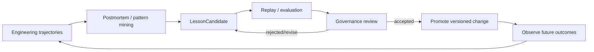
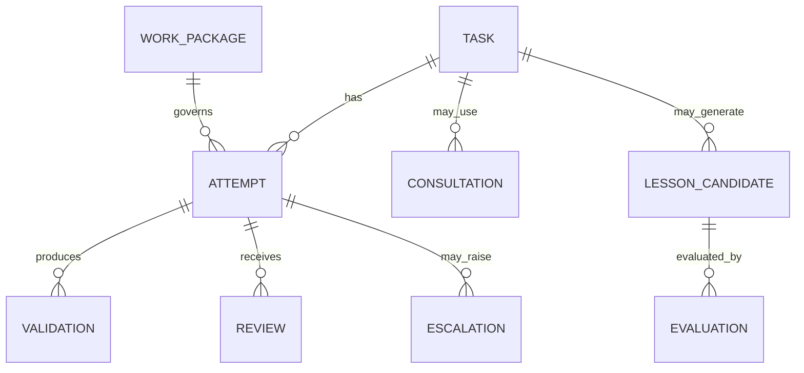
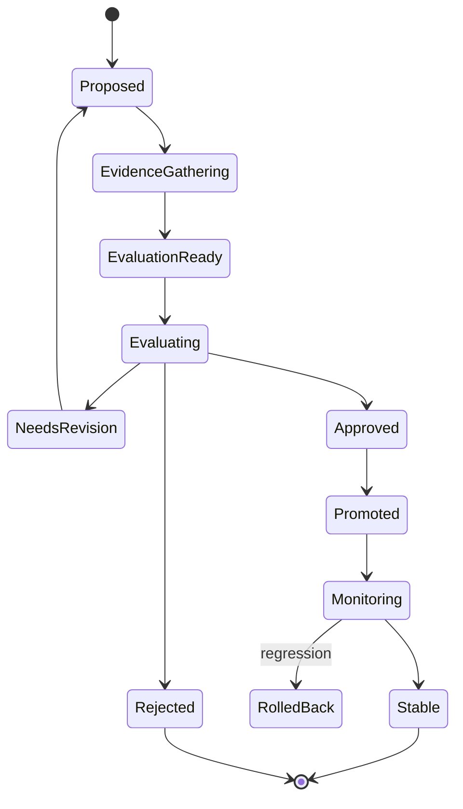
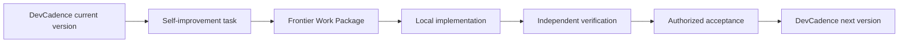

# Learning and Continuous Improvement

## Scope

DevCadence learns by improving its engineering system: knowledge, skills, prompts, routing, verification, task design and policies. Learning is evidence-driven and governed. It is not uncontrolled prompt self-editing.

## 1. Learning loop



## 2. Trajectory model

A trajectory records the observable engineering process:
- initial ProjectState revision;
- Work Package;
- evidence used;
- models/profiles;
- prompts/skills versions;
- tool calls;
- implementation attempts;
- validation results;
- reviews/disagreements;
- escalations;
- consultant results;
- accepted patch;
- human corrections;
- outcome and later regressions.

It does not require storing hidden chain-of-thought.

## 3. Trajectory relationships



## 4. Lesson types

### Project knowledge
Example: “Timestamp normalization belongs in ingestion.”

Can become:
- project invariant;
- ADR clarification;
- component rule.

### Engineering skill
Example: “When a Go interface changes, find/regenerate mocks before validation.”

Can become:
- reusable role skill;
- deterministic preflight check.

### Routing knowledge
Example: “Model A catches API compatibility issues better than Model B.”

Can alter:
- reviewer routing;
- N-version policies.

### Task-design knowledge
Example: “Concurrency tasks fail less when ownership/locking pseudocode is mandatory.”

Can alter:
- Work Package templates;
- readiness policy.

### Verification knowledge
Example: “These parser changes need fuzzing.”

Can alter:
- validation profile selection.

### Prompt/role knowledge
A role prompt consistently misses a class of issue.

Can produce:
- prompt candidate;
- evaluation against frozen trajectories.

### Architecture knowledge
A past ADR caused repeated workarounds.

Can produce:
- architecture lesson;
- reconciliation input.

## 5. Lesson Candidate lifecycle



## 6. Candidate contents

A LessonCandidate should include:
- type;
- scope;
- observed pattern;
- evidence trajectories;
- proposed change;
- expected benefit;
- possible counterexamples;
- conflicts with existing policy/invariants;
- evaluation plan;
- promotion authority;
- rollback plan.

## 7. Evaluation before promotion

Possible evaluation methods:
- replay historical task contexts;
- run a frozen repository fixture;
- A/B role prompts;
- shadow routing;
- compare reviewer true/false positive rates;
- compare retries/escalations;
- human review of representative cases.

Do not promote a general rule solely because it would have fixed one memorable failure.

## 8. Prompt evaluation

Prompt changes are code changes.

Track:
- prompt version;
- evaluation corpus;
- success criteria;
- regressions;
- output schema validity;
- token/context behavior;
- tool-call reliability;
- false escalation rate.

## 9. Portfolio and workflow routing evaluation

Track outcomes against the actual decision context, not merely model name:

```text
task class / language / risk
+ engineering role
+ endpoint + access channel
+ economic regime / budget pool
+ workflow topology
+ prompt/skill revision
→ evaluated outcome
```

Useful questions include:
- which endpoint/access path reaches accepted implementation with the fewest scarce-resource repair cycles;
- when local iteration is preferable to subscription/API escalation;
- whether independent provider diversity catches materially different defects;
- when multiple reviewers add no value;
- whether a subscription quota should be reserved for Principal/closure work;
- whether a nominally cheap hosted endpoint causes enough retries to be more expensive overall.

Avoid opaque autonomous routing initially. Historical evidence produces interpretable PortfolioRecommendation/WorkflowPolicy candidates that follow the normal LessonCandidate evaluation/promotion process.

## 10. Useful outcome metrics

- task accepted and later regressions;
- human corrections;
- retry/repair count;
- cognition session/invocation count;
- Principal escalation/re-entry;
- reviewer defect precision;
- Work Package deviation;
- validation failures;
- wall time;
- local compute/resource use;
- subscription/quota use;
- metered API token/spend where observable;
- source exposure;
- workflow topology;
- resource-to-accepted-result;
- code-health impact.

Quality dominates raw speed, but "cheap" cognition is not assumed free. Recommendations compare outcome quality and scarce-resource consumption together.

## 11. Architecture postmortems

When an implementation is painful, ask whether design was wrong.

Possible causes:
- incorrect architecture;
- ambiguous Work Package;
- missing repository fact;
- bad local model;
- poor routing;
- missing deterministic check;
- insufficient test strategy.

Do not default to blaming the implementer.

## 12. Cross-project vs project-specific learning

A project-specific lesson should not automatically become global.

Promotion scopes:
- task-local;
- project;
- language/framework;
- organization;
- global DevCadence default.

Higher scope requires stronger evidence.

## 13. Knowledge retrieval

Promoted lessons should be retrievable by:
- component;
- language/framework;
- failure type;
- task class;
- architecture concept.

Do not stuff all lessons into every prompt.

## 14. Policy experiments

A PolicyExperiment defines:
- hypothesis;
- baseline;
- candidate behavior;
- evaluation set;
- metrics;
- stop conditions;
- promotion criteria.

Example:
> For systemic Go concurrency changes, adding a clean-context concurrency reviewer after correctness review reduces accepted race defects without increasing false escalation above X.

## 15. Self-development

DevCadence may develop DevCadence, but self-referential work follows identical policy.



No component gets privileged permission to bypass governance because the target repository is itself.

## 16. Fine-tuning

Fine-tuning is optional and later-stage.

Before considering it, prefer:
- better Work Packages;
- better evidence retrieval;
- role specialization;
- prompts/skills;
- model routing;
- deterministic checks;
- evaluation.

If trajectory data eventually supports fine-tuning, keep train/eval leakage controls and preserve a sealed evaluation corpus.

## 17. Anti-patterns

- agent edits its own normative prompt after one failure;
- “learned rule” with no provenance;
- routing policy based only on vendor benchmark;
- deleting failed trajectories to make metrics look better;
- training on the same tasks used to claim improvement;
- treating human override as noise rather than high-value evidence.
