# DevCadience Engineering Lifecycle

## Scope

This document defines how DevCadience handles a project from Day 0 through long-term maintenance. The lifecycle is deliberately broader than code generation.

## 1. Whole-project lifecycle

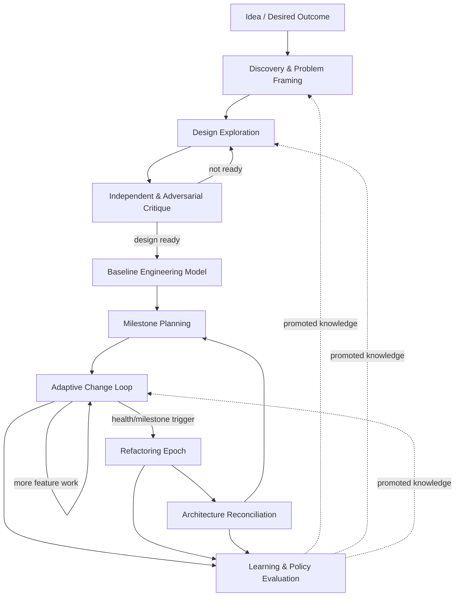

## 2. Day 0: idea intake

The system begins by understanding the problem, not inventing architecture.

Required initial artifact: **Problem Model**.

Suggested fields:
- desired outcome;
- target users/operators;
- problem evidence;
- constraints;
- explicit non-goals;
- assumptions;
- unknowns;
- current environment;
- data/security/regulatory concerns;
- expected scale;
- acceptable operational complexity;
- success/failure criteria.

The principal should ask whether the proposed software is actually the correct intervention.

## 3. Discovery

Discovery may use:
- current web/documentation research;
- local environment probes;
- prototypes;
- consultant analyses;
- comparable architecture research;
- performance measurements;
- standards/security references.

The principal distinguishes:
- verified external facts;
- current repository facts;
- assumptions;
- hypotheses.

### Discovery convergence

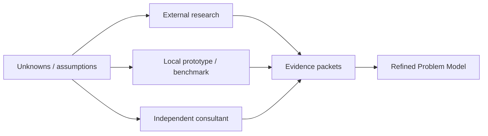

## 4. Design exploration

Substantial systems should have multiple candidate architectures.

The principal should consider alternatives before becoming attached to one.

For an architectural decision, capture:
- candidate design;
- benefits;
- failure modes;
- operational burden;
- security implications;
- testability;
- migration path;
- reversibility;
- impact on future features;
- assumptions;
- evidence.

## 5. Deliberate critique vectors

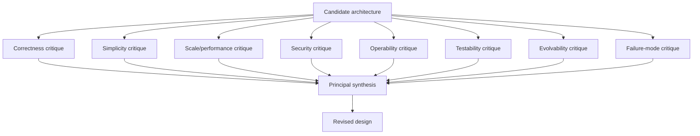

Not every vector needs a frontier consultant. Many can be separate local or frontier passes. The important property is explicit perspective diversity.

## 6. Baseline Engineering Model

Implementation of a new substantial project should begin only after the project has enough durable guidance.

Typical baseline:
- VISION / problem definition;
- functional requirements;
- non-functional requirements;
- architecture;
- component contracts;
- invariants;
- ADRs;
- failure model;
- security model;
- observability strategy;
- testing/verification strategy;
- rollout/migration strategy when relevant;
- milestones.

“Baseline” means implementation agents cannot casually redefine these decisions. It does not mean architecture can never change.

## 7. Change impact classification

Every feature/change is classified before choosing process depth.

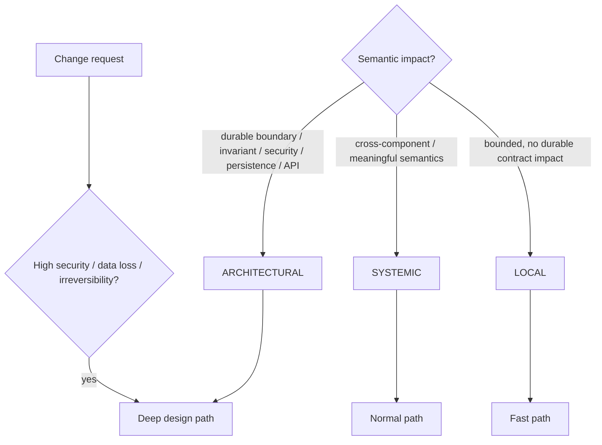

Risk can promote a small change to the deep path.

## 8. Fast path

Suitable for local changes.

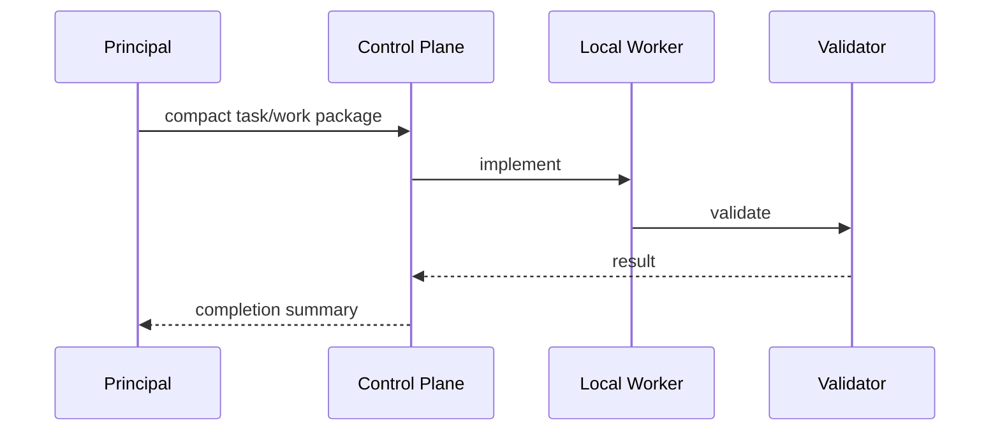

Fast does not mean unverified.

## 9. Normal path

For systemic changes:

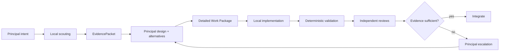

## 10. Deep architectural path

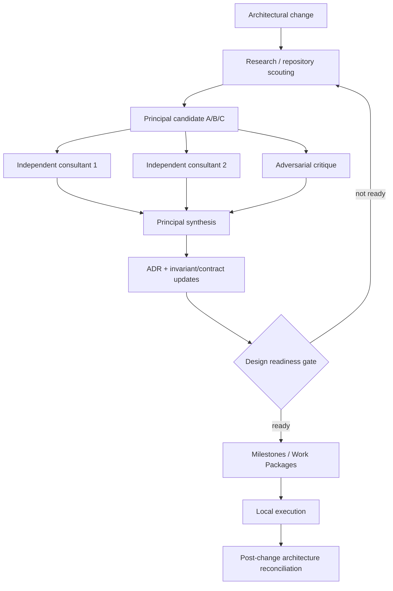

Where independence matters, consultants should first receive the problem without the principal's preferred answer.

## 11. Design Readiness Gate

Readiness is evidence-based, not a numeric self-confidence score.

A systemic/architectural design is ready when required policy checks are satisfied, such as:
- material assumptions verified or explicitly accepted as risk;
- alternatives considered;
- current repository constraints grounded;
- current external facts grounded where applicable;
- major risks documented;
- dissent/disagreements resolved or intentionally preserved;
- implementation approach complete;
- pseudocode/algorithms sufficient for non-trivial logic;
- acceptance and test strategy complete;
- rollback/migration understood;
- escalation conditions defined.

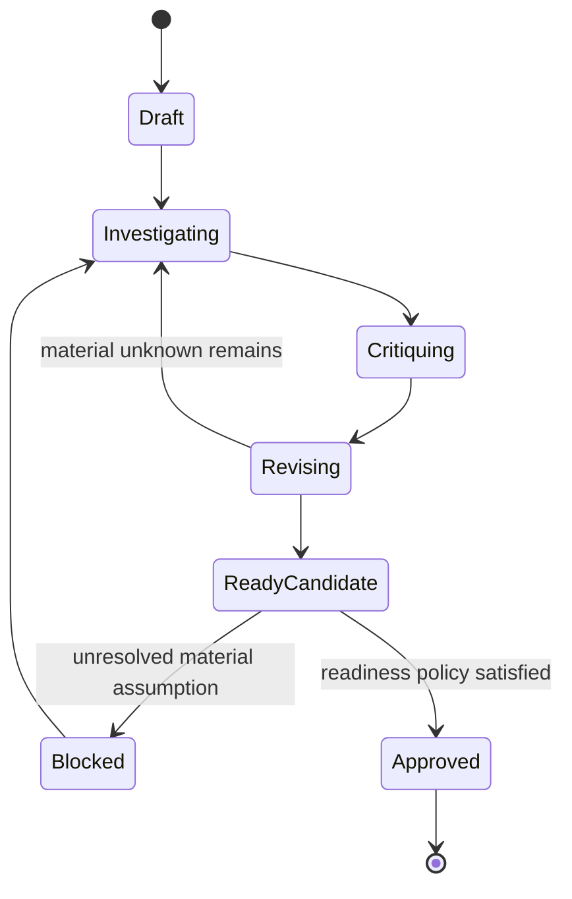

## 12. Delivery task lifecycle

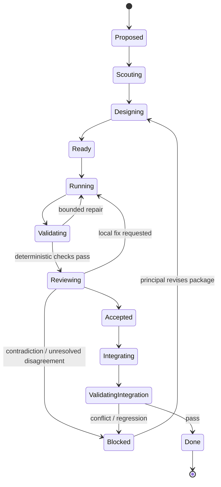

Retries create new Attempt records and do not erase failed history.

## 13. Contradiction path

A local agent is expected to challenge a false blueprint assumption.

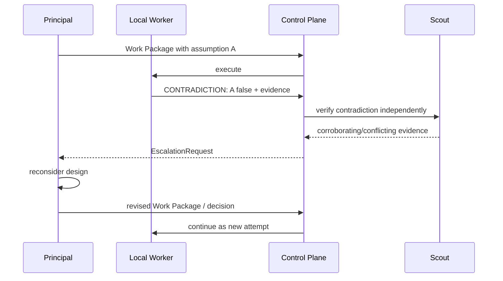

## 14. Refactoring Epoch triggers

A Refactoring Epoch may be triggered by:
- milestone completion;
- N systemic tasks since previous epoch;
- rising complexity or duplication;
- API surface growth;
- repeated reviewer concerns;
- architectural smell clusters;
- significant dependency changes;
- pre-release gate.

Feature pressure cannot permanently suppress the epoch.

## 15. Architecture Reconciliation

Refactoring focuses on code quality within the intended architecture.

Architecture Reconciliation asks whether the intended architecture itself is still right.

Inputs:
- current implementation map;
- current requirements;
- original architecture;
- ADR history;
- accumulated workarounds;
- code-health reports;
- production/operational evidence;
- repeated failure patterns.

Outputs:
- confirmation of current baseline; or
- new architecture version;
- superseded ADRs/invariants;
- migration plan;
- new milestones/work packages.

## 16. Learning loop integration

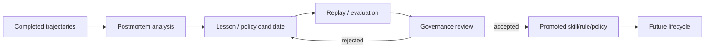

## 17. Human escalation

The human should see decisions with durable product or risk significance, not every implementation failure.

Examples:
- product semantics genuinely ambiguous;
- irreversible data migration;
- security boundary change;
- legal/compliance implication;
- cost/operational commitment;
- multiple frontier consultants remain materially divided;
- project goals conflict.

The system should present the human with evidence, alternatives and consequences rather than an unstructured transcript.

## 18. Discovery and Specification Loop

The Day-0 intake described above is governed by the full protocol in [DISCOVERY_AND_SPECIFICATION.md](DISCOVERY_AND_SPECIFICATION.md).

Before entering Design Exploration, a substantial greenfield project or product-semantic change must pass Specification Readiness.

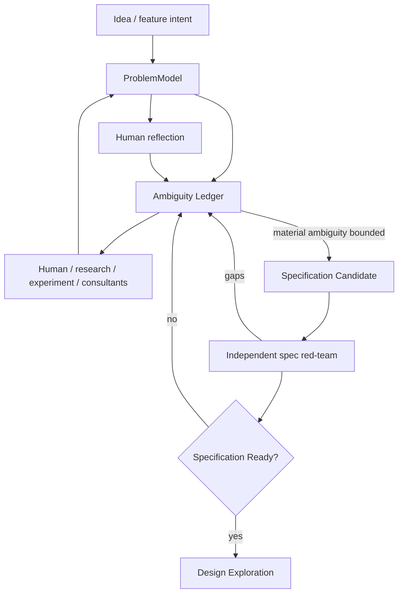

A fixed questionnaire is not the lifecycle. The principal asks a small number of high-impact questions, updates durable state, and repeats.

When requirements change after architecture has begun, only the affected discovery scope must be reopened unless the change invalidates foundational product assumptions.
