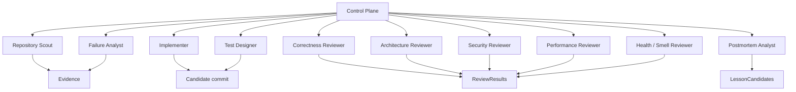
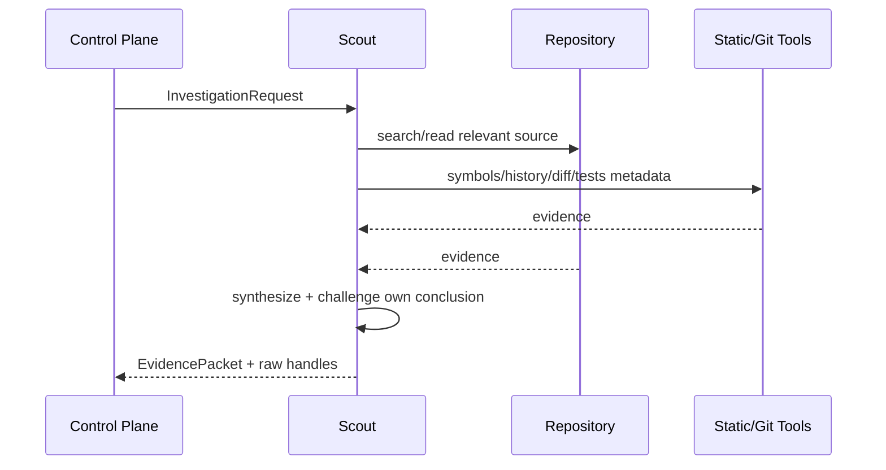
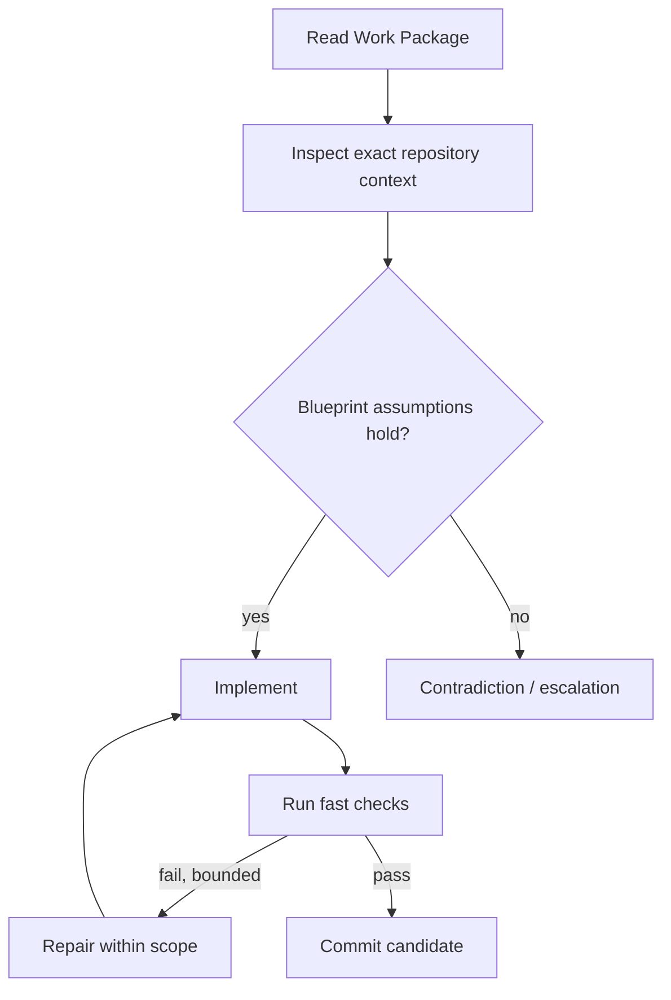
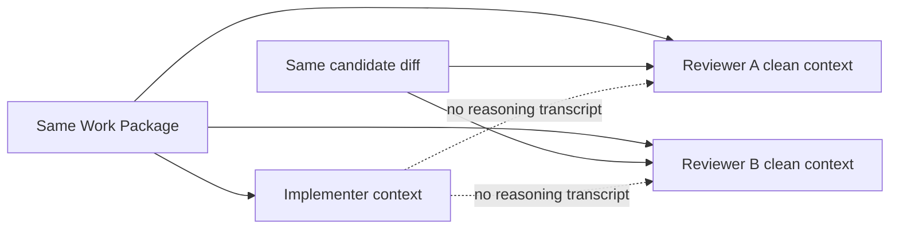
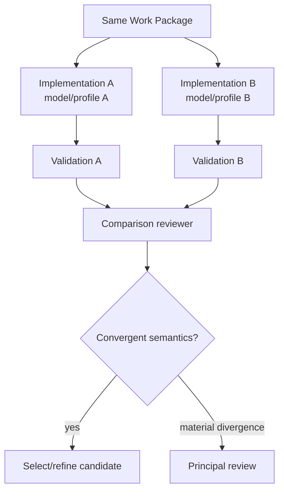

# Local Engineering Agents

## Scope

This document defines the local roles that perform high-volume engineering cognition. A role is a stable responsibility and authority boundary; the model/runtime assigned to a role is replaceable.

## 1. Role graph

Not every task invokes every role.

## 2. Shared local-agent principles

All local roles:
- operate under explicit authority;
- distinguish observation from interpretation;
- preserve evidence references;
- may report uncertainty;
- must stop on prohibited scope expansion;
- do not change normative architecture by implication;
- do not mark deterministic facts without tool evidence;
- are replaceable by another model/harness.

## 3. Repository Scout

### Purpose
Spend local tokens freely to answer focused repository questions.

### Input
- InvestigationRequest;
- project/repository configuration;
- optional scope hints;
- allowed read tools.

### Responsibilities
- search files/symbols/history/tests;
- follow call paths;
- identify existing patterns;
- discover relevant interfaces and invariants;
- detect contradictions to proposed design assumptions;
- return concise EvidencePacket.

### Not allowed
- broad implementation;
- architectural decision;
- altering source;
- converting inference into fact.

### Flow

## 4. Implementer

### Purpose
Realize an approved Engineering Work Package in an isolated worktree.

### Required input
- immutable Work Package version;
- base commit/worktree;
- relevant evidence;
- repository tools;
- validation commands/policy.

### Execution loop

### Important behavior
The implementer should not blindly translate pseudocode line-for-line. It adapts to actual repository idioms while preserving semantic requirements.

It may deviate from SHOULD/SUGGESTED guidance with explanation.

It may never silently violate MUST.

## 5. Test Designer

### Purpose
Attack the Work Package's acceptance model independently of the implementer.

Useful for:
- boundary cases;
- property tests;
- regression tests;
- fuzz targets;
- state-machine transitions;
- failure injection;
- concurrency tests.

Test Designer should preferably not see the implementer’s explanatory rationale before producing its first test critique.

## 6. Correctness Reviewer

Checks:
- actual behavior against Work Package;
- edge cases;
- error paths;
- state consistency;
- hidden behavior change;
- incomplete implementation;
- unjustified deviation.

It does not primarily review style.

## 7. Architecture / Invariant Reviewer

Checks:
- component responsibility;
- dependency direction;
- public API effects;
- architectural invariant compliance;
- accidental abstractions;
- scope expansion;
- documented design vs implementation.

## 8. Security Reviewer

Checks according to task risk:
- authority expansion;
- command injection;
- prompt injection;
- credentials;
- unsafe file/path handling;
- arbitrary shell/network access;
- sandbox escape assumptions;
- destructive operations;
- secret persistence/logging;
- dependency risk.

## 9. Performance Reviewer

Used when performance is material.

Must distinguish measured concerns from speculative micro-optimization.

May request benchmarks before recommending complexity.

## 10. Failure Analyst

Invoked when:
- repeated validation failures;
- worker loops;
- unclear compiler/test failures;
- contradiction between blueprint and code;
- integration regression.

The Failure Analyst does not automatically patch. It creates a diagnosis/evidence package that can guide a new Attempt or principal escalation.

## 11. Health / Smell Reviewer

Used during Refactoring Epochs or health triggers.

Looks for semantic smells difficult to reduce to simple metrics:
- duplicated concepts under different names;
- near-identical abstractions;
- layer leakage;
- unnecessary wrappers;
- “AI defensive coding” proliferation;
- fragmented configuration;
- redundant tests;
- accidental public APIs;
- code that technically works but no longer expresses the architecture.

## 12. Postmortem Analyst

Analyzes trajectories after:
- repeated failure;
- principal escalation;
- human correction;
- architectural rollback;
- unusually successful workflow.

It asks whether the cause was:
- Work Package ambiguity;
- wrong principal assumption;
- local model limitation;
- missing deterministic check;
- bad reviewer routing;
- policy threshold;
- architectural weakness.

Its output is a LessonCandidate, never immediate policy mutation.

## 13. Clean-context independence

This reduces correlated self-justification.

## 14. Multi-model diversity

When available, critical reviews should sometimes use different model families.

Diversity is useful when models have different failure patterns.

The system should empirically track whether diversity improves defect detection rather than assuming it always does.

## 15. N-version implementation

For high-risk or algorithmically ambiguous tasks:

Use selectively; it trades time/compute for independent design evidence.

## 16. Retry policy

Retries are bounded.

A retry should have a reason:
- deterministic failure;
- reviewer-requested repair;
- new evidence;
- revised Work Package.

Repeating the same model/prompt against the same unchanged evidence is not a meaningful retry.

## 17. Model routing

Role profiles may include:
- required context;
- language/framework;
- tool-use reliability;
- structured-output reliability;
- memory footprint;
- expected review strength;
- observed recent success;
- cost class;
- runtime availability.

Model routing is a policy/evaluation problem, not hard-coded identity.

## 18. Local model runtime hygiene

Long-running local systems should:
- unload models when resource policy requires;
- monitor memory pressure;
- bound concurrent contexts;
- record runtime/model version;
- detect truncation;
- preserve prompt/output artifacts subject to privacy policy;
- fail explicitly when requested context exceeds configured capability.

## 19. Output discipline

Local agents return structured outputs. Free-form prose may supplement them.

Critical fields must not be recoverable only by brittle prose parsing.

## 20. Anti-patterns

- one “super local agent” with all authorities;
- reviewers inheriting implementer reasoning by default;
- “confidence: 95%” replacing evidence;
- unlimited retry loops;
- worker silently broadening task scope;
- worker rewriting architecture to make tests pass;
- using the strongest local model for trivial log compression when smaller/deterministic processing is sufficient.
