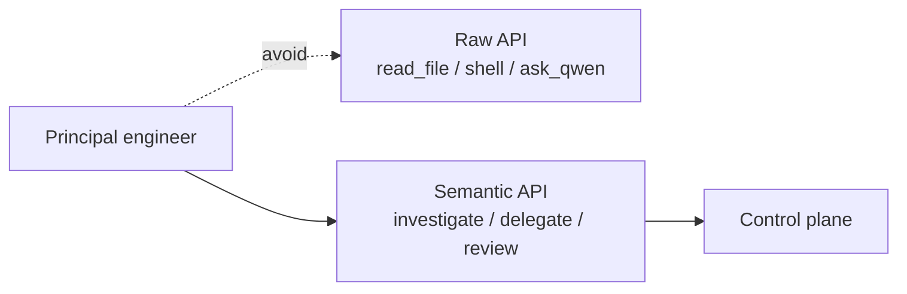
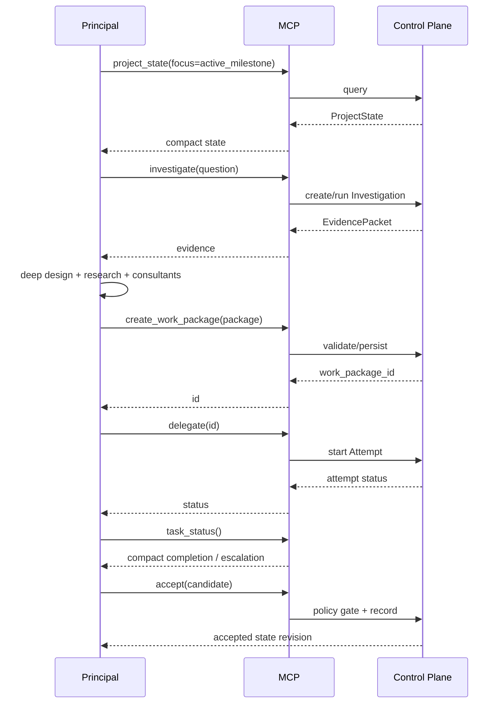
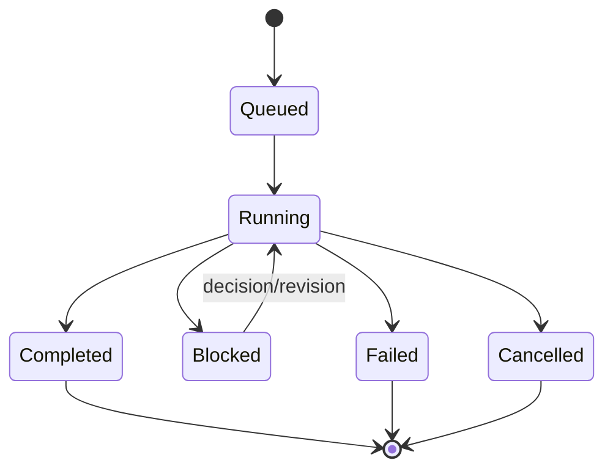

# Semantic MCP API

## Scope

This document defines the intended principal-facing MCP surface. It is deliberately semantic. The principal should think in engineering operations, not raw repository primitives.

Exact MCP transport/configuration is adapter-level and may evolve without changing these semantics.

### Bootstrap executable contract

The `devcadience-mcp` binary MUST start the stdio MCP server when invoked with no arguments. This makes it directly usable from Antigravity's `mcp_config.json` `command` field. Additional subcommands/flags MAY be added later, but the no-argument stdio behavior is a compatibility contract for the Antigravity plugin.

See [ANTIGRAVITY_INTEGRATION.md](ANTIGRAVITY_INTEGRATION.md).

## 1. API design principle

The control plane chooses how to satisfy semantic operations.

## 2. Bootstrap tool set

### `project_state`
Returns compact canonical state.

Input:
- project ID;
- optional focus (milestone/component/task);
- optional state revision.

Output:
- ProjectState or focused projection.

### `investigate`
Requests repository-local investigation.

Input:
- question;
- evidence requested;
- scope hints;
- base commit/state revision;
- semantic response budget.

Output:
- EvidencePacket.

### `create_work_package`
Persists a principal-authored Engineering Work Package after validating references and base revision.

This tool does not generate the package; the principal supplies the design artifact.

### `delegate`
Starts an Attempt for an approved Work Package.

Input:
- work package ID/version;
- worker profile;
- optional execution policy override allowed by project policy.

Output:
- attempt ID and status.

### `task_status`
Returns current task/attempt status without flooding the principal with logs.

### `validate`
Runs or retrieves a validation profile for a candidate.

### `review`
Schedules independent review dimensions.

### `request_evidence`
Retrieves progressively deeper raw evidence behind an EvidencePacket/ReviewResult.

### `accept`
Records an authorized candidate acceptance subject to policy gates.

### `reject`
Rejects candidate with reason and optional revision direction.

### `record_decision`
Persists a DecisionRecord and links ADR/invariant updates.

## 3. Extended tools

Later milestones may add:
- `consult`;
- `classify_change`;
- `plan_refactoring_epoch`;
- `health_report`;
- `architecture_reconcile`;
- `lesson_candidates`;
- `promote_lesson`;
- `integration_plan`;
- `cancel_attempt`.

## 4. Typical principal session

## 5. Information depth

`request_evidence` supports explicit depth:

- `summary` — semantic finding;
- `symbol` — signatures/types/call relationships;
- `snippet` — focused source excerpts;
- `diff` — relevant patch;
- `file` — selected complete file;
- `artifact` — raw log/test/consultation artifact.

Direct unrestricted repository traversal is intentionally not a public bootstrap MCP primitive.

## 6. Asynchronous behavior

Long operations return IDs/status rather than holding a giant MCP response.

The principal can poll status or use future notification/event mechanisms.

## 7. Error model

Semantic errors include:
- `STALE_PROJECT_STATE`;
- `POLICY_DENIED`;
- `CONTRADICTED_ASSUMPTION`;
- `VALIDATION_FAILED`;
- `REVIEW_DISAGREEMENT`;
- `NEEDS_PRINCIPAL`;
- `NEEDS_HUMAN`;
- `MODEL_UNAVAILABLE`;
- `CONSULTANT_UNAVAILABLE`;
- `UNSUPPORTED_SCHEMA_VERSION`.

Errors should provide actionable evidence handles.

## 8. Project-state staleness

Creating a Work Package against stale state must be detected.

Policy options:
- accept if changed files/components are disjoint;
- require targeted re-scout;
- require principal revalidation;
- reject.

Do not silently execute a plan whose assumptions may no longer hold.

## 9. Authority

Each MCP tool has an authority level.

Example:
- read semantic state: low;
- investigate: low;
- start isolated attempt: medium;
- accept/integrate: higher;
- promote lesson: higher;
- destructive Git/deployment: outside normal principal MCP bootstrap surface.

## 10. MCP adapter rule

The MCP server is thin:
- validate input schema;
- authenticate/identify caller if needed;
- invoke application service;
- normalize errors;
- stream/return result.

No important routing or acceptance policy belongs only in the MCP adapter.
