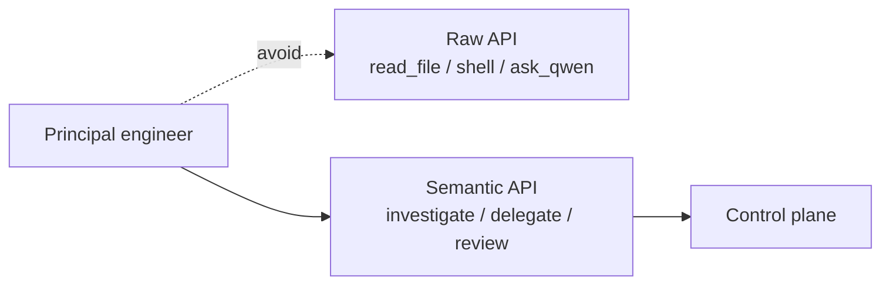
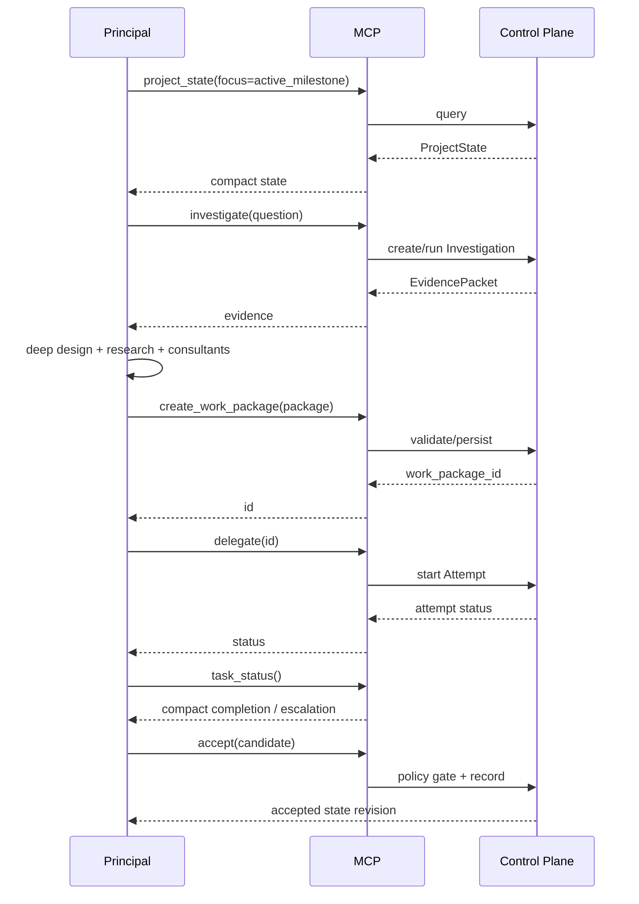
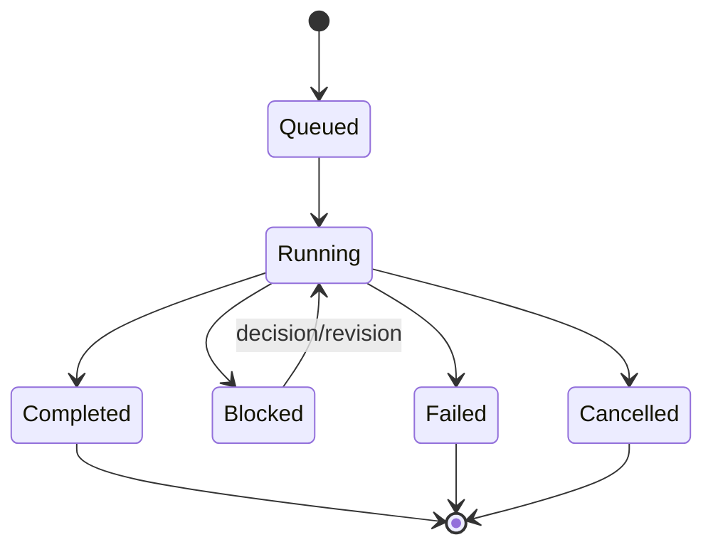

# Semantic MCP API

## Scope

This document defines the intended principal-facing MCP surface. It is deliberately semantic. The principal should think in engineering operations, not raw repository primitives.

Exact MCP transport/configuration is adapter-level and may evolve without changing these semantics.

### Bootstrap executable contract

The `devcadence-mcp` binary MUST start the stdio MCP server when invoked with no arguments. The no-argument stdio behavior is a host-neutral compatibility contract intended to make integration straightforward from supported principal hosts.

Antigravity is the reference host; Cursor and Visual Studio Code are also initial first-class host targets. Host-specific configuration remains adapter-level.

See [PRINCIPAL_HOSTS.md](PRINCIPAL_HOSTS.md) and [ANTIGRAVITY_INTEGRATION.md](ANTIGRAVITY_INTEGRATION.md).

## M5 preparation status

See the [M5 preparation window](work-packages/window-2026-10-f-overview.md) for planning status and runtime prerequisites, [WP-M5-2](work-packages/wp-m5-2-semantic-mcp-ewp.md) for the proposed wire boundary, and [WP-M5-3 owning-contract alignment](work-packages/wp-m5-3-discovery-ewp.md#owning-contract-alignment) for discovery refinement and synchronization. The accepted [ADR-0016 evidence-tier amendment](adr/0016-validation-services-bounded-tools-and-context-compaction.md#amendment-2026-09-23-evidence-tiers-within-the-bounded-tools-boundary) governs the depth examples below: search/symbol may be direct compact evidence; source content is bounded execution-agent-mediated, never a principal raw file or pager operation.

**WP-M5-2 status:** the host-neutral facade (`internal/principal/facade`), the thin official-SDK stdio adapter (`internal/mcpadapter`) and the no-argument `cmd/devcadence-mcp` binary are implemented in the working tree under the same disclosed owner authorization as WP-M5-1 (the EWP header remained DRAFT/NOT_READY; independent review has not run). The slice delivers state, proposal persistence and bounded evidence operations only. **No production task, validation, review, snippet or scout runtime exists:** those ports are nil by default and deny with `MODEL_UNAVAILABLE`, and **acceptance is hard-disabled** (`accept` always returns `NEEDS_PRINCIPAL`). See [§8.2](#82-facade-launch-binding-and-limits-wp-m5-2) and the [EWP implementation record](work-packages/wp-m5-2-semantic-mcp-ewp.md#implementation-record).

## 1. API design principle

```mermaid
flowchart LR
    Bad["Raw API<br/>read_file / shell / ask_qwen"]
    Good["Semantic API<br/>investigate / delegate / review"]
    Principal["Principal engineer"]
    Control["Control plane"]

    Principal -. avoid .-> Bad
    Principal --> Good --> Control
```

The control plane chooses how to satisfy semantic operations.

## 2. Bootstrap tool set

### `project_state`
Returns compact canonical state.

Input:
- project ID;
- optional focus (milestone/component/task);
- optional state revision.

Output:
- ProjectState or focused projection.

### `investigate`
Requests repository-local investigation.

Input:
- question;
- evidence requested;
- scope hints;
- base commit/state revision;
- semantic response budget.

Output:
- EvidencePacket.

### `create_work_package`
Persists a principal-authored Engineering Work Package after validating references and base revision.

This tool does not generate the package; the principal supplies the design artifact.

### `delegate`
Starts an Attempt for an approved Work Package.

Input:
- work package ID/version;
- worker profile;
- optional execution policy override allowed by project policy.

Output:
- attempt ID and status.

### `task_status`
Returns current task/attempt status without flooding the principal with logs.

### `validate`
Runs or retrieves a validation profile for a candidate.

### `review`
Schedules independent review dimensions.

### `request_evidence`
Retrieves progressively deeper raw evidence behind an EvidencePacket/ReviewResult.

### `accept`
Records an authorized candidate acceptance subject to policy gates.

### `reject`
Rejects candidate with reason and optional revision direction.

### `record_decision`
Persists a DecisionRecord and links ADR/invariant updates.

## 2A. Discovery tool set

For Day-0 and product-semantic discovery, the semantic MCP surface should support:

### `initialize_project`
Creates a project before source implementation necessarily exists.

### `discovery_state`
Returns the current ProblemModel reference/summary, Ambiguity Ledger summary, requirements status, ProductDecisions, active experiments and latest SpecificationReadiness.

### `record_problem_model`
Persists a new immutable/versioned ProblemModel revision.

### `record_ambiguities`
Adds/updates ambiguity entries while preserving resolution history.

### `record_product_decision`
Persists a human-authoritative product decision and its consequences.

### `record_requirements`
Persists versioned requirements with provenance and epistemic status.

### `record_discovery_experiment`
Creates/updates a bounded discovery experiment and evidence references.

### `review_specification`
Schedules independent specification review dimensions through available local/consultant reviewers.

### `record_specification_readiness`
Persists the evidence-based readiness gate result.

These operations are semantic persistence/orchestration tools. Antigravity remains responsible for the human conversation and synthesis.

See [DISCOVERY_AND_SPECIFICATION.md](DISCOVERY_AND_SPECIFICATION.md).

## 3. Extended tools

Later milestones may add:
- `start_review_campaign`;
- `review_campaign_state`;
- `adjudicate_findings`;
- `create_repair_work_package`;
- `focused_revalidate`;
- `close_review_campaign`;
- `reopen_review_campaign`;
- `consult`;
- `classify_change`;
- `plan_refactoring_epoch`;
- `health_report`;
- `architecture_reconcile`;
- `lesson_candidates`;
- `promote_lesson`;
- `integration_plan`;
- `cancel_attempt`.

## 4. Typical principal session

```mermaid
sequenceDiagram
    participant P as Principal
    participant M as MCP
    participant C as Control Plane

    P->>M: project_state(focus=active_milestone)
    M->>C: query
    C-->>M: ProjectState
    M-->>P: compact state

    P->>M: investigate(question)
    M->>C: create/run Investigation
    C-->>M: EvidencePacket
    M-->>P: evidence

    P->>P: deep design + research + consultants
    P->>M: create_work_package(package)
    M->>C: validate/persist
    C-->>M: work_package_id
    M-->>P: id

    P->>M: delegate(id)
    M->>C: start Attempt
    C-->>M: attempt status
    M-->>P: status

    P->>M: task_status()
    M-->>P: compact completion / escalation

    P->>M: accept(candidate)
    M->>C: policy gate + record
    C-->>P: accepted state revision
```

## 5. Information depth

`request_evidence` supports explicit depth:

- `summary` — semantic finding;
- `symbol` — signatures/types/call relationships;
- `snippet` — focused source excerpts;
- `diff` — relevant patch;
- `file` — selected complete file;
- `artifact` — raw log/test/consultation artifact.

Direct unrestricted repository traversal is intentionally not a public bootstrap MCP primitive.

**Implemented depth (WP-M5-2, governed by the accepted ADR-0016 amendment).** `request_evidence` is a closed union of `summary`, `search`, `symbol`, `snippet` and `diff`; `file` and `artifact` are not offered to the principal. `summary`, `search` and `symbol` return compact structured facts bound to project and base; `snippet` and `diff` are worker-mediated process operations capped at 8192 UTF-8 bytes and 200 lines, never silently truncated (`CONTEXT_UNFIT` with narrower-request advice). A binding's `source_depth` (`summary` < `symbol` < `snippet`) bounds what a caller may ask for.

## 6. Asynchronous behavior

Long operations return IDs/status rather than holding a giant MCP response.

```mermaid
stateDiagram-v2
    [*] --> Queued
    Queued --> Running
    Running --> Completed
    Running --> Blocked
    Running --> Failed
    Running --> Cancelled
    Blocked --> Running: decision/revision
    Completed --> [*]
    Failed --> [*]
    Cancelled --> [*]
```

The principal can poll status or use future notification/event mechanisms.

## 7. Error model

The principal v1 wire vocabulary (`internal/principal`, WP-M5-1) fixes a **closed** error-code set: `INVALID_ARGUMENT`, `UNSUPPORTED_SCHEMA_VERSION`, `NOT_FOUND`, `INTEGRITY`, `STALE_PROJECT_STATE`, `STALE_WORK_PACKAGE`, `POLICY_DENIED`, `VALIDATION_FAILED`, `REVIEW_DISAGREEMENT`, `NEEDS_PRINCIPAL`, `NEEDS_HUMAN`, `MODEL_UNAVAILABLE`, `CONTEXT_UNFIT`, `CONTRADICTED_ASSUMPTION`, `OPERATION_LOST`, `CANCELLED`, `INTERNAL`. Each code carries one fixed safe message; raw provider, shell or SQL text is never returned, and `evidence_refs` hold only authorized project-scoped immutable handles. `CONSULTANT_UNAVAILABLE` below is not in the v1 closed set and remains a future extension. The informal list that follows predates that set.

Semantic errors include:
- `STALE_PROJECT_STATE`;
- `POLICY_DENIED`;
- `CONTRADICTED_ASSUMPTION`;
- `VALIDATION_FAILED`;
- `REVIEW_DISAGREEMENT`;
- `NEEDS_PRINCIPAL`;
- `NEEDS_HUMAN`;
- `MODEL_UNAVAILABLE`;
- `CONSULTANT_UNAVAILABLE`;
- `UNSUPPORTED_SCHEMA_VERSION`.

Errors should provide actionable evidence handles.

## 8. Project-state staleness

### 8.1 Call envelope and transactional guard (WP-M5-1 foundation)

Every principal call carries `CallMeta` (`schema_version` `"1.0"`, `project_id`, `correlation_id`, and for mutations `expected_state_revision`; bootstrap initialization must omit it). Requests carry **no actor, grant or policy field**: unknown keys are refused, and the caller's identity and grants come only from the local protected binding (`principal.CallerContext`, internal, never serialized). `WorkPackageRef`, `CandidateRef`, `SemanticError` and `OperationRef` complete the vocabulary; see [schemas/README.md](../schemas/README.md). Mutations reach the control plane through `controlplane.ApplyBatch`, which enforces the expected prefix and the start-execution Work Package guard inside one transaction ([PROJECT_STATE.md §7.1a](PROJECT_STATE.md#71a-guarded-writes-and-start-execution-freshness-wp-m5-1)). A facade maps `errors.Is(err, controlplane.ErrStaleProjectState)` to `STALE_PROJECT_STATE` and `ErrStaleWorkPackage` to `STALE_WORK_PACKAGE` before any generic conflict mapping. `correlation_id` is correlation only, not an idempotency promise: repeating a call at its old prefix after a successful commit is stale.

Creating a Work Package against stale state must be detected.

### 8.2 Facade, launch binding and limits (WP-M5-2)

**One facade, thin transport.** `internal/principal/facade` owns every semantic decision; `internal/mcpadapter` strictly decodes arguments, binds the launch caller, dispatches and normalises, so the same authorized call gives the same result through Go and MCP. Only the eleven base tools are registered, named exactly as in §2 (these names are also the canonical grants; there are no aliases). Resources, prompts, completions, logging, sampling, elicitation and roots are refused, and no raw filesystem, shell, SQL or network tool exists. The discovery tools of §2A and their grants belong to WP-M5-3 and are not registered. As a read-only exception owned by that work package, `project_state` with `focus` `discovery` at the current revision also returns `result.discovery_analysis`: a reconstruction from durable records (open questions, decision statuses, ledger-versus-journal consistency violations and readiness blockers) in which `positive_readiness` is never derived from a recorded verdict and is false while human reflection or independent review cannot be verified. The facade's `DiscoveryWrite` refuses every discovery write tool with no effect (`NEEDS_HUMAN`, `MODEL_UNAVAILABLE` or `NEEDS_PRINCIPAL`); see the [EWP implementation record](work-packages/wp-m5-3-discovery-ewp.md#implementation-record).

**Launch.** `devcadence-mcp` takes no arguments (any argument exits 2 before launch) and speaks MCP over stdio; stdout carries protocol frames only and diagnostics go to stderr. It reads `DEVCADENCE_PROJECT_ID`, an absolute `DEVCADENCE_HOME` and an optional absolute `DEVCADENCE_PRINCIPAL_BINDING` (default `$DEVCADENCE_HOME/config/principal-binding.json`); the database is `$DEVCADENCE_HOME/state/control-plane.db`. Nothing is discovered in the working directory, so the source repository need not be the process cwd. The binding (`binding_version` `1.0`, `project_id`, `principal_id`, `allowed_actions`, `policy_ref`, `max_evidence_bytes` 1-8192, `max_snippet_lines` 1-200, `source_depth`) must be a regular, symlink-free, owner-owned `0600` file in an owner-private `0700` directory whose ancestors are not group/world writable (sticky directories excepted); non-POSIX platforms block launch. This protects against unrelated users, not against agent processes running as the same OS user. The binding and its policy are pinned to the launch bytes: a changed or deleted file denies every later action and never grants new authority; relaunch to apply it. The caller (principal, project, grants, caps) comes only from the binding, and the journal actor is `principal` with the binding's `principal_id`.

**Facade behaviour.** Every effect is preceded by a project, exact-grant and `PolicyResolver` check (read evidence repeats it before serialization). `create_work_package` persists an immutable proposal (`WorkPackageProposed`, [PROJECT_STATE.md §7.1b](PROJECT_STATE.md#71b-work-package-proposals-wp-m5-2)); it is not approval. `reject` records `ChangeRejected` only for the current reviewing candidate and starts nothing. `record_decision` stores an immutable `DecisionRecord` with its existing event. `delegate`, `validate`, `review`, `investigate`, `snippet` and `diff` dispatch to runtime ports; with no port installed they return `MODEL_UNAVAILABLE` before any effect, and a handle returned by a port is accepted only if it carries this process's instance id. Requests are at most 1 MiB; a complete response is at most 32 KiB and an oversize one becomes a complete `CONTEXT_UNFIT` error. A semantic error is MCP `isError` with the typed error in `structuredContent` and as JSON text. Request and response schemas are `schemas/principal-<tool>-request|response.schema.json`.

**Process operations.** At most 64 active and 256 retained completed operations; the 10 s yield threshold is a response threshold, neither a deadline nor durability. An unknown deadline denies scheduling, a full registry denies new work and never evicts an active one, and a handle from another instance, a restart or an expired entry is `OPERATION_LOST`. EOF or shutdown cancels owned operations and fabricates no durable completion.

**Repository drift (outside change).** The facade re-reads the registered repository on every call that depends on it; nothing is cached. `project_state` includes a live `repository` observation (current `head_commit`, `dirty`, `changed_paths` since the accepted commit, `refresh_required`). `request_evidence` search/symbol/snippet and `investigate` compare the request's `base_commit` with the current commit and working tree for the requested paths; `create_work_package`, `delegate`, `validate` and `review` do the same for the Work Package's declared path scope (path-like `scope.in_scope` and `repository_anchors` entries; with none, any tracked change counts). A changed affected file, a moved HEAD that changed one, or an uncommitted edit returns `STALE_PROJECT_STATE` (retryable) with a `git:<head>` evidence handle: call `project_state`, then repeat the request at the current commit. Untracked files and changes to unrelated paths are not drift. A registered repository that cannot be opened fails closed: repository-dependent calls are refused while `project_state` stays available and discloses `repository:unobserved`.

**Acceptance is disabled.** `accept` returns `NEEDS_PRINCIPAL` with the evidence handle `acceptance-runtime-unavailable` after structural, project and grant checks, with no journal, storage or Git effect, whatever the grants or evidence. No option, flag or injected gate enables it; activation needs a separate accepted M5-R2 gate and provenance contract. **Candidate handoff (SH1-4C).** The durable candidate ref `refs/devcadence/candidates/<task>-<attempt>` is created at candidate production (`git update-ref`, create-only, after every scope check; no branch or HEAD moves, nothing is pushed or merged); `task_status` and `accept` only READ it. When the installed task runtime can inspect candidates (`facade.CandidateInspector`; the self-host `taskexec.Executor` can), `task_status` for a task with a current candidate adds `result.candidate_handoff` and `accept` adds `result.handoff` next to its refusal: candidate and base commit, the ref, branch/worktree reference, changed-file manifest, model identity (endpoint, model, digest), the execution mode recorded at attempt time (`unknown` if the attempt recorded none), the honest review label (`review_unavailable`, `independent=false`), post-check rounds (repair history), validate outcomes, command-trace counts, and the exact `git diff`/`git log`/`merge`/`cherry-pick` text for the owner. If the packet cannot be built (e.g. the ref is missing), `task_status` still succeeds without it and adds the evidence ref `candidate-handoff-unavailable`; `accept` refuses with the inspector's code (`INTEGRITY` for a missing or mismatched ref, `NOT_FOUND`/`INVALID_ARGUMENT` for failed lineage) and no handoff. Handoff is read-only evidence: acceptance remains a manual owner action and `accept` still returns `NEEDS_PRINCIPAL` with no journal, storage or Git write. `validate` (like the post-check) runs repository-defined commands and model-written code unconfined, so the self-host executor refuses it with `POLICY_DENIED` and ref `validate_requires_yolo` unless `execution_mode` is `yolo`. Schema: `candidateHandoff` in `principal-task-status-response`.

Policy options:
- accept if changed files/components are disjoint;
- require targeted re-scout;
- require principal revalidation;
- reject.

Do not silently execute a plan whose assumptions may no longer hold.

## 9. Authority

Each MCP tool has an authority level.

Example:
- read semantic state: low;
- investigate: low;
- start isolated attempt: medium;
- accept/integrate: higher;
- promote lesson: higher;
- destructive Git/deployment: outside normal principal MCP bootstrap surface.

## 10. MCP adapter rule

The MCP server is thin:
- validate input schema;
- authenticate/identify caller if needed;
- invoke application service;
- normalize errors;
- stream/return result.

No important routing or acceptance policy belongs only in the MCP adapter.

### Review-campaign API rule

Review tools must preserve campaign convergence semantics.

The API must not expose "run another unrestricted review" as the default post-repair operation. Broad review, focused revalidation, closure review, and reopen are distinct semantic actions with different thresholds.

A reopen request for an adjudicated/frozen campaign must carry materially new evidence or a changed requirement/policy basis. Equivalent new opinion is rejected by policy.

Implementers receive consolidated Repair Work Packages rather than raw reviewer transcripts by default.

See [REVIEW_AND_CONVERGENCE.md](REVIEW_AND_CONVERGENCE.md).
