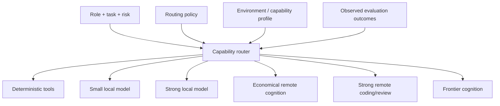
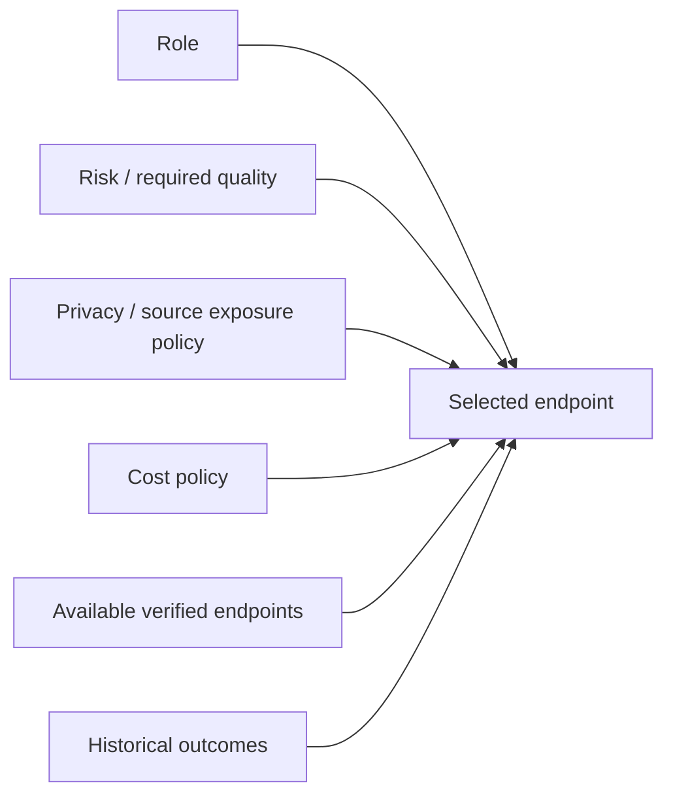

# Cognition Runtime, Capability Routing, and Scheduling

## Scope

This document defines how DevCadence discovers, verifies, represents and routes model cognition.

The discovery, verification, representation and routing described here are
**implemented** as of M3A, in `internal/environment` and `internal/cognition`.
Two things remain forward-looking: evaluation-derived capability grades (§4, §15)
need an evaluation subsystem no milestone has built, so M3A records `unknown` or
an explicit operator declaration instead of inventing a grade; and distributed
workers (§21) are unimplemented by design. The durable contracts are settled in
[adr/0013-environment-intelligence-and-cognition-contracts.md](adr/0013-environment-intelligence-and-cognition-contracts.md).

The original bootstrap target of a 48 GB Apple Silicon machine remains a valuable **strong-local reference profile**, but it is not an architectural prerequisite.

DevCadence must also run usefully on machines where:

- only small local models are practical;
- no local model runtime is installed;
- local acceleration is unavailable;
- implementation/review must use an economical remote cognition endpoint.

> **Local-first means local control-plane authority and repository execution. Inference location is a policy/routing decision.**

See [ENVIRONMENT_INTELLIGENCE_AND_ONBOARDING.md](ENVIRONMENT_INTELLIGENCE_AND_ONBOARDING.md) and ADR-0011.

## 1. Cognition architecture



Roles are not models.

Models/providers/runtimes are replaceable implementations of role capability.

## 2. CognitionEndpoint

A CognitionEndpoint represents a usable source of model cognition.

Possible kinds:

- local runtime;
- authenticated CLI;
- remote API;
- future LAN/remote model worker.

Conceptual shape:

```yaml
id: local-small
kind: local_runtime
provider: ollama

capabilities:
  repository_reasoning: medium
  implementation: low
  review: medium
  structured_output: measured
  tool_use: measured

execution:
  locality: local
  health: ready
  acceleration:
    backend: vulkan
    verified: true

resources:
  preferred_context_tokens: 16384
  max_concurrent_sessions: 1

policy:
  cost_class: local_compute
  source_exposure: local_only

evaluation:
  suite_revision: ...
  success_rate: ...
```

Another endpoint might be an authenticated coding CLI or remote API with different locality/cost/privacy characteristics.

## 3. Runtime/endpoint adapter responsibilities

A local runtime adapter should expose, where available:

- model discovery;
- load/readiness;
- generation/session invocation;
- context configuration;
- structured-output support;
- cancellation;
- health;
- backend/acceleration information;
- usage/resource statistics.

A remote/CLI endpoint adapter should expose, where available:

- readiness/auth status;
- invocation/session behavior;
- structured-output/tool capability;
- cancellation;
- model/capability identity;
- usage/cost metadata;
- source/context exposure properties.

The control plane must not depend directly on Ollama tags, MLX process syntax, one provider's API schema, or one coding CLI's session format.

## 4. Capability profiles

Capability is observed/assessed, not inferred solely from model marketing or parameter count.

Useful dimensions include:

- repository reasoning;
- implementation;
- review;
- architecture/system reasoning;
- structured output reliability;
- tool use;
- context behavior;
- latency/throughput;
- memory/resource safety;
- privacy/locality;
- monetary cost class.

Values should come from measured local probes/evaluation where feasible.

## 5. Role routing



The implemented router (M3A) applies hard constraints first, recording a reason
for every rejection, then orders the survivors explicitly:

```text
operator preference  ->  cheapest cost class  ->  most private exposure
                     ->  best capability grade  ->  identifier
```

Cost precedes capability grade because every survivor already *satisfies* the
requirement, so the choice among them is the least expensive and most private one.
The identifier tiebreak makes ties deterministic rather than dependent on
discovery order. There is no score, no weight and no confidence value, and a
decision distinguishes "ineligible" from "eligible but not chosen".

Two safety properties: an unset policy fails closed to `local_only` /
`local_compute`, so a caller who configured nothing cannot authorise remote
cognition by omission; and operator preference orders eligible endpoints without
ever making an ineligible one eligible, so preference cannot route around a
privacy constraint.

A conceptual preference sequence may look like:

```text
deterministic
  -> small local cognition
  -> strong local cognition
  -> economical remote cognition
  -> strong remote cognition
  -> frontier escalation
```

But routing is not required to traverse every tier. It selects the least expensive/most private endpoint that satisfies required capability and policy.

## 6. Thin-node operation

A modest Linux machine is a normal deployment target.

Example:

```yaml
profile: hybrid-thin

local:
  deterministic_tools: ready
  repository_indexing: ready
  small_model: ready
  strong_coder: unavailable

remote:
  economical_implementation: ready
  strong_escalation: ready
```

Such a node may use deterministic search/AST/Git tooling plus a small local model for:

- ranking repository evidence;
- classification;
- structured extraction;
- log compression;
- targeted summarization;
- basic review triage.

Complex coding/review can route to an allowed remote cognition endpoint while all repository worktrees/tests/evidence remain locally governed.

## 7. Zero-local-model operation

No local LLM is a supported capability state.

A valid deployment may consist of:

```text
local:
  control plane
  repository/worktrees
  process runner
  validation
  artifacts
  semantic retrieval/indexing

remote:
  implementation cognition
  review cognition
  frontier principal
```

The system should report unavailable local cognition explicitly and continue when policy permits remote cognition.

## 8. Local hardware/resource management

For local runtimes, scheduling must preserve headroom for:

- operating system;
- IDE/principal host;
- DevCadence daemon;
- Git/worktrees;
- compiler/test processes;
- KV/context cache;
- model load/switching.

Advertised maximum context is not the default operating target.

Context is a scheduling resource.

Sequential model diversity may be preferable to concurrent memory pressure.

## 9. Acceleration verification

Runtime presence is not acceleration evidence.

The environment intelligence subsystem should determine candidate backends and run an actual inference probe before marking one ready.

Typical backend candidates:

- Apple Silicon: MLX/Metal, Ollama/Metal;
- NVIDIA Linux: supported CUDA runtime path;
- AMD Linux: ROCm where supported and/or Vulkan;
- Intel/other supported GPUs: Vulkan/runtime-specific paths;
- CPU fallback.

Exact compatibility evolves and belongs in setup recipes/knowledge.

An endpoint profile should record the verified backend and the software/hardware versions associated with the verification.

## 10. Apple Silicon

Apple Silicon is the initial strong-local reference platform.

MLX-LM and/or Ollama may be used when verified.

Scheduling should account for unified memory shared by:

- weights;
- KV cache;
- operating system;
- principal host;
- build/test tools;
- other model processes.

A model merely fitting into unified memory is not sufficient evidence that it is a safe default.

## 11. Linux GPU paths

### NVIDIA

Discovery should distinguish:

- NVIDIA hardware present;
- usable driver stack;
- runtime sees compatible acceleration;
- actual inference offloads.

Do not require/install a full development SDK when the selected runtime does not need it.

### AMD

Do not equate AMD hardware with guaranteed ROCm suitability.

The compatibility engine may prefer/test ROCm for supported hardware and Vulkan for other supported devices/APUs.

Permissions/device-node issues are part of setup diagnostics.

### Vulkan

Vulkan can be a useful portable acceleration candidate on Linux, but availability must be verified through device/runtime probes rather than package presence alone.

## 12. Context policy

Repository-heavy workers should search/retrieve rather than preloading entire codebases.

Operational context targets depend on:

- endpoint quality at length;
- local KV/memory cost where applicable;
- monetary input cost for remote providers;
- task shape;
- semantic compression quality.

The same context-minimization principle applies to local and remote inference.

## 13. Prompt caching

Where supported:

- cache stable role instructions and normative project context;
- include prompt/skill revision in identity;
- avoid cache reuse across security boundaries;
- measure cost/resource benefit rather than assuming it.

## 14. Endpoint health

Monitor appropriate signals such as:

- runtime/provider readiness;
- auth expiration;
- inference failure;
- OOM/memory pressure;
- unexpected CPU fallback;
- context truncation;
- malformed structured output;
- tool-loop stalls;
- generation latency;
- model load/unload;
- provider/rate-limit failure.

Repeated endpoint failure should change routing availability.

## 15. Structured output reliability

Every endpoint used for protocol-producing roles should be evaluated for:

- valid JSON/schema generation;
- required fields;
- unknown field behavior;
- recovery after malformed output;
- long-context schema drift.

A strong coder with poor protocol reliability may require a repair wrapper or different role.

## 16. Model/provider diversity

Different model families/providers may be useful for independent reviews/consultation.

Diversity is an experimental variable, not a correctness guarantee.

M6 review convergence still adjudicates evidence; it does not majority-vote model opinions.

## 17. Smaller local models

Small local models remain valuable even when they are not suitable implementers.

Good candidate workloads:

- repository evidence ranking;
- log compression;
- simple classification;
- task metadata extraction;
- low-risk test summarization;
- artifact tagging;
- structured extraction.

Do not waste high-cost cognition on deterministic or trivial processing.

## 18. Privacy and source exposure

Routing must obey project policy for whether source may leave the machine.

Possible policies may permit:

- no external source;
- semantic evidence only;
- focused snippets;
- selected files;
- authorized worktree access through a tool-mediated coding agent.

Remote inference must never be a silent fallback when policy disallows it.

## 19. Cost-aware routing

Remote cognition has monetary/quota cost.

Profiles may represent coarse classes such as:

- local_compute;
- subscription_included;
- remote_economy;
- remote_strong;
- frontier_expensive.

Routing should prefer quality-sufficient lower-cost cognition for high-volume implementation/review and reserve frontier cognition for high-leverage reasoning.

Cost policy does not override correctness/security requirements.

## 20. Installation and onboarding

Runtime/provider installation and auth discovery are handled by the guided bootstrap subsystem.

Bootstrap:

- assumes nothing is preinstalled;
- discovers existing software first;
- recommends the smallest useful additions;
- requires approval for downloads/packages/services/auth flows;
- verifies actual runtime/backend health;
- may recommend a deployment profile.

See [ENVIRONMENT_INTELLIGENCE_AND_ONBOARDING.md](ENVIRONMENT_INTELLIGENCE_AND_ONBOARDING.md).

## 21. Future distributed workers

The cognition abstraction may later support remote local-model workers.

That does not mean M3 should introduce distributed scheduling.

A true remote worker design requires:

- mutual authentication;
- source/artifact synchronization;
- source confidentiality;
- capability/resource reporting;
- failure semantics;
- a separate threat model.

## 22. Core principle

The architectural distinction is not:

```text
cloud versus local
```

It is:

```text
high-value cognition
versus
high-volume cognition
versus
deterministic machinery
```

Inference placement is chosen according to capability and policy while local control-plane authority remains stable.
