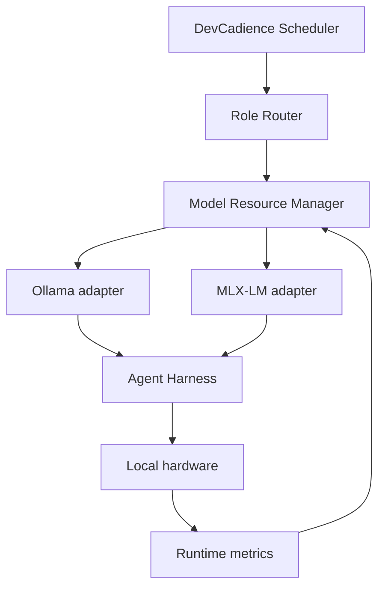
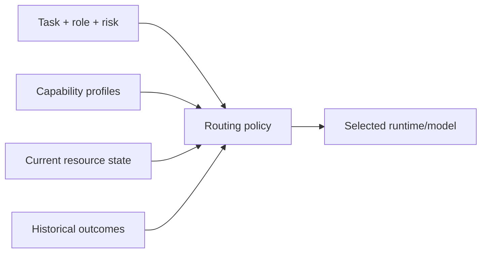
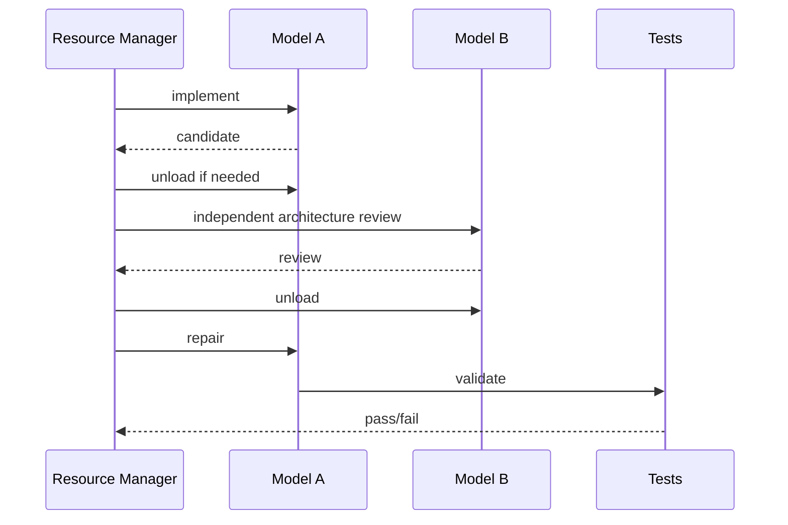

# Local Model Runtime and Scheduling

## Scope

This document defines how DevCadience manages local model inference as a shared engineering resource. The initial target is Apple Silicon with 48 GB unified memory, but the architecture remains hardware-neutral.

## 1. Runtime architecture



## 2. Runtime responsibilities

A runtime adapter should expose:
- model discovery;
- load/readiness;
- generation/session invocation;
- context configuration;
- structured-output support/capability;
- cancellation;
- health;
- usage statistics where available.

The control plane should not depend directly on Ollama-specific tags or MLX-LM process syntax.

## 3. Capability profiles

A model profile captures observed capability:

```yaml
id: local-strong-coder
runtime: mlx
model: qwen-coder-family
quantization: 4bit

capabilities:
  repository_reasoning: strong
  implementation: strong
  review: medium
  structured_output: measured
  tool_use: measured

resources:
  estimated_weight_memory_gb: ...
  preferred_context_tokens: 65536
  max_concurrent_sessions: 1

evaluation:
  suite_revision: ...
  success_rate: ...
```

Values should be measured locally where possible.

## 4. Role routing



No permanent “Qwen is the implementer” assumption belongs in the domain model.

## 5. Unified-memory strategy

On Apple Silicon, weights, KV cache, OS applications, Git/build tools and other model processes share unified memory.

Therefore:
- preserve OS/tool headroom;
- do not treat “model fits in RAM” as sufficient;
- context size is a scheduling resource;
- large model concurrency may be worse than sequential diversity;
- unloading/reloading can be acceptable because latency is secondary.

## 6. Quality-over-latency scheduling

The preferred scheduler objective is:

1. correctness;
2. evidence diversity;
3. resource safety;
4. throughput;
5. latency.

For example, a high-risk task may intentionally do:



Sequential model diversity is often preferable to memory pressure.

## 7. Context policy

Advertised model maximum context is not the default target.

Each role gets an operational context target based on:
- model quality at length;
- KV memory;
- repository task shape;
- available semantic compression.

Repository agents should search/retrieve rather than preloading the entire codebase.

## 8. Prompt caching

Where a runtime supports prompt caching:
- cache stable role instructions and project normative context;
- avoid accidental cache reuse across security boundaries;
- include prompt/skill version in cache identity;
- measure whether caching changes memory pressure.

## 9. Model installation

The daemon may eventually help install/configure runtimes, but automatic package download is a privileged operation.

Bootstrap SHOULD:
- detect existing Ollama and/or MLX-LM;
- report missing requirements;
- optionally provide explicit operator-run setup commands;
- avoid silently pulling multi-GB models without user intent.

## 10. Runtime health

Monitor:
- model readiness;
- inference failure;
- OOM/memory pressure;
- context truncation;
- malformed structured output;
- tool-loop stalls;
- generation latency;
- model load/unload.

Repeated runtime failure should change routing availability.

## 11. Structured output reliability

Every candidate model used for protocol-producing roles should be evaluated on:
- valid JSON generation;
- required field adherence;
- unknown field behavior;
- retry/recovery;
- long-context schema drift.

A strong coding model with poor protocol reliability may require a wrapper/repair layer or a different role.

## 12. Model diversity

Different model families may be assigned to independent reviewers when memory/time allows.

Diversity is an experimental variable and should be evaluated against defect-detection outcomes.

## 13. Smaller models

Smaller local models are useful for:
- log compression;
- simple classification;
- task metadata extraction;
- low-risk test summarization;
- artifact tagging.

Do not waste the strongest local model on deterministic or trivial processing.

## 14. Security

Local runtime does not automatically imply safe runtime.

Treat model-generated commands as untrusted requests mediated by the control plane.

Local model server network exposure should be loopback/private by default.

## 15. Future distributed workers

The runtime interface may later support remote local-model workers, but bootstrap does not require distributed scheduling.

Any remote worker design requires:
- mutual authentication;
- artifact/repository synchronization;
- source confidentiality;
- resource reporting;
- failure semantics;
- a new threat model.
