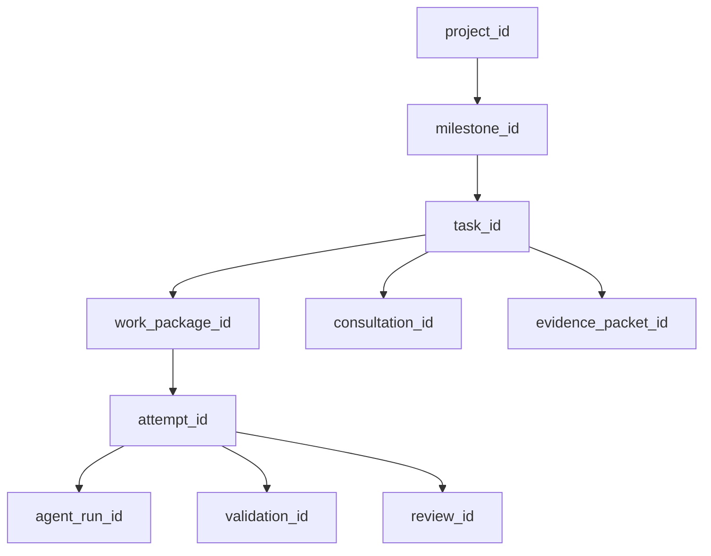
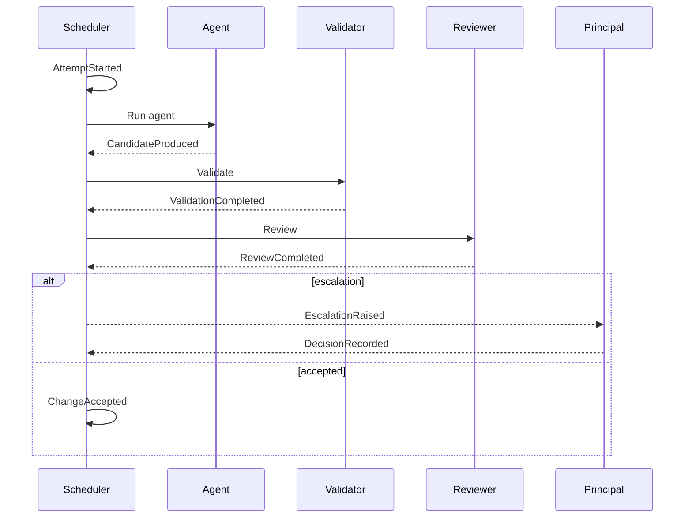
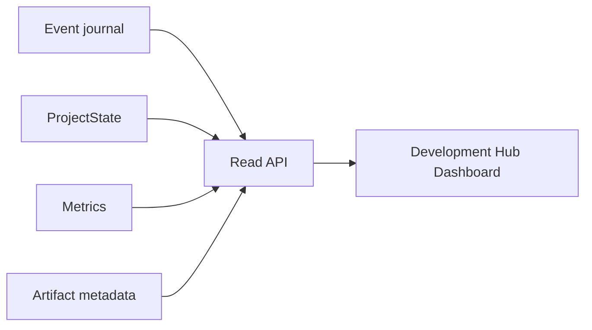
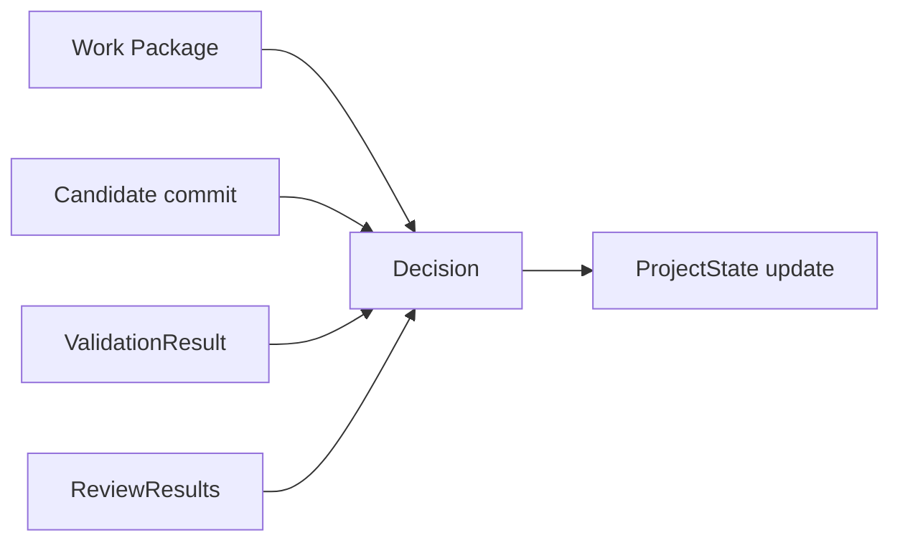

# Observability and Auditability

## Scope

DevCadience must explain what it is doing, why it did it, and which evidence supported a decision. Observability serves operators, debugging, evaluation, security, and learning.

## 1. Correlation hierarchy



Every important event should be attributable within this hierarchy.

## 2. Operator questions

The system should answer quickly:
- What is running?
- Why is it running?
- Which Work Package governs it?
- What has failed?
- Is it retrying?
- What is blocked?
- What needs principal/human decision?
- Which model/runtime is loaded?
- What deterministic checks passed?
- Why was a change accepted?
- What did local reviewers disagree on?
- How much frontier quota/API usage did this milestone consume?
- What did the system learn?

## 3. Event timeline



The event journal should make this reconstructable.

## 4. Metrics

### Reliability
- accepted tasks;
- retries per task;
- blocked tasks;
- validation failure rate;
- post-acceptance regression rate;
- reviewer disagreement rate;
- principal escalation rate.

### Intelligence usage
- local model inference time/tokens where available;
- frontier calls;
- consultant calls;
- principal evidence bytes/tokens;
- raw-source escalation frequency.

### Quality
- Work Package deviation rate;
- review defect yield;
- seeded-defect detection;
- architecture-review findings;
- code-health trend.

### Resource
- local unified memory;
- model load time;
- active contexts;
- CPU/GPU utilization if exposed;
- test duration;
- artifact storage.

### Discovery/specification
- open material ambiguities;
- ambiguities awaiting human vs research vs experiment;
- human questions asked per discovery round;
- requirement counts by epistemic status;
- specification red-team findings;
- readiness gate failures/reasons;
- architecture reopens caused by missed product ambiguity.

### Review convergence
- active/frozen ReviewCampaigns;
- material findings per round;
- FIX_NOW / REJECT / DEFER / DUPLICATE dispositions;
- duplicate/opportunistic finding rate;
- repair rounds per campaign;
- repair regressions;
- closure-gate failures/reasons;
- frozen campaigns reopened by new evidence;
- review context/tokens per material finding;
- marginal material finding yield by round.

### Lifecycle
- time spent discovery/design/implementation/verification;
- refactoring epoch frequency;
- lesson candidate/promotion rate.

## 5. Logs

Use structured logs with:
- timestamp;
- severity;
- component;
- correlation IDs;
- event/action;
- concise fields.

Do not dump entire prompts/source/log artifacts into operational logs. Store them separately with references and retention policy.

## 6. Artifacts

Large artifacts may include:
- model prompts/responses;
- diffs;
- build output;
- test reports;
- profiler data;
- consultant reports;
- external research snapshots;
- health reports.

Artifact metadata includes digest, MIME/type, size, producer and lineage.

## 7. Dashboard model

Future dashboard:



Dashboard is read-heavy. Write/control actions require explicit policy and should not be coupled to rendering.

## 8. Example operator summary

A daily summary should resemble:

```text
Milestone M3: 68%

Completed overnight: 7
Running: 3
Blocked: 1
Awaiting principal: 2

Validation baseline: PASS
Reviewer disagreements: 2
Frontier consultations: 4
OpenAI escalations: 1
Claude escalations: 0

Refactoring health: WATCH
New lesson candidates: 3
```

The summary should link to evidence rather than copying all details.

## 9. Decision audit

An acceptance decision should be explainable as:



## 10. Privacy and retention

Projects may contain sensitive code and prompts.

Configure retention separately for:
- metadata/events;
- source excerpts;
- model transcripts;
- consultant payloads;
- command output;
- external research cache.

Support deletion/compaction without losing required audit relationships where policy permits.

## 11. Replay

A replayable trajectory should have enough durable input to run a new model/prompt against the same task evidence without pretending tool side effects can always be recreated exactly.

Replay modes:
- semantic replay: same Work Package/evidence;
- fixture replay: frozen repository state;
- review replay: same candidate diff;
- policy replay: same recorded signals.

## 12. Alerts

Useful alerts:
- task stuck beyond policy;
- repeated identical retry;
- model OOM/resource pressure;
- worktree leak;
- mandatory validation skipped;
- schema incompatibility;
- security-denied action;
- state reducer inconsistency;
- artifact storage failure;
- escalation awaiting principal/human.

## 13. Observability invariant

If the system cannot explain why a code change was accepted, the acceptance mechanism is incomplete.
