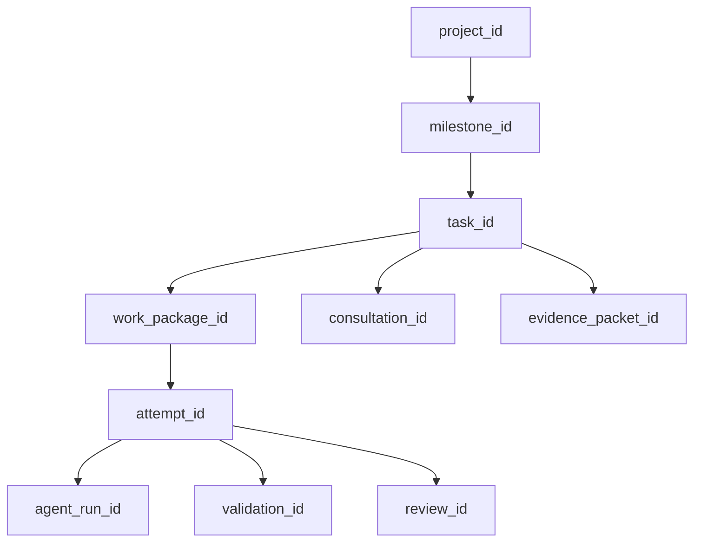
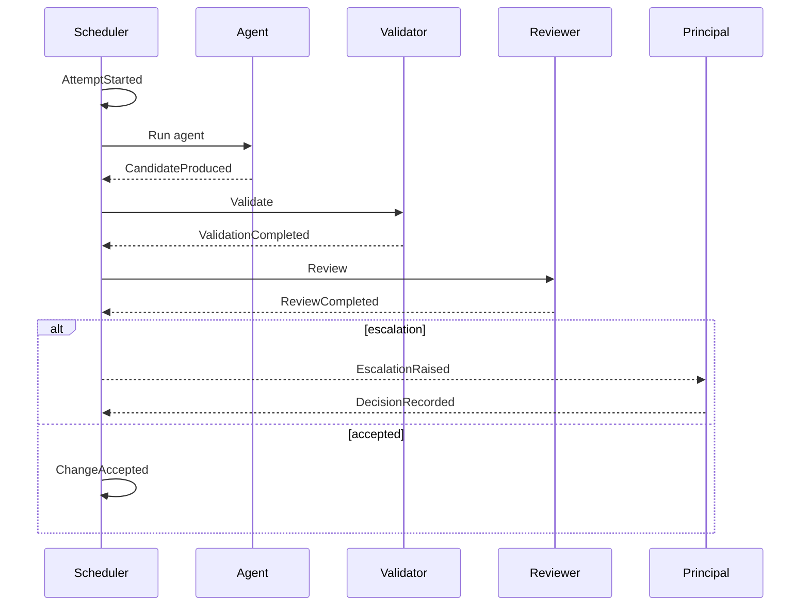
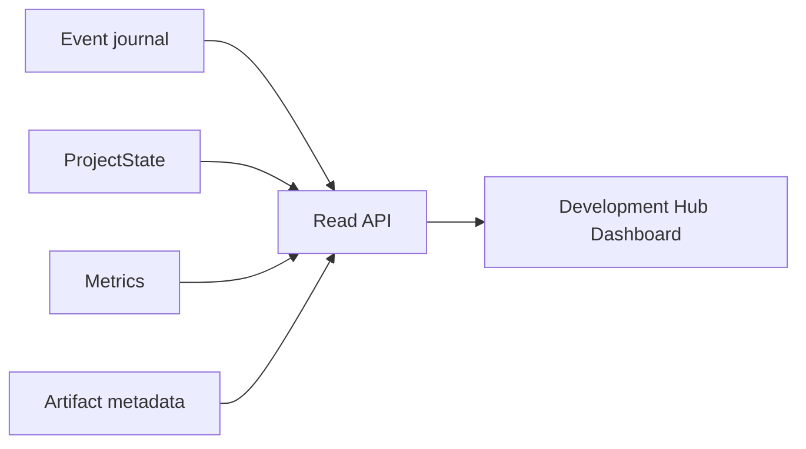
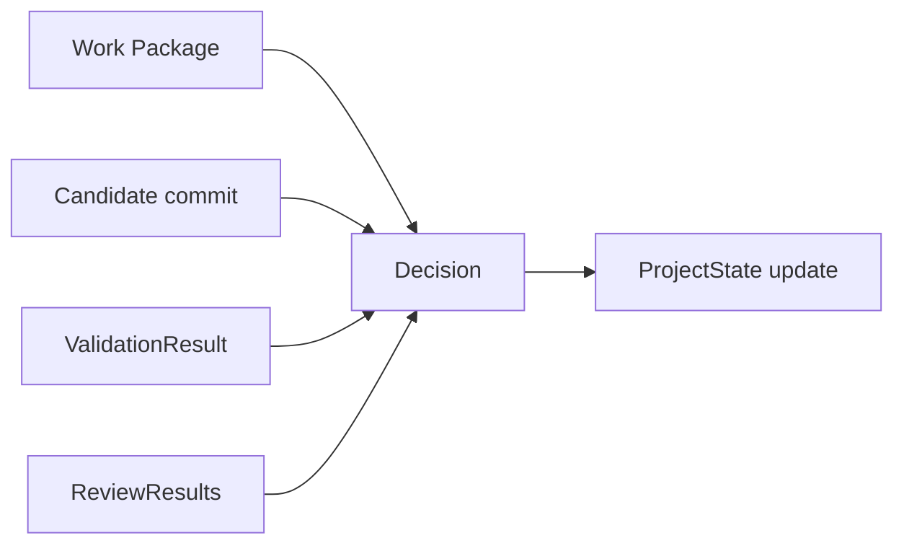

# Observability and Auditability

## Scope

DevCadence must explain what it is doing, why it did it, and which evidence supported a decision. Observability serves operators, debugging, evaluation, security, and learning.

## 1. Correlation hierarchy


```mermaid
flowchart TB
    Project["project_id"]
    Milestone["milestone_id"]
    Task["task_id"]
    WP["work_package_id"]
    Attempt["attempt_id"]
    Run["agent_run_id"]
    Val["validation_id"]
    Review["review_id"]
    Consult["consultation_id"]
    Evidence["evidence_packet_id"]

    Project --> Milestone --> Task --> WP --> Attempt
    Attempt --> Run
    Attempt --> Val
    Attempt --> Review
    Task --> Consult
    Task --> Evidence
```

Every important event should be attributable within this hierarchy.

## 2. Operator questions

The system should answer quickly:
- What is running?
- Why is it running?
- Which Work Package governs it?
- What has failed?
- Is it retrying?
- What is blocked?
- What needs principal/human decision?
- Which model/runtime is loaded?
- What deterministic checks passed?
- Why was a change accepted?
- What did local reviewers disagree on?
- How much frontier quota/API usage did this milestone consume?
- What did the system learn?

## 3. Event timeline


```mermaid
sequenceDiagram
    participant S as Scheduler
    participant A as Agent
    participant V as Validator
    participant R as Reviewer
    participant P as Principal

    S->>S: AttemptStarted
    S->>A: Run agent
    A-->>S: CandidateProduced
    S->>V: Validate
    V-->>S: ValidationCompleted
    S->>R: Review
    R-->>S: ReviewCompleted
    alt escalation
        S-->>P: EscalationRaised
        P-->>S: DecisionRecorded
    else accepted
        S->>S: ChangeAccepted
    end
```

The event journal should make this reconstructable.

## 4. Metrics

### Reliability
- accepted tasks;
- retries per task;
- blocked tasks;
- validation failure rate;
- post-acceptance regression rate;
- reviewer disagreement rate;
- principal escalation rate.

### Intelligence usage
- local model inference time/tokens where available;
- frontier calls;
- consultant calls;
- principal evidence bytes/tokens;
- raw-source escalation frequency.

### Quality
- Work Package deviation rate;
- review defect yield;
- seeded-defect detection;
- architecture-review findings;
- code-health trend.

### Resource
- local unified memory;
- model load time;
- active contexts;
- CPU/GPU utilization if exposed;
- test duration;
- artifact storage.

### Discovery/specification
- open material ambiguities;
- ambiguities awaiting human vs research vs experiment;
- human questions asked per discovery round;
- requirement counts by epistemic status;
- specification red-team findings;
- readiness gate failures/reasons;
- architecture reopens caused by missed product ambiguity.

### Review convergence
- active/frozen ReviewCampaigns;
- material findings per round;
- FIX_NOW / REJECT / DEFER / DUPLICATE dispositions;
- duplicate/opportunistic finding rate;
- repair rounds per campaign;
- repair regressions;
- closure-gate failures/reasons;
- frozen campaigns reopened by new evidence;
- review context/tokens per material finding;
- marginal material finding yield by round.

### Lifecycle
- time spent discovery/design/implementation/verification;
- refactoring epoch frequency;
- lesson candidate/promotion rate.

## 5. Logs

Use structured logs with:
- timestamp;
- severity;
- component;
- correlation IDs;
- event/action;
- concise fields.

Do not dump entire prompts/source/log artifacts into operational logs. Store them separately with references and retention policy.

### Flight recorder (Phase 1, implemented)

`internal/flightrec` (recorder), `internal/flightrec/journal` (writer, recovery scanner) and `internal/flightrec/wire` (schema, codec) implement the diagnostic flight recorder of [ADR-0026](adr/0026-durable-execution-flight-recorder.md) under [WP-TRACE-1](work-packages/wp-trace-1-ewp.md). It is **diagnostic evidence only**: it never mutates canonical state, never references canonical transitions and is never an authority for task completion. A START without an END means *unresolved* (crash, `runtime.Goexit` or a lost diagnostic END), not failed and not safe to retry; exactly-once and cross-store atomicity are not claimed. Phase 1 has no exporter, no instrumentation of existing subsystems and no retention (disk use is unbounded per run; a cap is required before broad instrumentation).

- **Layout** (root resolved once at `Bootstrap`; directories 0700, files 0600): `<root>/node-id`, `<root>/nodes/<node_id>/<runtime_id>/main/LOCK` and `segment-NNNNNN.pbj`. `runtime_id` (`run_<ULID>`) is one process lifetime on one node and is unrelated to `agent_run_id` above; `trace_id` groups causally related operations across streams and runs. Root order: `--trace-dir` flag, `DEVCADENCE_TRACE_DIR`, `$DEVCADENCE_HOME/traces`, `$XDG_STATE_HOME/devcadence/traces`, `~/.devcadence/traces`, `$TMP/devcadence-trace-<uid>`; every failed candidate is recorded with a stable error code in `STREAM_STARTED` / `PATH_FALLBACK` health records. Bootstrap uses no DevCadence config, hardware probing, SQLite or network.
- **Durability classes**: *Critical* records (`StartSpec.Durability`, `EndDurability`, `ObservationSpec.Durability`; `OUTCOME_PANIC` END is always critical, best effort) return only after write plus fsync, and on error the caller must refuse the protected effect. *Diagnostic* records (default) are queued, never block or fail the caller, and a drop is counted (`Stats.Dropped`) and reported as `DROPPED_DIAGNOSTICS` health. END and post-start critical appends use a context detached from caller cancellation with a 5 s timeout, so a cancelled request still records its END. `flock` is advisory and unreliable on NFS and some network filesystems (single-writer enforcement is best effort there).
- **Degraded mode**: `Bootstrap` never fails or panics. If no location is usable, locking is unsupported, or the journal cannot open, it returns a no-op recorder; `Recorder.Status()` (`Mode`, `Reason`, `Attempts`, `SidecarPath`, `SidecarError`, `Stats`) and the bounded in-memory `Recorder.Health()` ring (including `DEGRADED_NOOP`) stay available so a degraded recorder is itself visible in a later export. Critical operations on a degraded recorder fail with `recorder degraded`.
- **Bootstrap-failure sidecar** (an early startup failure stays exportable offline): when `Bootstrap` degrades (no usable path, invalid id, journal open or `STREAM_STARTED` failure, panic) it writes one small JSON file with plain `os` calls (no journal), `O_CREATE|O_EXCL`, mode 0600, at most 64 KiB, to the first writable of these directories, in this exact order: (1) the resolved trace root, only when a root was resolved and just the journal failed; (2) `<UserHomeDir>/.devcadence`; (3) `<TempDir>/devcadence-trace-<uid>` (skipped when the uid is unknown); (4) `<TempDir>` itself. Directories (2) and (3) follow the trace-root rules (created 0700, no symlink, owned by the uid, absolute). The name is `bootstrap-failure.json`; if it already exists (an earlier failure) the file is `bootstrap-failure-<random>.json` in the same directory, and in directory (4) always `devcadence-bootstrap-failure-<random>.json`. Content: `schema_version`, `written_at`, `reason` (stable code), `writer_version`, `node_id` and `node_id_source` (`file` or `ephemeral`) when known, `attempts` (candidate source, sanitized path and error code only, never error text), and `stats`; it never contains environment values, file contents, credentials or tokens, and every field passes the sanitizer. `Status.SidecarPath` is the file written; `Status.SidecarError` is `no_writable_dir` (or `sidecar_panic`) when none was. `attempts[].path` is a sanitized path and may include the value of `DEVCADENCE_TRACE_DIR` (or the flag): a path is not a secret, but a secret-looking path is redacted. If the injected filesystem panics during the sidecar's own directory checks, a last-resort attempt using only plain `os` calls (`os.UserHomeDir` then `os.TempDir`, random names, `O_EXCL`, 0600, no ownership checks) still writes the sidecar (`bootstrap-failure-<random>.json` in `<UserHomeDir>/.devcadence`, else `devcadence-bootstrap-failure-<random>.json` in `<TempDir>`), and `sidecar_panic` is reported only if that fails too. A new random-named sidecar is not created in a directory that already holds more than 32 matching files owned by the current uid, counted among at most the first 256 directory entries, so files of other users in a shared `<TempDir>` cannot suppress it (that directory is skipped), which bounds accumulation. **Exporter scan list (Phase 2 MUST implement exactly this):** `bootstrap-failure*.json` in every resolved trace root candidate (explicit flag, `DEVCADENCE_TRACE_DIR`, `$DEVCADENCE_HOME/traces`, `$XDG_STATE_HOME/devcadence/traces`, `<UserHomeDir>/.devcadence/traces`, `<TempDir>/devcadence-trace-<uid>`), `bootstrap-failure*.json` in `~/.devcadence` and `<TempDir>/devcadence-trace-<uid>`, and the glob `devcadence-bootstrap-failure-*.json` in `os.TempDir()`.
- **Storage path and node-id behavior**: only the leaf directory of a candidate is checked (an existing ancestor symlink or foreign-owned ancestor is not); the Lstat-then-use window is a documented residual risk. `<root>/node-id` is opened only when `Lstat` says it is a regular file and at most 256 bytes are read, so a FIFO, symlink or huge file yields an ephemeral id (`NODE_ID_EPHEMERAL`) and is never followed or overwritten. The temp fallback `$TMP/devcadence-trace-<uid>` is a shared-location directory protected only by 0700, the owner check and `O_EXCL` files.
- **Known limits** (documented, not enforced): sanitization is heuristic. Short flags with a value other than `-u`/`--user`/`--proxy-user` (`-p x`, `mysql -pSECRET`, an attached `-uuser:pass`; only `docker login -p` is special-cased), credentials under innocuous names that contain no deny word, Cyrillic or other homoglyph spellings of keywords, and long hex or base64 blobs without a keyword are not detected; free-text rules over-redact (for example the free-text assignment `max_tokens: 5`, or `pass: ok`) rather than risk a leak, while structured token counters keep their numeric value. long hex/base64 blobs and PEM bodies without a `BEGIN ... PRIVATE KEY` header are caught only by best-effort heuristics; `[]byte` values inside maps and slices are replaced by `[OMITTED:bytes]` but byte fields inside structs are not (they marshal as base64 and rely on the heuristics). If the function passed to `Run` calls `op.End(OutcomeCompleted, ...)` and then panics, the recorded END stays `COMPLETED` (`Run` never overrides an explicit End); the panic is still re-raised. Passing a nil `Op`, `fn` or `ctx` panics and is not supported. `Recorder.Observe(ctx, ...)` cannot see that the span in `ctx` already ended (only `Op.Observe` checks and counts `ObserveAfterEnd`), so such an observation is recorded after the END.
- **Sanitizer defaults** (applied before persistence to metadata, results, payloads, error summaries, health details and every scalar field): key denylist (substring match on the normalized name: `password`, `secret`, `token`, `apikey`, `authorization`, `credential`, `privatekey`, `cookie`, `bearer`, `session`, `auth`, `jwt`, `signature`, `passphrase`, `secretkey`, `accesskey`, `clientsecret`, `dsn`, `connectionstring`, `encryptionkey`, `signingkey`, `hmac`, `mnemonic`, ...; whole-name only for `key`, `sig`, `salt`, `license`, `seed`, which would over-redact as substrings (`seed` is an RNG or wallet seed, `seeded` is not; `cache_key` and `sort_key` are not credentials); `pass`, `pw`, `otp`, `totp` and `hotp` match as a whole name or as any SEGMENT of the name (split on `-_. ` and camelCase boundaries), so `db_pass`, `DB_PASS`, `adminPass`, `mysql-pw` and `--db-pass` are credentials but `bypass` and `passes` are not; the `auth` substring ignores `author*` (`author`, `authority`); `userpass`, `userpwd`, `dbpass`, `accountkey`, `licensekey` and `oauth` are substrings; only the exact numeric counters `input/output/total/max/max_output/cached/reasoning/prompt/completion/cache_read_input/cache_creation_input_tokens`, `token_count/limit/usage` keep a value, and a non-numeric value is redacted) with default-deny of any value whose key is invalid (non-ASCII, invisible characters, over 64 bytes), and default-deny raw-content keys (`prompt`, `content`, `stdout`, `diff`, `env`, ...) which travel only as artifact references (digest plus locator); free text is first folded to ASCII (invisible format characters dropped, Unicode spaces and full-width forms mapped), then value patterns apply (secret prefixes anywhere in a string, JWT, PEM private keys to end of line, ssh key material, URL userinfo, `Authorization:` and `Cookie:`/`Set-Cookie:` to end of line, `Bearer`/`Basic` credentials, `<name>[:=]<value>` assignments whose name merely CONTAINS a credential word (`db_password`, `GITHUB_TOKEN`, `aws_secret_access_key`, `?access_token=`, `&apikey=`), `NAME=value` assignments, and credential flags decided by the same deny list as structured keys: `--client_secret`, `--secret-key=V`, `--private-key V`, including the next array element; `sha256:` digests exempt); strings at most 256 bytes, multiline strings omitted, depth 6, 64 entries per object/array, 16 KiB per document, 1 MiB input cap. Protobuf `Any` payloads are not accepted in Phase 1.
- **Sanitizer rule summary (round 3)**: text persisted by the sanitizer is the FOLDED text, never the original: besides the ASCII folding above, a run of backslashes before a quote or slash is dropped (`{\"password\":\"x\"}` is matched as JSON, and `https:\/\/` as a URL; other escapes such as `\u0070` are not decoded). Name/value rules accept the operators `:`, `=`, `=>`, `:=`, `::=`, `?=`, an optional quote and `]` after the name (`['token'] = 'x'`), and, for the whitespace form, a filler word (`password is x`, `_authToken x`). Query and fragment credentials are covered through the name rules (`?access_token=`, `&sig=`, `#access_token=`, `X-Goog-Signature=`, `Signature=`), plus `[?&;#]key=` (a bare `key=` is not redacted). `signature` is a credential word and `sig` a whole-name word; `code=` is deliberately NOT redacted (OAuth codes are single-use and short-lived, and `?code=404` is a common diagnostic). Key prefixes: GitHub, GitLab, Slack (`xox?-`, `xapp-`), Stripe (`sk-`, `sk_live_`, `rk_live_`, `whsec_`), Shopify (`shpat_`, `shpca_`, `shppa_`), DigitalOcean (`dop_v1_`), npm, Hugging Face, PyPI, Google (`AIza`, `ya29.`), SendGrid (`SG.`), Twilio (`SK` plus 32 hex), AWS (`AKIA`, `ASIA`); Slack and Discord webhook URLs are redacted wholesale. URL userinfo ends at the LAST `@` before the first `/`; scheme-less `user:pass@host.tld` and MySQL `user:pass@tcp(` DSNs are redacted (`image:tag@sha256:` digests are not). `-u`, `--user` and `--proxy-user` redact a `user:password` value; a `{"name":"DB_PASSWORD","value":"x"}` (or `key`/`value`) pair redacts the sibling `value` when the name is a credential name. Path-kind scalars (`attempts[].path`, locators) may hold spaces and non-ASCII letters, marks and digits (control, format and separator runes, and invalid UTF-8, stay `[INVALID]`) and still pass every secret rule. Work is bounded: the rules run on at most 8192 bytes of one string (the rest is dropped and counted in the `[truncated N bytes]` suffix, cutting before the last whitespace-delimited token) and on at most 256 KiB of free text per record (further text becomes `[OMITTED:budget]`), so adversarial 1 MiB inputs cost milliseconds. **Over-redaction trade-offs** (accepted so that a leak is the rarer error): free-text `signature`/`token`/`secret` words redact their value (`signature: foo(int)`); `password is incorrect` redacts `incorrect`; `-u 1000:1000` redacts the uid:gid pair; any structured key named `key`, `sig`, `salt`, `license` or containing a `pass`/`pw`/`otp` segment (`pass_rate`) is redacted; a `{"key":"Content-Type","value":"x"}` pair loses both. **Heuristic limits** (remaining shapes, not detected): `-p x` and `mysql -pSECRET` (outside `docker login`), long hex or base64 blobs without a keyword, homoglyph (Cyrillic and similar) and combining-mark spellings of keywords in free text, exotic encodings (`\u0070assword`, percent- or HTML-encoded names, ROT13, split across array elements), a `/` inside an unescaped URL password, and secrets under names containing no credential word. **Defense in depth: exporters (Phase 2) MUST re-run the sanitizer on every record at export time**, so rules added after a trace was written protect that trace's export, and MUST treat the persisted journal as sensitive data regardless.

## 6. Artifacts

Large artifacts may include:
- model prompts/responses;
- diffs;
- build output;
- test reports;
- profiler data;
- consultant reports;
- external research snapshots;
- health reports.

Artifact metadata includes digest, MIME/type, size, producer and lineage.

## 7. Dashboard model

Future dashboard:


```mermaid
flowchart LR
    Events["Event journal"]
    State["ProjectState"]
    Metrics["Metrics"]
    Artifacts["Artifact metadata"]
    API["Read API"]
    UI["Development Hub Dashboard"]

    Events --> API
    State --> API
    Metrics --> API
    Artifacts --> API
    API --> UI
```

Dashboard is read-heavy. Write/control actions require explicit policy and should not be coupled to rendering.

## 8. Example operator summary

A daily summary should resemble:

```text
Milestone M3: 68%

Completed overnight: 7
Running: 3
Blocked: 1
Awaiting principal: 2

Validation baseline: PASS
Reviewer disagreements: 2
Frontier consultations: 4
OpenAI escalations: 1
Claude escalations: 0

Refactoring health: WATCH
New lesson candidates: 3
```

The summary should link to evidence rather than copying all details.

## 9. Decision audit

An acceptance decision should be explainable as:


```mermaid
flowchart LR
    WP["Work Package"]
    Candidate["Candidate commit"]
    V["ValidationResult"]
    R["ReviewResults"]
    D["Decision"]
    State["ProjectState update"]

    WP --> D
    Candidate --> D
    V --> D
    R --> D
    D --> State
```

## 10. Privacy and retention

Projects may contain sensitive code and prompts.

Configure retention separately for:
- metadata/events;
- source excerpts;
- model transcripts;
- consultant payloads;
- command output;
- external research cache.

Support deletion/compaction without losing required audit relationships where policy permits.

## 11. Replay

A replayable trajectory should have enough durable input to run a new model/prompt against the same task evidence without pretending tool side effects can always be recreated exactly.

Replay modes:
- semantic replay: same Work Package/evidence;
- fixture replay: frozen repository state;
- review replay: same candidate diff;
- policy replay: same recorded signals.

## 12. Alerts

Useful alerts:
- task stuck beyond policy;
- repeated identical retry;
- model OOM/resource pressure;
- worktree leak;
- mandatory validation skipped;
- schema incompatibility;
- security-denied action;
- state reducer inconsistency;
- artifact storage failure;
- escalation awaiting principal/human.

## 13. Observability invariant

If the system cannot explain why a code change was accepted, the acceptance mechanism is incomplete.
