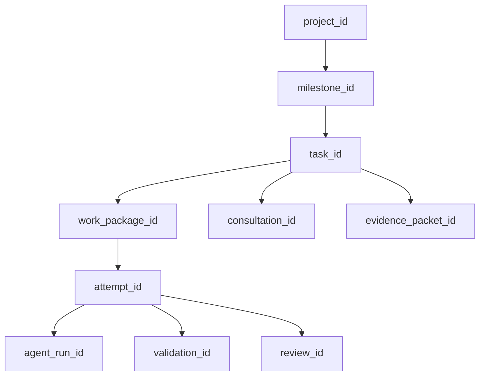
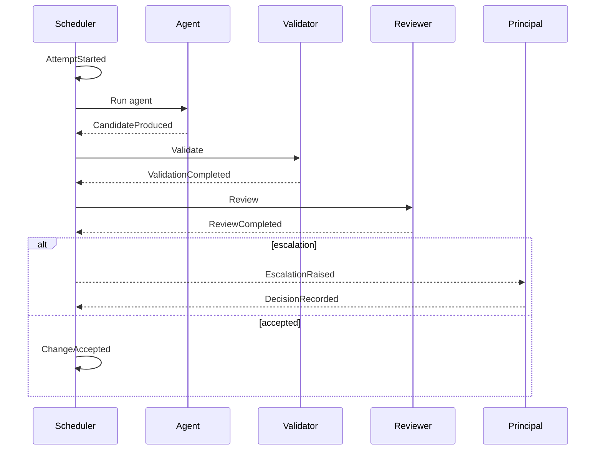
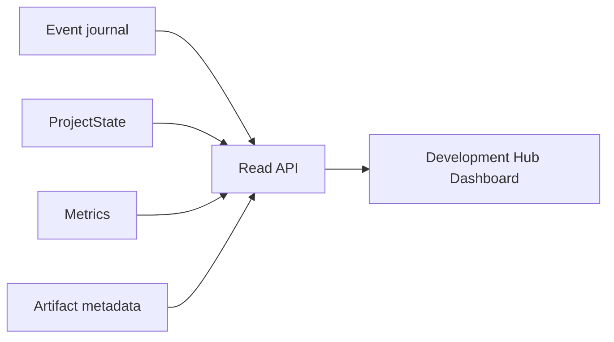
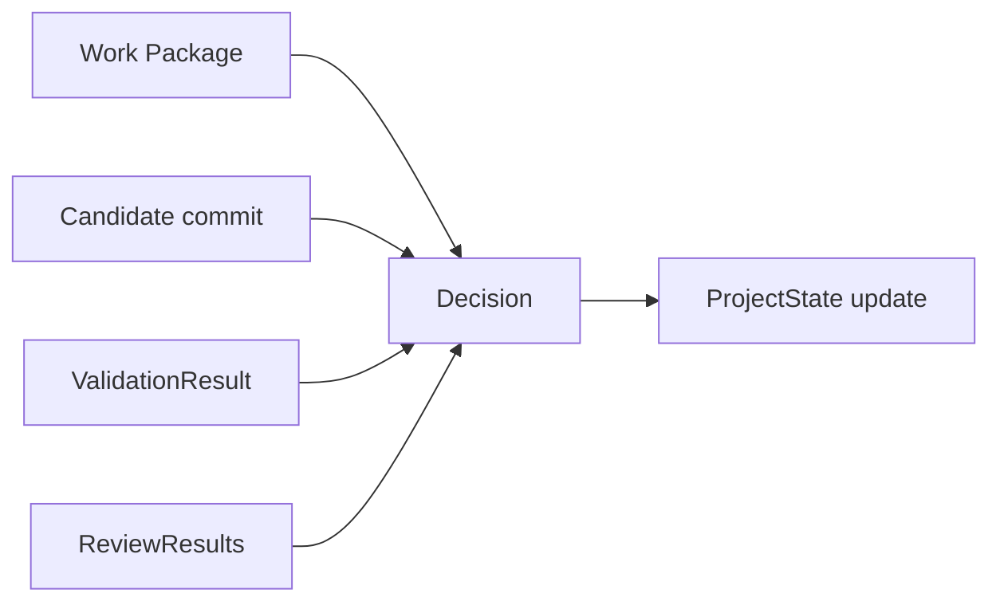

# Observability and Auditability

## Scope

DevCadence must explain what it is doing, why it did it, and which evidence supported a decision. Observability serves operators, debugging, evaluation, security, and learning.

## 1. Correlation hierarchy


```mermaid
flowchart TB
    Project["project_id"]
    Milestone["milestone_id"]
    Task["task_id"]
    WP["work_package_id"]
    Attempt["attempt_id"]
    Run["agent_run_id"]
    Val["validation_id"]
    Review["review_id"]
    Consult["consultation_id"]
    Evidence["evidence_packet_id"]

    Project --> Milestone --> Task --> WP --> Attempt
    Attempt --> Run
    Attempt --> Val
    Attempt --> Review
    Task --> Consult
    Task --> Evidence
```

Every important event should be attributable within this hierarchy.

## 2. Operator questions

The system should answer quickly:
- What is running?
- Why is it running?
- Which Work Package governs it?
- What has failed?
- Is it retrying?
- What is blocked?
- What needs principal/human decision?
- Which model/runtime is loaded?
- What deterministic checks passed?
- Why was a change accepted?
- What did local reviewers disagree on?
- How much frontier quota/API usage did this milestone consume?
- What did the system learn?

## 3. Event timeline


```mermaid
sequenceDiagram
    participant S as Scheduler
    participant A as Agent
    participant V as Validator
    participant R as Reviewer
    participant P as Principal

    S->>S: AttemptStarted
    S->>A: Run agent
    A-->>S: CandidateProduced
    S->>V: Validate
    V-->>S: ValidationCompleted
    S->>R: Review
    R-->>S: ReviewCompleted
    alt escalation
        S-->>P: EscalationRaised
        P-->>S: DecisionRecorded
    else accepted
        S->>S: ChangeAccepted
    end
```

The event journal should make this reconstructable.

## 4. Metrics

### Reliability
- accepted tasks;
- retries per task;
- blocked tasks;
- validation failure rate;
- post-acceptance regression rate;
- reviewer disagreement rate;
- principal escalation rate.

### Intelligence usage
- local model inference time/tokens where available;
- frontier calls;
- consultant calls;
- principal evidence bytes/tokens;
- raw-source escalation frequency.

### Quality
- Work Package deviation rate;
- review defect yield;
- seeded-defect detection;
- architecture-review findings;
- code-health trend.

### Resource
- local unified memory;
- model load time;
- active contexts;
- CPU/GPU utilization if exposed;
- test duration;
- artifact storage.

### Discovery/specification
- open material ambiguities;
- ambiguities awaiting human vs research vs experiment;
- human questions asked per discovery round;
- requirement counts by epistemic status;
- specification red-team findings;
- readiness gate failures/reasons;
- architecture reopens caused by missed product ambiguity.

### Review convergence
- active/frozen ReviewCampaigns;
- material findings per round;
- FIX_NOW / REJECT / DEFER / DUPLICATE dispositions;
- duplicate/opportunistic finding rate;
- repair rounds per campaign;
- repair regressions;
- closure-gate failures/reasons;
- frozen campaigns reopened by new evidence;
- review context/tokens per material finding;
- marginal material finding yield by round.

### Lifecycle
- time spent discovery/design/implementation/verification;
- refactoring epoch frequency;
- lesson candidate/promotion rate.

## 5. Logs

Use structured logs with:
- timestamp;
- severity;
- component;
- correlation IDs;
- event/action;
- concise fields.

Do not dump entire prompts/source/log artifacts into operational logs. Store them separately with references and retention policy.

### Flight recorder (Phase 1, implemented)

`internal/flightrec` (recorder), `internal/flightrec/journal` (writer, recovery scanner) and `internal/flightrec/wire` (schema, codec) implement the diagnostic flight recorder of [ADR-0026](adr/0026-durable-execution-flight-recorder.md) under [WP-TRACE-1](work-packages/wp-trace-1-ewp.md). It is **diagnostic evidence only**: it never mutates canonical state, never references canonical transitions and is never an authority for task completion. A START without an END means *unresolved* (crash, `runtime.Goexit` or a lost diagnostic END), not failed and not safe to retry; exactly-once and cross-store atomicity are not claimed. Phase 1 has no exporter, no instrumentation of existing subsystems and no retention (disk use is unbounded per run; a cap is required before broad instrumentation).

- **Layout** (root resolved once at `Bootstrap`; directories 0700, files 0600): `<root>/node-id`, `<root>/nodes/<node_id>/<runtime_id>/main/LOCK` and `segment-NNNNNN.pbj`. `runtime_id` (`run_<ULID>`) is one process lifetime on one node and is unrelated to `agent_run_id` above; `trace_id` groups causally related operations across streams and runs. Root order: `--trace-dir` flag, `DEVCADENCE_TRACE_DIR`, `$DEVCADENCE_HOME/traces`, `$XDG_STATE_HOME/devcadence/traces`, `~/.devcadence/traces`, `$TMP/devcadence-trace-<uid>`; every failed candidate is recorded with a stable error code in `STREAM_STARTED` / `PATH_FALLBACK` health records. Bootstrap uses no DevCadence config, hardware probing, SQLite or network.
- **Durability classes**: *Critical* records (`StartSpec.Durability`, `EndDurability`, `ObservationSpec.Durability`; `OUTCOME_PANIC` END is always critical, best effort) return only after write plus fsync, and on error the caller must refuse the protected effect. *Diagnostic* records (default) are queued, never block or fail the caller, and a drop is counted (`Stats.Dropped`) and reported as `DROPPED_DIAGNOSTICS` health. END and post-start critical appends use a context detached from caller cancellation with a 5 s timeout, so a cancelled request still records its END. `flock` is advisory and unreliable on NFS and some network filesystems (single-writer enforcement is best effort there).
- **Degraded mode**: `Bootstrap` never fails or panics. If no location is usable, locking is unsupported, or the journal cannot open, it returns a no-op recorder; `Recorder.Status()` (`Mode`, `Reason`, `Attempts`, `Stats`) and the bounded in-memory `Recorder.Health()` ring (including `DEGRADED_NOOP`) stay available so a degraded recorder is itself visible in a later export. Critical operations on a degraded recorder fail with `recorder degraded`.
- **Sanitizer defaults** (applied before persistence to metadata, results, payloads, error summaries, health details and every scalar field): key denylist (`password`, `secret`, `token` with `*_tokens` allowed, `apikey`, `authorization`, `credential`, `privatekey`, `cookie`, `bearer`, `sessionid`, ...) and default-deny raw-content keys (`prompt`, `content`, `stdout`, `diff`, `env`, ...) which travel only as artifact references (digest plus locator); value patterns (secret prefixes, JWT, PEM private keys, URL userinfo, `Authorization:` text, `NAME=value` assignments; `sha256:` digests exempt); strings at most 256 bytes, multiline strings omitted, depth 6, 64 entries per object/array, 16 KiB per document, 1 MiB input cap. Protobuf `Any` payloads are not accepted in Phase 1.

## 6. Artifacts

Large artifacts may include:
- model prompts/responses;
- diffs;
- build output;
- test reports;
- profiler data;
- consultant reports;
- external research snapshots;
- health reports.

Artifact metadata includes digest, MIME/type, size, producer and lineage.

## 7. Dashboard model

Future dashboard:


```mermaid
flowchart LR
    Events["Event journal"]
    State["ProjectState"]
    Metrics["Metrics"]
    Artifacts["Artifact metadata"]
    API["Read API"]
    UI["Development Hub Dashboard"]

    Events --> API
    State --> API
    Metrics --> API
    Artifacts --> API
    API --> UI
```

Dashboard is read-heavy. Write/control actions require explicit policy and should not be coupled to rendering.

## 8. Example operator summary

A daily summary should resemble:

```text
Milestone M3: 68%

Completed overnight: 7
Running: 3
Blocked: 1
Awaiting principal: 2

Validation baseline: PASS
Reviewer disagreements: 2
Frontier consultations: 4
OpenAI escalations: 1
Claude escalations: 0

Refactoring health: WATCH
New lesson candidates: 3
```

The summary should link to evidence rather than copying all details.

## 9. Decision audit

An acceptance decision should be explainable as:


```mermaid
flowchart LR
    WP["Work Package"]
    Candidate["Candidate commit"]
    V["ValidationResult"]
    R["ReviewResults"]
    D["Decision"]
    State["ProjectState update"]

    WP --> D
    Candidate --> D
    V --> D
    R --> D
    D --> State
```

## 10. Privacy and retention

Projects may contain sensitive code and prompts.

Configure retention separately for:
- metadata/events;
- source excerpts;
- model transcripts;
- consultant payloads;
- command output;
- external research cache.

Support deletion/compaction without losing required audit relationships where policy permits.

## 11. Replay

A replayable trajectory should have enough durable input to run a new model/prompt against the same task evidence without pretending tool side effects can always be recreated exactly.

Replay modes:
- semantic replay: same Work Package/evidence;
- fixture replay: frozen repository state;
- review replay: same candidate diff;
- policy replay: same recorded signals.

## 12. Alerts

Useful alerts:
- task stuck beyond policy;
- repeated identical retry;
- model OOM/resource pressure;
- worktree leak;
- mandatory validation skipped;
- schema incompatibility;
- security-denied action;
- state reducer inconsistency;
- artifact storage failure;
- escalation awaiting principal/human.

## 13. Observability invariant

If the system cannot explain why a code change was accepted, the acceptance mechanism is incomplete.
