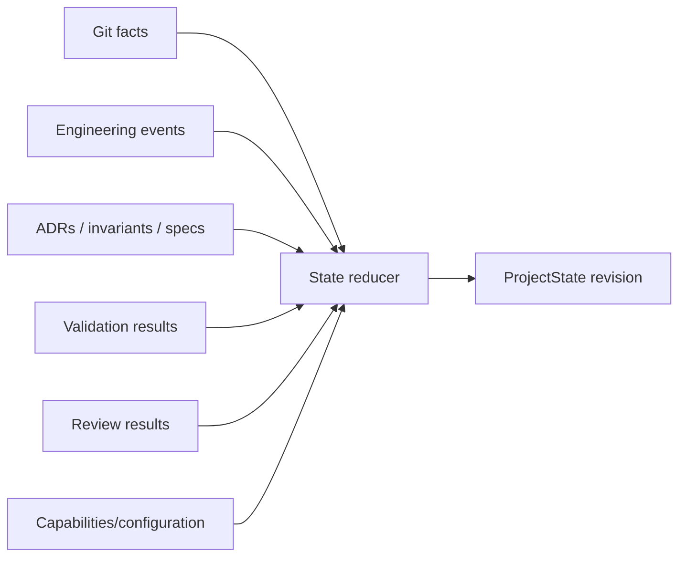
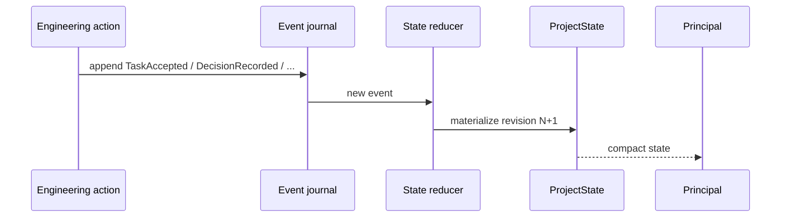
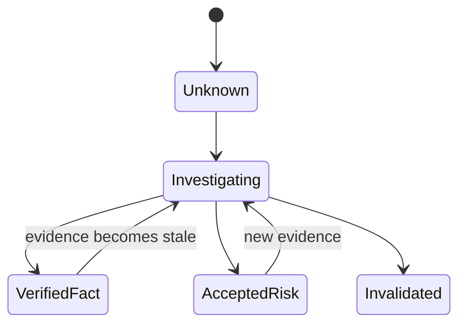
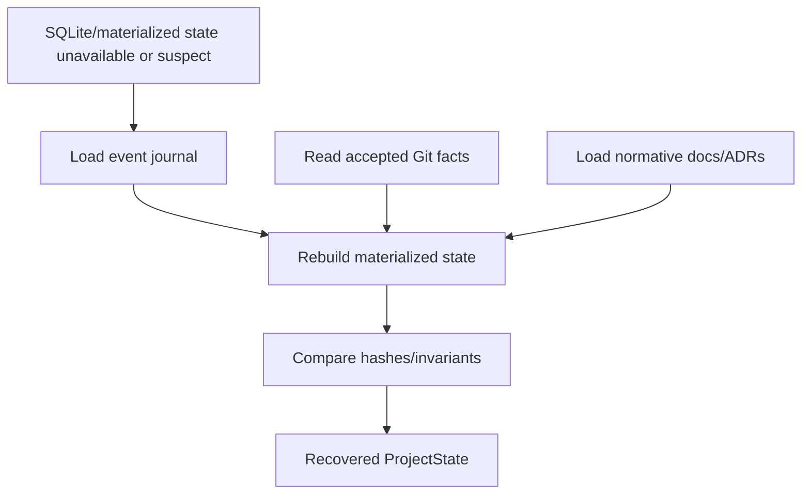
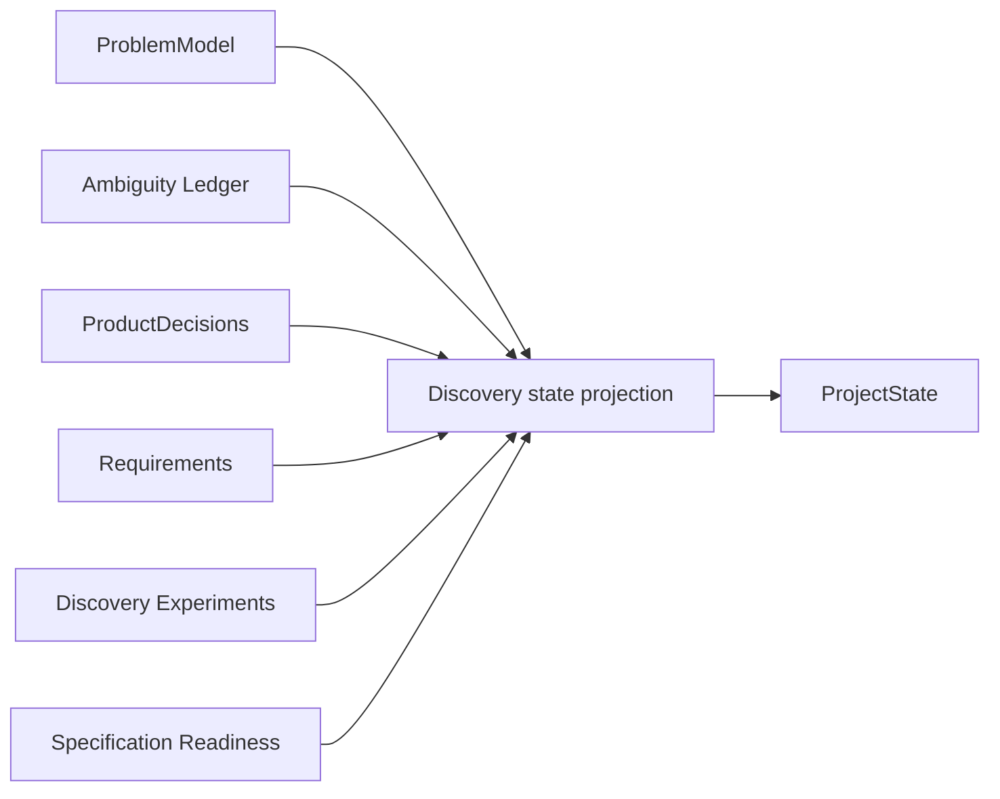

# Canonical Engineering State Model

## Scope

The Engineering State Model is DevCadience's compact, durable representation of what matters about a project **now**. It exists so the principal can reason effectively without reconstructing the project from repository source or chat history.

## 1. Design goals

ProjectState must be:
- compact enough for frequent frontier use;
- semantically rich;
- reconstructable and auditable;
- linked to raw evidence;
- explicit about uncertainty;
- versioned;
- independent of one model/provider;
- resistant to accidental free-form drift.

ProjectState is not:
- a repository index;
- an LLM transcript;
- a dumping ground for every test log;
- a replacement for Git;
- a replacement for ADRs/specifications.

## 2. Conceptual state

```mermaid
flowchart TB
    Identity["Project identity"]
    Vision["Vision / current product intent"]
    Milestone["Active milestone"]
    Components["Component states & contracts"]
    Tasks["Task/dependency state"]
    Decisions["Active ADRs / invariants"]
    Validation["Validation & quality state"]
    Health["Code/architecture health"]
    Risks["Risks / unknowns / decisions required"]
    Agents["Available capabilities"]
    Recent["Recent semantic changes"]

    PS["ProjectState"]

    Identity --> PS
    Vision --> PS
    Milestone --> PS
    Components --> PS
    Tasks --> PS
    Decisions --> PS
    Validation --> PS
    Health --> PS
    Risks --> PS
    Agents --> PS
    Recent --> PS
```



## 3. Example

```yaml
schema_version: "1.0"
project_id: devcadience
state_revision: "ps_000184"
git:
  accepted_commit: 91acd82
  dirty: false

product:
  vision_ref: docs/VISION.md
  current_outcome: >
    Prove compact frontier context plus local implementation can
    deliver real changes with strong evidence and lower frontier
    repository-token consumption.

milestone:
  id: M1
  title: Bootstrap Vertical Slice
  progress:
    completed: 4
    total: 11

components:
  control_plane:
    status: active
    contract_state: evolving
  evidence:
    status: planned
  local_runtime:
    status: implementing

tasks:
  ready: [DC-012, DC-013]
  running: [DC-010]
  blocked: [DC-011]
  awaiting_principal: [DC-014]

invariants:
  active:
    - DCI-001
    - DCI-010
    - DCI-020

validation:
  baseline:
    go_test: pass
    go_vet: pass
  last_full_run: 2026-09-20T20:00:00Z

health:
  status: green
  known_debt: []

risks:
  - id: R-003
    severity: medium
    statement: >
      Structured output reliability for the selected local runtime
      has not yet been measured.

decisions_required:
  - id: DR-005
    question: >
      Use content-addressed filesystem artifacts or SQLite blobs
      during bootstrap?

recent_semantic_changes:
  - task: DC-009
    summary: >
      Task retry now creates immutable Attempt records.

capabilities:
  local_models:
    - profile: local-strong-coder
      available: true
  consultants:
    codex:
      available: unknown
    claude:
      available: unknown
```

## 4. State provenance

Each semantic fact should be traceable.



ProjectState fields that are derived should identify or make retrievable the evidence that produced them.

## 5. Event-sourced orientation

DevCadience should prefer durable transition facts over arbitrary state mutation.



The system may keep mutable/materialized tables for query performance. The logical history remains explicit.

## 6. Recommended event envelope

```yaml
schema_version: "1.0"
event_id: evt_...
project_id: ...
event_type: TaskAccepted
occurred_at: ...
actor:
  kind: control_plane
  id: ...
correlation:
  task_id: DC-012
  attempt_id: att_...
payload:
  ...
```

Events represent facts that happened. They should not be retroactively edited because a later model dislikes the result.

Corrections produce compensating/new events.

## 7. State revision semantics

Each ProjectState has:
- immutable state revision ID;
- accepted Git commit;
- event-journal high-water mark;
- schema version;
- generation timestamp.

An Engineering Work Package references an explicit ProjectState revision and base Git commit.

That allows detection of stale plans.

### 7.1 Implemented identity (M1)

Settled by [adr/0005-deterministic-project-state-identity.md](adr/0005-deterministic-project-state-identity.md).

ProjectState is a **pure function of the event-journal prefix** it summarises:

- `state_revision` is derived from the high-water mark: `ps_%09d` of the
  journal sequence of the highest applied event. The revision and the
  watermark therefore cannot disagree, and the consistency check in §15
  ("state revision not matching journal high-water mark") holds structurally.
- `event_high_watermark` is that same sequence as a decimal string.
- `generated_at` is the `occurred_at` of the highest applied event, not a
  wall-clock read. The same history always renders the same bytes, which is
  what makes the §16 rebuild comparable rather than merely similar.
- Staleness is a numeric comparison: a Work Package planned at `ps_000000004`
  is older than current `ps_000000013`.
- Historical revisions are **reconstructed on demand** by reducing the journal
  prefix (`devcadience state show -project P -at N`) rather than stored. Only
  the current revision is materialised.

The accepted commit advances when integration validation passes, not when a
change is accepted: an accepted candidate still has to survive the integration
worktree (ARCHITECTURE.md §11).

### 7.2 Task buckets

`tasks.{ready,running,blocked,awaiting_principal}` are derived from task state
by one mapping, defined in
[adr/0004-canonical-task-state-machine.md](adr/0004-canonical-task-state-machine.md):

| Task state | Buckets |
| --- | --- |
| `proposed` | — (untriaged) |
| `scouting`, `running`, `validating`, `reviewing`, `integrating`, `integration_validating` | `running` |
| `designing` | `awaiting_principal` |
| `ready` | `ready` |
| `accepted` | — (transient) |
| `done` | — (reported through milestone progress and recent semantic changes) |
| `blocked`, authority `principal` | `blocked` **and** `awaiting_principal` |
| `blocked`, other authority | `blocked` |

A task blocked on a principal decision appears in two buckets on purpose:
`blocked` answers "what is stuck" and `awaiting_principal` answers "what is
mine to unstick". Buckets list task **aliases** (`DC-012`), not opaque
identifiers.

### 7.3 Capabilities

`capabilities` is a typed object with `local_models` and `consultants`, not a
free-form map (ENGINEERING_STANDARDS.md §4). M1 leaves it empty; no model
runtime exists until M3.

### 7.3a Evidence lineage is checked, not carried

ProjectState stays compact, so it carries no validation or review contents.
The reducer keeps a private index of recorded evidence — for each validation
and review id, only the task, attempt and candidate it belongs to — so that an
acceptance can be checked against the evidence it cites without any of that
reaching the principal's view. The full documents live in the record store
behind their ids (DCI-011: compression must not destroy provenance).

An acceptance is refused when it cites evidence that was never recorded,
evidence belonging to another task or attempt, or integration evidence
presented as evidence about an attempt's candidate. docs/OBSERVABILITY.md §13
is the reason: an acceptance the system cannot explain means the acceptance
mechanism is incomplete, and one citing ids that name nothing reads as
justified while explaining nothing.

### 7.4 Bounded current state

`recent_semantic_changes` is capped (currently at ten, newest first) so that
current state stays compact as history grows (§12). The complete history
remains in the event journal.

## 8. Semantic recent changes

Git diffs are too low-level for frontier incremental memory.

After accepted work, generate a semantic change entry:

```yaml
task: DC-042
commit: c81af61
changes:
  - >
    Work Packages now distinguish SHOULD from SUGGESTED guidance.
  - >
    ReviewResult records justified deviations separately.
public_contracts:
  changed: true
  refs:
    - schemas/work-package.schema.json
invariants:
  changed: false
migration:
  required: false
```

The principal can update its mental model using semantic deltas rather than reconstructing the whole system.

## 9. Component state

Component records should answer:
- what responsibility does this component own?
- what stable contracts exist?
- is the contract stable/evolving/deprecated?
- what components depend on it?
- what architectural constraints matter?
- what active work touches it?

Avoid listing every file. File/package maps belong to repository indexes and EvidencePackets.

## 10. Risk and unknown state

Unknowns are first-class.



The principal should not be presented with unverified unknowns as if they were established architecture.

## 11. Decision-required queue

Some issues should stop local autonomy without blocking unrelated work.

A DecisionRequired object records:
- question;
- why it matters;
- deadline/dependency;
- evidence;
- alternatives;
- recommended decision authority: local policy / principal / consultant / human.

## 12. State compaction

Project history may become enormous. Current state should remain bounded.

Compaction rules:
- completed task details leave the current snapshot except for relevant recent semantic changes;
- old risks become archived records;
- superseded decisions remain referenced through ADR history, not copied into state;
- evidence is represented by handles;
- large review/test results are summarized with artifact refs.

Do not compact away unresolved constraints merely because they are old.

## 13. Freshness

Each fact category may have a freshness policy.

Examples:
- accepted Git commit: exact/current;
- dependency vulnerability data: time-sensitive;
- model capability benchmarks: time-sensitive;
- architecture invariant: current until superseded;
- task state: current;
- local hardware availability: runtime current.

ProjectState should distinguish stale external knowledge when it can materially affect decisions.

## 14. Project state and principal sessions

A new principal session should be able to start with:
1. ProjectState;
2. active milestone;
3. relevant ADR/invariant excerpts;
4. requested EvidencePackets.

The system should not depend on restoring a giant previous conversation.

## 15. State consistency checks

Automated checks should detect:
- task marked DONE without accepted commit;
- active Work Package based on obsolete commit beyond policy tolerance;
- invariant reference that no longer exists;
- current component contract conflicting with active ADR;
- validation summary newer/older than claimed commit;
- duplicated active task ownership;
- state revision not matching journal high-water mark.

## 16. Failure recovery



Bootstrap may implement only a subset, but the persistence architecture should preserve this direction.

As of M1 this is implemented and tested: the materialised projection can be
destroyed entirely and rebuilt from the journal alone, producing a
byte-identical ProjectState. `devcadience state rebuild -project P` performs
the recovery; `TestProjectionCanBeDestroyedAndRebuilt` proves it. Git facts
and normative documents are not yet reducer inputs — M1 is
repository-independent — so the accepted commit currently comes from recorded
events rather than from inspecting a repository.

## 17. Discovery projection

ProjectState should include a compact discovery projection when a project is in Day-0 or when product-semantic discovery is active.

It should not inline every requirement or ambiguity. It should expose enough state for a new principal session to know where discovery stands.

Conceptual shape:

```yaml
discovery:
  problem_model:
    id: pm_...
    revision: 7
  ambiguity:
    ledger_id: al_...
    open_material: 2
    awaiting_human: 1
    researching: 1
  requirements:
    confirmed: 18
    evidence_backed: 4
    proposed: 3
    assumed_material: 0
  product_decisions:
    active: 9
  experiments:
    running: 1
    completed: 3
  specification_readiness:
    verdict: not_ready
    latest_ref: sr_...
  current_questions:
    - AQ-027
    - AQ-031
```



Detailed discovery objects remain separate durable records. ProjectState carries a compact current projection.

### 17.1 Implemented derivation

`discovery` is reduced from the discovery events of ENGINEERING_STANDARDS.md
§11, so FR-D-012 — a new principal session reconstructing current product
intent from durable artifacts rather than a transcript — holds without the
discovery workflow existing yet. Recording these events is M1; performing
discovery is not.

The derivation rules, each of which is a decision rather than a mechanical
mapping:

- **Material** means an open ambiguity whose `architectural_impact` is medium
  or higher. §3 of [DISCOVERY_AND_SPECIFICATION.md](DISCOVERY_AND_SPECIFICATION.md)
  defines materiality as the potential to alter architecture, and that is the
  field grading it; a low-impact question is by definition unlikely to alter
  architecture.
- **Awaiting human** means an open ambiguity whose `resolution_authority` is
  `human`. An open question only the human can settle is waiting on them, so
  no separate status event is needed. `current_question_refs` lists exactly
  those, in the order they were opened.
- **Requirement counts** are by current epistemic status (DCI-015). Re-recording
  a requirement replaces its status, so a promotion from proposed to confirmed
  keeps one identity while the journal retains both statements.
- **Active product decisions** are the `confirmed` ones; superseding a decision
  marks the previous one superseded in the same event.
- **A readiness verdict is withheld after the ProblemModel is revised.** The
  verdict describes the revision it judged; a later revision changed the thing
  assessed, so inheriting it would let architecture proceed on an assessment
  nobody made (DCI-016). The reference is kept so the assessment stays
  retrievable.
- Experiment and review events are recorded but not projected: the schema's
  `discovery` object carries no counts for them. The conceptual example above
  shows more than the contract requires.

The projection is omitted entirely until a discovery fact is recorded, so a
project that never ran discovery carries no block of zeroes.

## 18. Review convergence projection

ProjectState should expose compact active review-campaign state without embedding reviewer transcripts.

Conceptual shape:

~~~yaml
review:
  campaign_id: rc_...
  candidate_commit: ...
  phase: focused_revalidation
  repair_round: 1
  max_repair_rounds: 2
  required_dimensions: [correctness, architecture]
  completed_dimensions: [correctness, architecture]
  findings:
    blocking_open: 0
    material_unadjudicated: 0
    fix_now: 3
    deferred: 2
    rejected: 4
    opportunistic: 5
  closure_threshold: critical
  residual_risk_refs: [R-...]
  closure_decision_ref: null
~~~

Only compact counts/references belong in ProjectState. Raw reviewer outputs, consultant conversations, and repair transcripts remain evidence artifacts retrievable by reference.

Once a campaign is frozen, current ProjectState should retain the closure reference and residual-risk handles rather than the full campaign history.

See [REVIEW_AND_CONVERGENCE.md](REVIEW_AND_CONVERGENCE.md).

### 18.1 Not yet implemented

`review` is published in `schemas/project-state.schema.json` but has no
counterpart on the Go `ProjectState` type, and no event reduces into it. It is
an M6 deliverable (ADR-0010), published ahead of its implementation the way
the discovery contracts were before M1.

The consequence is worth stating plainly, because strict decoding makes it
sharp: `protocol.Unmarshal` refuses a ProjectState document carrying a
`review` block, since unknown fields are an error rather than a silent loss
(DCI-092). Nothing emits one today, so nothing is broken; M6 must add the
typed projection in the same change that first writes the field, not after.
The same applies to `schemas/review-campaign.schema.json`,
`finding-disposition` and `closure-decision`, which are listed in
`tests/schema_fixtures_test.go` as awaiting implementation.
