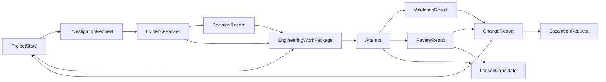
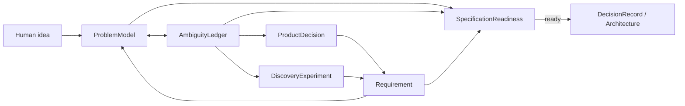
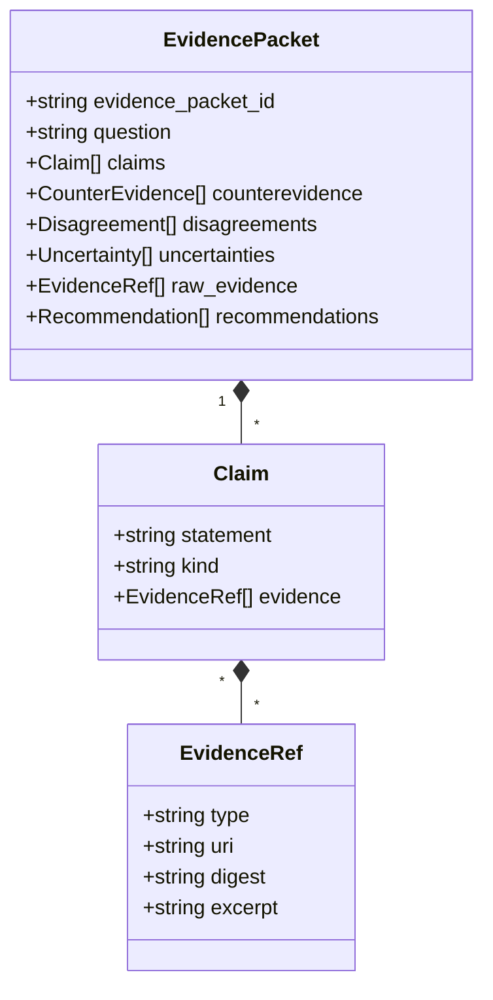
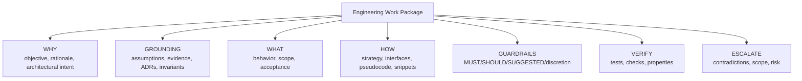
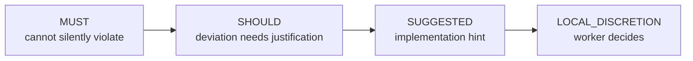
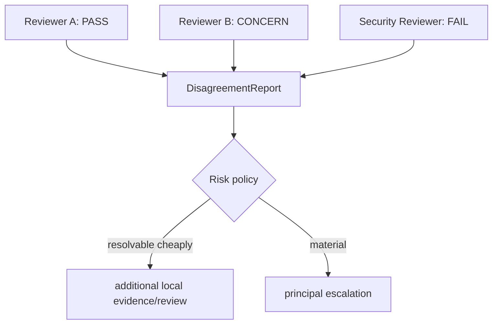
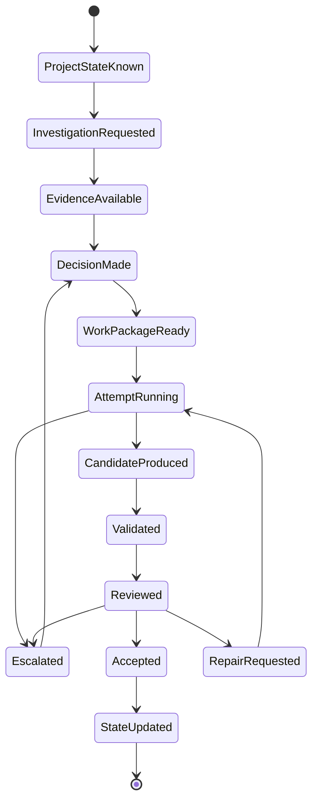

# DevCadence Protocols

## Scope

This document defines the semantic language spoken between principals, the control plane, local engineering agents, validators and consultants.

Core protocols must remain provider-independent.

Machine-readable definitions live in `schemas/`. This document explains semantics that schemas alone cannot express.

## 1. Protocol philosophy

A model should not have to infer organizational meaning from free-form chat.

DevCadence uses explicit artifacts:



## 2. Common envelope

Durable protocol records SHOULD contain:
- `schema_version`;
- stable object ID;
- project ID;
- creation timestamp;
- actor/producer identity;
- parent/correlation IDs;
- provenance references;
- content hash when stored as immutable artifact.

IDs should be opaque stable strings, e.g. ULID/UUID, with human-readable task aliases layered on top.

## 3. ProjectState

Purpose: provide a compact semantic snapshot to the principal/control plane.

ProjectState is not a source-code dump.

See [PROJECT_STATE.md](PROJECT_STATE.md).

## 3A. Discovery protocol objects

Discovery adds a product-definition layer before implementation protocols:



### ProblemModel
Canonical compact statement of product intent, actors, workflows, scope, success/failure criteria, constraints, assumptions, unknowns and risks.

### AmbiguityLedger
Active queue of unresolved meanings, their impact, resolution authority, status and provenance.

### ProductDecision
Human-authoritative product choice. Engineering models may explain consequences but cannot silently override it.

### Requirement
A functional/non-functional/constraint/non-goal statement with strength, provenance and epistemic status.

### DiscoveryExperiment
A bounded empirical investigation used to resolve feasibility/performance facts.

### SpecificationReadiness
Evidence-based gate indicating whether remaining ambiguity is safe for architecture.

See [DISCOVERY_AND_SPECIFICATION.md](DISCOVERY_AND_SPECIFICATION.md) and the corresponding schemas.

## 3B. MachineCapabilityProfile

Purpose: describe the machine and the cognition endpoints available on it, from
observed evidence.

It is the one durable contract that is **machine-scoped rather than
project-scoped**, and therefore carries no `project_id`: the hardware and the
installed runtimes are identical for every project on a host, and what differs per
project is policy rather than capability.

Shape, in outline:

```text
machine_fingerprint     digest over the stable facts of the machine
observed_at             injected observation instant
knowledge_revision      which compatibility knowledge produced the assessment
probe_depth             inventory | health | inference
environment             observed facts + per-component findings
accelerator_candidates  assessed backends, with reasons
endpoints               cognition endpoints, with health/auth/capability/evidence
assessment              readiness verdict
limitations             what this configuration cannot do
```

Three rules distinguish it from a status dump:

- **facts, assessment and evidence are separate.** `environment` contains no
  judgement; `accelerator_candidates` is a pure function of it and may never claim
  more than `runtime_available`.
- **a capability grade carries its provenance** (`configured`, `measured`,
  `evaluated`) and a grade without one is refused. `unknown` is the normal,
  correct value.
- **`acceleration.state: verified` requires evidence** — an authoritative offload
  signal from the runtime that performed the inference, a verification instant,
  no conflicts, and a profile whose `probe_depth` actually ran inference (DCI-106).

It is computed on demand rather than persisted; ProjectState carries a compact
projection of it. See
[adr/0013-environment-intelligence-and-cognition-contracts.md](adr/0013-environment-intelligence-and-cognition-contracts.md).

## 3C. Adaptive cognition portfolio protocols (M3C)

These protocol families are introduced normatively by ADR-0018; concrete Go/schema implementation lands in M3C.

### ResourceInventory
A deterministic snapshot/projection referencing MachineCapabilityProfile, cognition endpoints/capability provenance, session-driver features, host availability, credential references/auth status, configured economic/budget bindings and current resource observations where safely available. It contains no raw secrets.

### EconomicRegime / BudgetPool / BudgetState
`EconomicRegime` describes how use is constrained/charged: local compute, subscription quota, metered API, prepaid credits, enterprise allocation, unknown/custom.

`BudgetPool` is stable policy/configuration shared by one or more endpoints. It may define spending/reserve/overage policy even when exact remaining quota is not observable.

`BudgetState` is ephemeral evidence such as remaining quota/credits, reset time, rate/concurrency limits or local resource pressure. Unknown values remain unknown.

### PortfolioRecommendation
Typed advisory output from the Cognition Portfolio Planner. It references existing endpoints/budget pools and includes role choices/fallbacks, independence/diversity constraints, escalation/reserve behavior, workflow constraints, rationale/tradeoffs and evidence refs. It cannot grant authority.

### CognitionPortfolio
A versioned, deterministically validated configuration accepted from a recommendation or explicit operator configuration. It is the durable routing input, not a deployment-label string.

### WorkflowPlan
A bounded per-task topology compiled from task/risk requirements + CognitionPortfolio + current resource state. It names roles, endpoint/session requirements, retry/review/escalation bounds and deterministic gates. It may contain one cognition role or many.

### PortfolioChangeProposal
An explicit diff triggered by changed resources/policy/evidence. Applying it is auditable and reversible; learned evidence never silently mutates the active portfolio.

## 4. InvestigationRequest

An InvestigationRequest asks local repository cognition to establish facts.

Suggested structure:

```yaml
schema_version: "1.0"
investigation_id: INV-...
project_id: ...
base_commit: ...
question: >
  Can the current event storage abstraction support bounded
  time-range queries without changing its public interface?

requested_evidence:
  - relevant_interfaces
  - current_callers
  - existing_patterns
  - contradictions
scope_hints:
  - internal/storage
  - internal/events
max_semantic_response_tokens: 5000
```

The token limit is a response budget, not permission to omit material contradictions.

## 5. EvidencePacket

EvidencePacket is the principal boundary object for repository understanding.



Claim kind examples:
- deterministic_fact;
- repository_observation;
- external_fact;
- interpretation;
- assumption;
- recommendation.

An EvidencePacket must not disguise model synthesis as a deterministic fact.

## 6. DecisionRecord

DecisionRecord captures a durable choice.

Required semantics:
- question/context;
- alternatives;
- selected option;
- criteria;
- rationale;
- supporting evidence;
- dissent/unresolved uncertainty;
- consequences;
- rollback/supersession relationship;
- changed invariants/contracts.

Architecture-level decisions should also have a human-readable ADR.

## 7. Engineering Work Package

This is the core frontier-to-local contract.

### 7.1 Shape



### 7.2 Mandatory fields for systemic work

- `work_package_id`
- `task_id`
- `project_state_revision`
- `base_commit`
- objective
- rationale
- architectural intent
- assumptions with verification status
- source evidence references
- relevant decisions/invariants
- scope and non-scope
- implementation strategy
- guidance list with strength
- acceptance criteria
- validation requirements
- escalation conditions

### 7.3 Recommended fields

- interface sketches;
- pseudocode;
- code snippets;
- sequence/state diagrams;
- repository anchors;
- existing patterns;
- expected files/packages;
- edge cases;
- failure modes;
- performance expectations;
- observability requirements;
- migration/rollback details.

## 8. Guidance strength



Strength is about authority, not confidence.

A SHOULD may be highly confident but intentionally overridable because local repository reality is better observed by the worker.

## 9. Attempt

Every implementation execution is a separate Attempt.

Attempt fields include:
- attempt ID;
- Work Package version;
- worker role/profile;
- model/runtime version;
- worktree;
- base SHA;
- start/end;
- terminal status;
- candidate commit if produced;
- blocking contradictions;
- artifacts;
- repair-cycle count.

Retry does not overwrite the prior attempt.

## 10. ValidationResult

ValidationResult is produced by deterministic machinery where possible.

**Subject.** A ValidationResult states what it validated through an explicit
`subject` object rather than through optional top-level identifiers:

| `subject.kind` | required | forbidden |
| --- | --- | --- |
| `attempt` | `task_id`, `attempt_id` | — |
| `integration` | `task_id` | `attempt_id` |
| `baseline` | — | `task_id`, `attempt_id` |

`commit` is required for every scope: a run always validates some tree, and
evidence that does not name what it is about cannot be read as covering
anything in particular.

The three scopes match `ValidationCompleted.scope` exactly, and the two share
one enumeration (`protocol.ValidationScope`). A subject object rather than
optional fields is what lets "required here, forbidden there" be stated at
all: with bare optional fields, an integration result carrying an attempt id
and an attempt result missing one are both merely absent-field cases, and
neither the type nor the schema could reject them. The subject carries no
integration identifier because `ValidationCompleted` has none either, and a
field the event cannot corroborate could not be cross-checked.

Each check includes:
- check name/type;
- exact command/tool;
- tool version;
- working directory (scoped to module where applicable);
- module id if module-scoped (ADR-0015);
- exit code/status;
- start/end;
- stdout/stderr artifact refs;
- parsed summary;
- truncation indicator;
- policy importance.

When supervised validation services are used (ADR-0016), `ValidationResult` additionally records `config_digest` and the verified `service_identities` that ran alongside the checks.

A model may summarize the result, but the raw check is retained.

## 10A. Supervised Services and Asynchronous Operations

Under ADR-0016:
- **`OperationID`:** Identifies a controlled external process execution, separate from an architectural `TaskID`.
- **Response Yield Threshold:** Commands taking longer than 10 seconds yield `status: "running"` with an `OperationID`. The operation proceeds uninterrupted; upon completion, hosts receive event-driven wakeups without token-wasting busy-loops.
- **Universal Pagination (`fetch_content`):** Process outputs are decoupled via injected output sinks. Models page through immutable content-addressed artifacts with strict byte limits and contiguous offsets using `fetch_content(content_ref, offset, limit, unit)`. Full daemon-level live streaming into artifact storage with 4 KiB inline previews is scheduled with the background runner milestone.

## 11. ReviewResult

ReviewResult is model-assisted evidence **about an implementation candidate**,
judged against the Engineering Work Package that governed the attempt. It
therefore requires both `attempt_id` and `work_package_id`, and that linkage is
mechanically proven rather than assumed:

```
ReviewCompleted.work_package_id == ReviewResult.work_package_id == Attempt.work_package_id
```

The first equality is checked in the control-plane transaction (the event and
the record it summarises must agree); the second in the reducer (the record
must be about the blueprint the attempt actually executed). No work-package
*version* is carried on the event: the attempt already pins the exact version,
and `ReviewResult` records only the id, so a version on the event could be
checked against nothing.

Specification reviews are a different record entirely; see §11a.

Fields:
- review dimension;
- reviewer profile/model/runtime;
- verdict;
- findings with severity;
- Work Package compliance;
- evidence references;
- uncertainties;
- requested repairs;
- whether principal escalation is recommended.

Possible dimensions:
- correctness;
- architecture;
- invariants;
- security;
- test adequacy;
- performance;
- concurrency;
- API compatibility;
- complexity/maintainability.

## 11a. SpecificationReviewResult

SpecificationReviewResult is independent evidence **about a specification**,
produced during discovery — before an Engineering Work Package or an Attempt
exists. It is deliberately not a ReviewResult: the two judge different
artifacts at different times, and an implementation review record cannot
represent a specification review without empty attempt and work-package
fields that would make the two interchangeable again.

It pins `problem_model_id` and `problem_model_revision`, because a verdict
about revision 7 says nothing about revision 8.

Its dimensions are the discovery vectors from `prompts/specification-reviewer.md`
— `completeness`, `ambiguity`, `contradiction`, `architecture_contamination`,
`security_privacy`, `failure_modes`, `operations`, `ux_mental_model` — not the
implementation vectors of §11.

Each finding carries a resolution authority and a recommended question, so a
gap is routed to whoever can settle it (DCI-008), plus `blocks_readiness`. A
`pass` verdict over a finding that blocks readiness is refused: the Design
Readiness Gate must be passed by evidence, not by a summary.

## 12. DisagreementReport

When independent reviews disagree materially, preserve the disagreement as a first-class object rather than collapsing it into one verdict.



## 13. EscalationRequest

An escalation should be concise and decision-oriented.

Required:
- trigger;
- blocking question;
- violated/uncertain assumption;
- evidence;
- impact;
- options if known;
- what the local layer tried;
- requested decision authority.

Do not send the principal a 100K-token failed transcript by default.

## 14. ChangeReport

ChangeReport summarizes a candidate or accepted implementation:
- Work Package compliance;
- files/packages changed;
- semantic behavior changed;
- public API diff;
- schema/migration impact;
- deterministic validation;
- reviewer results;
- deviations;
- unresolved risks;
- commit IDs;
- evidence handles.

## 15. ConsultationRequest / ConsultationResult

ConsultationRequest contains:
- role requested;
- neutral problem statement;
- facts/evidence;
- explicit questions;
- whether candidate design should be hidden or shown;
- budget/turn constraints;
- confidentiality/allowed data scope.

ConsultationResult contains:
- provider/model identity;
- analysis summary;
- proposed alternatives;
- concerns;
- assumptions;
- evidence/source refs where supported;
- recommendation;
- uncertainty.

## 16. LessonCandidate

See [LEARNING.md](LEARNING.md).

A LessonCandidate includes:
- scope: project / language / framework / cross-project;
- type: invariant / skill / routing / prompt / test / review / policy;
- observed pattern;
- trajectory evidence;
- proposed rule/change;
- possible counterexamples;
- evaluation plan;
- promotion authority.

## 17. Protocol state transitions



## 18. Compatibility rules

Initial policy:
- major schema version change may be breaking;
- minor compatible additions should not change interpretation of existing required fields;
- durable records retain their original schema version;
- readers either support a version or fail explicitly;
- migration produces new records/artifacts rather than silently rewriting historical evidence where possible.

Unknown fields must not be silently discarded when round-tripping durable records.

The implemented policy, settled by
[adr/0003-durable-record-compatibility.md](adr/0003-durable-record-compatibility.md),
is **strict readers**: because every schema declares
`additionalProperties: false`, an unrecognised field is refused rather than
preserved or dropped, so loss cannot occur. Records are stored as the
canonical bytes that were written, with a digest, so a record this build
cannot interpret stays inspectable and verifiable. For an *optional* field, an
absent key, an explicit `null` and the type's zero value are the same
statement, and writers emit the shortest form. See
[../schemas/README.md](../schemas/README.md) for the full policy.

## 19. Protocol anti-patterns

Avoid:
- free-form “agent says done” as completion state;
- one generic `ask_model(prompt)` MCP tool as the public engineering API;
- storing raw chain-of-thought as required project state;
- parsing critical semantics from prose when a typed field is appropriate;
- using numeric confidence as the sole routing criterion;
- mutating Work Packages in place after attempts have started;
- losing links from summaries back to raw evidence.


## ReviewCampaign and convergence protocols

Review convergence is represented by three durable objects.

### ReviewCampaign
A bounded campaign around one immutable candidate lineage. It records candidate commit, Work Package/attempt identity, required review dimensions, thresholds, repair round, finding/disposition references, residual risks, and closure state.

### FindingDisposition
The principal's adjudication of one reviewer finding. Every adjudicated finding carries a `materiality` classification of `blocking`, `material_non_blocking`, or `opportunistic`, then receives exactly one disposition: FIX_NOW, REJECT, DEFER, HUMAN_DECISION, or DUPLICATE.

A FIX_NOW disposition must answer why the issue belongs in the current milestone/campaign.

### ClosureDecision
The evidence-backed termination decision. Closure checks deterministic validation, required reviews, blocking findings, unadjudicated material findings, repair regressions, contract review, and bounded residual risk.

A FROZEN outcome terminates the active ReviewCampaign. Below-threshold later observations become new work; reopening requires materially new evidence under the Reopen Rule.

~~~mermaid
flowchart LR
    C["Candidate"]
    R["Parallel broad reviews"]
    A["Principal adjudication"]
    D["FindingDisposition"]
    W["Repair Work Package"]
    F["Focused revalidation"]
    CD["ClosureDecision"]
    Z["Frozen"]

    C --> R --> A --> D
    D -->|"FIX_NOW"| W --> F --> CD
    D -->|"no current repair"| CD
    CD -->|"frozen"| Z
    CD -->|"repair required"| W
~~~

See [REVIEW_AND_CONVERGENCE.md](REVIEW_AND_CONVERGENCE.md) and schemas/review-campaign.schema.json, finding-disposition.schema.json, closure-decision.schema.json.
