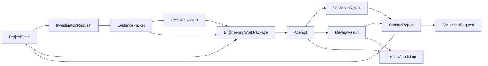
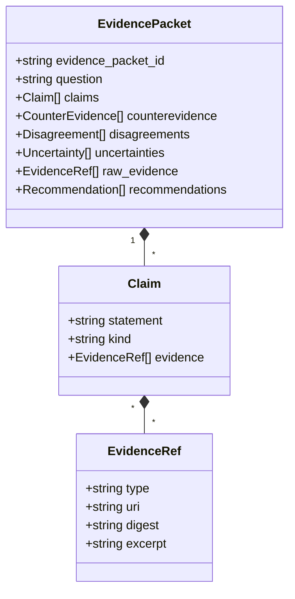
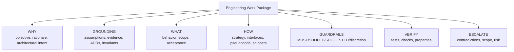
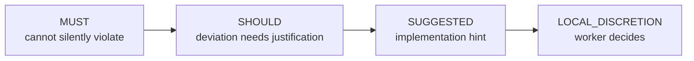
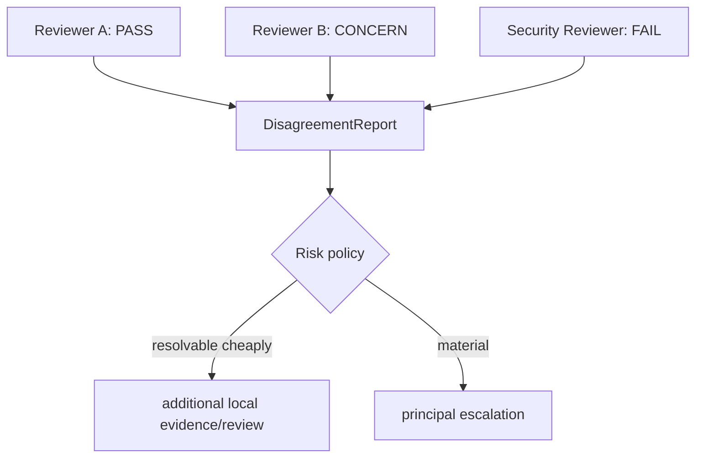
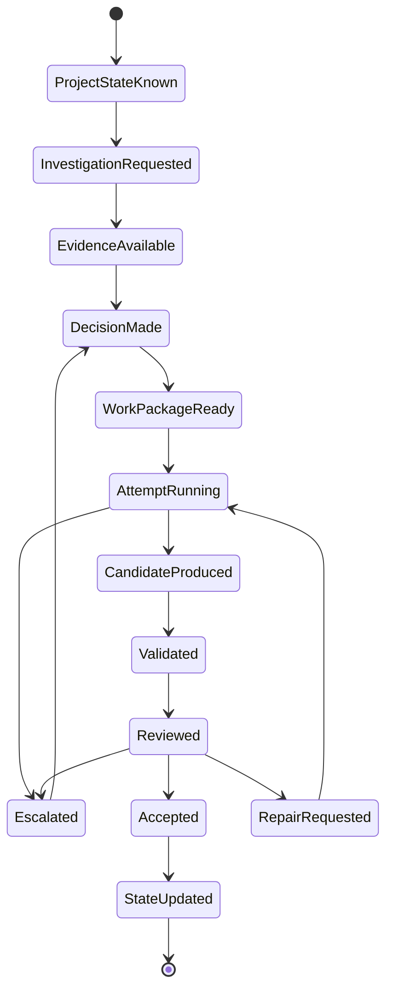

# DevCadience Protocols

## Scope

This document defines the semantic language spoken between principals, the control plane, local engineering agents, validators and consultants.

Core protocols must remain provider-independent.

Machine-readable definitions live in `schemas/`. This document explains semantics that schemas alone cannot express.

## 1. Protocol philosophy

A model should not have to infer organizational meaning from free-form chat.

DevCadience uses explicit artifacts:



## 2. Common envelope

Durable protocol records SHOULD contain:
- `schema_version`;
- stable object ID;
- project ID;
- creation timestamp;
- actor/producer identity;
- parent/correlation IDs;
- provenance references;
- content hash when stored as immutable artifact.

IDs should be opaque stable strings, e.g. ULID/UUID, with human-readable task aliases layered on top.

## 3. ProjectState

Purpose: provide a compact semantic snapshot to the principal/control plane.

ProjectState is not a source-code dump.

See [PROJECT_STATE.md](PROJECT_STATE.md).

## 4. InvestigationRequest

An InvestigationRequest asks local repository cognition to establish facts.

Suggested structure:

```yaml
schema_version: "1.0"
investigation_id: INV-...
project_id: ...
base_commit: ...
question: >
  Can the current event storage abstraction support bounded
  time-range queries without changing its public interface?

requested_evidence:
  - relevant_interfaces
  - current_callers
  - existing_patterns
  - contradictions
scope_hints:
  - internal/storage
  - internal/events
max_semantic_response_tokens: 5000
```

The token limit is a response budget, not permission to omit material contradictions.

## 5. EvidencePacket

EvidencePacket is the principal boundary object for repository understanding.



Claim kind examples:
- deterministic_fact;
- repository_observation;
- external_fact;
- interpretation;
- assumption;
- recommendation.

An EvidencePacket must not disguise model synthesis as a deterministic fact.

## 6. DecisionRecord

DecisionRecord captures a durable choice.

Required semantics:
- question/context;
- alternatives;
- selected option;
- criteria;
- rationale;
- supporting evidence;
- dissent/unresolved uncertainty;
- consequences;
- rollback/supersession relationship;
- changed invariants/contracts.

Architecture-level decisions should also have a human-readable ADR.

## 7. Engineering Work Package

This is the core frontier-to-local contract.

### 7.1 Shape



### 7.2 Mandatory fields for systemic work

- `work_package_id`
- `task_id`
- `project_state_revision`
- `base_commit`
- objective
- rationale
- architectural intent
- assumptions with verification status
- source evidence references
- relevant decisions/invariants
- scope and non-scope
- implementation strategy
- guidance list with strength
- acceptance criteria
- validation requirements
- escalation conditions

### 7.3 Recommended fields

- interface sketches;
- pseudocode;
- code snippets;
- sequence/state diagrams;
- repository anchors;
- existing patterns;
- expected files/packages;
- edge cases;
- failure modes;
- performance expectations;
- observability requirements;
- migration/rollback details.

## 8. Guidance strength



Strength is about authority, not confidence.

A SHOULD may be highly confident but intentionally overridable because local repository reality is better observed by the worker.

## 9. Attempt

Every implementation execution is a separate Attempt.

Attempt fields include:
- attempt ID;
- Work Package version;
- worker role/profile;
- model/runtime version;
- worktree;
- base SHA;
- start/end;
- terminal status;
- candidate commit if produced;
- blocking contradictions;
- artifacts;
- repair-cycle count.

Retry does not overwrite the prior attempt.

## 10. ValidationResult

ValidationResult is produced by deterministic machinery where possible.

Each check includes:
- check name/type;
- exact command/tool;
- tool version;
- working directory;
- exit code/status;
- start/end;
- stdout/stderr artifact refs;
- parsed summary;
- truncation indicator;
- policy importance.

A model may summarize the result, but the raw check is retained.

## 11. ReviewResult

ReviewResult is model-assisted evidence.

Fields:
- review dimension;
- reviewer profile/model/runtime;
- verdict;
- findings with severity;
- Work Package compliance;
- evidence references;
- uncertainties;
- requested repairs;
- whether principal escalation is recommended.

Possible dimensions:
- correctness;
- architecture;
- invariants;
- security;
- test adequacy;
- performance;
- concurrency;
- API compatibility;
- complexity/maintainability.

## 12. DisagreementReport

When independent reviews disagree materially, preserve the disagreement as a first-class object rather than collapsing it into one verdict.



## 13. EscalationRequest

An escalation should be concise and decision-oriented.

Required:
- trigger;
- blocking question;
- violated/uncertain assumption;
- evidence;
- impact;
- options if known;
- what the local layer tried;
- requested decision authority.

Do not send the principal a 100K-token failed transcript by default.

## 14. ChangeReport

ChangeReport summarizes a candidate or accepted implementation:
- Work Package compliance;
- files/packages changed;
- semantic behavior changed;
- public API diff;
- schema/migration impact;
- deterministic validation;
- reviewer results;
- deviations;
- unresolved risks;
- commit IDs;
- evidence handles.

## 15. ConsultationRequest / ConsultationResult

ConsultationRequest contains:
- role requested;
- neutral problem statement;
- facts/evidence;
- explicit questions;
- whether candidate design should be hidden or shown;
- budget/turn constraints;
- confidentiality/allowed data scope.

ConsultationResult contains:
- provider/model identity;
- analysis summary;
- proposed alternatives;
- concerns;
- assumptions;
- evidence/source refs where supported;
- recommendation;
- uncertainty.

## 16. LessonCandidate

See [LEARNING.md](LEARNING.md).

A LessonCandidate includes:
- scope: project / language / framework / cross-project;
- type: invariant / skill / routing / prompt / test / review / policy;
- observed pattern;
- trajectory evidence;
- proposed rule/change;
- possible counterexamples;
- evaluation plan;
- promotion authority.

## 17. Protocol state transitions



## 18. Compatibility rules

Initial policy:
- major schema version change may be breaking;
- minor compatible additions should not change interpretation of existing required fields;
- durable records retain their original schema version;
- readers either support a version or fail explicitly;
- migration produces new records/artifacts rather than silently rewriting historical evidence where possible.

Unknown fields must not be silently discarded when round-tripping durable records.

The implemented policy, settled by
[adr/0002-durable-record-compatibility.md](adr/0002-durable-record-compatibility.md),
is **strict readers**: because every schema declares
`additionalProperties: false`, an unrecognised field is refused rather than
preserved or dropped, so loss cannot occur. Records are stored as the
canonical bytes that were written, with a digest, so a record this build
cannot interpret stays inspectable and verifiable. For an *optional* field, an
absent key, an explicit `null` and the type's zero value are the same
statement, and writers emit the shortest form. See
[../schemas/README.md](../schemas/README.md) for the full policy.

## 19. Protocol anti-patterns

Avoid:
- free-form “agent says done” as completion state;
- one generic `ask_model(prompt)` MCP tool as the public engineering API;
- storing raw chain-of-thought as required project state;
- parsing critical semantics from prose when a typed field is appropriate;
- using numeric confidence as the sole routing criterion;
- mutating Work Packages in place after attempts have started;
- losing links from summaries back to raw evidence.
