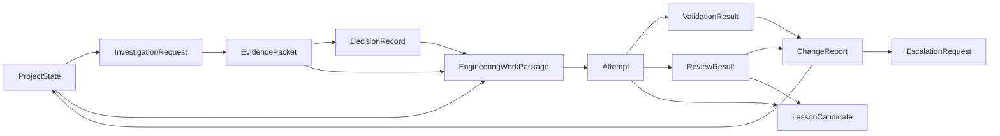
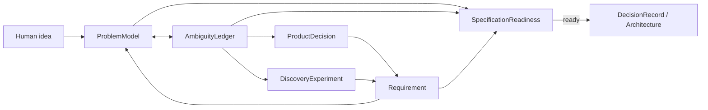
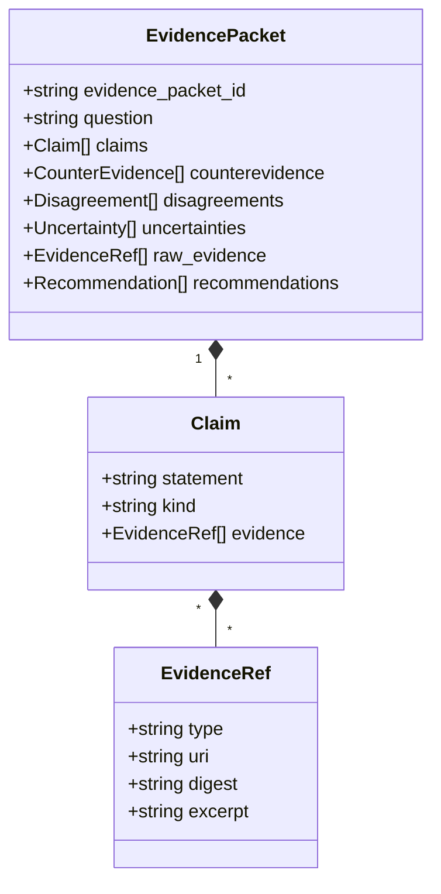
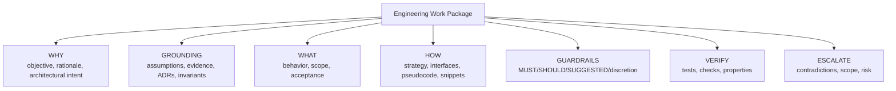
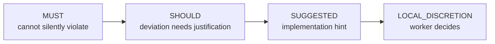
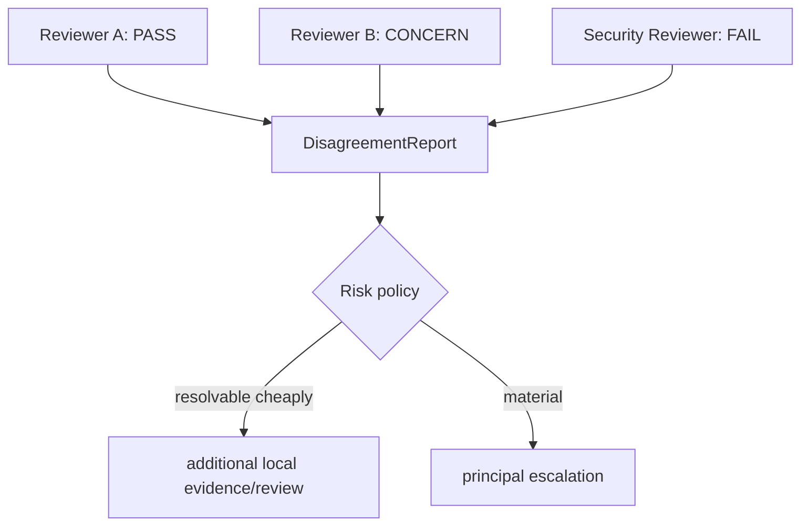
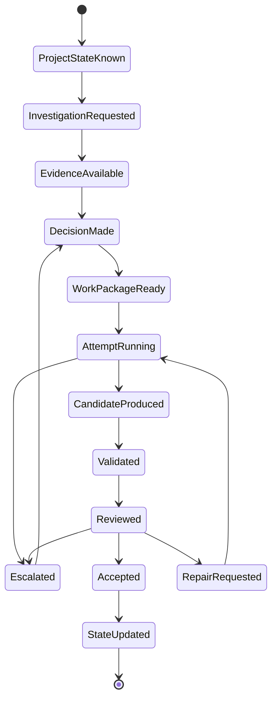

# DevCadence Protocols

## Scope

This document defines the semantic language spoken between principals, the control plane, local engineering agents, validators and consultants.

Core protocols must remain provider-independent.

Machine-readable definitions live in `schemas/`. This document explains semantics that schemas alone cannot express.

## 1. Protocol philosophy

A model should not have to infer organizational meaning from free-form chat.

DevCadence uses explicit artifacts:



## 2. Common envelope

Durable protocol records SHOULD contain:
- `schema_version`;
- stable object ID;
- project ID;
- creation timestamp;
- actor/producer identity;
- parent/correlation IDs;
- provenance references;
- content hash when stored as immutable artifact.

IDs should be opaque stable strings, e.g. ULID/UUID, with human-readable task aliases layered on top.

## 3. ProjectState

Purpose: provide a compact semantic snapshot to the principal/control plane.

ProjectState is not a source-code dump.

See [PROJECT_STATE.md](PROJECT_STATE.md).

## 3A. Discovery protocol objects

Discovery adds a product-definition layer before implementation protocols:



### ProblemModel
Canonical compact statement of product intent, actors, workflows, scope, success/failure criteria, constraints, assumptions, unknowns and risks.

### AmbiguityLedger
Active queue of unresolved meanings, their impact, resolution authority, status and provenance.

### ProductDecision
Human-authoritative product choice. Engineering models may explain consequences but cannot silently override it.

### Requirement
A functional/non-functional/constraint/non-goal statement with strength, provenance and epistemic status.

### DiscoveryExperiment
A bounded empirical investigation used to resolve feasibility/performance facts.

### SpecificationReadiness
Evidence-based gate indicating whether remaining ambiguity is safe for architecture.

See [DISCOVERY_AND_SPECIFICATION.md](DISCOVERY_AND_SPECIFICATION.md) and the corresponding schemas.

## 3B. MachineCapabilityProfile

Purpose: describe the machine and the cognition endpoints available on it, from
observed evidence.

It is the one durable contract that is **machine-scoped rather than
project-scoped**, and therefore carries no `project_id`: the hardware and the
installed runtimes are identical for every project on a host, and what differs per
project is policy rather than capability.

Shape, in outline:

```text
machine_fingerprint     digest over the stable facts of the machine
observed_at             injected observation instant
knowledge_revision      which compatibility knowledge produced the assessment
probe_depth             inventory | health | inference
environment             observed facts + per-component findings
accelerator_candidates  assessed backends, with reasons
endpoints               cognition endpoints, with health/auth/capability/evidence
assessment              readiness verdict
limitations             what this configuration cannot do
```

Three rules distinguish it from a status dump:

- **facts, assessment and evidence are separate.** `environment` contains no
  judgement; `accelerator_candidates` is a pure function of it and may never claim
  more than `runtime_available`.
- **a capability grade carries its provenance** (`configured`, `measured`,
  `evaluated`) and a grade without one is refused. `unknown` is the normal,
  correct value.
- **`acceleration.state: verified` requires evidence** — an authoritative offload
  signal from the runtime that performed the inference, a verification instant,
  no conflicts, and a profile whose `probe_depth` actually ran inference (DCI-106).

It is computed on demand rather than persisted; ProjectState carries a compact
projection of it. See
[adr/0013-environment-intelligence-and-cognition-contracts.md](adr/0013-environment-intelligence-and-cognition-contracts.md).

## 3C. Cognition resource/session and adaptive planning protocols (M3C/M3D)

These protocol families are introduced normatively by ADR-0018. M3C owns the deterministic protocol/session/economic substrate and validation/activation boundary; M3D owns AI-assisted PortfolioRecommendation and WorkflowPlan synthesis over those types.

### ResourceInventory
A deterministic snapshot/projection referencing MachineCapabilityProfile, cognition endpoints/capability provenance, session-driver features, host availability, credential references/auth status, configured economic/budget bindings and current resource observations where safely available. It contains no raw secrets.

### EconomicRegime / BudgetPool / BudgetState
`EconomicRegime` describes how use is constrained/charged: local compute, subscription quota, metered API, prepaid credits, enterprise allocation, unknown/custom.

`BudgetPool` is stable policy/configuration shared by one or more endpoints. It may define spending/reserve/overage policy even when exact remaining quota is not observable.

`BudgetState` is ephemeral evidence such as remaining quota/credits, reset time, rate/concurrency limits or local resource pressure. Unknown values remain unknown.

### PortfolioRecommendation
Typed advisory output from the Cognition Portfolio Planner. It references existing endpoints/budget pools and includes role choices/fallbacks, independence/diversity constraints, escalation/reserve behavior, workflow constraints, rationale/tradeoffs and evidence refs. It cannot grant authority.

### CognitionPortfolio
A versioned, deterministically validated configuration accepted from a recommendation or explicit operator configuration. It is the durable routing input, not a deployment-label string.

### WorkflowPlan
A bounded per-task topology compiled from task/risk requirements + CognitionPortfolio + current resource state. It names roles, endpoint/session requirements, retry/review/escalation bounds and deterministic gates. It may contain one cognition role or many.

### PortfolioChangeProposal
An explicit diff triggered by changed resources/policy/evidence. Applying it is auditable and reversible; learned evidence never silently mutates the active portfolio.

## 4. InvestigationRequest

An InvestigationRequest asks local repository cognition to establish facts.

Suggested structure:

```yaml
schema_version: "1.0"
investigation_id: INV-...
project_id: ...
base_commit: ...
question: >
  Can the current event storage abstraction support bounded
  time-range queries without changing its public interface?

requested_evidence:
  - relevant_interfaces
  - current_callers
  - existing_patterns
  - contradictions
scope_hints:
  - internal/storage
  - internal/events
max_semantic_response_tokens: 5000
```

The token limit is a response budget, not permission to omit material contradictions.

## 5. EvidencePacket

EvidencePacket is the principal boundary object for repository understanding.



Claim kind examples:
- deterministic_fact;
- repository_observation;
- external_fact;
- interpretation;
- assumption;
- recommendation.

An EvidencePacket must not disguise model synthesis as a deterministic fact.

## 6. DecisionRecord

DecisionRecord captures a durable choice.

Required semantics:
- question/context;
- alternatives;
- selected option;
- criteria;
- rationale;
- supporting evidence;
- dissent/unresolved uncertainty;
- consequences;
- rollback/supersession relationship;
- changed invariants/contracts.

Architecture-level decisions should also have a human-readable ADR.

## 7. Engineering Work Package

This is the core frontier-to-local contract.

### 7.1 Shape



### 7.2 Mandatory fields for systemic work

- `work_package_id`
- `task_id`
- `project_state_revision`
- `base_commit`
- objective
- rationale
- architectural intent
- assumptions with verification status
- source evidence references
- relevant decisions/invariants
- scope and non-scope
- implementation strategy
- guidance list with strength
- acceptance criteria
- validation requirements
- escalation conditions

### 7.3 Recommended fields

- interface sketches;
- pseudocode;
- code snippets;
- sequence/state diagrams;
- repository anchors;
- existing patterns;
- expected files/packages;
- edge cases;
- failure modes;
- performance expectations;
- observability requirements;
- migration/rollback details.

### 7.4 RefactoringProposal (Bottom-Up Challenge Protocol) [Proposed - M3C]

*Status:* Proposed for Milestone M3C. Protocol Go types and JSON Schemas will be formalized under `internal/protocol/` and `schemas/` during M3C implementation.

An accepted Work Package is a stable baseline, not an immutable dogma (ADR-0019 §3). When an implementer or reviewer discovers that an upstream interface, dependency, or contract is flawed, clunky, or missing essential parameters, it is forbidden from writing hacky workarounds or local shims.

Instead, the worker emits a typed `RefactoringProposal`:

```yaml
schema_version: "1.0"
proposal_id: "REF-001"
source_work_package_id: "WP-M3B-5"
target_work_package_id: "WP-M3B-2"
architectural_tension: >
  Doctor.Run requires context.Context for cancellation and timeouts,
  but WP-2 defined the interface with only facts and scope.
contradiction_evidence:
  - "internal/setup/doctor.go:210"
  - "compiler error on timeout handler implementation"
proposed_interface: >
  Run(ctx context.Context, scope ReadinessEvaluationScope, facts EnvironmentFacts) (*DoctorReport, error)
affected_callers:
  - "cmd/devcadence/cmd_doctor.go"
  - "tests/m3b_milestone_closure_test.go"
reversibility_assessment: "Low risk; atomic signature update across 3 callers."
```

The Principal adjudicates the proposal. If accepted, an atomic upstream refactor is applied cleanly, regression tests run, and the codebase remains free of architectural rot.

## 8. Guidance strength



Strength is about authority, not confidence.

A SHOULD may be highly confident but intentionally overridable because local repository reality is better observed by the worker.

## 9. Attempt

Every implementation execution is a separate Attempt.

Attempt fields include:
- attempt ID;
- Work Package version;
- worker role/profile;
- model/runtime version;
- worktree;
- base SHA;
- start/end;
- terminal status;
- candidate commit if produced;
- blocking contradictions;
- artifacts;
- repair-cycle count.

Retry does not overwrite the prior attempt.

## 10. ValidationResult

ValidationResult is produced by deterministic machinery where possible.

**Subject.** A ValidationResult states what it validated through an explicit
`subject` object rather than through optional top-level identifiers:

| `subject.kind` | required | forbidden |
| --- | --- | --- |
| `attempt` | `task_id`, `attempt_id` | — |
| `integration` | `task_id` | `attempt_id` |
| `baseline` | — | `task_id`, `attempt_id` |

`commit` is required for every scope: a run always validates some tree, and
evidence that does not name what it is about cannot be read as covering
anything in particular.

The three scopes match `ValidationCompleted.scope` exactly, and the two share
one enumeration (`protocol.ValidationScope`). A subject object rather than
optional fields is what lets "required here, forbidden there" be stated at
all: with bare optional fields, an integration result carrying an attempt id
and an attempt result missing one are both merely absent-field cases, and
neither the type nor the schema could reject them. The subject carries no
integration identifier because `ValidationCompleted` has none either, and a
field the event cannot corroborate could not be cross-checked.

Each check includes:
- check name/type;
- exact command/tool;
- tool version;
- working directory (scoped to module where applicable);
- module id if module-scoped (ADR-0015);
- exit code/status;
- start/end;
- stdout/stderr artifact refs;
- parsed summary;
- truncation indicator;
- policy importance.

When supervised validation services are used (ADR-0016), `ValidationResult` additionally records `config_digest` and the verified `service_identities` that ran alongside the checks.

A model may summarize the result, but the raw check is retained.

## 10A. Supervised Services and Asynchronous Operations

Under ADR-0016:
- **`OperationID`:** Identifies a controlled external process execution, separate from an architectural `TaskID`.
- **Response Yield Threshold:** Commands taking longer than 10 seconds yield `status: "running"` with an `OperationID`. The operation proceeds uninterrupted; upon completion, hosts receive event-driven wakeups without token-wasting busy-loops.
- **Universal Pagination (`fetch_content`):** Process outputs are decoupled via injected output sinks. Models page through immutable content-addressed artifacts with strict byte limits and contiguous offsets using `fetch_content(content_ref, offset, limit, unit)`. Full daemon-level live streaming into artifact storage with 4 KiB inline previews is scheduled with the background runner milestone.

## 10B. Adaptive Context Architecture and Evidence Working Set [Proposed - M3C]

*Status:* Proposed for Milestone M3C. Provider-neutral context control capabilities (`ContextControl = ExactStateless | AppendOnly | OpaqueSession`) and Evidence Working Set lease mediation land in M3C.

Rather than treating cognition as monolithic conversational loops that cause context bloat, token waste, and attention dilution, DevCadence structures cognition across four adaptive layers (ADR-0019 §1):

1. **Protected Core (Static Prefix)**: System instructions, task EWP, candidate diff, and deterministic validation outputs are placed at the prompt head. Because this block is immutable across an attempt or review, it maximizes provider prefix KV-cache reuse.
2. **Cognitive State Capsule**: A compact, typed data structure maintaining derived hypotheses, active TODOs, intermediate decisions, and unresolved questions across turns. Explicitly categorized as derived cognition (not ground fact), preserving continuity without dragging raw conversational debris.
3. **Evidence Working Set (Leased Snippet Pool)**: Models manage their active evidence dynamically through verbatim code snippets, diffs, and log excerpts:
   - **Content-Addressed Leases**: Snippets reference `(file_path, content_digest, start_line, end_line)`;
   - **Freshness Invalidation**: If underlying files are modified in a worktree during implementation, dependent snippet leases are automatically marked stale;
   - **Server-Side Authorization**: The control plane enforces path authorization and bounds to prevent leaking out-of-scope files or secrets.
4. **Short Ephemeral Tail**: Immediate prior tool call/result exchange for drivers that benefit from local conversational continuity, discarded across task boundaries and never treated as canonical project state.

Example working-memory lease update:

```json
{
  "request_facts": [
    { "path": "internal/setup/doctor.go", "start_line": 815, "end_line": 835 }
  ],
  "release_facts": [
    "snippet_1"
  ]
}
```

The control plane runtime deterministically drops released leases, verifies and fetches requested lines, and maintains a lean working memory envelope.

## 11. ReviewResult

ReviewResult is model-assisted evidence **about an implementation candidate**,
judged against the Engineering Work Package that governed the attempt. It
therefore requires both `attempt_id` and `work_package_id`, and that linkage is
mechanically proven rather than assumed:

```
ReviewCompleted.work_package_id == ReviewResult.work_package_id == Attempt.work_package_id
```

The first equality is checked in the control-plane transaction (the event and
the record it summarises must agree); the second in the reducer (the record
must be about the blueprint the attempt actually executed). No work-package
*version* is carried on the event: the attempt already pins the exact version,
and `ReviewResult` records only the id, so a version on the event could be
checked against nothing.

Specification reviews are a different record entirely; see §11a.

Fields:
- review dimension;
- reviewer profile/model/runtime;
- verdict;
- findings with severity;
- Work Package compliance;
- evidence references;
- uncertainties;
- requested repairs;
- whether principal escalation is recommended.

Possible dimensions:
- `correctness`: algorithmic accuracy, nil safety, boundary conditions;
- `architecture`: layer boundaries, dependency inversion, public contract adherence;
- `invariants`: durable system invariants (DCI compliance);
- `security`: auth bypass, injection, secret exposure, command safety;
- `test_adequacy`: assertion validity, edge-case coverage, negative-path and mutation testing;
- `concurrency`: synchronization, race safety, cancellation lifetimes;
- `performance`: algorithmic complexity, allocation profiles, concurrency overhead;
- `maintainability`: code clarity, idiomatic style, comment accuracy;
- `other`: explicitly scoped reviews outside the primary taxonomy.

### 11.1 Dynamic Review Lenses and Active Falsification

Review invocations may attach targeted **Review Lenses / Strategies** (ADR-0019 §4) that guide reviewer focus across the dimensions above, avoiding churn in the durable `ReviewDimension` enum:
- `anti_rabbit_hole`: scrutinizes code for YAGNI, defensive bloat, and speculative over-engineering;
- `anti_drift`: verifies strict scope discipline, checking that touched files match the declared work package and catching drive-by edits;
- `anti_hallucination`: grounds claims by verifying cited symbols, CLI flags, and test executions exist.

Additionally, reviewers can formulate **Active Falsification Probes** (`FalsificationProbe` / mutation testing): targeted requests asking deterministic validation machinery to temporarily mutate or invert a condition to verify that tests fail as expected. This converts subjective reviewer suspicion into empirical verification evidence.

## 11a. SpecificationReviewResult

SpecificationReviewResult is independent evidence **about a specification**,
produced during discovery — before an Engineering Work Package or an Attempt
exists. It is deliberately not a ReviewResult: the two judge different
artifacts at different times, and an implementation review record cannot
represent a specification review without empty attempt and work-package
fields that would make the two interchangeable again.

It pins `problem_model_id` and `problem_model_revision`, because a verdict
about revision 7 says nothing about revision 8.

Its dimensions are the discovery vectors from `prompts/specification-reviewer.md`
— `completeness`, `ambiguity`, `contradiction`, `architecture_contamination`,
`security_privacy`, `failure_modes`, `operations`, `ux_mental_model` — not the
implementation vectors of §11.

Each finding carries a resolution authority and a recommended question, so a
gap is routed to whoever can settle it (DCI-008), plus `blocks_readiness`. A
`pass` verdict over a finding that blocks readiness is refused: the Design
Readiness Gate must be passed by evidence, not by a summary.

## 11b. Dual Independent Review and Aggregator Synthesis [Planned - M7]

For systemic or high-risk candidates, DevCadence invokes dual independent reviews in parallel (ADR-0019 §5).

Aggregation is an orchestration phase within `ReviewCampaign`, not a separate durable protocol table or SQLite schema:
- **Parallel Independent Review**: Two independent reviewer models evaluate the candidate commit in parallel, each starting from a clean context.
- **Double-Green Adjudication Fast-Path**: If both independent reviewers return `PASS` with zero blocking findings AND all deterministic validation checks pass, the Principal receives an instant green card allowing immediate, frictionless closure. Double-Green is an **adjudication fast-path**, not an unmoderated bypass of human/principal authority (DCI-009) or deterministic closure prerequisites (`closure-decision.schema.json`).
- **Asymmetric Veto**: If any reviewer raises a `BLOCKING` finding in `security` or `invariants`, an Aggregator model **cannot** discard or override it. It can only be dismissed by explicit human disposition or deterministic falsification proof.
- **Consolidated Repair Synthesis**: If findings exist or reviewers disagree, the Aggregator synthesizes the findings into standard `FindingDisposition` records and compiles at most one consolidated `RepairWorkPackage`. Implementers never negotiate directly with multiple reviewers.

## 12. DisagreementReport

When independent reviews disagree materially, preserve the disagreement as a first-class object rather than collapsing it into one verdict.



## 13. EscalationRequest

An escalation should be concise and decision-oriented.

Required:
- trigger;
- blocking question;
- violated/uncertain assumption;
- evidence;
- impact;
- options if known;
- what the local layer tried;
- requested decision authority.

Do not send the principal a 100K-token failed transcript by default.

## 14. ChangeReport

ChangeReport summarizes a candidate or accepted implementation:
- Work Package compliance;
- files/packages changed;
- semantic behavior changed;
- public API diff;
- schema/migration impact;
- deterministic validation;
- reviewer results;
- deviations;
- unresolved risks;
- commit IDs;
- evidence handles.

## 15. ConsultationRequest / ConsultationResult

ConsultationRequest contains:
- role requested;
- neutral problem statement;
- facts/evidence;
- explicit questions;
- whether candidate design should be hidden or shown;
- budget/turn constraints;
- confidentiality/allowed data scope.

ConsultationResult contains:
- provider/model identity;
- analysis summary;
- proposed alternatives;
- concerns;
- assumptions;
- evidence/source refs where supported;
- recommendation;
- uncertainty.

## 16. LessonCandidate

See [LEARNING.md](LEARNING.md).

A LessonCandidate includes:
- scope: project / language / framework / cross-project;
- type: invariant / skill / routing / prompt / test / review / policy;
- observed pattern;
- trajectory evidence;
- proposed rule/change;
- possible counterexamples;
- evaluation plan;
- promotion authority.

## 17. Protocol state transitions



## 18. Compatibility rules

Initial policy:
- major schema version change may be breaking;
- minor compatible additions should not change interpretation of existing required fields;
- durable records retain their original schema version;
- readers either support a version or fail explicitly;
- migration produces new records/artifacts rather than silently rewriting historical evidence where possible.

Unknown fields must not be silently discarded when round-tripping durable records.

The implemented policy, settled by
[adr/0003-durable-record-compatibility.md](adr/0003-durable-record-compatibility.md),
is **strict readers**: because every schema declares
`additionalProperties: false`, an unrecognised field is refused rather than
preserved or dropped, so loss cannot occur. Records are stored as the
canonical bytes that were written, with a digest, so a record this build
cannot interpret stays inspectable and verifiable. For an *optional* field, an
absent key, an explicit `null` and the type's zero value are the same
statement, and writers emit the shortest form. See
[../schemas/README.md](../schemas/README.md) for the full policy.

## 19. Protocol anti-patterns

Avoid:
- free-form “agent says done” as completion state;
- one generic `ask_model(prompt)` MCP tool as the public engineering API;
- storing raw chain-of-thought as required project state;
- parsing critical semantics from prose when a typed field is appropriate;
- using numeric confidence as the sole routing criterion;
- mutating Work Packages in place after attempts have started;
- losing links from summaries back to raw evidence.


## ReviewCampaign and convergence protocols

Review convergence is represented by three durable objects.

### ReviewCampaign
A bounded campaign around one immutable candidate lineage. It records candidate commit, Work Package/attempt identity, required review dimensions, thresholds, repair round, finding/disposition references, residual risks, and closure state.

### FindingDisposition
The principal's adjudication of one reviewer finding. Every adjudicated finding carries a `materiality` classification of `blocking`, `material_non_blocking`, or `opportunistic`, then receives exactly one disposition: FIX_NOW, REJECT, DEFER, HUMAN_DECISION, or DUPLICATE.

A FIX_NOW disposition must answer why the issue belongs in the current milestone/campaign.

### ClosureDecision
The evidence-backed termination decision. Closure checks deterministic validation, required reviews, blocking findings, unadjudicated material findings, repair regressions, contract review, and bounded residual risk.

A FROZEN outcome terminates the active ReviewCampaign. Below-threshold later observations become new work; reopening requires materially new evidence under the Reopen Rule.

~~~mermaid
flowchart LR
    C["Candidate"]
    R["Parallel broad reviews"]
    A["Principal adjudication"]
    D["FindingDisposition"]
    W["Repair Work Package"]
    F["Focused revalidation"]
    CD["ClosureDecision"]
    Z["Frozen"]

    C --> R --> A --> D
    D -->|"FIX_NOW"| W --> F --> CD
    D -->|"no current repair"| CD
    CD -->|"frozen"| Z
    CD -->|"repair required"| W
~~~

See [REVIEW_AND_CONVERGENCE.md](REVIEW_AND_CONVERGENCE.md) and schemas/review-campaign.schema.json, finding-disposition.schema.json, closure-decision.schema.json.

## 20. Credential references and authentication evidence

DevCadence isolates authorization handles from secret material and keeps credentials orthogonal to cognition routing, access channels, accounts, and economic regimes (ADR-0014 §6, ADR-0018 §1, DCI-081):

```text
CredentialRef
!= CognitionEndpoint
!= AccessChannel
!= Session
!= Account
!= EconomicRegime
!= CognitionPortfolio
```

### CredentialRef
An opaque reference to an authorization mechanism. It is provider-neutral, holds no secret custody, and is a durable record (`schema_version`, `Validate()`, registered in `protocol.NewRecord`):
- `schema_version`: durable contract version;
- `ref_id`: stable identifier for the reference, bounded and rejected if secret-shaped (the same opaque-ID check `AuthEvidence.ref_id`/`adapter_id` share);
- `kind`: `env_var | cli_session | keychain_ref`;
- `locator`: non-secret locator (e.g. uppercase environment variable identifier, CLI session handle, or keychain service locator). Raw secret values are rejected at boundary validation.

### AuthEvidence
A structured, bounded durable record of authentication readiness resulting from an evaluation:
- `schema_version`: durable contract version;
- `ref_id`: reference identifier matching the CredentialRef, same opaque-ID contract;
- `kind`: credential reference kind — structurally bound to `probe_kind` (`env_var`→`env_presence`, `keychain_ref`→`keychain_presence`, `cli_session`→`cli_auth_call`|`cli_version_only`; any other pairing is rejected);
- `status`: `authenticated | unauthenticated | unavailable | indeterminate`;
- `probe_kind`: `env_presence | cli_auth_call | cli_version_only | keychain_presence`;
- `observed_at`: timestamp of the probe;
- `probe_target`: optional locator or CLI tool name;
- `adapter_id`: optional adapter identifier, same opaque-ID contract;
- `detail`: bounded, non-secret diagnostic description.

Crucial invariant: only `cli_auth_call` (an authoritative probe that actually exercises the credential against its provider) may produce `authenticated`. `cli_version_only` (e.g. `claude --version`), `env_presence`, and `keychain_presence` probes prove installation or mere presence only, NEVER authentication — a record claiming `authenticated` from any of the three is structurally refused by `AuthEvidence.Validate()`. Presence therefore reports `indeterminate` (not `authenticated`); absence reports `unauthenticated`; a check that could not be completed at all (e.g. no keychain backend on this platform) reports `unavailable`, never `unauthenticated` — an incomplete check is not evidence of absence.

The `cli_auth_call` guarantee is enforced structurally, not merely by adapter configuration. `BoundedCLIAuthAdapter`'s probe argv can only be set through `Probe AuthProbeDefinition` — a closed type whose one field is unexported, so it can only be produced by `credentials.NewAuthProbeDefinition`/`MustAuthProbeDefinition`, which themselves refuse an empty or version/help-shaped argv (`--version`, `-v`, `--help`, …). A `BoundedCLIAuthAdapter` built without going through that constructor (e.g. a bare struct literal) is left with the zero `AuthProbeDefinition` and reports `unavailable` without ever running a command. This closes both halves of "an arbitrary command must not acquire `cli_auth_call`/`authenticated` authority": the shape a declared probe may take, and the fact that a probe must be declared at all before it can run.

CLI adapters (`VersionOnlyAdapter`, `BoundedCLIAuthAdapter`) separate two identities that must never collapse into one field: `Handle` is the opaque logical CLI identifier matched against `CredentialRef.locator` (the `cli_session` locator contract forbids `/`), while `ExecutablePath` is what is actually started — a bare name resolved via the adapter's `Env` (`PATH`), or a discovered/verified absolute path. `Env` defaults to `process.BaseEnv()` when unset; `process.Runner` resolves a bare executable only from `Spec.Env`'s `PATH` and fails closed (`unavailable`) otherwise, by design (docs/SECURITY.md §5).

`protocol.LooksLikeSecret` is prefix/keyword-based only and carries no length threshold of its own: `ref_id`/`locator`/`adapter_id` are bounded to 128 bytes, `probe_target` to 256, and `detail` to 512, each by its own field-specific check (mirrored exactly in the JSON Schema twins' `maxLength`), so a field's own declared contract — not a shared heuristic — decides what counts as "too long." Callers elsewhere in the codebase that want a shorter opaque-handle-length bound (e.g. `internal/cognition`'s and `internal/cognition/remoteapi`'s `CredentialRef`/`AccountRef` declaration fields) apply that bound locally alongside `protocol.LooksLikeSecret`, rather than the shared helper enforcing it for every caller. `ref_id`/`locator`/`adapter_id` are ASCII-regex-constrained, so byte length and Unicode character count coincide; `probe_target`/`detail` are free text, so their Go-side length checks use `utf8.RuneCountInString`, not `len()`, to agree with JSON Schema's `maxLength` (which counts Unicode characters, not UTF-8 bytes).
See schemas/credential-ref.schema.json and schemas/auth-evidence.schema.json.

## 21. Milestone Retrospective Artifact (Inter-Milestone "What Learned" Phase)

At every milestone boundary, before the control plane transitions to planning or executing the next milestone, an explicit **Milestone Retrospective** is produced (ADR-0019 §6).

The retrospective is a **structured, versioned Markdown engineering artifact** (stored under `docs/retrospectives/<milestone>.md`), not a premature canonical database table or separate wire schema. It serves as an auditable bridge between milestones, synthesizing:
1. **Succeeded Patterns**: Architectural designs, EWP structures, and verification patterns to promote;
2. **Failed Patterns & Anti-Patterns**: Process friction, tautological tests, premature status claims, or role boundary blurring;
3. **Repository Reconciliation**: Pruning ephemeral session handoff files (e.g. removing temporary `HANDOFF.md` from tracking) and verifying canonical docs match as-built reality;
4. **Governed Promotions**: Emits standard durable `LessonCandidate` records (`schemas/lesson-candidate.schema.json`) and `DecisionRecord` / ADR amendments for formal adoption.

Example retrospective artifact structure (`docs/retrospectives/M3B.md`):

```yaml
retrospective_id: "RETRO-M3B"
milestone_id: "M3B"
completion_commit: "9b2166f"
evaluated_work_packages:
  - "WP-M3B-1"
  - "WP-M3B-2"
  - "WP-M3B-3"
  - "WP-M3B-4"
  - "WP-M3B-5"
  - "WP-M3B-6"
  - "WP-M3B-7"
  - "WP-M3B-8"
patterns_succeeded:
  - "Explicit keep/adapt/deprecate/delete pre-checks prevented duplicate logic"
  - "Deterministic CLI exit codes (0-6) prevented vague test suites"
  - "Dual independent review caught blind spots single models missed"
patterns_failed:
  - "EWP written in the same commit as implementation violated role separation"
  - "Preemptive doc claims stating milestone complete before review accepted it"
  - "Decorative/tautological tests passing without exercising real discovery"
reconciled_artifacts:
  - "Removed temporary HANDOFF.md from tracking"
promoted_lessons:
  - lesson_id: "LESSON-M3B-01"
    target: "INVARIANTS.md"
    description: "Require mutation check verification on negative-path test assertions"
  - lesson_id: "LESSON-M3B-02"
    target: "REVIEW_AND_CONVERGENCE.md"
    description: "Adopt Dual Independent Review and Double-Green adjudication fast-path"
```
