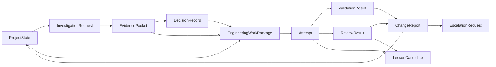
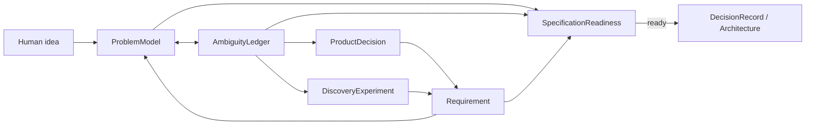
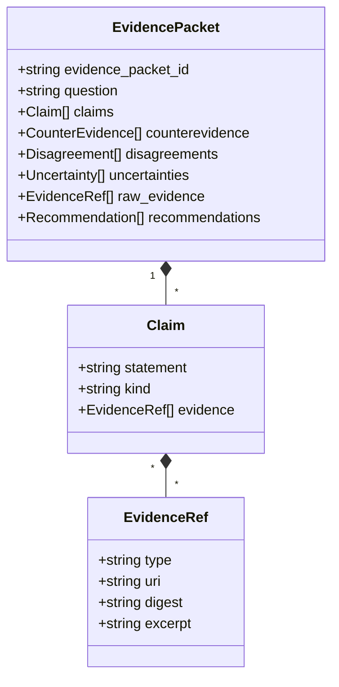
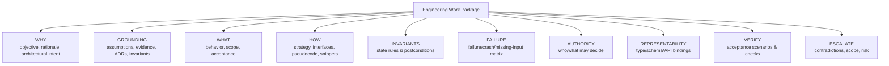
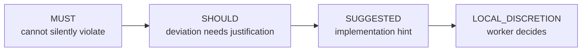
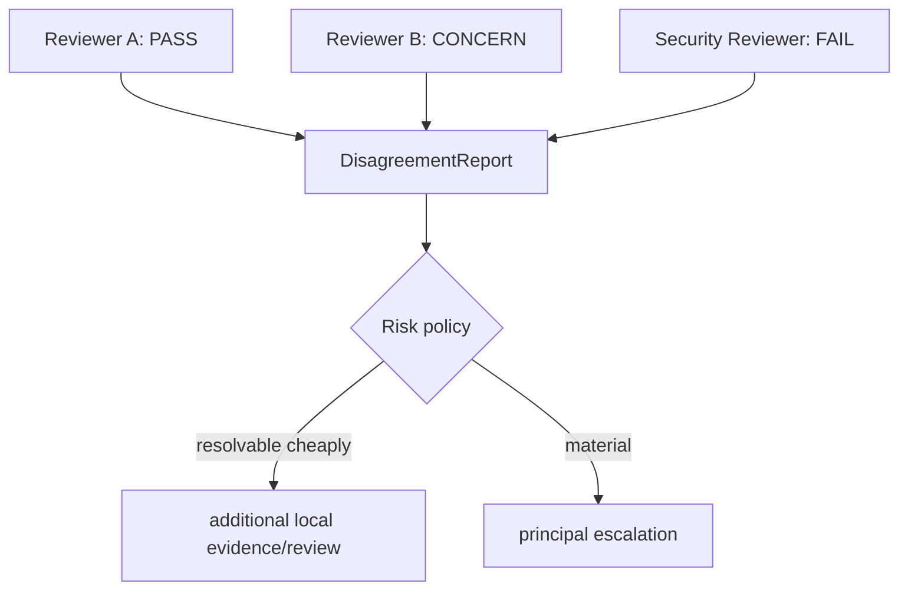
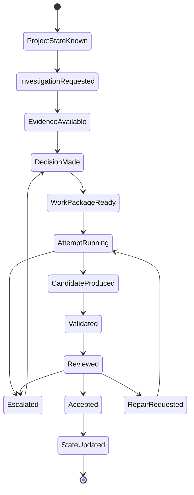

# DevCadence Protocols

## Scope

This document defines the semantic language spoken between principals, the control plane, local engineering agents, validators and consultants.

Core protocols must remain provider-independent.

Machine-readable definitions live in `schemas/`. This document explains semantics that schemas alone cannot express.

## 1. Protocol philosophy

A model should not have to infer organizational meaning from free-form chat.

DevCadence uses explicit artifacts:


```mermaid
flowchart LR
    PS["ProjectState"]
    IR["InvestigationRequest"]
    EP["EvidencePacket"]
    DR["DecisionRecord"]
    EWP["EngineeringWorkPackage"]
    AT["Attempt"]
    VR["ValidationResult"]
    RR["ReviewResult"]
    ER["EscalationRequest"]
    CR["ChangeReport"]
    LC["LessonCandidate"]

    PS --> IR --> EP
    EP --> DR
    DR --> EWP
    PS --> EWP
    EP --> EWP
    EWP --> AT
    AT --> VR
    AT --> RR
    VR --> CR
    RR --> CR
    CR --> ER
    CR --> PS
    AT --> LC
    RR --> LC
```

## 2. Common envelope

Durable protocol records SHOULD contain:
- `schema_version`;
- stable object ID;
- project ID;
- creation timestamp;
- actor/producer identity;
- parent/correlation IDs;
- provenance references;
- content hash when stored as immutable artifact.

IDs should be opaque stable strings, e.g. ULID/UUID, with human-readable task aliases layered on top.

## 3. ProjectState

Purpose: provide a compact semantic snapshot to the principal/control plane.

ProjectState is not a source-code dump.

See [PROJECT_STATE.md](PROJECT_STATE.md).

## 3A. Discovery protocol objects

Discovery adds a product-definition layer before implementation protocols:


```mermaid
flowchart LR
    Idea["Human idea"]
    PM["ProblemModel"]
    AL["AmbiguityLedger"]
    PD["ProductDecision"]
    Req["Requirement"]
    Exp["DiscoveryExperiment"]
    SR["SpecificationReadiness"]
    DR["DecisionRecord / Architecture"]

    Idea --> PM
    PM <--> AL
    AL --> PD
    AL --> Exp
    PD --> Req
    Exp --> Req
    Req --> PM
    PM --> SR
    AL --> SR
    Req --> SR
    SR -->|"ready"| DR
```

### ProblemModel
Canonical compact statement of product intent, actors, workflows, scope, success/failure criteria, constraints, assumptions, unknowns and risks.

### AmbiguityLedger
Active queue of unresolved meanings, their impact, resolution authority, status and provenance.

### ProductDecision
Human-authoritative product choice. Engineering models may explain consequences but cannot silently override it.

### Requirement
A functional/non-functional/constraint/non-goal statement with strength, provenance and epistemic status.

### DiscoveryExperiment
A bounded empirical investigation used to resolve feasibility/performance facts.

### SpecificationReadiness
Evidence-based gate indicating whether remaining ambiguity is safe for architecture.

See [DISCOVERY_AND_SPECIFICATION.md](DISCOVERY_AND_SPECIFICATION.md) and the corresponding schemas.

## 3B. MachineCapabilityProfile

Purpose: describe the machine and the cognition endpoints available on it, from
observed evidence.

It is the one durable contract that is **machine-scoped rather than
project-scoped**, and therefore carries no `project_id`: the hardware and the
installed runtimes are identical for every project on a host, and what differs per
project is policy rather than capability.

Shape, in outline:

```text
machine_fingerprint     digest over the stable facts of the machine
observed_at             injected observation instant
knowledge_revision      which compatibility knowledge produced the assessment
probe_depth             inventory | health | inference
environment             observed facts + per-component findings
accelerator_candidates  assessed backends, with reasons
endpoints               cognition endpoints, with health/auth/capability/evidence
assessment              readiness verdict
limitations             what this configuration cannot do
```

Three rules distinguish it from a status dump:

- **facts, assessment and evidence are separate.** `environment` contains no
  judgement; `accelerator_candidates` is a pure function of it and may never claim
  more than `runtime_available`.
- **a capability grade carries its provenance** (`configured`, `measured`,
  `evaluated`) and a grade without one is refused. `unknown` is the normal,
  correct value.
- **`acceleration.state: verified` requires evidence** — an authoritative offload
  signal from the runtime that performed the inference, a verification instant,
  no conflicts, and a profile whose `probe_depth` actually ran inference (DCI-106).

It is computed on demand rather than persisted; ProjectState carries a compact
projection of it. See
[adr/0013-environment-intelligence-and-cognition-contracts.md](adr/0013-environment-intelligence-and-cognition-contracts.md).

## 3C. Cognition resource/session and adaptive planning protocols (M3C/M3D)

These protocol families are introduced normatively by ADR-0018. M3C owns the deterministic protocol/session/economic substrate and validation/activation boundary; M3D owns AI-assisted PortfolioRecommendation and WorkflowPlan synthesis over those types.

### ResourceInventory
A deterministic snapshot/projection referencing MachineCapabilityProfile, cognition endpoints/capability provenance, session-driver features, host availability, credential references/auth status, configured economic/budget bindings and current resource observations where safely available. It contains no raw secrets.

### EconomicRegime / BudgetPool / BudgetState
`EconomicRegime` describes how use is constrained/charged: local compute, subscription quota, metered API, prepaid credits, enterprise allocation, unknown/custom.

`BudgetPool` is stable policy/configuration shared by one or more endpoints. It may define spending/reserve/overage policy even when exact remaining quota is not observable.

`BudgetState` is ephemeral evidence such as remaining quota/credits, reset time, rate/concurrency limits or local resource pressure. Unknown values remain unknown.

### PortfolioRecommendation
Typed advisory output from the Cognition Portfolio Planner. It references existing endpoints/budget pools and includes role choices/fallbacks, independence/diversity constraints, escalation/reserve behavior, workflow constraints, rationale/tradeoffs and evidence refs. It cannot grant authority.

### CognitionPortfolio
A versioned, deterministically validated configuration accepted from a recommendation or explicit operator configuration. It is the durable routing input, not a deployment-label string.

### WorkflowPlan
A bounded per-task topology compiled from task/risk requirements + CognitionPortfolio + current resource state. It names roles, endpoint/session requirements, retry/review/escalation bounds and deterministic gates. It may contain one cognition role or many.

### PortfolioChangeProposal
An explicit diff triggered by changed resources/policy/evidence. Applying it is auditable and reversible; learned evidence never silently mutates the active portfolio.

## 3D. Project capability, toolchain, and health protocols [Planned - M6]

### ProjectCapabilityPack

Versioned producer-neutral ecosystem extension containing Agent Skills-format knowledge, DevCadence mechanical manifest data, compatibility/applicability metadata, fixtures, and provenance.

Core identity/provenance fields include:

- logical pack ID;
- schema/revision/content digest;
- origin kind/locator;
- requested and resolved source revision where applicable;
- acquisition/producer provenance;
- conformance/Skill-trial provenance.

### PackRecommendation

Advisory Principal/LLM recommendation of candidate packs based on product needs, ProjectBlueprint choices, or observed repository evidence. Recommendation does not install or activate capability.

### PackUpgradeProposal

Explicit successor proposal for an activated pack. It references current/new exact revisions, mechanics/Skill diff, compatibility/conformance evidence, affected toolchain/health bindings, and revalidation/baseline-reconciliation requirements.

### PackConformanceReport

Deterministic evidence for schema/compatibility, command execution, declared result parsing, version probes, module/path scope, and seeded-failure checks where applicable.

### SkillValidationResult

Evidence from applying a generated/changed pack Skill to a bounded scratch-worktree task and evaluating the result through the real ProjectHealthContract.

### ToolchainProfile

Versioned resolved composition of module capabilities such as language/runtime, package manager, framework, build system/compiler, and check providers. A module may bind multiple pack/native components.

Observed manifests are evidence only; capability resolution/activation is explicit.

### ProjectHealthContract

Versioned project authority identifying required checks, lifecycle gates, candidate/base semantics, result/fingerprint semantics, inherited-debt baseline, bounded exceptions, and managed-adapter provenance.

Existing ValidationProfiles remain execution projections.

### HealthBaseline / FindingFingerprint

Revision-pinned accepted historical-debt state. Structured findings should use stable fingerprints where supported. Pack/tool/rule changes that alter finding semantics require explicit reconciliation rather than silent comparison.

### UnsupportedCapabilityReport

Structured unsupported/partial-state evidence identifying observed/selected technology, missing capability classes, available packs if any, and bounded fallbacks.

### ProjectBlueprint

Versioned greenfield architecture/repository intent: modules/archetypes, technologies/frameworks, boundaries/dependencies, expected capability needs, docs root, and initial health expectations. Actual materialization is a bounded EWP rather than a DevCadence-owned scaffold recipe.

See [PROJECT_CAPABILITY_PACKS.md](PROJECT_CAPABILITY_PACKS.md),
[PROJECT_TOOLCHAINS_AND_HEALTH.md](PROJECT_TOOLCHAINS_AND_HEALTH.md),
[PROJECT_CREATION_AND_SCAFFOLDING.md](PROJECT_CREATION_AND_SCAFFOLDING.md),
and ADR-0021..0023.

## 4. InvestigationRequest

An InvestigationRequest asks local repository cognition to establish facts.

Suggested structure:

```yaml
schema_version: "1.0"
investigation_id: INV-...
project_id: ...
base_commit: ...
question: >
  Can the current event storage abstraction support bounded
  time-range queries without changing its public interface?

requested_evidence:
  - relevant_interfaces
  - current_callers
  - existing_patterns
  - contradictions
scope_hints:
  - internal/storage
  - internal/events
max_semantic_response_tokens: 5000
```

The token limit is a response budget, not permission to omit material contradictions.

## 5. EvidencePacket

EvidencePacket is the principal boundary object for repository understanding.


```mermaid
classDiagram
    class EvidencePacket {
      +string evidence_packet_id
      +string question
      +Claim[] claims
      +CounterEvidence[] counterevidence
      +Disagreement[] disagreements
      +Uncertainty[] uncertainties
      +EvidenceRef[] raw_evidence
      +Recommendation[] recommendations
    }

    class Claim {
      +string statement
      +string kind
      +EvidenceRef[] evidence
    }

    class EvidenceRef {
      +string type
      +string uri
      +string digest
      +string excerpt
    }

    EvidencePacket "1" *-- "*" Claim
    Claim "*" *-- "*" EvidenceRef
```

Claim kind examples:
- deterministic_fact;
- repository_observation;
- external_fact;
- interpretation;
- assumption;
- recommendation.

An EvidencePacket must not disguise model synthesis as a deterministic fact.

## 6. DecisionRecord

DecisionRecord captures a durable choice.

Required semantics:
- question/context;
- alternatives;
- selected option;
- criteria;
- rationale;
- supporting evidence;
- dissent/unresolved uncertainty;
- consequences;
- rollback/supersession relationship;
- changed invariants/contracts.

Architecture-level decisions should also have a human-readable ADR.

## 7. Engineering Work Package

This is the core Principal-to-implementation contract. Its purpose is to **remove implementation-critical architectural choice before delegation**, especially when the worker may be a smaller/local model.

### 7.1 Shape


```mermaid
flowchart TB
    EWP["Engineering Work Package"]

    EWP --> Why["WHY<br/>objective, rationale, architectural intent"]
    EWP --> Ground["GROUNDING<br/>assumptions, evidence, ADRs, invariants"]
    EWP --> What["WHAT<br/>behavior, scope, acceptance"]
    EWP --> How["HOW<br/>strategy, interfaces, pseudocode, snippets"]
    EWP --> Invariants["INVARIANTS<br/>state rules & postconditions"]
    EWP --> Failure["FAILURE<br/>failure/crash/missing-input matrix"]
    EWP --> Authority["AUTHORITY<br/>who/what may decide"]
    EWP --> Repr["REPRESENTABILITY<br/>type/schema/API bindings"]
    EWP --> Verify["VERIFY<br/>acceptance scenarios & checks"]
    EWP --> Esc["ESCALATE<br/>contradictions, scope, risk"]
```

### 7.2 Mandatory fields for substantial delegated work

- `work_package_id`
- `task_id`
- `project_state_revision`
- `base_commit`
- objective
- rationale / architectural intent
- assumptions with verification status
- source evidence references
- relevant decisions/invariants
- semantic scope envelope and non-scope
- exact MUST/MUST-NOT requirements
- required interfaces / algorithm semantics
- local-discretion list
- acceptance scenarios
- validation requirements
- escalation conditions
- Implementation Readiness result

For systemic, stateful, security/authority-sensitive or otherwise high-risk work, the following are mandatory unless explicitly shown not applicable:

- invariant/state-rule table;
- failure matrix;
- authority matrix;
- missing/unknown/stale-input semantics;
- representability map;
- requirement → invariant → representation → acceptance traceability.

### 7.3 Implementation Readiness

A Work Package is not implementation authority merely because its design is approved. Before delegation, a Principal performs Contract Completeness Review and records `READY_FOR_IMPLEMENTATION` only when implementation-critical ambiguity is closed.

The test is:

> Could a competent worker with good language/repository skill but mediocre architecture judgment execute this contract without inventing important semantics?

The following are never left to implementer inference:

- public/cross-layer contract meaning;
- authority/security/privacy/spending decisions;
- persistence, commit, rollback and recovery semantics;
- missing/unknown behavior for required facts;
- protocol/schema interpretation when sources conflict;
- acceptance meaning.

If a requirement has no exact representation in current types/schema/API/state, the Principal resolves that design defect first.

### 7.4 Scope envelope

Scope is semantic. EWPs should declare authorized domains/path patterns and forbidden semantic changes rather than relying solely on brittle exhaustive filenames.

Within the declared domain, adding/splitting tests, private helpers, local implementation files or repository-native refactors is LOCAL_DISCRETION unless it changes semantics.

The worker must escalate before changing public contracts, protocol/schema meaning, persistence/crash behavior, security/trust/privacy/spending boundaries, invariant meaning, cross-layer dependency direction, external services/dependencies or unrelated subsystems.

### 7.5 Execution Contract and Context Manifest (manual now; typed evolution)

An EWP contains the complete bounded Execution Contract described in WORK_PACKAGES.md, plus progressively retrievable design/rationale. The contract and task Context Manifest identify the EWP revision/digest, base/state identity, scope envelope, exact applicable normative clauses, acceptance, validation and escalation. Required clauses must be resolved into exact operative content before action; index lines are navigational only. No execution-critical requirement may exist solely in rationale.

The contract additionally closes applicable invariants, failure behavior, authority, missing-input semantics, representability and acceptance scenarios per [ADR-0024](adr/0024-implementation-ready-work-packages-and-contract-completeness.md).

This is a document-authoring contract now, **not** a new field on the current strict EngineeringWorkPackage wire record. Future versioned protocol work should add typed equivalents such as `ContractInvariant`, `FailureCase`, `AuthorityRule`, `InputSemantic`, `RepresentabilityBinding`, `AcceptanceScenario`, `ScopeEnvelope` and `ImplementationReadiness`, with schema/type compatibility tests. Existing accepted records retain their meaning (DCI-090–093).

### 7.6 RefactoringProposal (Bottom-Up Challenge Protocol) [Proposed - M3C]

*Status:* Proposed for Milestone M3C. Protocol Go types and JSON Schemas will be formalized under `internal/protocol/` and `schemas/` during M3C implementation.

An accepted Work Package is a stable baseline, not an immutable dogma (ADR-0019 §3). When an implementer or reviewer discovers that an upstream interface, dependency, representation or contract is flawed, contradictory, or missing essential semantics, it must not write a plausible workaround or silently reinterpret the requirement.

Instead, the worker emits a typed `RefactoringProposal` / escalation with contradiction evidence, proposed change, affected callers/contracts and reversibility assessment. The Principal adjudicates the proposal. If accepted, the EWP/contract is amended before implementation continues.


## 8. Guidance strength


```mermaid
flowchart LR
    Must["MUST<br/>cannot silently violate"]
    Should["SHOULD<br/>deviation needs justification"]
    Suggested["SUGGESTED<br/>implementation hint"]
    Local["LOCAL_DISCRETION<br/>worker decides"]

    Must --> Should --> Suggested --> Local
```

Strength is about authority, not confidence.

A SHOULD may be highly confident but intentionally overridable because local repository reality is better observed by the worker.

## 9. Attempt

Every implementation execution is a separate Attempt.

Attempt fields include:
- attempt ID;
- Work Package version;
- worker role/profile;
- model/runtime version;
- worktree;
- base SHA;
- start/end;
- terminal status;
- candidate commit if produced;
- blocking contradictions;
- artifacts;
- repair-cycle count.

Retry does not overwrite the prior attempt.

## 10. ValidationResult

ValidationResult is produced by deterministic machinery where possible.

**Subject.** A ValidationResult states what it validated through an explicit
`subject` object rather than through optional top-level identifiers:

| `subject.kind` | required | forbidden |
| --- | --- | --- |
| `attempt` | `task_id`, `attempt_id` | — |
| `integration` | `task_id` | `attempt_id` |
| `baseline` | — | `task_id`, `attempt_id` |

`commit` is required for every scope: a run always validates some tree, and
evidence that does not name what it is about cannot be read as covering
anything in particular.

The three scopes match `ValidationCompleted.scope` exactly, and the two share
one enumeration (`protocol.ValidationScope`). A subject object rather than
optional fields is what lets "required here, forbidden there" be stated at
all: with bare optional fields, an integration result carrying an attempt id
and an attempt result missing one are both merely absent-field cases, and
neither the type nor the schema could reject them. The subject carries no
integration identifier because `ValidationCompleted` has none either, and a
field the event cannot corroborate could not be cross-checked.

Each check includes:
- check name/type;
- exact command/tool;
- tool version;
- working directory (scoped to module where applicable);
- module id if module-scoped (ADR-0015);
- exit code/status;
- start/end;
- stdout/stderr artifact refs;
- parsed summary;
- truncation indicator;
- policy importance.

When supervised validation services are used (ADR-0016), `ValidationResult` additionally records `config_digest` and the verified `service_identities` that ran alongside the checks.

A model may summarize the result, but the raw check is retained.

## 10A. Supervised Services and Asynchronous Operations

Under ADR-0016:
- **`OperationID`:** Identifies a controlled external process execution, separate from an architectural `TaskID`.
- **Response Yield Threshold:** Commands taking longer than 10 seconds yield `status: "running"` with an `OperationID`. The operation proceeds uninterrupted; upon completion, hosts receive event-driven wakeups without token-wasting busy-loops.
- **Universal Pagination (`fetch_content`):** Process outputs are decoupled via injected output sinks. Models page through immutable content-addressed artifacts with strict byte limits and contiguous offsets using `fetch_content(content_ref, offset, limit, unit)`. Full daemon-level live streaming into artifact storage with 4 KiB inline previews is scheduled with the background runner milestone.

## 10B. Adaptive Context Architecture and Evidence Working Set [Implemented - WP-M3C-1 / WP-M3C-2B]

**Status:** merged WP-M3C-1 implements the core ContextProfile/Manifest/Pack/EvidenceLease Go/schema shapes; WP-M3C-2B implements the runtime Cognitive Invocation Compiler, deterministic invariant admission from embedded INVARIANTS.md, authority-projection catalog authentication, prompt renderers (tagged markdown and JSON), and lease/capsule lifecycle managers; WP-M3C-4 verifies substrate integration and characterizes known gaps KG-1..KG-5. Existing `internal/compaction` and bounded tools under ADR-0016 remain useful mechanisms. ADR-0019 owns context-layer rationale; ADR-0020 owns deterministic applicability, retrieval authority boundaries, prompt projection and review-ledger integration; this section owns protocol semantics.

### ContextProfile

Endpoint/access-path and workload-specific capability/budget evidence:
- endpoint identity, runtime/model/quantization/context configuration and profile revision;
- declared and runtime windows; empirically effective working envelopes **by workload**, calibration task/evidence/date and confidence/unknown status;
- target/hard resident ceilings, protected-core and contract limits, maximum single lease, output/reasoning and tool-tail reserves, tokenizer/accounting method and estimate uncertainty;
- `ContextControl = ExactStateless | AppendOnly | OpaqueSession` and `PrefixCache = Explicit | Implicit | SessionKV | None` as adapter-observed capabilities, not inferred from local/remote labels;
- long-context configuration and cache capabilities where observable; unknown values remain unknown.

Targets are defaults; hard endpoint/policy ceilings are enforced. Model/runtime/configuration changes invalidate calibration applicability. Admission counts all model-visible system/host/tool-schema, contract, normative, state, evidence and tail tokens plus reserves; estimated counts include conservative margin. Opaque CLI session usage reporting is deferred to a protocol follow-up (KG-2, PRE-3).

Before M4 empirical calibration, an endpoint may use a **provisional** profile: hard fit comes from runtime/declared capacity plus configured policy ceilings, explicit output/reasoning/tool reserves, and conservative accounting uncertainty. Any provisional target ceiling is versioned configuration, not a claim of measured effectiveness; DevCadence does not hard-code a universal percentage of the nominal window. A policy that requires verified effectiveness may declare the provisional endpoint ineligible.

### Rule applicability and retrieval plan

The compiler derives mandatory admission from deterministic metadata rather than ranking:

- task/role/action identity;
- EWP revision/digest;
- touched/read/write paths and package/domain mapping;
- declared and discovered risk tags;
- explicit requirement/invariant/ADR dependency edges;
- project/runtime state that activates conditional policy.

The resulting mandatory clause set is dependency-closed and revision-pinned. Unknown applicability is an error state, not a low score.

#### Layered Authority Hierarchy and Composition

Authority in DevCadence is strictly layered:
1. **System Invariants (`system`)**: Universal engine invariants governing control-plane safety, evidence integrity, model boundaries, and isolated execution (94 DevCadence DCI invariants from `INVARIANTS.md`: DCI-001 through DCI-135, with intentional gaps) built by `NewCanonicalRuleRegistry()`.
2. **Organization Policy (`organization`)**: Enterprise or team governance rules [future].
3. **Project Invariants (`project`)**: Codebase-specific durable rules located in `.devcadence/INVARIANTS.md` of the target project, discovered and governed during M6 Project Adoption.
4. **Task Constraints (`task`)**: Execution Work Package obligations and boundary contracts.

Lower authority layers may add restrictions but MUST NOT weaken or contradict higher-authority constraints; detected contradictions fail closed. `NewCanonicalRuleRegistry()` builds the DevCadence system catalog, not the entire universe of authority for all projects. When additional authority layers are implemented, they will compose deterministically into a unified frozen registry snapshot.

In the current M3C implementation, the compiler operates on the DevCadence system catalog with an explicit `SourceKind` authority seam on every `Rule` (`SourceKind`, `SourceDoc`, `Revision`, `ContentDigest`), authenticated cryptographically by `CatalogDigest`. The full `AuthoritySource` model (`source_kind`, `source_id`, `revision`, `digest`) and multi-source composition are planned for M6 Project Adoption and future distributed milestones.

#### Effect Authority vs. IAM

The capability system is **Effect Authority** (what real-world effects can this model invocation cause: `write`, `exec`, `credentials`, `network`, `spending`, `durable_state_mutation`), NOT enterprise IAM or human authentication. The deterministic control plane evaluates which execution capabilities are attached and admits corresponding mandatory rules (`capability_default`); models never declare, infer, or negotiate their own authority.

#### Project Invariants vs. Documentation

A clear distinction is maintained across knowledge artifacts:
- **Ordinary Documentation / Specification**: Durable reference knowledge.
- **Project Invariant**: A property that must continue to hold across future work packages.
- **Current EWP Constraint**: Narrow, temporary execution authority for the immediate task.

The project invariant lifecycle is deferred to M6 (Project Adoption), where adoption discovery proposes a small, curated set of durable project invariants, governs them through review, commits them versioned with the target codebase under `.devcadence/INVARIANTS.md`, and feeds them into the same deterministic compiler pipeline alongside system invariants.

#### Admission Classes

Every execution-critical clause declares one admission class:
- `always`: admitted to every cognition invocation;
- `capability_default`: admitted whenever the invocation can exercise the named authority class; exclusion requires an explicit revision-pinned not-applicable mapping;
- `mapped`: admitted through normal task/role/action/path/domain/risk rules and dependency closure.

A reverse-coverage check rejects a mandatory clause with no deterministic admission path. This detects **orphaned authority only**: it does not prove that a `mapped` clause is attached to every domain/action where it belongs. Mapping correctness is a separate concern, checked by Contract Completeness Review plus M4's independently established/seeded applicability ground truth. Runtime admission therefore fails closed on unknown/orphaned applicability, while known-but-wrong mappings are treated as a specification defect to be falsified by those independent checks.

Optional retrieval may use exact/lexical search and graph traversal. Dense embeddings/reranking are optional M4 experiments rather than an M3C baseline requirement. Retrieval results carry provenance, revision/freshness and admission reason. Dense similarity MAY expand recall but MUST NOT delete or override a mandatory clause.

The compiler may internally maintain richer indexes than the model sees. Index metadata is navigation/provenance, never a substitute for exact operative clause text.

### PromptProjection

Canonical ContextPack semantics are renderer-neutral. A PromptProjection is an ephemeral endpoint-specific serialization of one validated pack. Renderers may choose compact tagged Markdown/XML-like sections, JSON, YAML or another format supported by the endpoint.

Projection MUST preserve:

- task/current action;
- exact operative obligations;
- relevant state identity;
- admitted evidence and provenance handles;
- output contract;
- boundary between instructions and evidence.

Projection format does not grant authority and is calibrated empirically per endpoint/configuration. A renderer MUST preserve instruction/data boundaries under adversarial evidence content: snippets containing apparent closing tags, Markdown fences, JSON-like control fields, or other delimiter text cannot escape their evidence container or become instructions. Strict structured output SHOULD use schema-constrained decoding where supported.

### ContextManifest

Compiled task intent and provenance: role, task/EWP revision/digest, base/candidate/state identity; allowed read envelope and distinct allowed write paths; domains/risk tags; mandatory normative clause IDs with revision/digest; initial/deferred evidence refs; mapping/source versions; explicit questions, assumptions and expansion/re-resolution triggers; selected ContextProfile and budget.

The Principal declares intent; the Cognitive Invocation Compiler's deterministic resolver phase adds applicable role/action/path/domain/risk rules and admission-floor clauses. No semantic-search ranking decides whether MUST clauses apply. Unknown applicability blocks the affected action pending resolution. The manifest records why every substantial admitted object is required and how it was selected.

### ContextPack

Ephemeral compiled invocation input, reproducible from a manifest revision: small role core, complete Execution Contract, exact mandatory normative clauses, compact derived Cognitive State, initial/active evidence, evidence handles, candidate/diff manifest, validation summaries and final current question/action. Record admitted object digests, token counts/method, reserves and coverage. The pack is a projection, not new canonical project state or a second owner of normative rules.

Resolve/validate required references and count the **complete** pack before invocation. Reject missing/stale clauses, unmapped required domains, unauthorized content or insufficient reserve. `CONTEXT_UNFIT` means the mandatory contract/pack cannot fit: split work, select an authorized capable endpoint or escalate. Never send a partial contract or silently truncate. Hard ceilings, privacy and spending remain unbypassable.

### EvidenceLease

Lease ID; evidence kind; source revision/worktree identity, path or artifact handle, exact clause/symbol/range locator, content digest; acquisition question/reason; token count/method; freshness/expiry and release state. Code and normative payloads are verbatim. Path, range and digest can be metadata without prefixing every source line with a number. Headers, qualifiers and dependencies needed to interpret a clause are part of its semantic unit.

Evidence is evictable; protected requirements are not. If required evidence changes, invalidate it and derived state claims depending on it. When contract/normative identity changes, rebuild the pack and revalidate affected assumptions. Release removes active residency only where the adapter can enforce it; it never deletes durable evidence. Read authorization is not limited to allowed write paths and never permits secrets outside policy.

### Expansion and state transition

A small request records the explicit question, required IDs/symbols/ranges and reason. The Cognitive Invocation Compiler authorizes retrieval, resolves exact references, measures the enlarged pack and atomically either admits it (with optional evidence eviction), rejects with a typed cause or suspends for decomposition/routing/approval under existing policy. Fetching larger sections/full files is legitimate when justified and fit; permission to investigate is not permission to expand authority.

New domains, risk tags or proposed write paths require context re-resolution before modification; write-scope changes also require EWP authorization. Required normative clauses cannot be evicted to accommodate expansion. Request/release evidence through the existing proposed working-memory operation shape; this is not a second durable request table:

```json
{
  "request_facts": [
    { "path": "internal/setup/doctor.go", "start_line": 815, "end_line": 835 }
  ],
  "release_facts": ["snippet_1"]
}
```

M3C extends that proposed operation with question/reason, stable normative identifiers, lease identity and explicit admission outcomes. Current schemas do not accept these extensions yet.

The Cognitive State Capsule carries derived hypotheses, TODOs, decisions, open questions and evidence dependencies; it does not certify truth. Restart reconstructs state from pinned contract and current evidence, not inherited chat. Outer cumulative resource exhaustion preserves a checkpoint and suspends under `PAUSED_BUDGET_EXCEEDED`; it is distinct from per-invocation `CONTEXT_UNFIT`.

### Driver honesty and telemetry

Exact stateless drivers can rebuild/evict; append-only drivers must rebuild/restart when needed rather than claiming deletion from past turns/KV state. Opaque drivers constrain initial instructions/tool outputs and use scoped sessions/checkpoints, reporting actual visibility and uncertainty. If a mandatory hard bound cannot be demonstrated, that endpoint is ineligible for policies requiring the bound. Cache reuse is opportunistic; never pad the prompt or keep obsolete requirements just for a cache hit.

Attach usage to attempt/session telemetry, not a new canonical context journal: runtime window/profile, initial/peak resident tokens, role core/contract/normative/state/leased-evidence components, reserves, cumulative input/cached-input/output, reloaded tokens, expansions/evictions/restarts, coverage gaps and measurement provenance. Unknown provider counts stay unknown. Derived metrics include Initial/Peak Context Ratio (resident/runtime window), Evidence Yield (resolved material questions or findings per evidence tokens), Repeated Context Tax (reloaded/input tokens), tokens per accepted change and tokens per blocking defect found. Record denominator definitions; undefined/zero denominators remain unavailable, not zero. Ratios require compatible accounting; report input billed and input processed separately where available.

## 11. ReviewResult

ReviewResult is model-assisted evidence **about an implementation candidate**,
judged against the Engineering Work Package that governed the attempt. It
therefore requires both `attempt_id` and `work_package_id`, and that linkage is
mechanically proven rather than assumed:

```
ReviewCompleted.work_package_id == ReviewResult.work_package_id == Attempt.work_package_id
```

The first equality is checked in the control-plane transaction (the event and
the record it summarises must agree); the second in the reducer (the record
must be about the blueprint the attempt actually executed). No work-package
*version* is carried on the event: the attempt already pins the exact version,
and `ReviewResult` records only the id, so a version on the event could be
checked against nothing.

Specification reviews are a different record entirely; see §11a.

Fields:
- review dimension;
- reviewer profile/model/runtime;
- verdict;
- findings with severity;
- Work Package compliance;
- evidence references;
- uncertainties;
- requested repairs;
- whether principal escalation is recommended.

Possible dimensions:
- `correctness`: algorithmic accuracy, nil safety, boundary conditions;
- `architecture`: layer boundaries, dependency inversion, public contract adherence;
- `invariants`: durable system invariants (DCI compliance);
- `security`: auth bypass, injection, secret exposure, command safety;
- `test_adequacy`: assertion validity, edge-case coverage, negative-path and mutation testing;
- `concurrency`: synchronization, race safety, cancellation lifetimes;
- `performance`: algorithmic complexity, allocation profiles, concurrency overhead;
- `maintainability`: code clarity, idiomatic style, comment accuracy;
- `other`: explicitly scoped reviews outside the primary taxonomy.

### 11.1 Dynamic Review Lenses and Active Falsification [Planned - M7]

*Status:* Dynamic lenses and automated falsification execution are **Planned for Milestone M7**.

DevCadence separates **immediate process guidance** from **future machine protocol**:
- **Effective-Now Process Guidance**: Human and model reviewers may adopt these review lenses today to guide qualitative focus across the standard dimensions, without changing wire schemas:
  - `anti_rabbit_hole`: scrutinizes code for YAGNI, defensive bloat, and speculative over-engineering;
  - `anti_drift`: verifies strict scope discipline, checking that touched files match the declared work package and catching drive-by edits;
  - `anti_hallucination`: grounds claims by verifying cited symbols, CLI flags, and test executions exist.
  Manual reviewers can also perform manual falsification checks (e.g. verifying a test fails when an assertion is commented out).
- **Future M7 Machine Protocol**: Milestone M7 will formalize review lens metadata on automated review invocations and introduce automated **Active Falsification Probes** (`FalsificationProbe` / mutation testing) executed by deterministic validation runners in isolated worktrees, converting reviewer suspicion into empirical proof.

## 11a. SpecificationReviewResult

SpecificationReviewResult is independent evidence **about a specification**,
produced during discovery — before an Engineering Work Package or an Attempt
exists. It is deliberately not a ReviewResult: the two judge different
artifacts at different times, and an implementation review record cannot
represent a specification review without empty attempt and work-package
fields that would make the two interchangeable again.

It pins `problem_model_id` and `problem_model_revision`, because a verdict
about revision 7 says nothing about revision 8.

Its dimensions are the discovery vectors from `prompts/specification-reviewer.md`
— `completeness`, `ambiguity`, `contradiction`, `architecture_contamination`,
`security_privacy`, `failure_modes`, `operations`, `ux_mental_model` — not the
implementation vectors of §11.

Each finding carries a resolution authority and a recommended question, so a
gap is routed to whoever can settle it (DCI-008), plus `blocks_readiness`. A
`pass` verdict over a finding that blocks readiness is refused: the Design
Readiness Gate must be passed by evidence, not by a summary.

## 11b. Dual Independent Review and Aggregator Synthesis [Planned - M7]

For systemic or high-risk candidates, DevCadence invokes dual independent reviews in parallel (ADR-0019 §5).

Aggregation is an orchestration phase within `ReviewCampaign`, not a separate durable protocol table or SQLite schema:
- **Parallel Independent Review**: Two independent reviewer models evaluate the candidate commit in parallel, each starting from a clean context. Independence spans both **endpoint/model diversity** (e.g. distinct provider families) and **review-method diversity** (e.g. invariant/contract tracing vs. failure-first/mutation testing).
- **Double-Green Adjudication Fast-Path**: If both independent reviewers return `PASS` with zero blocking findings AND all deterministic validation checks pass, the Principal receives an instant green card allowing immediate, frictionless closure. Double-Green is an **adjudication fast-path**, not an unmoderated bypass of human/principal authority (DCI-009) or deterministic closure prerequisites (`closure-decision.schema.json`).
- **Asymmetric Veto**: If any reviewer raises a `BLOCKING` finding in `security` or `invariants`, an Aggregator model **cannot** discard or override it. Deterministic falsification evidence may prove a finding *false or inapplicable* (e.g. demonstrating that a cited vulnerability path is unreachable or a claimed invariant conflict is refuted by code), but cannot waive or override a genuine invariant requirement. A real invariant conflict requires an explicit human/principal decision record, never an automatic reviewer dismissal.
- **Consolidated Repair Synthesis**: If findings exist or reviewers disagree, the Aggregator synthesizes the findings into standard `FindingDisposition` records and compiles at most one consolidated `RepairWorkPackage`. Implementers never negotiate directly with multiple reviewers.

## 12. DisagreementReport

When independent reviews disagree materially, preserve the disagreement as a first-class object rather than collapsing it into one verdict.


```mermaid
flowchart TD
    R1["Reviewer A: PASS"]
    R2["Reviewer B: CONCERN"]
    R3["Security Reviewer: FAIL"]
    D["DisagreementReport"]
    Policy{"Risk policy"}
    Local["additional local evidence/review"]
    Principal["principal escalation"]

    R1 --> D
    R2 --> D
    R3 --> D
    D --> Policy
    Policy -->|"resolvable cheaply"| Local
    Policy -->|"material"| Principal
```

## 13. EscalationRequest

An escalation should be concise and decision-oriented.

Required:
- trigger;
- blocking question;
- violated/uncertain assumption;
- evidence;
- impact;
- options if known;
- what the local layer tried;
- requested decision authority.

Do not send the principal a 100K-token failed transcript by default.

## 14. ChangeReport

ChangeReport summarizes a candidate or accepted implementation:
- Work Package compliance;
- files/packages changed;
- semantic behavior changed;
- public API diff;
- schema/migration impact;
- deterministic validation;
- reviewer results;
- deviations;
- unresolved risks;
- commit IDs;
- evidence handles.

## 15. ConsultationRequest / ConsultationResult

ConsultationRequest contains:
- role requested;
- neutral problem statement;
- facts/evidence;
- explicit questions;
- whether candidate design should be hidden or shown;
- budget/turn constraints;
- confidentiality/allowed data scope.

ConsultationResult contains:
- provider/model identity;
- analysis summary;
- proposed alternatives;
- concerns;
- assumptions;
- evidence/source refs where supported;
- recommendation;
- uncertainty.

## 16. LessonCandidate

See [LEARNING.md](LEARNING.md).

A LessonCandidate includes:
- scope: project / language / framework / cross-project;
- type: invariant / skill / routing / prompt / test / review / policy;
- observed pattern;
- trajectory evidence;
- proposed rule/change;
- possible counterexamples;
- evaluation plan;
- promotion authority.

## 17. Protocol state transitions


```mermaid
stateDiagram-v2
    [*] --> ProjectStateKnown
    ProjectStateKnown --> InvestigationRequested
    InvestigationRequested --> EvidenceAvailable
    EvidenceAvailable --> DecisionMade
    DecisionMade --> WorkPackageReady
    WorkPackageReady --> AttemptRunning
    AttemptRunning --> CandidateProduced
    AttemptRunning --> Escalated
    CandidateProduced --> Validated
    Validated --> Reviewed
    Reviewed --> Accepted
    Reviewed --> RepairRequested
    RepairRequested --> AttemptRunning
    Reviewed --> Escalated
    Escalated --> DecisionMade
    Accepted --> StateUpdated
    StateUpdated --> [*]
```

## 18. Compatibility rules

Initial policy:
- major schema version change may be breaking;
- minor compatible additions should not change interpretation of existing required fields;
- durable records retain their original schema version;
- readers either support a version or fail explicitly;
- migration produces new records/artifacts rather than silently rewriting historical evidence where possible.

Unknown fields must not be silently discarded when round-tripping durable records.

The implemented policy, settled by
[adr/0003-durable-record-compatibility.md](adr/0003-durable-record-compatibility.md),
is **strict readers**: because every schema declares
`additionalProperties: false`, an unrecognised field is refused rather than
preserved or dropped, so loss cannot occur. Records are stored as the
canonical bytes that were written, with a digest, so a record this build
cannot interpret stays inspectable and verifiable. For an *optional* field, an
absent key, an explicit `null` and the type's zero value are the same
statement, and writers emit the shortest form. See
[../schemas/README.md](../schemas/README.md) for the full policy.

## 19. Protocol anti-patterns

Avoid:
- free-form “agent says done” as completion state;
- one generic `ask_model(prompt)` MCP tool as the public engineering API;
- storing raw chain-of-thought as required project state;
- parsing critical semantics from prose when a typed field is appropriate;
- using numeric confidence as the sole routing criterion;
- mutating Work Packages in place after attempts have started;
- losing links from summaries back to raw evidence.


## ReviewCampaign and convergence protocols

ADR-0020 and [REVIEW_AND_CONVERGENCE.md](REVIEW_AND_CONVERGENCE.md) define the authority model. Conversation transcripts are evidence, not canonical campaign state.

### ReviewCampaign

A bounded campaign anchored to immutable candidate identity and contract revision. It references required review dimensions/lenses, normalized finding IDs, repair/verification state, deterministic evidence, residual risk and closure outcome.

### ReviewFinding

A normalized stable material claim produced from one or more existing `ReviewResult.findings` observations. It supplies the stable identity referenced by `ReviewCampaign.finding_refs` and `FindingDisposition.finding_id`. It records at least:

- finding ID and candidate/contract identity;
- canonical severity compatible with FindingDisposition (`info | low | medium | high | critical`);
- canonical materiality compatible with FindingDisposition (`blocking | material_non_blocking | opportunistic`);
- optional epistemic confidence (`high | medium | low`);
- claim and evidence;
- requirement/invariant references when applicable;
- impact / why-now;
- independent verification method;
- source reviewer/lens;
- durable producer provenance sufficient to distinguish logical producer and invocation across clean sessions (producer identity/reference, role, invocation reference, and endpoint/channel/session/model provenance when cognition-produced);
- status.

Multiple reviewer observations may support one normalized ReviewFinding. Severity means harm if true; materiality means current-campaign significance; confidence means evidence strength. FindingDisposition copies the normalized finding's severity/materiality; reclassification occurs during normalization/adjudication with explicit rationale, not implicitly during repair.

### FindingDisposition (existing compatibility record)

The existing FindingDisposition remains the Principal/Human adjudication record for a normalized finding: `fix_now | reject | defer | human_decision | duplicate`. ADR-0020 does not replace it. A `fix_now` disposition admits the finding into the consolidated repair packet; other dispositions retain their current schema semantics.

### FindingResolution

The implementer/author response to one accepted finding:

- `fix_attempted`: identify candidate commit/files/evidence; or
- `challenge`: provide reason/evidence that the finding is false, inapplicable or belongs at another boundary.

The durable record MUST identify its logical producer and invocation provenance (producer reference/role plus invocation reference, with endpoint/channel/session/model provenance where cognition-produced). A FindingResolution is never self-verification.

### ResolutionVerification

An independent decision over one finding + attempted resolution/challenge + focused evidence. The durable record MUST identify verifier/invocation provenance sufficient for the control plane to compare it with the ReviewFinding/FindingResolution producer provenance and mechanically reject self-verification across clean sessions. The cognitive verifier is blinded by default to reviewer/challenger identity and model/provider; the control plane separately checks required independence and exposes identity only when it is materially relevant evidence.

Conceptual outcomes are:
- `verified_fixed` — the accepted repair is independently established;
- `verified_dismissed` — the challenge is independently established and the finding no longer requires repair;
- `re_adjudication_required` — verification produced evidence that the current disposition should change (including a possible deferral), but the verifier does **not** exercise Principal/Human risk-acceptance authority.

A proposed deferral remains open until a Principal/Human writes a new/superseding `FindingDisposition{disposition=defer}` satisfying the existing deferred-target, reconsideration-trigger and accepted-risk requirements. Only that authorized disposition can make deferral eligible for closure.

The exact v1 enum/schema may be smaller if needed, but it MUST preserve the authority split: author attempts; independent verification establishes facts; Principal/Human adjudication alone accepts risk/deferral; deterministic closure consumes those durable records.

### ClosureDecision

The evidence-backed termination decision. Closure checks deterministic validation, required reviews, unresolved blockers, unverified material dispositions, repair regressions, contract changes and bounded residual risk.

A FROZEN outcome terminates the active campaign. Equivalent later opinion does not reopen it; reopening requires materially new evidence, changed contract, deterministic failure or repair regression.

~~~mermaid
flowchart LR
    C["Immutable candidate"]
    R["Parallel review"]
    N["Normalize findings"]
    L["Review Ledger"]
    W["Repair packet"]
    X["Fix attempt / challenge"]
    V["Independent verification"]
    CD["ClosureDecision"]
    Z["Frozen"]

    C --> R --> N --> L
    L -->|"accepted repairs"| W --> X --> V --> L
    L --> CD
    CD -->|"frozen"| Z
    CD -->|"threshold finding"| W
~~~

The model-facing projection for each role contains only the state needed for that action. The runtime owns lifecycle legality, required-response completeness and self-verification prevention.

Existing durable compatibility schemas are already implemented: `schemas/review-result.schema.json`, `schemas/review-campaign.schema.json`, `schemas/finding-disposition.schema.json`, and `schemas/closure-decision.schema.json`. The new `ReviewFinding`, `FindingResolution`, and `ResolutionVerification` records are planned for WP-M3C-5 and do not yet have committed Go/schema twins. Do not infer those new records are implemented from this semantic contract.

## 20. Credential references and authentication evidence

DevCadence isolates authorization handles from secret material and keeps credentials orthogonal to cognition routing, access channels, accounts, and economic regimes (ADR-0014 §6, ADR-0018 §1, DCI-081):

```text
CredentialRef
!= CognitionEndpoint
!= AccessChannel
!= Session
!= Account
!= EconomicRegime
!= CognitionPortfolio
```

### CredentialRef
An opaque reference to an authorization mechanism. It is provider-neutral, holds no secret custody, and is a durable record (`schema_version`, `Validate()`, registered in `protocol.NewRecord`):
- `schema_version`: durable contract version;
- `ref_id`: stable identifier for the reference, bounded and rejected if secret-shaped (the same opaque-ID check `AuthEvidence.ref_id`/`adapter_id` share);
- `kind`: `env_var | cli_session | keychain_ref`;
- `locator`: non-secret locator (e.g. uppercase environment variable identifier, CLI session handle, or keychain service locator). Raw secret values are rejected at boundary validation.

### AuthEvidence
A structured, bounded durable record of authentication readiness resulting from an evaluation:
- `schema_version`: durable contract version;
- `ref_id`: reference identifier matching the CredentialRef, same opaque-ID contract;
- `kind`: credential reference kind — structurally bound to `probe_kind` (`env_var`→`env_presence`, `keychain_ref`→`keychain_presence`, `cli_session`→`cli_auth_call`|`cli_version_only`; any other pairing is rejected);
- `status`: `authenticated | unauthenticated | unavailable | indeterminate`;
- `probe_kind`: `env_presence | cli_auth_call | cli_version_only | keychain_presence`;
- `observed_at`: timestamp of the probe;
- `probe_target`: optional locator or CLI tool name;
- `adapter_id`: optional adapter identifier, same opaque-ID contract;
- `detail`: bounded, non-secret diagnostic description.

Crucial invariant: only `cli_auth_call` (an authoritative probe that actually exercises the credential against its provider) may produce `authenticated`. `cli_version_only` (e.g. `claude --version`), `env_presence`, and `keychain_presence` probes prove installation or mere presence only, NEVER authentication — a record claiming `authenticated` from any of the three is structurally refused by `AuthEvidence.Validate()`. Presence therefore reports `indeterminate` (not `authenticated`); absence reports `unauthenticated`; a check that could not be completed at all (e.g. no keychain backend on this platform) reports `unavailable`, never `unauthenticated` — an incomplete check is not evidence of absence.

The `cli_auth_call` guarantee is enforced structurally, not merely by adapter configuration. `BoundedCLIAuthAdapter`'s probe argv can only be set through `Probe AuthProbeDefinition` — a closed type whose one field is unexported, so it can only be produced by `credentials.NewAuthProbeDefinition`/`MustAuthProbeDefinition`, which themselves refuse an empty or version/help-shaped argv (`--version`, `-v`, `--help`, …). A `BoundedCLIAuthAdapter` built without going through that constructor (e.g. a bare struct literal) is left with the zero `AuthProbeDefinition` and reports `unavailable` without ever running a command. This closes both halves of "an arbitrary command must not acquire `cli_auth_call`/`authenticated` authority": the shape a declared probe may take, and the fact that a probe must be declared at all before it can run.

CLI adapters (`VersionOnlyAdapter`, `BoundedCLIAuthAdapter`) separate two identities that must never collapse into one field: `Handle` is the opaque logical CLI identifier matched against `CredentialRef.locator` (the `cli_session` locator contract forbids `/`), while `ExecutablePath` is what is actually started — a bare name resolved via the adapter's `Env` (`PATH`), or a discovered/verified absolute path. `Env` defaults to `process.BaseEnv()` when unset; `process.Runner` resolves a bare executable only from `Spec.Env`'s `PATH` and fails closed (`unavailable`) otherwise, by design (docs/SECURITY.md §5).

`protocol.LooksLikeSecret` is prefix/keyword-based only and carries no length threshold of its own: `ref_id`/`locator`/`adapter_id` are bounded to 128 bytes, `probe_target` to 256, and `detail` to 512, each by its own field-specific check (mirrored exactly in the JSON Schema twins' `maxLength`), so a field's own declared contract — not a shared heuristic — decides what counts as "too long." Callers elsewhere in the codebase that want a shorter opaque-handle-length bound (e.g. `internal/cognition`'s and `internal/cognition/remoteapi`'s `CredentialRef`/`AccountRef` declaration fields) apply that bound locally alongside `protocol.LooksLikeSecret`, rather than the shared helper enforcing it for every caller. `ref_id`/`locator`/`adapter_id` are ASCII-regex-constrained, so byte length and Unicode character count coincide; `probe_target`/`detail` are free text, so their Go-side length checks use `utf8.RuneCountInString`, not `len()`, to agree with JSON Schema's `maxLength` (which counts Unicode characters, not UTF-8 bytes).
See schemas/credential-ref.schema.json and schemas/auth-evidence.schema.json.

## 21. Milestone Retrospective Artifact (Inter-Milestone "What Learned" Phase)

At every milestone boundary, before the control plane transitions to planning or executing the next milestone, an explicit **Milestone Retrospective** is produced (ADR-0019 §6).

The retrospective is a **structured, versioned Markdown engineering artifact** (stored under `docs/retrospectives/<milestone>.md`), not a premature canonical database table or separate wire schema. It serves as an auditable bridge between milestones, synthesizing:
1. **Succeeded Patterns**: Architectural designs, EWP structures, and verification patterns to promote;
2. **Failed Patterns & Anti-Patterns**: Process friction, tautological tests, premature status claims, or role boundary blurring;
3. **Repository Reconciliation**: Pruning ephemeral session handoff files (e.g. removing temporary `HANDOFF.md` from tracking) and verifying canonical docs match as-built reality;
4. **Governed Promotions**: Emits standard durable `LessonCandidate` records (`schemas/lesson-candidate.schema.json`) and `DecisionRecord` / ADR amendments for formal adoption.

Example retrospective artifact structure (`docs/retrospectives/M3B.md`):

```yaml
retrospective_id: "RETRO-M3B"
milestone_id: "M3B"
completion_commit: "9b2166f"
evaluated_work_packages:
  - "WP-M3B-1"
  - "WP-M3B-2"
  - "WP-M3B-3"
  - "WP-M3B-4"
  - "WP-M3B-5"
  - "WP-M3B-6"
  - "WP-M3B-7"
  - "WP-M3B-8"
patterns_succeeded:
  - "Explicit keep/adapt/deprecate/delete pre-checks prevented duplicate logic"
  - "Deterministic CLI exit codes (0-6) prevented vague test suites"
  - "Dual independent review caught blind spots single models missed"
patterns_failed:
  - "EWP written in the same commit as implementation violated role separation"
  - "Preemptive doc claims stating milestone complete before review accepted it"
  - "Decorative/tautological tests passing without exercising real discovery"
reconciled_artifacts:
  - "Removed temporary HANDOFF.md from tracking"
promoted_lessons:
  - lesson_id: "LESSON-M3B-01"
    target: "INVARIANTS.md"
    description: "Require mutation check verification on negative-path test assertions"
  - lesson_id: "LESSON-M3B-02"
    target: "REVIEW_AND_CONVERGENCE.md"
    description: "Adopt Dual Independent Review and Double-Green adjudication fast-path"
```
