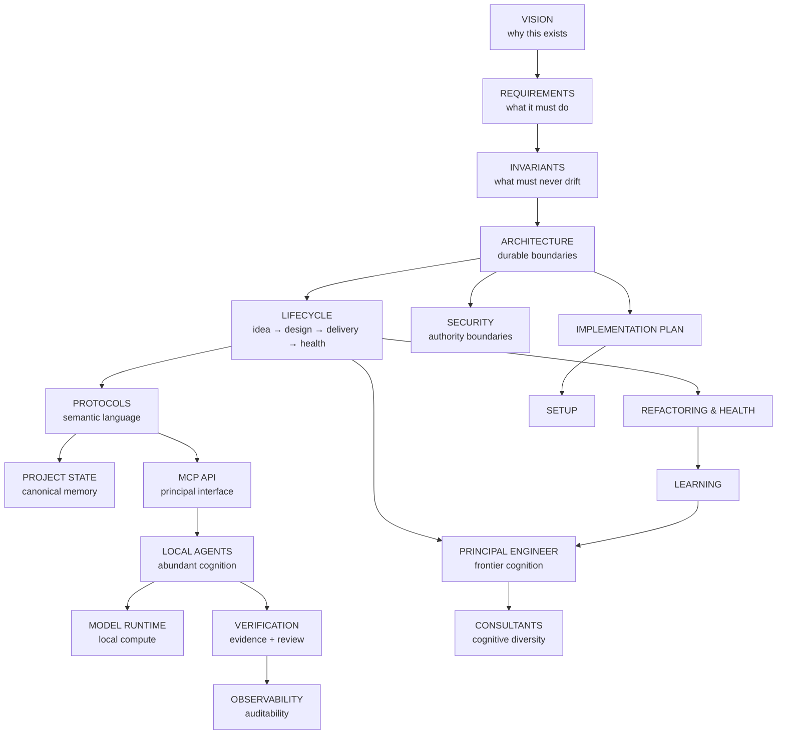

# DevCadience Documentation Map

The documentation is intentionally split by durable concern so humans and agents can load focused context instead of a single enormous specification.

## Reading paths

### New contributor
1. [../README.md](../README.md)
2. [VISION.md](VISION.md)
3. [REQUIREMENTS.md](REQUIREMENTS.md)
4. [../INVARIANTS.md](../INVARIANTS.md)
5. [ARCHITECTURE.md](ARCHITECTURE.md)
6. [IMPLEMENTATION_PLAN.md](IMPLEMENTATION_PLAN.md)
7. [../AGENTS.md](../AGENTS.md)

### Working on frontier/principal behavior
1. [PRINCIPAL_ENGINEER.md](PRINCIPAL_ENGINEER.md)
2. [LIFECYCLE.md](LIFECYCLE.md)
3. [PROTOCOLS.md](PROTOCOLS.md)
4. [CONSULTANTS.md](CONSULTANTS.md)
5. [../skills/antigravity-principal/SKILL.md](../skills/antigravity-principal/SKILL.md)

### Working on local execution
1. [LOCAL_AGENTS.md](LOCAL_AGENTS.md)
2. [MODEL_RUNTIME.md](MODEL_RUNTIME.md)
3. [VERIFICATION.md](VERIFICATION.md)
4. [SECURITY.md](SECURITY.md)
5. [../prompts/scout.md](../prompts/scout.md)
6. [../prompts/implementer.md](../prompts/implementer.md)
7. [../prompts/reviewer.md](../prompts/reviewer.md)

### Working on control-plane data/contracts
1. [PROTOCOLS.md](PROTOCOLS.md)
2. [PROJECT_STATE.md](PROJECT_STATE.md)
3. [MCP_API.md](MCP_API.md)
4. [../schemas/README.md](../schemas/README.md)

### Working on long-term quality
1. [REFACTORING_AND_HEALTH.md](REFACTORING_AND_HEALTH.md)
2. [LEARNING.md](LEARNING.md)
3. [OBSERVABILITY.md](OBSERVABILITY.md)
4. [../prompts/postmortem.md](../prompts/postmortem.md)

## Normative hierarchy

If documents appear to conflict, use this order and surface the inconsistency:

1. explicit human-authorized project decision / accepted ADR;
2. [../INVARIANTS.md](../INVARIANTS.md);
3. approved architecture and protocol documents;
4. [../AGENTS.md](../AGENTS.md) and engineering standards;
5. current Work Package;
6. role prompts/skills;
7. implementation suggestion.

A conflict is evidence to resolve, not permission to silently choose whichever text is convenient.
