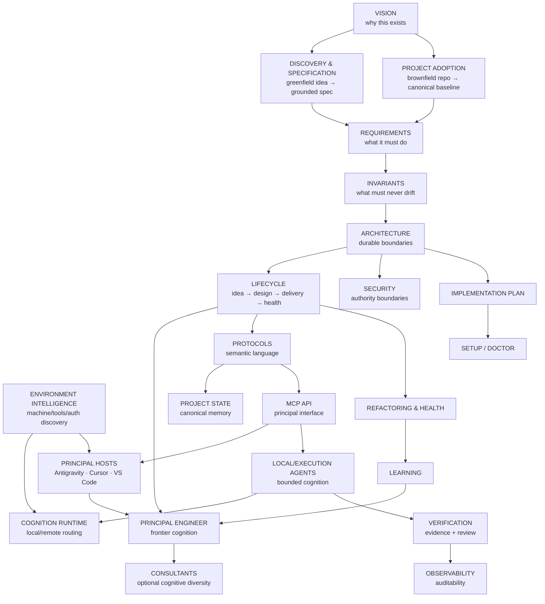

# DevCadence Documentation Map

The documentation is intentionally split by durable concern so humans and agents can load focused context instead of a single enormous specification.

## Reading paths

### New contributor
1. [../README.md](../README.md)
2. [VISION.md](VISION.md)
3. [REQUIREMENTS.md](REQUIREMENTS.md)
4. [../INVARIANTS.md](../INVARIANTS.md)
5. [ARCHITECTURE.md](ARCHITECTURE.md)
6. [IMPLEMENTATION_PLAN.md](IMPLEMENTATION_PLAN.md)
7. [../AGENTS.md](../AGENTS.md)

### Working on Day-0 discovery/specification
1. [DISCOVERY_AND_SPECIFICATION.md](DISCOVERY_AND_SPECIFICATION.md)
2. [../skills/antigravity-discovery/SKILL.md](../skills/antigravity-discovery/SKILL.md)
3. [CONSULTANTS.md](CONSULTANTS.md)
4. [PROTOCOLS.md](PROTOCOLS.md)
5. [../prompts/specification-reviewer.md](../prompts/specification-reviewer.md)
6. [adr/0001-discovery-specification-subsystem.md](adr/0001-discovery-specification-subsystem.md)

### Working on brownfield project adoption
1. [PROJECT_ADOPTION.md](PROJECT_ADOPTION.md)
2. [DISCOVERY_AND_SPECIFICATION.md](DISCOVERY_AND_SPECIFICATION.md)
3. [PROJECT_STATE.md](PROJECT_STATE.md)
4. [ARCHITECTURE.md](ARCHITECTURE.md)
5. [REQUIREMENTS.md](REQUIREMENTS.md)
6. [adr/0012-mandatory-brownfield-adoption-baseline.md](adr/0012-mandatory-brownfield-adoption-baseline.md)

### Working on environment/setup/cognition portfolio

1. [ENVIRONMENT_INTELLIGENCE_AND_ONBOARDING.md](ENVIRONMENT_INTELLIGENCE_AND_ONBOARDING.md)
2. [COGNITION_PORTFOLIO.md](COGNITION_PORTFOLIO.md)
3. [MODEL_RUNTIME.md](MODEL_RUNTIME.md)
4. [SETUP.md](SETUP.md)
5. [SECURITY.md](SECURITY.md)
6. [adr/0011-adaptive-environment-and-host-independent-cognition.md](adr/0011-adaptive-environment-and-host-independent-cognition.md)
7. [adr/0013-environment-intelligence-and-cognition-contracts.md](adr/0013-environment-intelligence-and-cognition-contracts.md)
8. [adr/0014-guided-bootstrap-and-remediation.md](adr/0014-guided-bootstrap-and-remediation.md)
9. [adr/0018-adaptive-cognition-portfolio-and-workflow-synthesis.md](adr/0018-adaptive-cognition-portfolio-and-workflow-synthesis.md)

### Working on frontier/principal behavior
1. [PRINCIPAL_ENGINEER.md](PRINCIPAL_ENGINEER.md)
2. [LIFECYCLE.md](LIFECYCLE.md)
3. [PROTOCOLS.md](PROTOCOLS.md)
4. [PRINCIPAL_HOSTS.md](PRINCIPAL_HOSTS.md)
5. [MCP_API.md](MCP_API.md)
6. [ANTIGRAVITY_INTEGRATION.md](ANTIGRAVITY_INTEGRATION.md)
7. [CONSULTANTS.md](CONSULTANTS.md)
8. [../integrations/antigravity/devcadence/skills/devcadence-principal/SKILL.md](../integrations/antigravity/devcadence/skills/devcadence-principal/SKILL.md)

### Working on execution cognition
1. [LOCAL_AGENTS.md](LOCAL_AGENTS.md)
2. [MODEL_RUNTIME.md](MODEL_RUNTIME.md)
3. [VERIFICATION.md](VERIFICATION.md)
4. [SECURITY.md](SECURITY.md)
5. [../prompts/scout.md](../prompts/scout.md)
6. [../prompts/implementer.md](../prompts/implementer.md)
7. [../prompts/reviewer.md](../prompts/reviewer.md)

### Working on control-plane data/contracts
1. [PROTOCOLS.md](PROTOCOLS.md)
2. [PROJECT_STATE.md](PROJECT_STATE.md)
3. [MCP_API.md](MCP_API.md)
4. [../schemas/README.md](../schemas/README.md)
5. [adr/0003-durable-record-compatibility.md](adr/0003-durable-record-compatibility.md)
6. [adr/0004-canonical-task-state-machine.md](adr/0004-canonical-task-state-machine.md)
7. [adr/0005-deterministic-project-state-identity.md](adr/0005-deterministic-project-state-identity.md)

### Working on persistence
1. [ARCHITECTURE.md](ARCHITECTURE.md) §10
2. [adr/0002-control-plane-persistence.md](adr/0002-control-plane-persistence.md)
3. [adr/0006-identifiers-and-time.md](adr/0006-identifiers-and-time.md)
4. [../ENGINEERING_STANDARDS.md](../ENGINEERING_STANDARDS.md) §10–§12

### Working on long-term quality
1. [REFACTORING_AND_HEALTH.md](REFACTORING_AND_HEALTH.md)
2. [LEARNING.md](LEARNING.md)
3. [OBSERVABILITY.md](OBSERVABILITY.md)
4. [../prompts/postmortem.md](../prompts/postmortem.md)

## Accepted ADRs

Accepted ADRs are normative and rank above the engineering standards in the
hierarchy below.

| ADR | Decision |
| --- | --- |
| [0001](adr/0001-discovery-specification-subsystem.md) | First-class discovery and specification subsystem |
| [0002](adr/0002-control-plane-persistence.md) | SQLite persistence: pure-Go driver, append-only journal, derived projections |
| [0003](adr/0003-durable-record-compatibility.md) | Strict readers, unknown-field behaviour, preserved original bytes |
| [0004](adr/0004-canonical-task-state-machine.md) | Canonical task lifecycle, block semantics, ProjectState task buckets |
| [0005](adr/0005-deterministic-project-state-identity.md) | ProjectState is a pure function of the event prefix |
| [0006](adr/0006-identifiers-and-time.md) | ULID identifiers and injected clocks |
| [0007](adr/0007-repository-and-worktree-safety-model.md) | Repository identity, worktree ownership (per-project manifest), non-mutating integration checks |
| [0008](adr/0008-controlled-process-execution.md) | Controlled process execution: no shell, no implicit environment inheritance, distinguished outcome categories |
| [0009](adr/0009-artifact-storage-and-validation-execution.md) | Content-addressed artifact store; validation-profile execution produces the real M1 ValidationResult |
| [0010](adr/0010-bounded-review-convergence.md) | Bounded review campaigns, adjudication, rising reopen thresholds and closure/freeze |
| [0011](adr/0011-adaptive-environment-and-host-independent-cognition.md) | Adaptive environment intelligence, capability-routed cognition, blank-machine onboarding and host independence |
| [0012](adr/0012-mandatory-brownfield-adoption-baseline.md) | Mandatory version-controlled canonical baseline before brownfield managed work |
| [0013](adr/0013-environment-intelligence-and-cognition-contracts.md) | Environment facts vs assessment, evidenced acceleration, capability provenance, cognition persistence boundaries and explainable routing |
| [0014](adr/0014-guided-bootstrap-and-remediation.md) | Safe guided bootstrap, explicit setup authority, crash-safe ledger and bounded remediation |
| [0015](adr/0015-declarative-modules-and-scoped-worktrees.md) | Declarative monorepo modules, scoped worktree execution, and reproducible state reduction |
| [0016](adr/0016-validation-services-bounded-tools-and-context-compaction.md) | Supervised validation services, bounded execution tools, asynchronous operations, and multi-tier context compaction |
| [0017](adr/0017-external-research-evidence-acquisition.md) | External research as a bounded evidence-acquisition service |
| [0018](adr/0018-adaptive-cognition-portfolio-and-workflow-synthesis.md) | Adaptive cognition portfolios, economics/budget pools, AI-assisted recommendation and adaptive workflow topology |
| [0019](adr/0019-non-conversational-cognition-and-adaptive-review.md) | Non-conversational cognition flows, active snippet pool, living work packages, and adaptive dual review |

## Normative hierarchy

If documents appear to conflict, use this order and surface the inconsistency:

1. explicit human-authorized project decision / accepted ADR;
2. [../INVARIANTS.md](../INVARIANTS.md);
3. approved architecture and protocol documents;
4. [../AGENTS.md](../AGENTS.md) and engineering standards;
5. current Work Package;
6. role prompts/skills;
7. implementation suggestion.

A conflict is evidence to resolve, not permission to silently choose whichever text is convenient.

### Working on review, repair, or milestone closure
1. [REVIEW_AND_CONVERGENCE.md](REVIEW_AND_CONVERGENCE.md)
2. [VERIFICATION.md](VERIFICATION.md)
3. [PRINCIPAL_ENGINEER.md](PRINCIPAL_ENGINEER.md)
4. [../prompts/reviewer.md](../prompts/reviewer.md)
5. [../prompts/review-synthesizer.md](../prompts/review-synthesizer.md)
6. [../prompts/closure-reviewer.md](../prompts/closure-reviewer.md)
