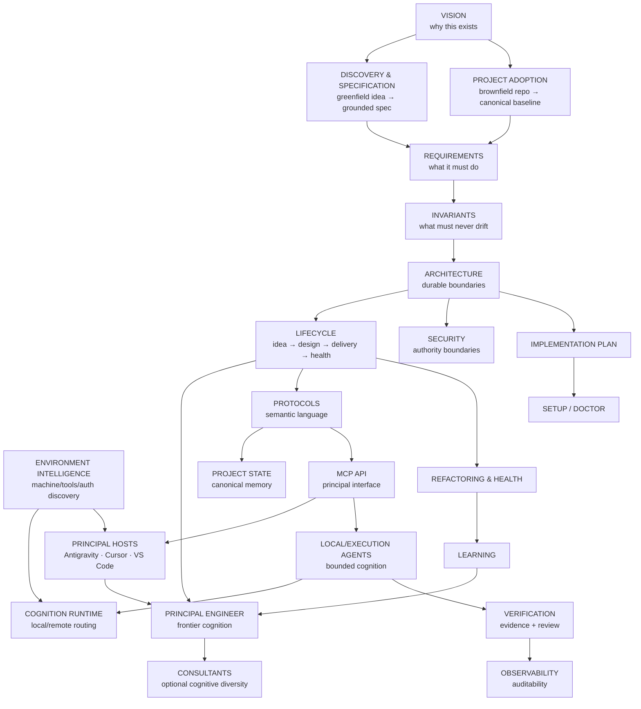

# DevCadence Documentation Map

The documentation is intentionally split by durable concern so humans and agents can load focused context instead of a single enormous specification.

```mermaid
flowchart TB
    Vision["VISION<br/>why this exists"]
    Req["REQUIREMENTS<br/>what it must do"]
    Discovery["DISCOVERY & SPECIFICATION<br/>greenfield idea → grounded spec"]
    Adoption["PROJECT ADOPTION<br/>brownfield repo → canonical baseline"]
    Env["ENVIRONMENT INTELLIGENCE<br/>machine/tools/auth discovery"]
    Hosts["PRINCIPAL HOSTS<br/>Antigravity · Cursor · VS Code"]
    Inv["INVARIANTS<br/>what must never drift"]
    Arch["ARCHITECTURE<br/>durable boundaries"]
    Life["LIFECYCLE<br/>idea → design → delivery → health"]
    Principal["PRINCIPAL ENGINEER<br/>frontier cognition"]
    Protocol["PROTOCOLS<br/>semantic language"]
    State["PROJECT STATE<br/>canonical memory"]
    Agents["LOCAL/EXECUTION AGENTS<br/>bounded cognition"]
    MCP["MCP API<br/>principal interface"]
    Runtime["COGNITION RUNTIME<br/>local/remote routing"]
    Verify["VERIFICATION<br/>evidence + review"]
    Consult["CONSULTANTS<br/>optional cognitive diversity"]
    Security["SECURITY<br/>authority boundaries"]
    Observe["OBSERVABILITY<br/>auditability"]
    Health["REFACTORING & HEALTH"]
    Learn["LEARNING"]
    Plan["IMPLEMENTATION PLAN"]
    Setup["SETUP / DOCTOR"]

    Vision --> Discovery
    Vision --> Adoption
    Discovery --> Req
    Adoption --> Req
    Req --> Inv
    Inv --> Arch
    Arch --> Life
    Life --> Principal
    Life --> Protocol
    Protocol --> State
    Protocol --> MCP
    Env --> Runtime
    Env --> Hosts
    MCP --> Hosts
    Hosts --> Principal
    MCP --> Agents
    Agents --> Runtime
    Agents --> Verify
    Principal --> Consult
    Arch --> Security
    Verify --> Observe
    Life --> Health
    Health --> Learn
    Learn --> Principal
    Arch --> Plan
    Plan --> Setup
```

## Context routing

**Normative hierarchy does not imply loading hierarchy.** Authority determines which consulted source wins; it does not require every higher-authority document in every prompt. These documents are durable, machine-addressable model memory. Models retrieve exact relevant clauses rather than treating reference files as a boot payload.

Start with [AGENTS.md](../AGENTS.md), the applicable [role template](../prompts/), a bounded EWP Execution Contract and task Context Manifest. The following is a **domain routing index**, not a mandatory reading list. Retrieve relevant sections when the trigger applies; full reads require recorded justification. References are relative to this directory.

| Trigger | Owning sources to resolve |
| --- | --- |
| Goals, product meaning or unresolved requirements | [VISION.md](VISION.md), [REQUIREMENTS.md](REQUIREMENTS.md), [DISCOVERY_AND_SPECIFICATION.md](DISCOVERY_AND_SPECIFICATION.md) |
| Brownfield readiness or inherited authority | [PROJECT_ADOPTION.md](PROJECT_ADOPTION.md), [ADR-0012](adr/0012-mandatory-brownfield-adoption-baseline.md) |
| Component boundary or dependency change | [ARCHITECTURE.md](ARCHITECTURE.md), applicable accepted ADR clauses |
| EWP expansion, implementation readiness or delegation | [WORK_PACKAGES.md](WORK_PACKAGES.md#execution-contract-and-context-manifest), [ADR-0024](adr/0024-implementation-ready-work-packages-and-contract-completeness.md), [PROTOCOLS.md §7](PROTOCOLS.md#7-engineering-work-package), [PRINCIPAL_ENGINEER.md](PRINCIPAL_ENGINEER.md), [work-package template](work-packages/IMPLEMENTATION_READY_TEMPLATE.md) |
| Agent context, rule admission, retrieval, prompt projection or driver capability | [ADR-0019](adr/0019-non-conversational-cognition-and-adaptive-review.md#context-working-set-contract), [ADR-0020](adr/0020-cognitive-invocation-compiler-and-review-ledger.md), [PROTOCOLS.md §10B](PROTOCOLS.md#10b-adaptive-context-architecture-and-evidence-working-set-implemented---wp-m3c-1--wp-m3c-2b), [LOCAL_AGENTS.md](LOCAL_AGENTS.md#context-admission-and-endpoint-envelopes) |
| Tool output/history compaction or supervised process | [ADR-0016](adr/0016-validation-services-bounded-tools-and-context-compaction.md), [SECURITY.md](SECURITY.md) |
| Machine, setup, credentials, runtime or routing | [ENVIRONMENT_INTELLIGENCE_AND_ONBOARDING.md](ENVIRONMENT_INTELLIGENCE_AND_ONBOARDING.md), [MODEL_RUNTIME.md](MODEL_RUNTIME.md), [SETUP.md](SETUP.md), [COGNITION_PORTFOLIO.md](COGNITION_PORTFOLIO.md), ADRs 0013/0014/0018, [SECURITY.md](SECURITY.md) |
| Workflow execution runtime, scheduler boundary, task activation/suspension or external orchestrator integration | [ARCHITECTURE.md §6.7D](ARCHITECTURE.md#67d-workflow-execution-runtime-boundary), [ADR-0025](adr/0025-workflow-execution-runtime-boundary.md), [MODEL_RUNTIME.md §22](MODEL_RUNTIME.md#22-workflow-execution-runtime-versus-cognition-session), [INVARIANTS.md DCI-159–161](../INVARIANTS.md#o-workflow-execution-runtime-invariants) |
| Capability-pack/plugin extension, ecosystem-specific prompt fragments, adding support for a new technology without core changes | [PROJECT_CAPABILITY_PACKS.md](PROJECT_CAPABILITY_PACKS.md), [ADR-0023](adr/0023-declarative-project-capability-packs.md), [PROJECT_TOOLCHAINS_AND_HEALTH.md](PROJECT_TOOLCHAINS_AND_HEALTH.md) |
| Greenfield stack/framework choice, application type, ProjectBlueprint or project scaffolding | [PROJECT_CREATION_AND_SCAFFOLDING.md](PROJECT_CREATION_AND_SCAFFOLDING.md), [ADR-0022](adr/0022-greenfield-technology-selection-and-scaffolding.md), [DISCOVERY_AND_SPECIFICATION.md](DISCOVERY_AND_SPECIFICATION.md), [PROJECT_TOOLCHAINS_AND_HEALTH.md](PROJECT_TOOLCHAINS_AND_HEALTH.md) |
| Target-project languages/toolchains, lint/test/build/coverage policy, presubmit/CI/merge health or health-policy drift | [PROJECT_TOOLCHAINS_AND_HEALTH.md](PROJECT_TOOLCHAINS_AND_HEALTH.md), [ADR-0021](adr/0021-project-toolchains-and-health-contracts.md), [PROJECT_ADOPTION.md](PROJECT_ADOPTION.md), [VERIFICATION.md](VERIFICATION.md) |
| State, persistence or wire/schema compatibility | [PROJECT_STATE.md](PROJECT_STATE.md), [PROTOCOLS.md](PROTOCOLS.md), [schemas/README.md](../schemas/README.md), ADRs 0002–0006, affected schema/type |
| Review, findings, repair, verification, closure or acceptance | [REVIEW_AND_CONVERGENCE.md](REVIEW_AND_CONVERGENCE.md), [ADR-0020](adr/0020-cognitive-invocation-compiler-and-review-ledger.md), [VERIFICATION.md](VERIFICATION.md), ADR-0010 |
| Principal host or semantic MCP boundary | [PRINCIPAL_HOSTS.md](PRINCIPAL_HOSTS.md), [MCP_API.md](MCP_API.md), relevant host integration |
| Health, lessons, telemetry or milestone status | [REFACTORING_AND_HEALTH.md](REFACTORING_AND_HEALTH.md), [LEARNING.md](LEARNING.md), [OBSERVABILITY.md](OBSERVABILITY.md), [IMPLEMENTATION_PLAN.md](IMPLEMENTATION_PLAN.md) |

Path/domain/risk rules must be resolved conjunctively: for example, a driver changing credential access needs session **and** security clauses. Undeclared paths or unmapped risks require re-resolution, not a guessed empty requirement set. This manual index is not yet the M3C machine mapping.

Open follow-ups from the context-discipline review are tracked in [CONTEXT_FOLLOWUPS.md](CONTEXT_FOLLOWUPS.md).

Generated invariant indexes, role cards and document maps are planned **projections** of owning clauses, not independent sources of authority. A compiled projection records source identifier, revision and digest; drift or unresolved anchors reject admission. Do not create another hand-maintained miniature corpus. Historical EWPs remain available as evidence, outside default reading sets.

## Accepted ADRs

Accepted ADRs are normative and rank above the engineering standards in the
hierarchy below.

| ADR | Decision |
| --- | --- |
| [0001](adr/0001-discovery-specification-subsystem.md) | First-class discovery and specification subsystem |
| [0002](adr/0002-control-plane-persistence.md) | SQLite persistence: pure-Go driver, append-only journal, derived projections |
| [0003](adr/0003-durable-record-compatibility.md) | Strict readers, unknown-field behaviour, preserved original bytes |
| [0004](adr/0004-canonical-task-state-machine.md) | Canonical task lifecycle, block semantics, ProjectState task buckets |
| [0005](adr/0005-deterministic-project-state-identity.md) | ProjectState is a pure function of the event prefix |
| [0006](adr/0006-identifiers-and-time.md) | ULID identifiers and injected clocks |
| [0007](adr/0007-repository-and-worktree-safety-model.md) | Repository identity, worktree ownership (per-project manifest), non-mutating integration checks |
| [0008](adr/0008-controlled-process-execution.md) | Controlled process execution: no shell, no implicit environment inheritance, distinguished outcome categories |
| [0009](adr/0009-artifact-storage-and-validation-execution.md) | Content-addressed artifact store; validation-profile execution produces the real M1 ValidationResult |
| [0010](adr/0010-bounded-review-convergence.md) | Bounded review campaigns, adjudication, rising reopen thresholds and closure/freeze |
| [0011](adr/0011-adaptive-environment-and-host-independent-cognition.md) | Adaptive environment intelligence, capability-routed cognition, blank-machine onboarding and host independence |
| [0012](adr/0012-mandatory-brownfield-adoption-baseline.md) | Mandatory version-controlled canonical baseline before brownfield managed work |
| [0013](adr/0013-environment-intelligence-and-cognition-contracts.md) | Environment facts vs assessment, evidenced acceleration, capability provenance, cognition persistence boundaries and explainable routing |
| [0014](adr/0014-guided-bootstrap-and-remediation.md) | Safe guided bootstrap, explicit setup authority, crash-safe ledger and bounded remediation |
| [0015](adr/0015-declarative-modules-and-scoped-worktrees.md) | Declarative monorepo modules, scoped worktree execution, and reproducible state reduction |
| [0016](adr/0016-validation-services-bounded-tools-and-context-compaction.md) | Supervised validation services, bounded execution tools, asynchronous operations, and multi-tier context compaction |
| [0017](adr/0017-external-research-evidence-acquisition.md) | External research as a bounded evidence-acquisition service |
| [0018](adr/0018-adaptive-cognition-portfolio-and-workflow-synthesis.md) | Adaptive cognition portfolios, economics/budget pools, AI-assisted recommendation and adaptive workflow topology |
| [0019](adr/0019-non-conversational-cognition-and-adaptive-review.md) | Context Working-Set Architecture, deterministic admission, dynamic review lenses, living work packages, and dual independent review |
| [0020](adr/0020-cognitive-invocation-compiler-and-review-ledger.md) | Cognitive Invocation Compiler, fail-safe mandatory admission, prompt projection, and durable review ledger |
| [0021](adr/0021-project-toolchains-and-health-contracts.md) | Project toolchains and one canonical health contract |
| [0022](adr/0022-greenfield-technology-selection-and-scaffolding.md) | Requirement-driven greenfield technology selection and bounded scaffolding |
| [0023](adr/0023-declarative-project-capability-packs.md) | Declarative capability packs and Skills-first ecosystem extensibility |
| [0024](adr/0024-implementation-ready-work-packages-and-contract-completeness.md) | Implementation-ready EWPs and contract completeness |
| [0025](adr/0025-workflow-execution-runtime-boundary.md) | Workflow execution runtime boundary, runtime-private activation, and hierarchical knowledge separation |

## Normative hierarchy

If documents appear to conflict, use this order and surface the inconsistency:

1. explicit human-authorized project decision / accepted ADR;
2. [../INVARIANTS.md](../INVARIANTS.md);
3. approved architecture and protocol documents;
4. [../AGENTS.md](../AGENTS.md) and engineering standards;
5. current Work Package;
6. role prompts/skills;
7. implementation suggestion.

A conflict is evidence to resolve, not permission to silently choose whichever text is convenient.
