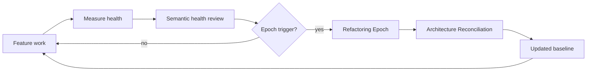
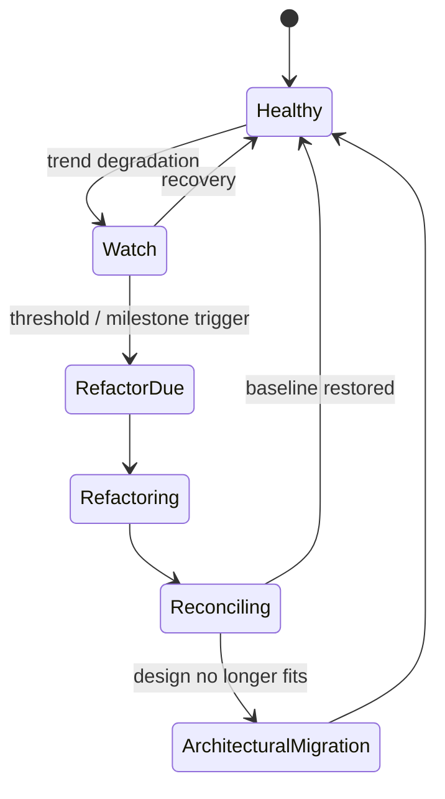
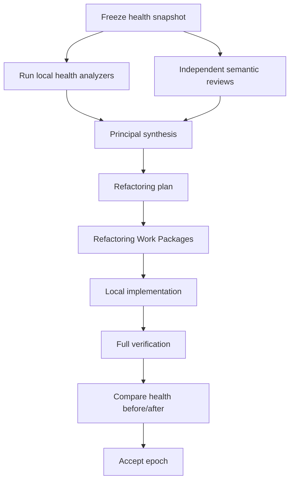
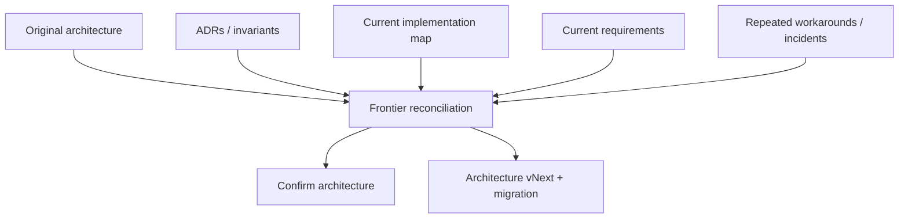

# Refactoring and Engineering Health

## Scope

DevCadence treats code health as a continuously monitored system property. Functional delivery does not erase structural debt, and long-running AI implementation is expected to accumulate local optimizations that can degrade global coherence.

## 1. Health loop

## 2. Why planned refactoring exists

Autonomous coding agents can create:
- duplicate abstractions;
- nearly identical helpers;
- unnecessary wrappers;
- layer leakage;
- brittle defensive code;
- inconsistent naming;
- API surface growth;
- accidental coupling;
- excessive configuration;
- dead compatibility paths;
- repetitive tests;
- code that passes tests but no longer communicates the architecture.

These effects may be individually rational in each task. They are dangerous cumulatively.

## 3. Health signal families

### Structural signals
- cyclomatic/cognitive complexity;
- dependency cycles;
- package/module size;
- public API growth;
- fan-in/fan-out;
- dead code;
- duplication;
- test runtime;
- flaky tests.

### Semantic signals
- overlapping concepts;
- two abstractions representing the same domain idea;
- inconsistent ownership of behavior;
- vocabulary drift;
- architectural boundary erosion;
- repeated exceptions to one rule;
- unnecessary genericity;
- test design mirroring implementation rather than behavior.

### Process signals
- rising retry rate;
- reviewer disagreement;
- repeated principal escalations in one component;
- recurring “small” fixes touching the same area;
- frequent Work Package deviations.

## 4. Health state

## 5. Refactoring Epoch triggers

Triggers may include:
- milestone completion;
- fixed number of systemic tasks;
- health score crossing policy threshold;
- dependency cycle introduced;
- API surface growth above threshold;
- repeated semantic duplication findings;
- architecture reviewer recurring concern;
- pre-release;
- major framework/runtime upgrade.

Trigger logic should combine metrics and semantic review rather than one synthetic number.

## 6. Refactoring Epoch protocol

Refactoring should preserve behavior unless an explicit architectural change is approved.

## 7. Review vectors during an epoch

Run separate passes for:
- duplication/concept overlap;
- dependency/layering;
- public API coherence;
- error handling;
- concurrency ownership;
- configuration;
- tests/fixtures;
- naming/domain language;
- dead/legacy code;
- unnecessary abstraction;
- observability/logging consistency.

Different models may be used.

## 8. Architecture Reconciliation

Refactoring asks “is this implementation clean?”

Architecture Reconciliation asks “is this still the right architecture?”

## 9. Reconciliation questions

- What does the code actually implement today?
- Which documented abstractions no longer match responsibility?
- Which workarounds have become permanent architecture?
- Which invariants are routinely awkward because the premise changed?
- Which components should split or merge?
- What would we design today given current requirements?
- Is the benefit of migration worth its disruption?

## 10. Health evidence model

A HealthReport should contain:
- deterministic metrics;
- semantic findings;
- trend vs prior snapshot;
- affected components;
- evidence refs;
- severity;
- recommended action;
- confidence basis;
- whether the concern is local or architectural.

## 11. Avoiding metric gaming

No single metric is a quality target.

Examples:
- reducing file size by splitting into meaningless wrappers is not improvement;
- increasing test count without behavior coverage is not improvement;
- eliminating all duplication can create premature abstraction;
- reducing complexity at the cost of opaque generic machinery can be worse.

The principal interprets metrics in architecture context.

## 12. Planned simplification

Refactoring epochs should actively ask what can be deleted.

Deletion candidates:
- obsolete adapters;
- compatibility code past its support window;
- unused configuration;
- duplicate helpers;
- abandoned feature flags;
- old schema migrations that can be archived safely;
- dead experiments.

## 13. Work Package requirements for refactoring

A refactoring Work Package should specify:
- behavior that must remain unchanged;
- architecture intent;
- target smell/debt;
- allowed scope;
- prohibited semantic changes;
- before/after validation;
- rollback strategy.

## 14. Verification

Refactor acceptance should include:
- full regression suite;
- API/schema compatibility checks;
- relevant performance benchmarks;
- architecture review;
- health comparison;
- no unexplained behavior change.

## 15. Learning integration

Repeated health problems can produce LessonCandidates.

Example:
- observation: four features each created a new near-identical adapter;
- candidate lesson: require extension of a registered provider capability interface rather than parallel one-off adapters;
- evaluation: replay against previous tasks / architecture review;
- promotion: engineering skill or invariant if justified.

## 16. Long-term objective

A mature DevCadence project should periodically emerge from refactoring with **less accidental complexity than before the preceding feature wave**, rather than accepting monotonically increasing entropy.
