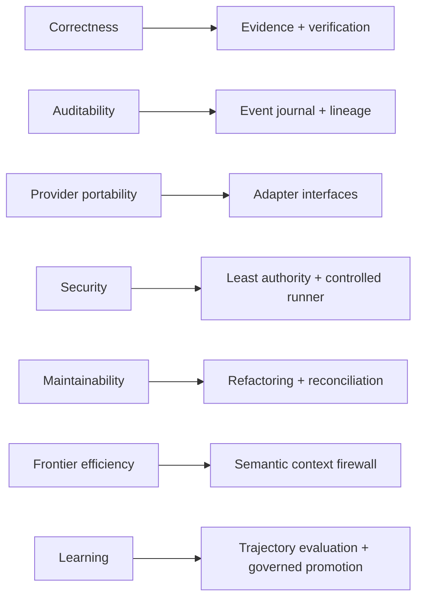

# DevCadience Requirements

## Scope

This document defines the initial functional and non-functional requirements for DevCadience. IDs are stable and intended to appear in Work Packages, tests, ADRs and milestone verification.

## 1. Product goals

DevCadience MUST enable a frontier principal to guide software development using compact, evidence-backed project context while local agents perform repository-heavy implementation and verification.

The system MUST cover both greenfield and evolving projects.

## 2. Functional requirements

### FR-001 — Project registration
The system MUST register a local Git repository as a DevCadience project with:
- stable project ID;
- repository path;
- accepted/base branch;
- project configuration;
- policy profile;
- model/runtime profile.

### FR-002 — Canonical ProjectState
The system MUST materialize a versioned ProjectState linked to an accepted Git commit.

### FR-003 — Engineering event journal
The system MUST record durable engineering state transitions sufficient to audit major task/decision history.

### FR-004 — Semantic principal interface
The system MUST expose semantic operations through MCP and/or equivalent API without requiring the principal to use generic filesystem/shell primitives.

### FR-005 — Repository investigation
A local Scout MUST be able to answer targeted InvestigationRequests and return structured EvidencePackets with provenance.

### FR-006 — Progressive evidence
The principal MUST be able to request deeper evidence without receiving full raw repository context by default.

### FR-007 — Engineering Work Packages
The system MUST persist versioned Work Packages tied to ProjectState revision and base commit.

### FR-008 — Requirement strengths
Work Packages MUST distinguish MUST, SHOULD, SUGGESTED and LOCAL_DISCRETION guidance.

### FR-009 — Isolated implementation
Autonomous implementation MUST execute in an isolated branch/worktree once worktree support is available.

### FR-010 — Attempt lineage
Every implementation run MUST create a distinct Attempt with model/profile, base revision, worktree, status and resulting commit/artifacts.

### FR-011 — Local model runtimes
The system MUST support at least one local runtime in the bootstrap release and MUST keep the adapter boundary compatible with multiple runtimes.

### FR-012 — Deterministic validation
The system MUST execute configured validation commands and capture immutable/traceable results.

### FR-013 — Independent review
The system MUST support review runs that do not inherit the implementer conversation.

### FR-014 — Multiple review dimensions
Review policy MUST allow correctness, architecture/invariant, security, test adequacy, concurrency, performance and maintainability dimensions.

### FR-015 — Contradiction escalation
A local worker MUST be able to report a false Work Package assumption and block rather than silently redesign.

### FR-016 — Bounded retry
Retry policy MUST be explicit and MUST prevent infinite autonomous loops.

### FR-017 — Acceptance decision
Candidate acceptance MUST reference Work Package, deterministic validation, required reviews and unresolved disagreements.

### FR-018 — Integration
The system MUST support integration validation after combining accepted changes.

### FR-019 — Consultant abstraction
The system SHOULD support replaceable frontier consultant adapters using normalized ConsultationRequest/Result records.

### FR-020 — Change impact classification
The system MUST classify work as local, systemic or architectural, with risk able to promote process depth.

### FR-021 — Design readiness
Systemic/architectural work MUST support a Design Readiness Gate before implementation.

### FR-022 — Architecture decisions
The system MUST support durable DecisionRecords and ADR links for architectural changes.

### FR-023 — Refactoring Epochs
The system MUST represent planned refactoring epochs and trigger them through milestone/health policy.

### FR-024 — Architecture Reconciliation
The system MUST support a lifecycle event/process that compares current implemented architecture with intended architecture and current requirements.

### FR-025 — Trajectory capture
The system MUST capture sufficient structured trajectory data to evaluate agent/policy behavior later.

### FR-026 — Lesson candidates
The system MUST support LessonCandidate creation and governed promotion rather than direct self-modification.

### FR-027 — Provider/model profiles
The system MUST represent model/runtime capability profiles independently from role definitions.

### FR-028 — Resource management
The local runtime layer SHOULD expose loaded-model and memory/resource state sufficient for safe scheduling.

### FR-029 — Auditability
The system MUST answer why a candidate was accepted/rejected and which evidence supported the decision.

### FR-030 — Human escalation
Policies MUST be able to require human approval for selected risk classes and destructive actions.

## 2A. Discovery and specification requirements

### FR-D-001 — ProblemModel
The system MUST represent a versioned ProblemModel containing outcomes, actors, workflows, scope, constraints, assumptions, unknowns and risks.

### FR-D-002 — Ambiguity Ledger
The system MUST represent unresolved product/specification ambiguity explicitly rather than relying on chat history.

### FR-D-003 — Resolution authority
Each material ambiguity MUST be classifiable by the authority best suited to resolve it: human, repository/tool, external research, experiment, consultant or principal synthesis.

### FR-D-004 — Human product authority
Human-authoritative product decisions MUST be persistable as ProductDecisions and MUST NOT be silently overridden by engineering agents.

### FR-D-005 — Requirement provenance
Requirements MUST record source/provenance and epistemic state such as confirmed, evidence-backed, proposed, assumed, deferred or rejected.

### FR-D-006 — Adaptive questioning
The Discovery Principal SHOULD prioritize high-impact questions dynamically and SHOULD NOT require a fixed questionnaire for all projects.

### FR-D-007 — Human reflection
The system SHOULD support periodic reflection of confirmed, proposed and open interpretations so the human can correct semantic drift.

### FR-D-008 — External grounding
Material current technical facts SHOULD be resolved through authoritative sources rather than human guesswork.

### FR-D-009 — Discovery experiments
Material empirical feasibility assumptions SHOULD be resolvable through bounded DiscoveryExperiments with explicit limitations.

### FR-D-010 — Independent specification review
Substantial specifications MUST support independent review dimensions including completeness, ambiguity, contradiction, security/privacy, failure modes and architecture contamination.

### FR-D-011 — Specification Readiness Gate
Architecture MUST NOT begin for substantial greenfield/product-semantic work until remaining material ambiguity is resolved, explicitly accepted as risk, or safely deferred behind a documented boundary.

### FR-D-012 — Compact discovery memory
A new principal session MUST be able to reconstruct current product intent from durable discovery artifacts without requiring the full original conversation transcript.

## 3. Principal cognition requirements

### FR-P-001 — Explicit assumptions
Systemic and architectural design artifacts MUST identify material assumptions and their verification state.

### FR-P-002 — Alternatives
Architectural changes MUST document credible alternatives.

### FR-P-003 — Self-challenge
The principal MUST perform an adversarial critique of its preferred architecture before readiness approval.

### FR-P-004 — External grounding
Current external facts material to design SHOULD be verified through authoritative sources.

### FR-P-005 — Detailed implementation guidance
Substantial Work Packages MUST contain implementation strategy and SHOULD include pseudocode/code/interface sketches when they materially reduce ambiguity.

### FR-P-006 — Consultant independence
The system SHOULD allow blind/neutral first-pass consultant requests to reduce anchoring.

## 4. Security requirements

### FR-S-001
Repository content MUST be treated as untrusted data with respect to instruction authority.

### FR-S-002
Secrets MUST NOT be persisted in ordinary model trajectory artifacts.

### FR-S-003
Implementer writes MUST be confined to authorized workspaces.

### FR-S-004
Destructive operations MUST have an elevated policy path.

### FR-S-005
External consultant/source access MUST be governed per project.

## 5. Non-functional requirements

### NFR-001 — Correctness over latency
Quality, reproducibility and bounded authority have priority over wall-clock latency.

### NFR-002 — Local-first operation
The control plane, repository, local agents and primary state store MUST be able to operate locally without a mandatory DevCadience cloud service.

### NFR-003 — Provider independence
No core domain contract may require one LLM provider.

### NFR-004 — Reproducibility
Control-plane state transitions and deterministic checks MUST be replayable/auditable from stored inputs where practical.

### NFR-005 — Durability
SQLite/control-plane data MUST use migrations and transactional updates.

### NFR-006 — Recoverability
Materialized ProjectState SHOULD be reconstructable from durable records plus repository facts.

### NFR-007 — Resource bounds
Concurrency, process output, retries, model contexts and artifact retention MUST be bounded by policy.

### NFR-008 — Cancellation
Long-running local/model/tool operations MUST support cancellation.

### NFR-009 — Compatibility
Durable protocol records MUST be schema-versioned.

### NFR-010 — Observability
Every long-running task MUST expose status and correlation identifiers.

### NFR-011 — Testability
Core orchestration MUST be testable without live LLMs through deterministic fakes.

### NFR-012 — Single-machine bootstrap
The initial system MUST run usefully on one developer machine.

### NFR-013 — 48 GB Apple Silicon target
The bootstrap local-model experience SHOULD work on a 48 GB unified-memory Apple Silicon machine while preserving OS/tool headroom.

### NFR-014 — Graceful model failure
Model/runtime unavailability MUST produce explicit state, not silent task loss.

### NFR-015 — Data minimization
External providers SHOULD receive the minimum source/context required by the authorized operation.

## 6. Quality attributes and architecture response

## 7. Bootstrap acceptance

The architecture is not validated merely because the daemon starts.

The bootstrap experiment MUST demonstrate:
1. principal receives compact state;
2. local scout explores a non-trivial repository;
3. principal creates a detailed Work Package;
4. local implementer executes in isolation;
5. deterministic validation runs;
6. clean-context reviewer evaluates;
7. contradiction/escalation can be represented;
8. principal can accept/reject from compact evidence;
9. token/context comparison can be measured against a direct cloud coding baseline.

## 8. Requirement evolution

Requirement changes that affect invariants, protocol semantics or security require corresponding ADR/architecture review.

Retired requirement IDs remain reserved for historical interpretability.
