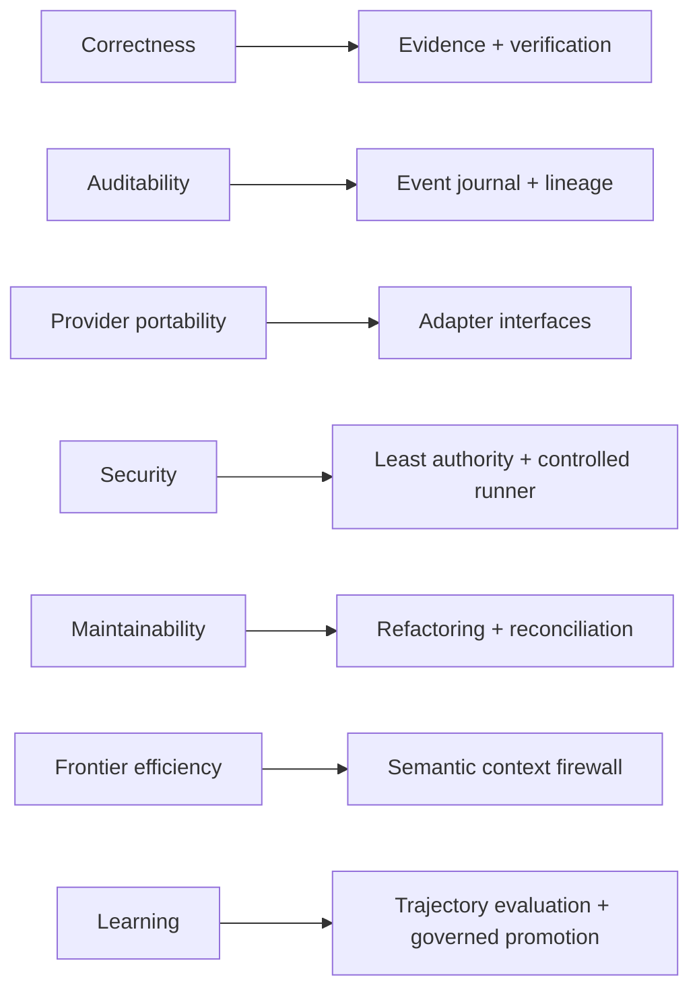

# DevCadience Requirements

## Scope

This document defines the initial functional and non-functional requirements for DevCadience. IDs are stable and intended to appear in Work Packages, tests, ADRs and milestone verification.

## 1. Product goals

DevCadience MUST enable a frontier principal to guide software development using compact, evidence-backed project context while bounded execution workers perform repository-heavy implementation and verification. Worker cognition may be local or remote according to capability, privacy, cost and policy; repository authority, deterministic execution, evidence and canonical state remain under the local control plane.

The system MUST cover both greenfield and evolving projects.

## 2. Functional requirements

### FR-001 — Project registration
The system MUST register a local Git repository as a DevCadience project with:
- stable project ID;
- repository path;
- accepted/base branch;
- project configuration;
- policy profile;
- model/runtime profile.

### FR-002 — Canonical ProjectState
The system MUST materialize a versioned ProjectState linked to an accepted Git commit.

### FR-003 — Engineering event journal
The system MUST record durable engineering state transitions sufficient to audit major task/decision history.

### FR-004 — Semantic principal interface
The system MUST expose semantic operations through MCP and/or equivalent API without requiring the principal to use generic filesystem/shell primitives.

### FR-005 — Repository investigation
A Scout MUST be able to answer targeted InvestigationRequests and return structured EvidencePackets with provenance. The Scout may use deterministic repository tooling, local cognition, or a policy-authorized remote cognition endpoint; full raw repository context is not the default transport.

### FR-006 — Progressive evidence
The principal MUST be able to request deeper evidence without receiving full raw repository context by default.

### FR-007 — Engineering Work Packages
The system MUST persist versioned Work Packages tied to ProjectState revision and base commit.

### FR-008 — Requirement strengths
Work Packages MUST distinguish MUST, SHOULD, SUGGESTED and LOCAL_DISCRETION guidance.

### FR-009 — Isolated implementation
Autonomous implementation MUST execute in an isolated branch/worktree once worktree support is available.

### FR-010 — Attempt lineage
Every implementation run MUST create a distinct Attempt with model/profile, base revision, worktree, status and resulting commit/artifacts.

### FR-011 — Cognition runtimes and endpoints
The system MUST keep model/cognition adapters independent from core roles and MUST support capability-based routing across replaceable cognition endpoints. The bootstrap SHOULD support local inference, but a strong or even installed local LLM MUST NOT be required for otherwise valid control-plane operation.

### FR-012 — Deterministic validation
The system MUST execute configured validation commands and capture immutable/traceable results.

### FR-013 — Independent review
The system MUST support review runs that do not inherit the implementer conversation.

### FR-014 — Multiple review dimensions
Review policy MUST allow correctness, architecture/invariant, security, test adequacy, concurrency, performance and maintainability dimensions.

### FR-015 — Contradiction escalation
A local worker MUST be able to report a false Work Package assumption and block rather than silently redesign.

### FR-016 — Bounded retry
Retry policy MUST be explicit and MUST prevent infinite autonomous loops.

### FR-017 — Acceptance decision
Candidate acceptance MUST reference Work Package, deterministic validation, required reviews and unresolved disagreements.

### FR-018 — Integration
The system MUST support integration validation after combining accepted changes.

### FR-019 — Optional consultant abstraction
The system SHOULD support replaceable frontier consultant adapters using normalized ConsultationRequest/Result records. No individual consultant provider or paid subscription is required; absence of consultants reduces cognitive diversity rather than invalidating unrelated capabilities.

### FR-020 — Change impact classification
The system MUST classify work as local, systemic or architectural, with risk able to promote process depth.

### FR-021 — Design readiness
Systemic/architectural work MUST support a Design Readiness Gate before implementation.

### FR-022 — Architecture decisions
The system MUST support durable DecisionRecords and ADR links for architectural changes.

### FR-023 — Refactoring Epochs
The system MUST represent planned refactoring epochs and trigger them through milestone/health policy.

### FR-024 — Architecture Reconciliation
The system MUST support a lifecycle event/process that compares current implemented architecture with intended architecture and current requirements.

### FR-025 — Trajectory capture
The system MUST capture sufficient structured trajectory data to evaluate agent/policy behavior later.

### FR-026 — Lesson candidates
The system MUST support LessonCandidate creation and governed promotion rather than direct self-modification.

### FR-027 — Cognition capability profiles
The system MUST represent cognition endpoint/model/runtime capability profiles independently from role definitions, including locality, health, structured-output/tool capability, privacy/exposure properties and cost class where applicable.

### FR-028 — Resource and endpoint management
Local runtimes SHOULD expose loaded-model and memory/resource state sufficient for safe scheduling. Remote/authenticated cognition endpoints SHOULD expose enough health, availability and usage/cost metadata for policy-aware routing where the integration permits it.

### FR-029 — Auditability
The system MUST answer why a candidate was accepted/rejected and which evidence supported the decision.

### FR-030 — Human escalation
Policies MUST be able to require human approval for selected risk classes and destructive actions.

### FR-031 — Bounded review campaigns
Substantial candidate review MUST be representable as a bounded ReviewCampaign with an immutable candidate, explicit review dimensions, repair-round limit, reporting/reopen thresholds, finding dispositions, and closure outcome.

### FR-032 — Finding adjudication
Material reviewer findings MUST be adjudicated before implementation repair as FIX_NOW, REJECT, DEFER, HUMAN_DECISION, or DUPLICATE. Raw reviewer output MUST NOT itself define implementation scope.

### FR-033 — Consolidated repair
The system MUST support consolidating current FIX_NOW findings into at most one Repair Work Package per repair round.

### FR-034 — Focused revalidation
After repair, the default review operation MUST verify accepted repairs and regressions rather than restart unrestricted broad review.

### FR-035 — Rising reopen threshold
Review policy MUST support a non-decreasing threshold for reopening code as a ReviewCampaign converges.

### FR-036 — Closure and freeze
The system MUST support an evidence-backed ClosureDecision that freezes a candidate when deterministic validation passes, required reviews are complete, blocking findings are closed, material findings are adjudicated, and residual risk is bounded.

### FR-037 — Evidence-based reopening
A frozen/adjudicated campaign MUST NOT reopen solely because another reviewer/model expresses an equivalent opinion. Reopening requires materially new evidence, changed requirements, or a newly applicable material correctness/security/integrity/contract concern.

### FR-038 — Review context bounds
Reviewer output volume, repair rounds, and handoff context MUST be policy-bounded. Implementers SHOULD receive consolidated repair guidance rather than full reviewer transcripts.

### FR-039 — Environment discovery
The system MUST be able to discover a blank machine's relevant OS, CPU, memory, storage, accelerator candidates and installed supported engineering/AI software without assuming vendor tools are already present.

### FR-040 — Capability assessment
The system MUST distinguish observed hardware/software facts from assessed capabilities and recommendations. Missing optional capability MUST be representable explicitly rather than collapsed into generic setup failure.

### FR-041 — Guided bootstrap
The system MUST support a guided bootstrap flow that can begin with no local LLM runtime, no principal host and no provider credentials; it SHOULD explain the recommended operating profile and the smallest changes needed to become more capable.

### FR-042 — Verified inference acceleration
A local inference backend MUST NOT be marked acceleration-ready solely because compatible hardware, drivers or runtime software exist. Setup MUST support an empirical inference probe that verifies the intended accelerator path.

### FR-043 — Cognition endpoint discovery
The system SHOULD detect supported installed/authenticated local runtimes, coding/agent CLIs and remote provider integrations and normalize them into capability-bearing cognition endpoints.

### FR-044 — Principal-host portability
The semantic principal interface MUST be host-independent. Principal-host-specific installation/configuration belongs behind replaceable host adapters/recipes.

### FR-045 — Initial principal-host scope
The initial first-class principal hosts are Antigravity, Cursor and Visual Studio Code. Antigravity is the reference integration; none of the three is a core-domain requirement. Additional hosts are future work.

### FR-046 — Blank-host onboarding
If no supported principal host is installed, setup MUST be able to present the supported host choices, guide installation/configuration of the user's selection, and allow the user to defer principal-host setup.

### FR-047 — Credential references
Configuration MUST reference credentials/authenticated integrations without persisting routine raw provider secrets in project configuration. Setup SHOULD reuse existing authenticated provider/CLI sessions when safe and supported.

### FR-048 — Setup planning and approval
Setup/remediation MUST expose planned mutating actions before execution. Privileged or high-impact actions require explicit user approval; hardware discovery and assessment remain read-only.

### FR-049 — Guided terminal UX
Interactive setup/doctor flows SHOULD provide a compact, colored terminal experience with selections, confirmations and status/progress feedback when useful, while preserving accessible, plain and machine-readable modes for SSH, scripts and CI.

### FR-050 — Brownfield project adoption
The system MUST support adopting an existing Git repository whose documentation may be absent, stale, incomplete or non-canonical through a retrospective reconstruction workflow.

### FR-051 — Mandatory canonical project baseline
A project MUST NOT enter normal DevCadience-managed engineering work until the required canonical project documentation set exists in committed repository state and passes an Adoption Readiness Gate.

### FR-052 — Required canonical project artifacts
The adoption baseline MUST contain stable canonical slots for vision, requirements, architecture, invariants, security, test strategy, operations and architectural decisions. A genuinely inapplicable topic MUST be represented explicitly rather than silently omitted.

### FR-053 — Existing-document harvest
Project adoption MUST discover and classify relevant existing documentation and machine-readable contracts regardless of whether they use DevCadience filenames or formats.

### FR-054 — Retrospective evidence provenance
Material reconstructed statements MUST preserve whether they are observed from current evidence, inherited from documentation, inferred, human-confirmed, reconstructed-confirmed, unknown, contradicted or accepted as bounded risk.

### FR-055 — Code/test/history reconstruction
Project adoption SHOULD use current source, tests, schemas/configuration and Git history to reconstruct current behavior, important contracts and durable architectural rationale, while keeping inference distinguishable from fact.

### FR-056 — Adoption ambiguity and contradiction handling
Material contradictions among documentation, code, tests, schemas or current human intent MUST remain explicit until resolved or deliberately accepted as bounded risk by the appropriate authority.

### FR-057 — Version-controlled adoption baseline
The canonical adoption documentation MUST be created in isolated repository state and committed. The adoption decision MUST identify the source commit reconstructed and the accepted baseline commit.

### FR-058 — Pre-adoption execution boundary
Before adoption READY, DevCadience MAY perform bounded investigation and isolated adoption work but MUST block normal managed implementation, acceptance and integration.

### FR-059 — Adoption Readiness Gate
The system MUST represent an explicit readiness decision proving that required canonical artifacts exist, material architecture/contracts are sufficiently reconstructed, critical ambiguities are resolved or safely deferred, and remaining uncertainty is bounded and visible.

### FR-060 — Canonical documentation entry point
Each managed project MUST expose a stable configured canonical documentation root. For brownfield adoption the default SHOULD be `docs/devcadience/`, while another committed location MAY be configured explicitly.

## 2A. Discovery and specification requirements

### FR-D-001 — ProblemModel
The system MUST represent a versioned ProblemModel containing outcomes, actors, workflows, scope, constraints, assumptions, unknowns and risks.

### FR-D-002 — Ambiguity Ledger
The system MUST represent unresolved product/specification ambiguity explicitly rather than relying on chat history.

### FR-D-003 — Resolution authority
Each material ambiguity MUST be classifiable by the authority best suited to resolve it: human, repository/tool, external research, experiment, consultant or principal synthesis.

### FR-D-004 — Human product authority
Human-authoritative product decisions MUST be persistable as ProductDecisions and MUST NOT be silently overridden by engineering agents.

### FR-D-005 — Requirement provenance
Requirements MUST record source/provenance and epistemic state such as confirmed, evidence-backed, proposed, assumed, deferred or rejected.

### FR-D-006 — Adaptive questioning
The Discovery Principal SHOULD prioritize high-impact questions dynamically and SHOULD NOT require a fixed questionnaire for all projects.

### FR-D-007 — Human reflection
The system SHOULD support periodic reflection of confirmed, proposed and open interpretations so the human can correct semantic drift.

### FR-D-008 — External grounding
Material current technical facts SHOULD be resolved through authoritative sources rather than human guesswork.

### FR-D-009 — Discovery experiments
Material empirical feasibility assumptions SHOULD be resolvable through bounded DiscoveryExperiments with explicit limitations.

### FR-D-010 — Independent specification review
Substantial specifications MUST support independent review dimensions including completeness, ambiguity, contradiction, security/privacy, failure modes and architecture contamination.

### FR-D-011 — Specification Readiness Gate
Architecture MUST NOT begin for substantial greenfield/product-semantic work until remaining material ambiguity is resolved, explicitly accepted as risk, or safely deferred behind a documented boundary.

### FR-D-012 — Compact discovery memory
A new principal session MUST be able to reconstruct current product intent from durable discovery artifacts without requiring the full original conversation transcript.

## 3. Principal cognition requirements

### FR-P-001 — Explicit assumptions
Systemic and architectural design artifacts MUST identify material assumptions and their verification state.

### FR-P-002 — Alternatives
Architectural changes MUST document credible alternatives.

### FR-P-003 — Self-challenge
The principal MUST perform an adversarial critique of its preferred architecture before readiness approval.

### FR-P-004 — External grounding
Current external facts material to design SHOULD be verified through authoritative sources.

### FR-P-005 — Detailed implementation guidance
Substantial Work Packages MUST contain implementation strategy and SHOULD include pseudocode/code/interface sketches when they materially reduce ambiguity.

### FR-P-006 — Consultant independence
The system SHOULD allow blind/neutral first-pass consultant requests to reduce anchoring.

## 4. Security requirements

### FR-S-001
Repository content MUST be treated as untrusted data with respect to instruction authority.

### FR-S-002
Secrets MUST NOT be persisted in ordinary model trajectory artifacts.

### FR-S-003
Implementer writes MUST be confined to authorized workspaces.

### FR-S-004
Destructive operations MUST have an elevated policy path.

### FR-S-005
External consultant/source access MUST be governed per project.

## 5. Non-functional requirements

### NFR-001 — Correctness over latency
Quality, reproducibility and bounded authority have priority over wall-clock latency.

### NFR-002 — Local-first authority
The control plane, repository/worktrees, deterministic execution substrate, evidence store and primary state store MUST be able to operate locally without a mandatory DevCadience cloud service. Model inference MAY be local or remote according to explicit project/operator policy.

### NFR-003 — Provider independence
No core domain contract may require one LLM provider.

### NFR-004 — Reproducibility
Control-plane state transitions and deterministic checks MUST be replayable/auditable from stored inputs where practical.

### NFR-005 — Durability
SQLite/control-plane data MUST use migrations and transactional updates.

### NFR-006 — Recoverability
Materialized ProjectState SHOULD be reconstructable from durable records plus repository facts.

### NFR-007 — Resource bounds
Concurrency, process output, retries, model contexts and artifact retention MUST be bounded by policy.

### NFR-008 — Cancellation
Long-running local/model/tool operations MUST support cancellation.

### NFR-009 — Compatibility
Durable protocol records MUST be schema-versioned.

### NFR-010 — Observability
Every long-running task MUST expose status and correlation identifiers.

### NFR-011 — Testability
Core orchestration MUST be testable without live LLMs through deterministic fakes.

### NFR-012 — Single-machine bootstrap
The initial system MUST run usefully on one developer machine.

### NFR-013 — Heterogeneous hardware bootstrap
A 48 GB unified-memory Apple Silicon machine remains a reference strong-local profile, but bootstrap MUST also support materially weaker machines, including 32 GB-class Linux hosts where strong local coding models are impractical. Hardware capability MUST influence routing rather than determine system validity.

### NFR-014 — Graceful model failure
Model/runtime unavailability MUST produce explicit state, not silent task loss.

### NFR-015 — Data minimization
External providers SHOULD receive the minimum source/context required by the authorized operation.

### NFR-016 — Graceful capability degradation
Unavailable optional models, accelerators, principal hosts, consultants or subscriptions MUST leave unrelated capabilities usable and explicitly report the reduced operating profile.

### NFR-017 — Blank-machine onboarding
The supported installation journey SHOULD start from an ordinary macOS or Linux machine with none of the optional AI runtimes/hosts configured.

### NFR-018 — Interactive/non-interactive parity
Terminal UI enhancements MUST NOT become the only way to configure or diagnose the system. Core setup/doctor operations must remain testable and automatable without an interactive terminal.

### NFR-019 — Bounded brownfield uncertainty
Project adoption MUST optimize for bounded material uncertainty rather than exhaustive reverse engineering of every repository file.

### NFR-020 — Canonical documentation durability
The canonical documentation baseline MUST live in version-controlled project state and remain available independently of model sessions, local databases or external provider history.

### NFR-021 — Non-destructive documentation adoption
Brownfield adoption SHOULD preserve useful native project documentation and references rather than rewriting unrelated documentation solely for stylistic uniformity.

## 6. Quality attributes and architecture response

## 7. Bootstrap acceptance

The architecture is not validated merely because the daemon starts.

The bootstrap experiment MUST demonstrate:
1. principal receives compact state through a supported principal host;
2. a Scout explores a non-trivial repository through compact evidence retrieval;
3. principal creates a detailed Work Package;
4. an implementation worker executes in isolation;
5. deterministic validation runs;
6. clean-context reviewer evaluates;
7. contradiction/escalation can be represented;
8. principal can accept/reject from compact evidence;
9. token/context comparison can be measured against a direct cloud coding baseline;
10. the same core protocols remain usable under strong-local, hybrid-thin and no-local-model/cloud-cognition configurations;
11. a blank-machine setup can discover capabilities and reach an explicit readiness profile without assuming Ollama, MLX, Antigravity or paid consultant subscriptions already exist.
12. an existing repository with incomplete/non-canonical documentation can be retrospectively reconstructed into the mandatory canonical project baseline;
13. normal managed implementation is blocked until that brownfield baseline is committed and the Adoption Readiness Gate passes.

## 8. Requirement evolution

Requirement changes that affect invariants, protocol semantics or security require corresponding ADR/architecture review.

Retired requirement IDs remain reserved for historical interpretability.
