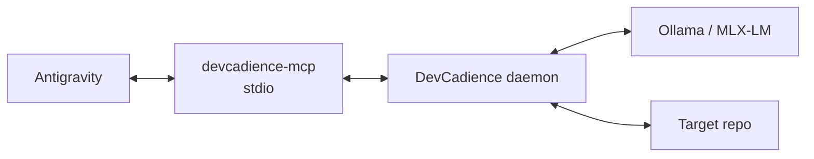

# Development Setup

## Status

DevCadience is currently at architecture/bootstrap stage. These instructions describe the intended development environment before code exists. Pin exact versions in `go.mod`, lock files and CI once implementation begins.

## 1. Target environment

Primary bootstrap target:
- macOS on Apple Silicon;
- 48 GB unified memory recommended for strong local coding models;
- Git;
- current supported Go toolchain;
- SQLite development/runtime support;
- at least one local LLM runtime: Ollama and/or MLX-LM;
- Antigravity for the first principal integration.

Linux should remain a control-plane compatibility target even though MLX is Apple-specific.

## 2. Clone

```bash
git clone https://github.com/olostan/DevCadience.git
cd DevCadience
```

## 3. Core tools

Recommended macOS tools:

```bash
brew install git go sqlite
```

Exact minimum Go version will be defined when the module is created.

Optional quality tools can be installed later through project scripts rather than requiring global setup.

## 4. Local model option A: Ollama

Install through the supported Ollama distribution/package for your platform. On Homebrew-based macOS environments:

```bash
brew install ollama
```

Start/verify according to the installed Ollama package.

Model selection is configuration. DevCadience should not hard-code one model name in architecture.

The bootstrap profile should target a strong coding model that fits with sufficient context headroom on the machine.

## 5. Local model option B: MLX-LM

MLX-LM requires Apple Silicon and Python.

A recommended isolated environment can use `uv`:

```bash
brew install uv
uv venv .venv-mlx
source .venv-mlx/bin/activate
uv pip install mlx-lm
```

DevCadience should communicate with MLX-LM through a controlled adapter/process boundary so the Go core does not absorb Python dependency semantics.

## 6. Keep machine headroom

Do not size local models based only on weight memory.

Leave memory for:
- macOS;
- IDE/Antigravity;
- DevCadience daemon;
- Git/worktrees;
- compiler/test processes;
- KV/context cache;
- reviewer model swapping.

The initial scheduler should prefer sequential strong-model use to unsafe memory saturation.

## 7. Proposed Go bootstrap

Once M1 begins:

```bash
go mod init github.com/olostan/DevCadience
go test ./...
```

Expected binaries:
- `devcadience` — CLI/daemon;
- `devcadience-mcp` — stdio semantic MCP adapter.

## 8. Local data directories

Do not store runtime state inside target project source trees by default.

Proposed layout:

```text
~/.devcadience/
  config/
  state/
  artifacts/
  worktrees/
  models/
  logs/
```

Per-project configuration references repository paths and policies.

Exact XDG/macOS conventions should be settled by ADR before implementation.

## 9. Target repository registration

Future CLI shape:

```bash
devcadience project add \
  --id hearthmind \
  --repo ~/src/HearthMind
```

This syntax is illustrative until implemented.

## 10. Validation setup

Each target project should define safe validation profiles through DevCadience configuration rather than allowing a model to invent arbitrary shell commands every run.

Example conceptual config:

```yaml
validation:
  fast:
    - ["go", "test", "./internal/..."]
    - ["go", "vet", "./..."]
  full:
    - ["go", "test", "./..."]
    - ["staticcheck", "./..."]
```

Commands are argv arrays by default.

## 11. Antigravity integration

The intended bootstrap topology is:



Antigravity should receive:
- the DevCadience principal Skill/Rules;
- semantic MCP tools;
- project design artifacts when useful.

The target source repository should not need to be Antigravity’s directly writable workspace in the strict information-firewall configuration.

Exact Antigravity MCP configuration should live under a versioned integration example once the MCP binary exists, because product configuration can evolve independently of DevCadience semantics.

## 12. External consultants

Consultants are optional during bootstrap.

Adapters should detect existing authenticated tools/configuration rather than asking users to paste credentials into prompts.

Examples could later include:
- Codex CLI;
- Claude Code;
- API-backed providers.

## 13. Development workflow

During M1/M2, run:

```bash
go test ./...
go vet ./...
```

Additional linters/static analyzers should be introduced with version pinning/CI.

## 14. Documentation

GitHub renders Mermaid fenced blocks directly in Markdown, so no documentation build step is required for the repository's core diagrams.

Keep a textual explanation around diagrams so the docs remain usable if rendering fails and remain accessible.

## 15. First end-to-end bootstrap

The first real setup demo should be:

1. start local model runtime;
2. start DevCadience daemon;
3. register a small target repository;
4. start `devcadience-mcp`;
5. configure Antigravity principal;
6. ask principal to inspect ProjectState;
7. issue a targeted investigation;
8. author a Work Package;
9. delegate to local implementer;
10. validate/review;
11. inspect ChangeReport;
12. accept or reject.

This demo is a milestone test, not merely onboarding documentation.

## 16. Troubleshooting principles

If local inference fails:
- verify runtime health;
- verify model/context configuration;
- inspect memory pressure;
- use structured runtime diagnostics;
- do not silently route private code to an external provider unless policy allows.

If MCP fails:
- test daemon application service independently;
- test MCP adapter separately;
- keep semantic logic out of transport layer.

If a task fails:
- preserve Attempt/artifacts;
- do not “fix” the database state manually unless recovery tooling explicitly supports it.
