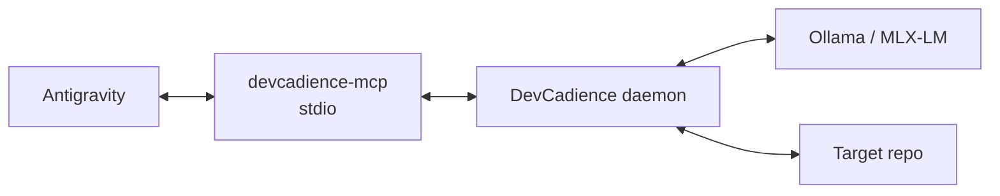

# Development Setup

## Status

The control-plane core (M1) is implemented and M2 is being developed separately. Sections below describing cognition runtimes, environment intelligence and principal-host setup define intended M3/M4 behavior; no model integration is required by the current core.

## 1. Target environment

Supported bootstrap starts from an ordinary macOS or Linux machine and assumes optional AI software may be absent.

Reference profiles include:
- Apple Silicon with 48 GB unified memory for strong local-model use;
- modest 32 GB-class Linux systems where only small local models may be practical;
- machines with no local LLM at all, using policy-authorized remote cognition.

Core prerequisites remain basic engineering tooling such as Git and the supported Go toolchain.

Ollama, MLX-LM, Antigravity, Cursor, VS Code, consultant CLIs and provider credentials are optional capabilities discovered/configured by guided setup rather than unconditional prerequisites.

## 2. Clone

```bash
git clone https://github.com/olostan/DevCadience.git
cd DevCadience
```

## 3. Core tools

Recommended macOS tools:

```bash
brew install git go sqlite
```

Exact minimum Go version will be defined when the module is created.

Optional quality tools can be installed later through project scripts rather than requiring global setup.

## 4. Optional local model option A: Ollama

Install through the supported Ollama distribution/package for your platform. On Homebrew-based macOS environments:

```bash
brew install ollama
```

Start/verify according to the installed Ollama package.

Model selection is configuration. DevCadience should not hard-code one model name in architecture.

The bootstrap profile should target a strong coding model that fits with sufficient context headroom on the machine.

## 5. Optional local model option B: MLX-LM

MLX-LM requires Apple Silicon and Python.

A recommended isolated environment can use `uv`:

```bash
brew install uv
uv venv .venv-mlx
source .venv-mlx/bin/activate
uv pip install mlx-lm
```

DevCadience should communicate with MLX-LM through a controlled adapter/process boundary so the Go core does not absorb Python dependency semantics.

## 6. Keep machine headroom

Do not size local models based only on weight memory.

Leave memory for:
- macOS;
- IDE/Antigravity;
- DevCadience daemon;
- Git/worktrees;
- compiler/test processes;
- KV/context cache;
- reviewer model swapping.

The initial scheduler should prefer sequential strong-model use to unsafe memory saturation.

## 7. Go bootstrap

The module is `github.com/olostan/DevCadience`. Its `go` directive is 1.25.0,
which the SQLite driver requires; a newer toolchain is fetched automatically
by recent Go releases.

```bash
make verify        # go vet ./... && go test ./... && schema validation
make build         # bin/devcadience
```

The build needs no C toolchain: the SQLite driver is pure Go
([ADR-0002](adr/0002-control-plane-persistence.md)).

Binaries:
- `devcadience` — CLI/daemon (implemented in M1);
- `devcadience-mcp` — stdio semantic MCP adapter (M4, not yet present).

## 7A. Guided bootstrap (M3)

The intended normal onboarding path is not manual runtime installation.

Conceptual commands:

```bash
devcadience doctor
devcadience setup
devcadience setup --dry-run
devcadience setup verify
```

The setup engine starts by discovering the machine and existing software.

It then:
1. assesses accelerator/runtime candidates;
2. discovers supported cognition CLIs/providers and authentication readiness;
3. discovers supported principal hosts;
4. recommends a deployment profile;
5. presents a structured remediation/install plan;
6. requests approval for mutating or privileged actions;
7. verifies actual inference acceleration/endpoint health;
8. performs lightweight capability benchmarks where useful.

No local model, principal host or consultant subscription is assumed.

See [ENVIRONMENT_INTELLIGENCE_AND_ONBOARDING.md](ENVIRONMENT_INTELLIGENCE_AND_ONBOARDING.md).

### Terminal experience

Interactive setup should use a restrained text UI suitable for local terminals and SSH:
- selections and confirmations;
- color/status marks with plain fallbacks;
- short progress/spinner feedback for genuinely long operations;
- accessible/basic prompt mode;
- `--no-tui` / machine-readable operation for automation.

The intended Go UI stack is Huh v2, using Bubble Tea v2/Lip Gloss v2 underneath when richer dynamic behavior is needed.

## 8. Local data directories

Do not store runtime state inside target project source trees by default.

Proposed layout:

```text
~/.devcadience/
  config/
  state/
  artifacts/
  worktrees/
  models/
  logs/
```

Per-project configuration references repository paths and policies.

Settled by [ADR-0002](adr/0002-control-plane-persistence.md) §9: the
control-plane database is `$DEVCADIENCE_HOME/state/control-plane.db`, with
`DEVCADIENCE_HOME` defaulting to `~/.devcadience`. The path must be absolute.
`devcadience -db <path>` overrides it, which is what the test suite and
throwaway experiments use. A full XDG layout was not adopted: the macOS-first
target and the single `DEVCADIENCE_HOME` indirection cover the need with one
variable.

## 9. Target repository registration

Future CLI shape:

```bash
devcadience project add \
  --id hearthmind \
  --repo ~/src/HearthMind
```

This syntax is illustrative until implemented.

## 10. Validation setup

Each target project should define safe validation profiles through DevCadience configuration rather than allowing a model to invent arbitrary shell commands every run.

Example conceptual config:

```yaml
validation:
  fast:
    - ["go", "test", "./internal/..."]
    - ["go", "vet", "./..."]
  full:
    - ["go", "test", "./..."]
    - ["staticcheck", "./..."]
```

Commands are argv arrays by default.

## 11. Principal host integration

The initial first-class principal hosts are:
- Antigravity (reference integration);
- Cursor;
- Visual Studio Code.

No host is assumed to already be installed.

Guided setup should prefer a compatible host the user already has. If none is installed, it should present the supported choices, help the user install/configure the selected host, and allow setup to be deferred.

See [PRINCIPAL_HOSTS.md](PRINCIPAL_HOSTS.md).

### Antigravity reference integration

The intended bootstrap topology is:



Antigravity should receive:
- the DevCadience principal Skill/Rules;
- semantic MCP tools;
- project design artifacts when useful.

The target source repository should not need to be Antigravity’s directly writable workspace in the strict information-firewall configuration.

The concrete configuration, strict principal-workspace topology, plugin packaging, permissions strategy, smoke test, and current Antigravity file locations are specified in [ANTIGRAVITY_INTEGRATION.md](ANTIGRAVITY_INTEGRATION.md).

A versioned plugin skeleton is already maintained under `integrations/antigravity/devcadience/`. It becomes directly usable once the `devcadience-mcp` binary is implemented and available on PATH.

## 12. External cognition and consultants

Consultants are optional.

Setup should detect usable existing cognition endpoints/authenticated CLIs before asking the user to create new credentials or subscriptions.

Examples may include:
- Codex CLI;
- Claude Code;
- Gemini/provider tooling;
- future supported consultant integrations;
- API-backed providers.

No particular consultant provider is required. Missing consultant capability should be reported as reduced cognitive diversity, not setup failure.

## 13. Development workflow

During M1/M2, run:

```bash
go test ./...
go vet ./...
```

Additional linters/static analyzers should be introduced with version pinning/CI.

## 14. Documentation

GitHub renders Mermaid fenced blocks directly in Markdown, so no documentation build step is required for the repository's core diagrams.

Keep a textual explanation around diagrams so the docs remain usable if rendering fails and remain accessible.

## 15. First end-to-end bootstrap

The first real setup demo should begin from a blank or intentionally stripped environment:

1. run environment discovery/doctor;
2. choose or confirm a deployment profile;
3. configure any desired local runtime and verify the actual acceleration backend, or explicitly choose no-local-model operation;
4. discover/configure at least one implementation cognition endpoint;
5. discover an existing principal host or select/install one of Antigravity, Cursor or VS Code;
6. start DevCadience daemon;
7. register a small target repository;
8. start `devcadience-mcp`;
9. verify the principal-host semantic connection;
10. ask principal to inspect ProjectState;
11. issue a targeted investigation;
12. author a Work Package;
13. delegate to an implementation worker;
14. validate/review;
15. inspect ChangeReport;
16. accept or reject.

The same core flow should be demonstrable under strong-local and hybrid/no-local-model configurations.

This demo is a milestone test, not merely onboarding documentation.

## 16. Troubleshooting principles

If local inference fails:
- verify runtime health;
- verify model/context configuration;
- inspect memory pressure;
- use structured runtime diagnostics;
- do not silently route private code to an external provider unless policy allows.

If MCP fails:
- test daemon application service independently;
- test MCP adapter separately;
- keep semantic logic out of transport layer.

If a task fails:
- preserve Attempt/artifacts;
- do not “fix” the database state manually unless recovery tooling explicitly supports it.
