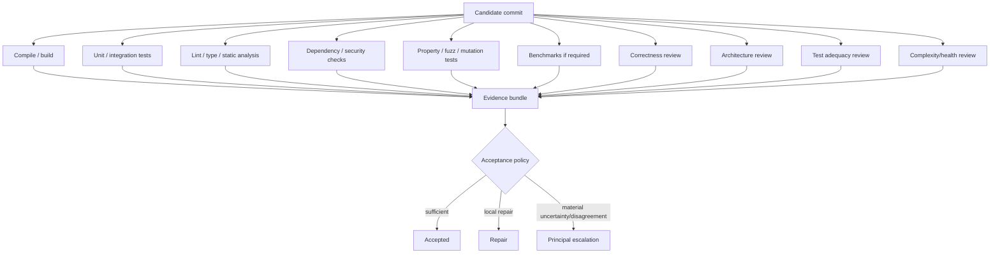
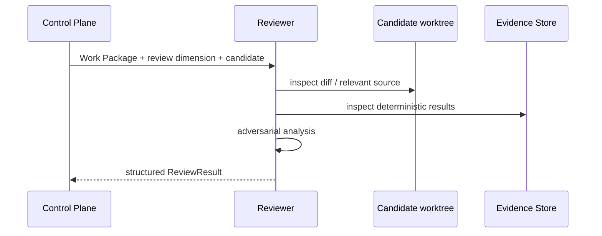
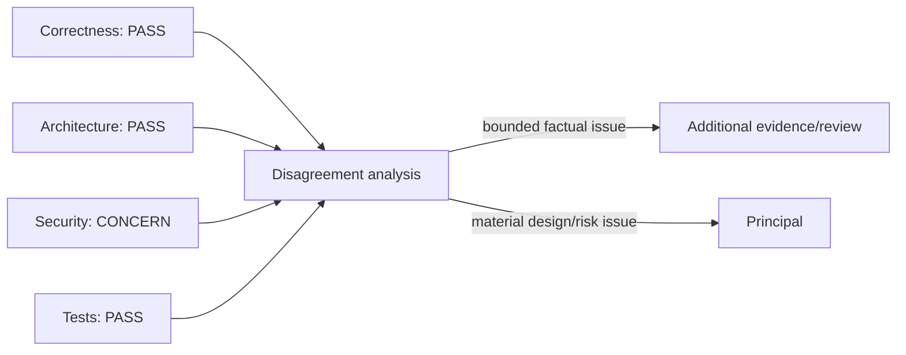
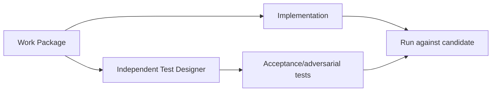

# Verification and Review

## Scope

DevCadience separates deterministic verification, model-assisted review, evidence quality, and acceptance policy. No single signal proves correctness.

## 1. Verification stack



Not every task requires every check. Policy chooses based on risk and scope.

## 2. Deterministic validation

For deterministic claims, tools are authoritative.

A ValidationResult records:
- exact command/tool;
- tool version;
- commit/worktree;
- exit status;
- timestamps;
- parsed summary;
- stdout/stderr artifact;
- truncation.

The model may explain a failure but cannot rewrite the underlying result.

## 3. Validation profiles

Projects define reusable validation profiles, e.g.:

```yaml
profiles:
  fast:
    - go test ./internal/...
    - go vet ./...
  full:
    - go test ./...
    - go vet ./...
    - staticcheck ./...
  concurrency:
    - go test -race ./...
  protocol:
    - go test ./...
    - ./scripts/validate-schemas
```

A Work Package selects required profiles and may add task-specific checks.

## 4. Independent model review

Reviewers receive a clean context.



The reviewer should not be told “the implementer believes this is correct.”

## 5. Work Package compliance

Each MUST requirement should have an explicit disposition:
- satisfied;
- violated;
- not applicable by authorized revision;
- unable to verify.

SHOULD deviations require explanation.

SUGGESTED deviations are informational.

## 6. Review dimensions

### Correctness
Behavior, edge cases, state transitions, errors.

### Architecture
Responsibility, dependency direction, contracts, invariants.

### Security
Trust boundaries, injection, credentials, authority, unsafe operations.

### Test adequacy
Does the test suite actually exercise the acceptance/failure model?

### Concurrency
Ownership, cancellation, races, ordering, deadlock/livelock.

### Performance
Measured bottlenecks and regressions when relevant.

### Maintainability
Complexity, duplication, indirection, conceptual clarity.

## 7. Disagreement as risk

A useful signal is not “average confidence”; it is whether independent reviewers converge.



## 8. Seeded defect evaluation

To evaluate reviewer quality, DevCadience should maintain fixture repositories/tasks with known defects:
- off-by-one boundary;
- missing cancellation;
- public API break;
- unsafe path join;
- data race;
- schema compatibility regression;
- missing error propagation;
- duplicate abstraction.

Measure:
- true-positive detection;
- false-positive rate;
- severity calibration;
- evidence quality.

This allows empirical routing rather than intuition about model strength.

## 9. Mutation/property/fuzz testing

Because local compute is cheap and time is flexible, high-value tasks may use deeper automated techniques.

Examples:
- mutation testing for business logic;
- property tests for serialization/state machines;
- fuzzing parsers/protocol boundaries;
- race detector for concurrency;
- long soak tests for process management.

These are especially useful overnight.

## 10. Test generation independence

A Test Designer may generate tests before seeing candidate implementation.



This reduces tests that merely mirror implementation structure.

## 11. Validation retries

A validation failure may return to the implementer when:
- failure is within Work Package scope;
- repair does not require architecture changes;
- retry budget remains;
- evidence is clear.

Otherwise route to Failure Analyst or principal.

## 12. Acceptance policy

An accepted change requires:
- deterministic mandatory checks passing;
- no unresolved MUST violation;
- required review dimensions complete;
- material disagreements resolved or explicitly accepted by authorized decision;
- integration feasibility;
- lineage complete.

For architectural changes, acceptance may require principal review even if all local signals pass.

## 13. Integration verification

A task passing in isolation is not enough.

After combining accepted tasks:
- merge/cherry-pick into integration worktree;
- resolve conflicts under policy;
- run integration/full validation;
- compare API/schema state;
- detect dependency interaction;
- only then advance accepted main.

## 14. Verification artifacts

Retain according to policy:
- command logs;
- test reports;
- coverage;
- benchmark outputs;
- review results;
- diff summaries;
- API/schema diffs;
- tool versions.

Large outputs should use artifact references, not bloated database rows.

## 15. Verification anti-patterns

- “all tests pass” without command evidence;
- one model reviewing its own change in same context;
- adding tests after implementation solely to make current behavior look correct;
- treating line coverage as correctness;
- running every expensive check on every trivial task;
- skipping deep checks on risky tiny changes because LOC is small;
- majority-vote acceptance without analyzing disagreement.
