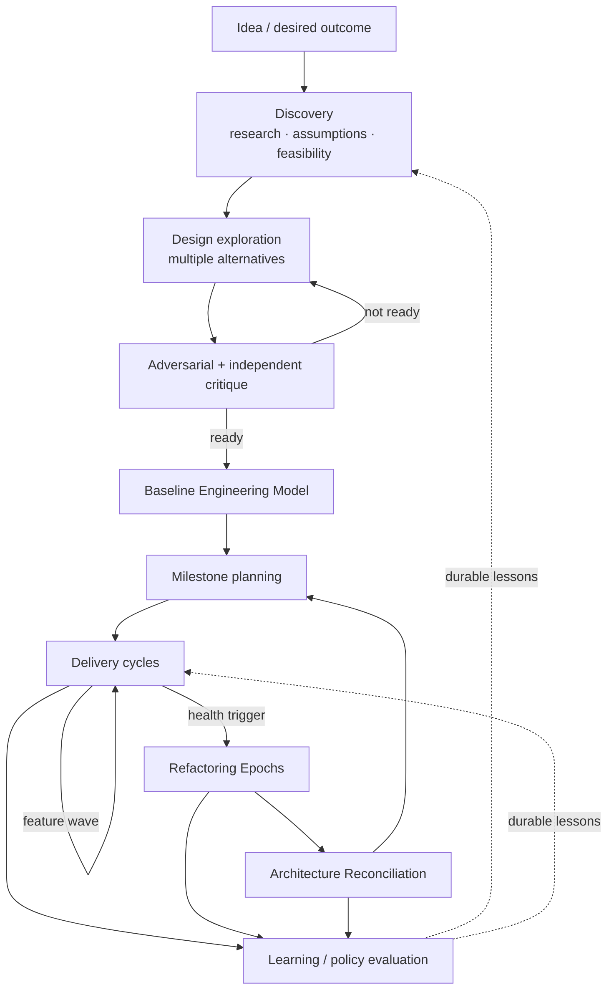
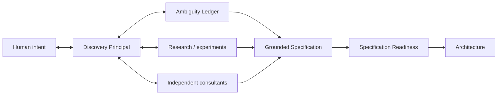

# DevCadence Vision

## 1. Vision

DevCadence is an intelligent development control plane that turns whatever engineering cognition resources a developer actually has into a disciplined, persistent software-engineering organization.

Those resources may include local models, authenticated coding/agent CLIs backed by subscriptions or organizational quotas, direct metered APIs, prepaid/enterprise allocations, one provider, many providers, or no model cognition at all.

DevCadence is vendor-neutral. It does not encode a belief that any provider is intrinsically best for architecture, coding, review, or consultation. Roles are stable; endpoints are replaceable and selected from policy plus evidence.

The target user experience is deceptively simple:

> Run DevCadence, let it sense the machine and available AI resources, state privacy/spending/preferences, and receive a safe, explainable engineering configuration that adapts as resources change.

## 2. Why now

Leading models from multiple providers, practical local inference, subscription-backed agent CLIs/SDKs, MCP, structured agent event streams and deterministic engineering tooling make heterogeneous orchestration practical. "Price per API token" is no longer a sufficient economic model because the same high-capability cognition may be local, subscription-included, quota-bound, enterprise-allocated or metered.

The opportunity is to build the missing adaptive coordination layer.

## 3. Economic and resource model

DevCadence does not classify a model family itself as "cheap" or "expensive." Economics belong to the endpoint/access path.

It separates:
- **EconomicRegime** — how usage is charged or constrained;
- **BudgetPool** — the quota/credits/local resource pool an endpoint consumes;
- **BudgetState** — current observable pressure, reset window, concurrency or availability;
- **capability/effectiveness** — whether an endpoint is good enough for a role;
- **workflow cost** — total resources consumed to reach an accepted result, including retries and reviewer/principal re-entry.

Subscription-included cognition is not free when its quota is scarce. A cheap API is not economical if it needs repeated repair/review. Local cognition may support many iterations when wall-clock time is abundant.

The optimization target is **accepted engineering quality under user policy and scarce-resource constraints**, not minimum token count, maximum local utilization, or maximum agent count.

## 4. Compressed intelligence

A key product concept is **compressed intelligence**.

A carefully reasoned ADR, invariant, algorithm, pseudocode block or Engineering Work Package may contain only hundreds or thousands of tokens while representing hours of research, alternative analysis and critique.

That artifact can guide many local execution steps without replaying the entire reasoning process.

DevCadence should preserve such artifacts as first-class project memory.

## 5. Human role

Humans remain decision owners where policy requires them.

DevCadence should amplify human agency by:
- surfacing meaningful decisions rather than implementation chatter;
- presenting alternatives and evidence;
- preserving uncertainty;
- escalating irreversible or product-semantic questions;
- making autonomous work auditable;
- allowing operators to set risk and consultant budgets.

The target experience is not “watch the agent type.” It is “manage an engineering organization.”

## 6. Principal role

The Principal is a role, not a provider class. It requires capabilities such as architecture/system reasoning, specification, alternatives analysis, repository reasoning and reliable structured output. Different users may assign different endpoints to Principal and independent architecture review.

## 7. Execution organization

Roles are stable abstractions; models/providers/access channels are replaceable implementations.

DevCadence MUST NOT assume every task requires every role as a separate model session. A Workflow Planner chooses a task-specific topology from risk, policy, resource availability and expected value. With one capable subscription endpoint, one bounded session plus deterministic validation may be better than five artificial passes. With abundant local cognition plus scarce Principal quota, many local repair/review loops may be economical.

## 8. Cognition portfolio and consultants

A **Cognition Portfolio** is the validated mapping between engineering roles, eligible cognition endpoints, budget pools, fallback/escalation rules and execution constraints.

A Cognition Portfolio Planner may use any sufficiently capable available endpoint to synthesize recommendations from deterministic ResourceInventory + user policy + DevCadence role requirements. The planner is advisory: deterministic validation rejects nonexistent endpoints, unsupported capabilities, privacy/spending violations, impossible driver features and false independence claims.

Consultation is a role/independence constraint over the same endpoint inventory, not a privileged provider category.

Portfolio adaptation is explicit and auditable. Adding a subscription, API budget, GPU, runtime or model may produce a configuration delta rather than requiring a reinstall.

## 9. Idea-to-production lifecycle

A new project is deliberately allowed to spend substantial time in discovery and design before implementation.

The lifecycle is intentionally iterative: design artifacts are durable but revisable through explicit decisions.

## 10. Adaptive rigor

Not every change deserves an architecture committee.

DevCadence classifies change impact:

### Local
Small, bounded, no durable contract or architecture impact.
Fast path: principal or templated design -> local execution -> validation/review.

### Systemic
Cross-component or semantically meaningful.
Normal path: scout -> principal alternatives/strategy -> detailed Work Package -> multiple review vectors.

### Architectural
Changes durable boundaries, invariants, security, persistence, APIs, concurrency model or platform assumptions.
Deep path: research -> independent consultant passes -> alternatives -> adversarial critique -> ADR -> Work Packages -> reconciliation after implementation.

Risk overrides apparent size. A two-line security or data-loss change may require deep path.

## 11. Time posture

Wall-clock speed is not the primary constraint.

It is acceptable for an architectural change to spend hours on:
- repository scouting;
- web/current-source verification;
- consultant analysis;
- prototypes;
- benchmarks;
- multiple design iterations;
- adversarial review.

LLMs are still much faster than equivalent human design cycles. Starting implementation later with a much better design is a feature.

## 12. Code-health vision

DevCadence assumes autonomous implementation will create entropy unless explicitly countered.

The system continuously records health signals and schedules planned cleanup.

Health includes:
- structural metrics;
- semantic duplication;
- API coherence;
- dependency direction;
- domain vocabulary;
- test architecture;
- documentation drift;
- abstraction quality;
- configuration growth;
- dead code;
- unnecessary indirection.

The question at Architecture Reconciliation is:

> Given everything we know now, would we still design the system this way?

If not, DevCadence plans controlled migration rather than normalizing drift.

## 13. Learning vision

DevCadence improves primarily through **system learning**, not immediate model fine-tuning.

It stores trajectories and derives candidates such as:
- project invariants;
- engineering skills;
- task decomposition heuristics;
- reviewer selection rules;
- escalation thresholds;
- model routing policies;
- prompt changes;
- new deterministic checks.

Candidates are evaluated and promoted under governance.

Over time the system builds empirical knowledge such as:
- which available cognition endpoint is best for Go implementation under a given cost/privacy profile;
- which reviewer catches API compatibility regressions;
- which task shapes correlate with local failure;
- when independent N-version implementation is worth the cost;
- which design-review dimensions predict later refactoring.

## 14. Success criteria

### Bootstrap success
- principal consumes compact state/evidence rather than whole repository;
- principal produces a detailed, grounded Work Package;
- at least one configured implementation cognition path successfully implements several real tasks;
- deterministic verification is trustworthy;
- independent local review catches at least some seeded or natural defects;
- contradictions can escalate cleanly;
- lineage can reconstruct why a change was accepted.

### Product success
- significant reduction in frontier repository-token consumption versus cloud-only agent trajectories;
- no degradation in accepted change quality;
- lower human review burden for routine implementation;
- measurable detection of architectural/code-health regressions;
- repeatable autonomous milestone execution;
- learned policies improve evaluated trajectories over time.

### Long-term success
A mature DevCadence instance can manage a medium/large project for long periods while:
- keeping architecture coherent;
- preserving decisions;
- using frontier quota primarily for reasoning;
- using low-cost cognition and deterministic compute heavily for implementation/verification;
- surfacing only high-value decisions to humans;
- learning from its own engineering history.

## 14A. Adaptive deployment vision

DevCadence should feel helpful before the user understands local-LLM tooling.

A blank machine is a supported starting state. The system should discover hardware, installed AI tools, usable authentication and principal hosts; verify actual inference acceleration; recommend a deployment profile; and guide the operator through the smallest useful configuration.

The same control-plane protocols should support:
- strong-local workstations;
- hybrid thin nodes using small local cognition plus remote implementation/review;
- no-local-model systems with local repository authority and remote cognition;
- offline deterministic operation with model-dependent roles unavailable.

Antigravity, Cursor and Visual Studio Code are the initial first-class principal hosts. Antigravity is the reference integration, not an architectural dependency.

See [ENVIRONMENT_INTELLIGENCE_AND_ONBOARDING.md](ENVIRONMENT_INTELLIGENCE_AND_ONBOARDING.md) and [PRINCIPAL_HOSTS.md](PRINCIPAL_HOSTS.md).

## 14B. Brownfield adoption vision

DevCadence should be adoptable by an existing project even when that repository was never designed for DevCadence and has little or poor documentation.

The system should:
- inventory the repository and all available documentation;
- reconstruct current behavior/contracts from source, tests, schemas, configuration and history;
- expose contradictions and unknowns instead of smoothing them over;
- ask humans only for decisions that actually require human/product authority;
- materialize a mandatory canonical project documentation baseline in Git;
- refuse normal managed implementation until the Adoption Readiness Gate passes.

The point is not to force old projects into a cosmetic template. The point is to create a predictable, version-controlled engineering contract from which future principal/worker sessions can operate safely.

See [PROJECT_ADOPTION.md](PROJECT_ADOPTION.md).

## 15. What we deliberately do not promise

DevCadence does not assume:
- local models are reliable merely because they are cheap;
- frontier models are correct merely because they are large;
- consensus implies truth;
- tests prove architecture;
- more agents always improve results;
- autonomous self-improvement is safe without governance;
- one provider or benchmark defines engineering capability.

The system exists precisely because every participant can be wrong.

## 16. Discovery as frontier work

DevCadence treats product disambiguation as one of the highest-leverage uses of frontier intelligence.

The frontier principal should not simply transform the first human description into architecture. It collaborates with the human through an explicit Discovery & Specification loop:

The principal must distinguish what only the human can decide from what can be established through tools, current sources, experiments or independent analysis.

Long discovery is acceptable when the cost of implementing the wrong interpretation is high. The output is compressed, durable intelligence: ProblemModel, ProductDecisions, requirements with provenance, resolved ambiguity and an explicit readiness report.

See [DISCOVERY_AND_SPECIFICATION.md](DISCOVERY_AND_SPECIFICATION.md).
