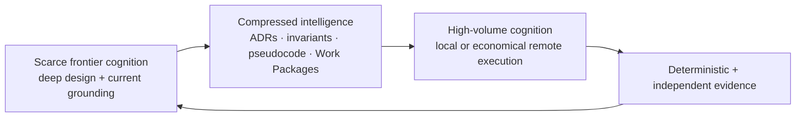
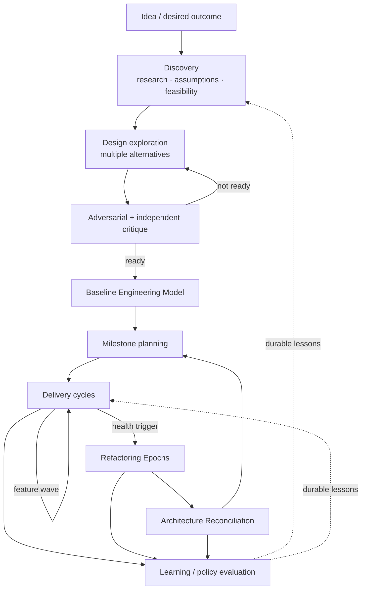
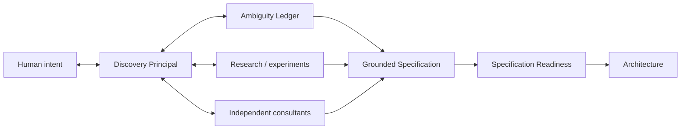

# DevCadence Vision

## 1. Vision

DevCadence is an intelligent development hub that turns a collection of heterogeneous AI models and engineering tools into a disciplined, persistent software-engineering organization.

Its purpose is not to maximize the amount of code generated by AI. Its purpose is to maximize the quality, traceability and durability of engineering decisions while using compute economically.

The system should be capable of supporting the entire life of a software project:
- a human describes an idea;
- frontier intelligence helps turn it into a well-grounded problem definition;
- multiple independent perspectives critique the design;
- assumptions are verified against current external knowledge and the repository;
- architecture, invariants, contracts and milestones become durable artifacts;
- frontier principals produce detailed Engineering Work Packages;
- bounded execution workers implement, test, debug and review repeatedly using local or policy-authorized remote cognition;
- deterministic tools establish facts;
- disagreements trigger additional cognition;
- architectural decisions are preserved;
- code health is periodically restored through planned refactoring;
- mistakes produce evaluated lessons rather than being forgotten;
- the system can operate autonomously for long periods while retaining bounded authority and clear escalation.

## 2. Why now

Three capabilities have converged:

1. Frontier models can perform high-quality software design, research and multi-step reasoning, but repeated large-context coding trajectories are quota- or cost-intensive.
2. Strong local coding models can run on some modern personal hardware, while smaller local models and economical remote cognition make the same control plane useful on substantially weaker machines.
3. MCP, coding-agent harnesses, Git worktrees, structured outputs and provider CLIs make heterogeneous orchestration practical without owning every execution environment.

The opportunity is to build the missing coordination layer.

## 3. Economic model

DevCadence does not assume that frontier tokens are always paid per token. They may be limited by subscription quotas, rate windows or organizational budgets.

The scarce resource is **frontier context and frontier invocation budget**.

The abundant/controllable resources are:
- local model tokens when hardware permits;
- economical remote cognition when policy permits;
- wall-clock time;
- deterministic compute;
- repeated tests;
- multiple independent reviews.

Therefore:
- do not minimize valuable frontier thinking;
- minimize unnecessary frontier ingestion of source/log repetition;
- compress expensive cognition into durable small artifacts;
- spend low-cost local or remote cognition freely when policy permits to reduce uncertainty before escalation.

## 4. Compressed intelligence

A key product concept is **compressed intelligence**.

A carefully reasoned ADR, invariant, algorithm, pseudocode block or Engineering Work Package may contain only hundreds or thousands of tokens while representing hours of research, alternative analysis and critique.

That artifact can guide many local execution steps without replaying the entire reasoning process.

DevCadence should preserve such artifacts as first-class project memory.

## 5. Human role

Humans remain decision owners where policy requires them.

DevCadence should amplify human agency by:
- surfacing meaningful decisions rather than implementation chatter;
- presenting alternatives and evidence;
- preserving uncertainty;
- escalating irreversible or product-semantic questions;
- making autonomous work auditable;
- allowing operators to set risk and consultant budgets.

The target experience is not “watch the agent type.” It is “manage an engineering organization.”

## 6. Principal role

The frontier principal behaves like a very patient staff/principal engineer.

It is expected to:
- understand product intent;
- research relevant external information;
- reason over compact project state;
- ask local scouts for repository facts;
- identify alternatives;
- challenge its own assumptions;
- consult other frontier systems when useful;
- choose and explain designs;
- encode implementation semantics precisely;
- define verification and escalation;
- periodically revisit whether the architecture still fits reality.

The principal is intentionally allowed to spend significant time thinking before implementation begins.

## 7. Execution organization

Execution workers are not one generic worker. They may be backed by local models, economical remote cognition endpoints, or deterministic tooling according to capability and policy.

Roles include:
- Repository Scout;
- Implementer;
- Correctness Reviewer;
- Architecture/Invariant Reviewer;
- Security Reviewer;
- Test Designer;
- Failure Analyst;
- Complexity/Smell Reviewer;
- Refactoring Worker;
- Postmortem Analyst.

Roles are stable abstractions. Models are replaceable implementations of roles.

## 8. Consultants

Consultants extend cognitive diversity.

A consultant may be:
- Codex/OpenAI;
- Claude;
- another Gemini configuration;
- a specialized local model;
- a static analysis or formal tool.

Consultant policy determines when independent reasoning is worth the quota. No individual consultant subscription is required; the system should use compatible endpoints the operator actually has.

Consultants are not “higher truth.” Their value is independent analysis and disagreement.

## 9. Idea-to-production lifecycle

A new project is deliberately allowed to spend substantial time in discovery and design before implementation.

The lifecycle is intentionally iterative: design artifacts are durable but revisable through explicit decisions.

## 10. Adaptive rigor

Not every change deserves an architecture committee.

DevCadence classifies change impact:

### Local
Small, bounded, no durable contract or architecture impact.
Fast path: principal or templated design -> local execution -> validation/review.

### Systemic
Cross-component or semantically meaningful.
Normal path: scout -> principal alternatives/strategy -> detailed Work Package -> multiple review vectors.

### Architectural
Changes durable boundaries, invariants, security, persistence, APIs, concurrency model or platform assumptions.
Deep path: research -> independent consultant passes -> alternatives -> adversarial critique -> ADR -> Work Packages -> reconciliation after implementation.

Risk overrides apparent size. A two-line security or data-loss change may require deep path.

## 11. Time posture

Wall-clock speed is not the primary constraint.

It is acceptable for an architectural change to spend hours on:
- repository scouting;
- web/current-source verification;
- consultant analysis;
- prototypes;
- benchmarks;
- multiple design iterations;
- adversarial review.

LLMs are still much faster than equivalent human design cycles. Starting implementation later with a much better design is a feature.

## 12. Code-health vision

DevCadence assumes autonomous implementation will create entropy unless explicitly countered.

The system continuously records health signals and schedules planned cleanup.

Health includes:
- structural metrics;
- semantic duplication;
- API coherence;
- dependency direction;
- domain vocabulary;
- test architecture;
- documentation drift;
- abstraction quality;
- configuration growth;
- dead code;
- unnecessary indirection.

The question at Architecture Reconciliation is:

> Given everything we know now, would we still design the system this way?

If not, DevCadence plans controlled migration rather than normalizing drift.

## 13. Learning vision

DevCadence improves primarily through **system learning**, not immediate model fine-tuning.

It stores trajectories and derives candidates such as:
- project invariants;
- engineering skills;
- task decomposition heuristics;
- reviewer selection rules;
- escalation thresholds;
- model routing policies;
- prompt changes;
- new deterministic checks.

Candidates are evaluated and promoted under governance.

Over time the system builds empirical knowledge such as:
- which available cognition endpoint is best for Go implementation under a given cost/privacy profile;
- which reviewer catches API compatibility regressions;
- which task shapes correlate with local failure;
- when independent N-version implementation is worth the cost;
- which design-review dimensions predict later refactoring.

## 14. Success criteria

### Bootstrap success
- principal consumes compact state/evidence rather than whole repository;
- principal produces a detailed, grounded Work Package;
- at least one configured implementation cognition path successfully implements several real tasks;
- deterministic verification is trustworthy;
- independent local review catches at least some seeded or natural defects;
- contradictions can escalate cleanly;
- lineage can reconstruct why a change was accepted.

### Product success
- significant reduction in frontier repository-token consumption versus cloud-only agent trajectories;
- no degradation in accepted change quality;
- lower human review burden for routine implementation;
- measurable detection of architectural/code-health regressions;
- repeatable autonomous milestone execution;
- learned policies improve evaluated trajectories over time.

### Long-term success
A mature DevCadence instance can manage a medium/large project for long periods while:
- keeping architecture coherent;
- preserving decisions;
- using frontier quota primarily for reasoning;
- using low-cost cognition and deterministic compute heavily for implementation/verification;
- surfacing only high-value decisions to humans;
- learning from its own engineering history.

## 14A. Adaptive deployment vision

DevCadence should feel helpful before the user understands local-LLM tooling.

A blank machine is a supported starting state. The system should discover hardware, installed AI tools, usable authentication and principal hosts; verify actual inference acceleration; recommend a deployment profile; and guide the operator through the smallest useful configuration.

The same control-plane protocols should support:
- strong-local workstations;
- hybrid thin nodes using small local cognition plus remote implementation/review;
- no-local-model systems with local repository authority and remote cognition;
- offline deterministic operation with model-dependent roles unavailable.

Antigravity, Cursor and Visual Studio Code are the initial first-class principal hosts. Antigravity is the reference integration, not an architectural dependency.

See [ENVIRONMENT_INTELLIGENCE_AND_ONBOARDING.md](ENVIRONMENT_INTELLIGENCE_AND_ONBOARDING.md) and [PRINCIPAL_HOSTS.md](PRINCIPAL_HOSTS.md).

## 14B. Brownfield adoption vision

DevCadence should be adoptable by an existing project even when that repository was never designed for DevCadence and has little or poor documentation.

The system should:
- inventory the repository and all available documentation;
- reconstruct current behavior/contracts from source, tests, schemas, configuration and history;
- expose contradictions and unknowns instead of smoothing them over;
- ask humans only for decisions that actually require human/product authority;
- materialize a mandatory canonical project documentation baseline in Git;
- refuse normal managed implementation until the Adoption Readiness Gate passes.

The point is not to force old projects into a cosmetic template. The point is to create a predictable, version-controlled engineering contract from which future principal/worker sessions can operate safely.

See [PROJECT_ADOPTION.md](PROJECT_ADOPTION.md).

## 15. What we deliberately do not promise

DevCadence does not assume:
- local models are reliable merely because they are cheap;
- frontier models are correct merely because they are large;
- consensus implies truth;
- tests prove architecture;
- more agents always improve results;
- autonomous self-improvement is safe without governance;
- one provider or benchmark defines engineering capability.

The system exists precisely because every participant can be wrong.

## 16. Discovery as frontier work

DevCadence treats product disambiguation as one of the highest-leverage uses of frontier intelligence.

The frontier principal should not simply transform the first human description into architecture. It collaborates with the human through an explicit Discovery & Specification loop:

The principal must distinguish what only the human can decide from what can be established through tools, current sources, experiments or independent analysis.

Long discovery is acceptable when the cost of implementing the wrong interpretation is high. The output is compressed, durable intelligence: ProblemModel, ProductDecisions, requirements with provenance, resolved ambiguity and an explicit readiness report.

See [DISCOVERY_AND_SPECIFICATION.md](DISCOVERY_AND_SPECIFICATION.md).
