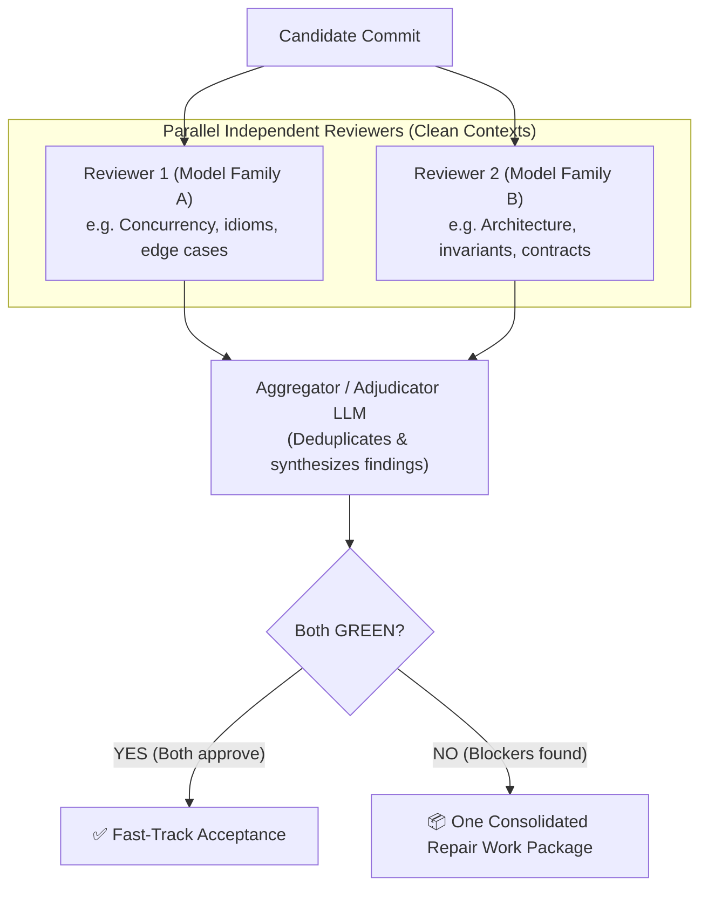

# ADR-0019: Non-Conversational Cognition, Working-Memory Garbage Collection, and Bidirectional Review

- **Status:** Accepted
- **Date:** 2026-09-25
- **Decision owner:** Principal / Human
- **Supersedes:** none
- **Superseded by:** none
- **Related invariants:** DCI-001, DCI-008, DCI-020, DCI-021, DCI-040, DCI-050, DCI-055, DCI-060, DCI-108
- **Related tasks:** WP-M3B (1–8 empirical review baseline), M3C, M3D, M4, M7

---

## Context

During the implementation and closure of Milestone M3B (tracked across PR #10, encompassing WP-M3B-1 through WP-M3B-8), the development of DevCadence was driven through an external, manual simulation of the control plane (`AGENT_HANDOFF_PROTOCOL.md`).

This empirical campaign yielded critical findings regarding how frontier and local models actually behave under work-package delegation and independent review:

1. **The "Chat Trap"**: When engineering agents run in conversational loops, prompt context grows monotonically with every tool call, compiler error, and bash output. By turn 20, a prompt exceeds 100k–150k tokens. Every subsequent turn re-processes this entire bloated history. This causes:
   - Severe quadratic token and compute waste;
   - Prompt fatigue and attention dilution (models miss subtle instructions amidst 100k tokens of dead transcripts);
   - Sunk-cost confirmation bias (models anchor on their own earlier guesses and defend them rather than checking ground truth).
2. **The "Frozen" Trap**: Early process rules stated that accepted Work Packages were "frozen". In practice, when implementing WP-5 or WP-8, reality revealed that an interface or decision made in WP-2 was clunky or lacked essential parameters. Under dogmatic freezing, models are forced to write awkward shims, wrappers, and workarounds to avoid touching upstream packages, causing rapid architectural rot.
3. **The Artificial Turn-Limit Trap**: Attempting to prevent runaway agent loops by telling the model *"You have a budget of N turns"* induces "budget anxiety": models rush, skip essential verifications, and hallucinate conclusions when running low on turns.
4. **The Lossy Distillation Trap**: Attempting to save tokens by asking models to summarize or distill source code into prose strips away exact types, error contracts, edge-case comments, and off-by-one checks, injecting hallucinations into downstream reasoning.
5. **The Power of Clean-Context Independent Review**: Conversely, spawning an independent reviewer in a fresh, clean session (containing only the EWP, diff, and deterministic test results) consistently caught deep bugs that the authoring agent was blind to (e.g. tautological test fixtures, character-device TTY quirks, and missing readiness mappings). When a reviewer ran mutation testing (temporarily disabling a diagnostic to verify the test failed), it provided ironclad correctness proof.

This decision formalizes the mechanisms needed to internalize these empirical discoveries into the native DevCadence control plane.

---

## Verified facts

1. **Transformer Statelessness & Pricing**: In transformer architectures, all prompt tokens must be computed on every forward pass. In a 20-turn chat growing by 5k tokens per turn, over 1,000,000 cumulative tokens are processed.
2. **Prefix Prompt Caching**: Major frontier providers (Anthropic, Gemini, OpenAI) offer 75% to 90% cost/latency discounts when the prompt prefix is static and exceeds minimum cache thresholds (e.g. 1,024 tokens). Modifying text in the middle of a prompt invalidates the cache from that point forward; appending strictly to the end preserves cache hits.
3. **Context Length vs. Model Reasoning**: Empirical benchmarks across both frontier (Claude 3.7, Gemini 2.0 Flash, GPT-4o) and local models (Llama 3 8B, Qwen 2.5 14B) show reasoning degradation, instruction non-compliance, and hallucination increase significantly when active prompts exceed 30k–50k tokens with noisy conversational debris.
4. **Provider Cognitive Diversity**: Different model families exhibit orthogonal blind spots. Claude excels at Go idioms, concurrency synchronization, and cancellation lifetimes; Gemini and OpenAI excel at broad schema invariants, boundary conditions, and contract coverage.

---

## Assumptions

1. Direct APIs (`LocalityRemoteAPI`) allow fine-grained control over prompt construction and prefix caching.
2. Authenticated coding CLIs (`LocalityAuthenticatedCLI`) can be spawned in scoped, ephemeral sessions for specific attempts or reviews.
3. Local models (`LocalityLocal`) on Apple Silicon or Linux GPUs benefit most drastically from tight working-memory bounds (staying under 12k tokens).

---

## Decision criteria

- **Correctness over Ceremony**: The process must increase software quality, not create bureaucratic overhead.
- **Cognitive Freedom**: Models must have unrestricted freedom to inspect code until certain, without artificial turn countdowns.
- **Zero Hallucination (Verbatim Code)**: Models must inspect exact, untranslated code, not lossy summaries.
- **Token and Compute Efficiency**: Maximize KV prefix caching; eliminate conversational debris.
- **Anti-Rot (Living Architecture)**: Bottom-up feedback from local execution must be able to challenge and refactor upstream baselines cleanly.

---

## Decision

DevCadence adopts the **Non-Conversational Cognition and Adaptive Review Architecture**, structured across five core mechanisms:

### 1. Working-Memory Active Snippet Pool (Request & Release)

Chat transcripts are discarded for engineering execution and review. Instead, the model interacts with a **Prefix-Cached Working Memory**:

```text
┌────────────────────────────────────────────────────────┐
│  STATIC PREFIX (100% KV-Cache Hit)                     │
│  - System role & invariants                            │
│  - Engineering Work Package (EWP) specification        │
│  - Candidate Git Diff                                  │
│  - Deterministic test exit codes & summaries           │
├────────────────────────────────────────────────────────┤
│  ACTIVE SNIPPET POOL (Managed by the model)            │
│  - [Snippet #1: internal/setup/doctor.go#L815-L835]    │
│  - [Snippet #2: internal/protocol/doctor.go#L165-L185] │
└────────────────────────────────────────────────────────┘
```

- **Verbatim Code, No Summaries**: Snippets are real source lines with types, comments, and syntax intact.
- **Explicit Memory Management**: In each iteration, the model outputs either a final action (`ReviewResult` / code patch) or a working-memory update:
  ```json
  {
    "request_facts": [
      { "path": "internal/setup/planner.go", "start_line": 140, "end_line": 180 }
    ],
    "release_facts": ["snippet_1"]
  }
  ```
- **Context Garbage Collection**: The control plane deterministically drops released snippets and appends requested snippets to the end, preserving the static prefix cache while keeping the working memory under 12k tokens.

### 2. Cognitive Freedom (No Artificial Turn Countdowns)

- Prompts must **never** impose arbitrary turn limits (e.g. "you have 5 turns") on models.
- The model is instructed to inspect whatever files, conventions, or tests it genuinely needs until it has sufficient evidence to reach a verdict.
- **Outer Circuit Breaker**: The control plane runtime silently monitors tool execution. It steps in only if a pathological infinite loop is detected (e.g., identical failing call repeated 5 times), pausing and escalating rather than forcing the model to guess.

### 3. Bidirectional Work Packages: Living Baselines & `RefactoringProposal`

- **Stable, Not Frozen**: An accepted Work Package is a stable baseline for dependent work, not an immutable dogma. Freezing is strictly scoped *within an active attempt* to prevent local workers from wandering off-task.
- **Bottom-Up Challenge Protocol**: When an implementer (local or smaller model) discovers an upstream interface is clunky, incomplete, or flawed, it is forbidden from writing hacky workarounds or shims.
- Instead, the worker emits a typed `RefactoringProposal`:
  - Cites the flawed upstream package;
  - Explains the architectural tension with concrete compiler/test evidence;
  - Proposes the atomic upstream interface change and affected callers.
- The Principal (or human) adjudicates the proposal. If accepted, an atomic upstream refactor is applied cleanly, regression tests run, and the codebase remains unified.

### 4. Dynamic Cognitive Review Vectors

Review is multi-dimensional cognitive analysis, not a mechanical linter. DevCadence dispatches specialized review vectors dynamically based on task risk:

1. **Anti-Rabbit Hole Vector (YAGNI & Simplicity)**:
   - Scrutinizes code for over-engineering, speculative future-proofing, and paranoid defensive bloat.
   - Demands the simplest implementation that satisfies the contract.
2. **Anti-Drift Vector (Scope Discipline)**:
   - Verifies that no files outside the declared work package were touched without authorization.
   - Flags unsolicited style tweaks, drive-by refactorings, and unauthorized new dependencies.
3. **Anti-Hallucination Vector (Fact & Grounding Checker)**:
   - Mechanically verifies that cited symbols, functions, and CLI flags exist.
   - Validates that test assertions actually exercise the code paths under review rather than passing via tautological mocks.
4. **Architecture & Invariants Vector**:
   - Ensures cross-module layer boundaries, security constraints, and persistence semantics are respected.

### 5. Dual Independent Review ("2nd Point of View") & Aggregator Protocol

For systemic, security-sensitive, or high-risk candidates:



- **Double-Green Fast Track**: If both independent reviewers approve with zero blocking findings, the candidate is fast-tracked for immediate acceptance.
- **The Aggregator**: If findings exist or reviewers disagree, the Aggregator (Principal LLM or Human):
  - Deduplicates findings across both vectors;
  - Drops cosmetic/opportunistic nits;
  - Resolves tensions into **one single consolidated `RepairWorkPackage`**.
- **No Implementer-Reviewer Debate**: The implementer never argues with reviewers. The implementer receives the adjudicated Repair Work Package and executes the fix.

### 6. Milestone Retrospective Protocol ("What Learned" Phase)

At every milestone boundary, before transitioning to the next milestone:
1. Conduct an explicit **Milestone Retrospective**:
   - What succeeded (patterns and abstractions to promote);
   - What failed or created friction (anti-patterns, tautological tests, premature status claims);
   - Upstream technical debt identification.
2. **Repository Reconciliation**:
   - Prune temporary session handoff artifacts (e.g. `HANDOFF.md`);
   - Ensure all EWPs and ADRs reflect final as-built reality.
3. **Lesson Promotion**:
   - Promote durable engineering findings into project invariants, coding standards, or ADR updates.

---

## Consequences

### Positive
- **Dramatic Token Reduction**: Eliminating monolithic chat transcripts cuts prompt sizes by 80% to 90%, preserving subscription quotas and slashing API costs.
- **Sub-12k Working Memory**: Allows smaller local models (8B–14B) on Apple Silicon / consumer GPUs to perform deep repository reasoning without context exhaustion.
- **Prevents Code Rot**: The `RefactoringProposal` protocol eliminates hacky workarounds and keeps architecture clean as milestones evolve.
- **High-Fidelity Review**: Dynamic vectors (Anti-Rabbit Hole, Anti-Drift, Anti-Hallucination) directly attack the known cognitive failure modes of LLMs.
- **Zero Sycophancy**: Clean-context reviewers have zero memory of the author's transcript and cannot be biased by past chatter.

### Negative
- Requires the control plane to manage working-memory state (fetching line ranges and pruning released snippets) rather than delegating everything to an off-the-shelf chatbot CLI.
- Dual-review dispatch requires managing two cognition endpoints in parallel.

### New risks
- If a model forgets to release snippets, working memory can grow toward provider limits (mitigated by the control plane providing total token telemetry in the prompt).

---

## Implementation guidance

1. **Protocol Objects** (`internal/protocol/` & `schemas/`):
   - Add `RefactoringProposal` (`proposal_id`, `target_package`, `contradiction_evidence`, `proposed_interface`).
   - Add `WorkingMemoryUpdate` (`request_facts`, `release_facts`).
   - Extend `ReviewResult` with `vector` taxonomy (`anti_rabbit_hole`, `anti_drift`, `anti_hallucination`, `architecture_invariants`).
2. **Session & Cognition Drivers (M3C / M3D)**:
   - Implement the stateless working-memory loop for `LocalityRemoteAPI` and `LocalityLocal`.
   - Implement scoped ephemeral session wrappers for `LocalityAuthenticatedCLI`.
3. **Review Campaign Orchestrator (M7)**:
   - Implement dual reviewer fan-out on shared cached prefixes.
   - Implement the Aggregator consolidation pass.

---

## Verification plan

1. In Milestone M4 (Early Hypothesis Gate), benchmark this non-conversational, multi-vector review against standard conversational coding-agent baselines across identical task sets, measuring:
   - Total tokens consumed;
   - Number of undetected defects / regressions;
   - Time-to-convergence.
2. Validate that local models (MLX-LM / Ollama) can successfully review and patch multi-package code within an 8k working-memory envelope.
