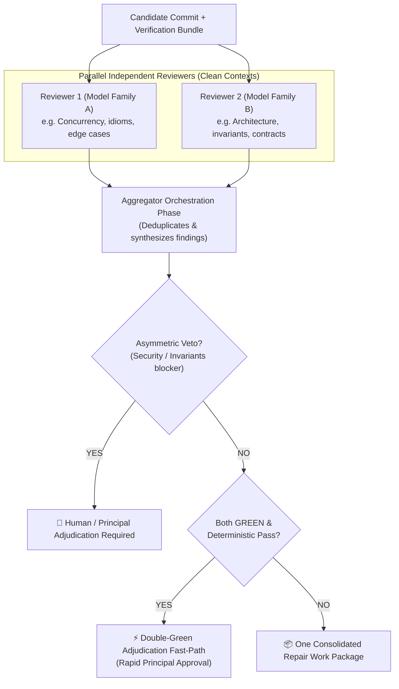

# ADR-0019: Adaptive Context Architecture, Dynamic Review Lenses, and Living Work Packages

- **Status:** Accepted
- **Date:** 2026-09-25 (Amended 2026-09-26)
- **Decision owner:** Principal / Human
- **Supersedes:** none
- **Superseded by:** none
- **Related invariants:** DCI-001, DCI-005, DCI-008, DCI-009, DCI-020, DCI-021, DCI-040, DCI-045, DCI-049, DCI-050, DCI-055, DCI-060, DCI-070, DCI-074, DCI-090, DCI-091, DCI-108
- **Related tasks:** WP-M3B (1–8 empirical review baseline), M3C, M3D, M4, M7

---

## Context

During the implementation and closure of Milestone M3B (tracked across PR #10, encompassing WP-M3B-1 through WP-M3B-8), the development of DevCadence was driven through an external, manual simulation of the control plane (`AGENT_HANDOFF_PROTOCOL.md`).

This empirical campaign yielded critical findings regarding how frontier and local models behave under work-package delegation, multi-turn tool interaction, and independent review:

1. **The "Chat Trap"**: When engineering agents run in conversational loops, prompt context grows monotonically with every tool call, compiler error, and bash output. By turn 20, a prompt exceeds 100k–150k tokens. Every subsequent turn re-processes this bloated history. This causes:
   - Severe quadratic token and compute waste;
   - Prompt fatigue and attention dilution (models miss subtle instructions amidst 100k tokens of dead transcripts);
   - Sunk-cost confirmation bias (models anchor on their own earlier guesses and defend them rather than checking ground truth).
2. **The "Frozen" Trap**: Early process rules stated that accepted Work Packages were "frozen". In practice, when implementing WP-5 or WP-8, reality revealed that an interface or decision made in WP-2 was clunky or lacked essential parameters. Under dogmatic freezing, models are forced to write awkward shims, wrappers, and workarounds to avoid touching upstream packages, causing rapid architectural rot.
3. **The Artificial Turn-Limit Trap**: Attempting to prevent runaway agent loops by telling the model *"You have a budget of N turns"* induces "budget anxiety": models rush, skip essential verifications, and hallucinate conclusions when running low on turns.
4. **The Lossy Distillation Trap**: Attempting to save tokens by asking models to summarize or distill source code into prose strips away exact types, error contracts, edge-case comments, and off-by-one checks, injecting hallucinations into downstream reasoning.
5. **The Power of Clean-Context Independent Review**: Conversely, spawning an independent reviewer in a fresh, clean session (containing only the EWP, diff, and deterministic test results) consistently caught deep bugs that the authoring agent was blind to (e.g. tautological test fixtures, character-device TTY quirks, and missing readiness mappings). When a reviewer ran mutation testing (temporarily disabling a diagnostic to verify the test failed), it provided ironclad correctness proof.

This decision formalizes the mechanisms needed to internalize these empirical discoveries into the native DevCadence control plane while strictly preserving epistemic boundaries, protocol integrity, and human governance.

---

## Facts, Observed Characteristics, and Working Hypotheses

DevCadence strictly distinguishes observed facts from empirical hypotheses (AGENTS.md §4, DCI-005):

### Observed Provider Characteristics

1. **Transformer Statelessness & Caching Mechanics**: In standard autoregressive transformer architectures, prompt tokens must be processed on each forward pass. Modern frontier providers (Anthropic, Google Gemini, OpenAI) offer prompt prefix caching that provides 50% to 90% latency and cost discounts when prompts reuse an identical, static prefix exceeding cache thresholds (typically 1,024–2,048 tokens). Modifying tokens within the prefix invalidates the cache downstream of the modification; appending strictly to the end preserves cache hits.
2. **Endpoint Controllability Differences**: Direct API endpoints (`LocalityRemoteAPI`) and local model runtimes (`LocalityLocal`) permit precise, deterministic control over prompt layout, prefix placement, and cache management. Authenticated coding CLIs (`LocalityAuthenticatedCLI`) operate with proprietary, provider-managed session compaction, caching, and resumption policies that are largely opaque to external callers.

### Working Empirical Hypotheses

1. **Context Length Degradation Boundary**: Monolithic conversational debris exceeding 30k–50k tokens significantly increases reasoning degradation, instruction non-compliance, and hallucination rates in both frontier and local models compared to focused, prefix-cached context.
2. **Provider Cognitive Diversity**: Different model families exhibit complementary cognitive blind spots and proficiencies across programming idioms, concurrency, type invariants, and boundary checks.

### Milestone M4 Validation Targets

In Milestone M4 (The Early Hypothesis Gate), DevCadence will empirically benchmark these hypotheses across seeded defect suites, measuring whether structured context architectures preserve quality while reducing total token volume and cost compared to standard conversational baselines.

---

## Assumptions

1. Direct APIs (`LocalityRemoteAPI`) allow fine-grained control over prompt construction and prefix caching.
2. Local models (`LocalityLocal`) on Apple Silicon or Linux GPUs benefit drastically from tight working-memory bounds (staying under 12k tokens).
3. Authenticated coding CLIs (`LocalityAuthenticatedCLI`) can be spawned in scoped, ephemeral sessions for specific attempts or reviews, even when exact token layouts cannot be commanded directly.

---

## Decision criteria

- **Correctness over Ceremony**: The process must increase software quality, not create bureaucratic overhead.
- **Cognitive Freedom with Deterministic Boundaries**: Models must have freedom to inspect code until certain without turn-limit panic, bounded by silent outer control-plane metering.
- **Verbatim Grounding & Active Falsification**: Models inspect exact untranslated code and can run deterministic mutation probes rather than passive guesses.
- **Adaptive Context Efficiency**: Maximize KV prefix caching and eliminate conversational debris across heterogeneous endpoints.
- **Anti-Rot (Living Architecture)**: Implementers must be able to challenge and refactor upstream baselines cleanly via typed challenge protocols.
- **Preserved Human Governance**: Fast-track adjudication must never bypass human authority or deterministic closure criteria.

---

## Decision

DevCadence adopts the **Adaptive Context Architecture, Dynamic Review Lenses, and Living Work Packages**, structured across six core mechanisms:

### 1. Adaptive Context Architecture (Protected Core, Cognitive State Capsule, and Leased Evidence Working Set)

Rather than treating "non-conversational cognition" as an absolute rule that causes reasoning amnesia or ignores endpoint differences, DevCadence structures model context into four explicit architectural layers:

```text
┌────────────────────────────────────────────────────────┐
│  LAYER 1: PROTECTED CORE (Static Prefix / KV Cache)    │
│  - System role & durable invariants                    │
│  - Engineering Work Package (EWP) specification        │
│  - Candidate Git Diff                                  │
│  - Deterministic test exit codes & verification bundle  │
├────────────────────────────────────────────────────────┤
│  LAYER 2: COGNITIVE STATE CAPSULE                      │
│  - Derived hypotheses, active TODOs, decisions,        │
│    unresolved questions, and evidence references       │
├────────────────────────────────────────────────────────┤
│  LAYER 3: EVIDENCE WORKING SET (Leased Snippet Pool)   │
│  - [Snippet #1: internal/setup/doctor.go#L815-L835]    │
│    (verbatim lines, content-addressed, freshness-check)│
│  - [Snippet #2: internal/protocol/doctor.go#L165-L185] │
├────────────────────────────────────────────────────────┤
│  LAYER 4: SHORT EPHEMERAL TAIL (Driver-local)          │
│  - Immediate prior tool execution / response exchange  │
│    (discarded across task boundaries, never canonical) │
└────────────────────────────────────────────────────────┘
```

1. **Layer 1: Protected Core (Static Prefix)**:
   - Immutable across an attempt or review. Placed strictly at the prompt head to maximize prefix KV-cache reuse.
   - Contains verbatim task EWP, candidate diff, invariants, and deterministic test outputs.
2. **Layer 2: Cognitive State Capsule**:
   - A compact, typed state structure maintained across turns containing derived hypotheses, TODOs, decisions, and unresolved questions.
   - Categorized as **derived cognition**, not ground truth. It maintains continuity across iterations without dragging raw conversation transcripts.
3. **Layer 3: Evidence Working Set (Leased Snippets)**:
   - Verbatim code snippets requested and released dynamically by the model.
   - **Content-Addressed Provenance**: Every snippet lease references `(file_path, content_digest, start_line, end_line)`.
   - **Freshness Invalidation**: If an underlying file is modified during implementation, dependent snippet leases are automatically marked stale and invalidated.
   - **Server-Side Authorization**: The control plane checks read authorization, blocking access to out-of-scope paths, secrets, or unbounded files.
4. **Layer 4: Short Ephemeral Tail**:
   - For execution drivers that benefit from local conversational continuity, the immediately preceding tool call/response may be retained locally in the driver turn and pruned thereafter.
5. **Endpoint Capability Mapping (M3C)**:
   Session drivers declare context capabilities:
   - `ContextControl = ExactStateless | AppendOnly | OpaqueSession`
   - `PrefixCache = Explicit | Implicit | SessionKV | None`
   Direct APIs and local models use exact stateless or append-only layouts; authenticated CLIs use scoped, ephemeral sessions.

### 2. Cognitive Freedom with Silent Multi-Dimensional Metering

- **No Artificial Turn Countdowns**: Prompts must **never** impose arbitrary turn limits (e.g. "you have 5 turns") on models. Turn countdowns induce budget anxiety, causing models to rush, skip verification, and guess.
- **Silent Outer Metering**: The control plane runtime monitors execution against silent outer budgets:
  - Cumulative input, cached, and output token ceilings;
  - Wall-clock execution limits per operation;
  - Cumulative tool-call limits;
  - Semantic loop detection (identifying oscillating edits or repeating identical failed tool invocations).
- **Graceful Suspension**: If an outer limit is reached, the runtime does not force the model to panic; it pauses execution with `PAUSED_BUDGET_EXCEEDED`, checkpoints the attempt, and escalates to the Principal/Human for disposition (DCI-045, DCI-049).

### 3. Bidirectional Work Packages: Living Baselines & `RefactoringProposal`

- **Stable, Not Frozen**: An accepted Work Package is a stable baseline for dependent work, not an immutable dogma. Freezing is strictly scoped *within an active attempt* to prevent local workers from wandering off-task.
- **Bottom-Up Challenge Protocol**: When an implementer discovers an upstream interface is clunky, incomplete, or flawed, it is forbidden from writing hacky workarounds or shims.
- Instead, the worker emits a typed `RefactoringProposal` (`proposal_id`, `source_work_package_id`, `target_work_package_id`, `architectural_tension`, `contradiction_evidence`, `proposed_interface`, `affected_callers`, `reversibility_assessment`).
- The Principal (or human) adjudicates the proposal. If accepted, an atomic upstream refactor is applied cleanly, regression tests run, and the codebase remains unified.

### 4. Dynamic Cognitive Review Lenses and Active Falsification

Review is multi-dimensional cognitive analysis, not a mechanical syntax linter. DevCadence routes candidates through targeted review lenses while preserving a stable, closed `ReviewDimension` taxonomy (`correctness`, `architecture`, `invariants`, `security`, `test_adequacy`, `concurrency`, `performance`, `maintainability`, `other`).

1. **Anti-Rabbit Hole Lens (YAGNI & Simplicity)**:
   - Scrutinizes code for over-engineering, speculative future-proofing, and paranoid defensive bloat.
   - Demands the simplest implementation that satisfies the contract.
2. **Anti-Drift Lens (Scope Discipline)**:
   - Verifies that no files outside the declared work package were touched without authorization.
   - Flags unsolicited style tweaks, drive-by refactorings, and unauthorized new dependencies.
3. **Anti-Hallucination Lens (Grounding & Verification)**:
   - Mechanically verifies that cited symbols, functions, and CLI flags exist.
   - Validates that test assertions actually exercise the code paths under review rather than passing via tautological mocks.
4. **Active Falsification (`FalsificationProbe` / Bounded Mutation Testing)**:
   - Reviewers can formulate targeted falsification probes (e.g., "temporarily disable this error check or branch; verify the test suite fails").
   - Deterministic machinery executes the probe in an isolated worktree and returns hard evidence, converting reviewer suspicion into empirical proof.

### 5. Dual Independent Review with Adjudication Fast-Path and Asymmetric Veto

For systemic, security-sensitive, or high-risk candidates:



- **Adjudication Fast-Path ("Double-Green")**: If both independent reviewers return `PASS` with zero blocking findings, and all deterministic validation checks pass, the Principal receives an instant green card allowing immediate, frictionless closure. Double-Green is an **adjudication fast-path**, not an unmoderated bypass of human/principal authority (DCI-009) or deterministic closure prerequisites (`closure-decision.schema.json`).
- **Asymmetric Veto**: If any reviewer raises a `BLOCKING` finding in `security` or `invariants`, an Aggregator model **cannot** discard or override it. It can only be dismissed by explicit human disposition or deterministic falsification proof.
- **Orchestration Step, Not New Durable Table**: Aggregation is an orchestration phase within `ReviewCampaign`. It synthesizes multiple `ReviewResult`s, produces standard `FindingDisposition`s, and advances the campaign toward closure or one consolidated `RepairWorkPackage`.

### 6. Milestone Retrospective & Repository Reconciliation

At every milestone boundary, before transitioning to the next milestone:
1. Conduct an explicit **Milestone Retrospective** documented as a structured versioned Markdown artifact (e.g. `docs/retrospectives/M3B.md`):
   - What succeeded (patterns and abstractions to promote);
   - What failed or created friction (anti-patterns, tautological tests, premature status claims);
   - Upstream technical debt identification.
2. **Repository Reconciliation**:
   - Prune temporary session handoff artifacts (e.g. `HANDOFF.md`);
   - Ensure all EWPs, ADRs, and canonical documentation reflect final as-built reality.
3. **Lesson Promotion**:
   - Emits standard `LessonCandidate` records (`schemas/lesson-candidate.schema.json`) and `DecisionRecord` amendments for durable promotion.

---

## Consequences

### Positive
- **Drastic Token and Cost Efficiency**: Replacing monotonic chat growth with prefix caching and leased snippets cuts token processing by 70% to 90%.
- **Cognitive Freedom**: Models reason thoroughly without budget-induced turn anxiety, while outer runtime meters guarantee bounded resource consumption.
- **Anti-Rot (Living Architecture)**: The `RefactoringProposal` protocol eliminates hacky workarounds and keeps upstream interfaces clean.
- **Empirical Grounding**: Active falsification probes convert subjective review debates into deterministic test evidence.
- **Clean Review Independence**: Independent reviewers start from clean contexts without author transcript bias.
- **Governed Fast-Path**: Double-Green accelerates obvious approvals while Asymmetric Veto guarantees security and invariant issues cannot be silently dismissed.

### Negative
- The control plane must manage snippet leasing, digest validation, and cache boundaries rather than delegating entirely to an off-the-shelf chatbot CLI.
- Dual review dispatch requires coordinating multiple endpoints and orchestrating synthesis.

### New risks
- **Stale Snippet References**: Code changes can invalidate snippet line numbers (mitigated by content-addressing and automatic digest invalidation).
- **State Capsule Drift**: Summarized hypotheses could drift from reality (mitigated by requiring evidence refs on all capsule claims).

---

## Implementation guidance & Milestone Alignment

1. **Milestone M3C (Session Substrate & Context Capabilities)**:
   - Define provider-neutral context capabilities: `ContextControl = ExactStateless | AppendOnly | OpaqueSession` and `PrefixCache = Explicit | Implicit | SessionKV | None`.
   - Implement the `Evidence Working Set` lease manager with content-addressed checks and path authorization.
   - Define `RefactoringProposal` in Go and JSON Schema (`internal/protocol/` and `schemas/`) so implementers can challenge baselines during M3C and M3D.
2. **Milestone M4 (Hypothesis & Benchmark Gate)**:
   - Benchmark the Context Architecture against standard conversational agent baselines across frontier APIs, authenticated CLIs, and local models.
   - Measure: input/cached/output tokens, defect catch rate, interaction tax, wall-clock time, cost, and stale-evidence rates.
   - Sweep active working-set budgets empirically (e.g. 6k, 12k, 24k) rather than treating arbitrary limits as dogma.
3. **Milestone M7 (Multi-Review Campaigns & Aggregator Synthesis)**:
   - Deliver parallel dual-reviewer fan-out with clean starting contexts.
   - Implement review lenses and active falsification probe execution.
   - Implement Aggregator synthesis into `FindingDisposition`s with Asymmetric Veto and Double-Green adjudication fast-path.

---

## Verification plan

1. In Milestone M4 (Early Hypothesis Gate), benchmark this adaptive context and multi-lens review architecture against standard conversational baselines across identical task sets, measuring:
   - Total tokens consumed (input, cached, output);
   - Number of undetected defects and regressions;
   - Time-to-convergence and cost.
2. Validate that local models (MLX-LM / Ollama) can successfully review and patch multi-package code within a bounded working-memory envelope.
3. Verify that Asymmetric Veto fails closed whenever a security or invariant blocker is raised, requiring human disposition or empirical falsification.
