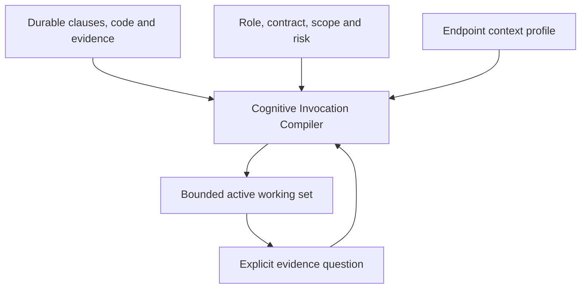
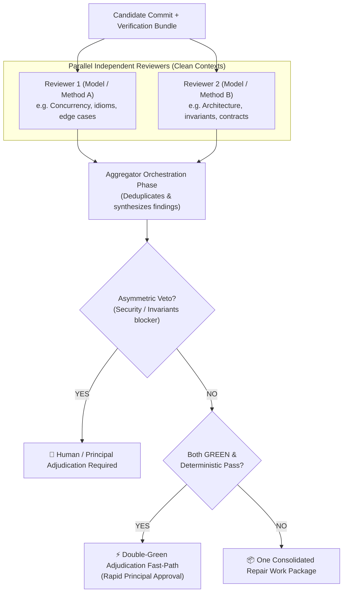

# ADR-0019: Adaptive Context Architecture, Dynamic Review Lenses, and Living Work Packages

- **Status:** Accepted
- **Date:** 2026-09-25 (Amended 2026-09-26; Context Working-Set amendment 2026-09-30)
- **Decision owner:** Principal / Human
- **Supersedes:** none
- **Superseded by:** none
- **Related:** ADR-0016 (bounded tools/history compaction) and ADR-0020 (Cognitive Invocation Compiler, deterministic rule admission, prompt rendering, and durable review ledger). ADR-0019 owns the per-turn context-layer architecture; ADR-0020 owns how the control plane selects mandatory/optional material and projects those layers into role-specific invocations.
- **Related invariants:** DCI-018, DCI-019, DCI-129, DCI-001, DCI-005, DCI-008, DCI-009, DCI-020, DCI-021, DCI-040, DCI-045, DCI-049, DCI-050, DCI-055, DCI-060, DCI-070, DCI-074, DCI-090, DCI-091, DCI-108
- **Related tasks:** WP-M3B (1–8 empirical review baseline), M3C, M3D, M4, M7

---

## Context

During the implementation and closure of Milestone M3B (tracked across PR #10, encompassing WP-M3B-1 through WP-M3B-8), the development of DevCadence was driven through an external, manual simulation of the control plane (`AGENT_HANDOFF_PROTOCOL.md`).

This empirical campaign yielded critical findings regarding how frontier and local models behave under work-package delegation, multi-turn tool interaction, and independent review:

1. **The "Chat Trap"**: Without pruning, conversational prompts accumulate tool output and prior decisions. Cumulative submitted input can grow approximately quadratically in turn count when each turn adds a similar amount; actual compute and billed cost depend on KV/prefix reuse and driver behavior. Attention dilution and anchoring are engineering risks to test, not universal model laws.
2. **The "Frozen" Trap**: Early process rules stated that accepted Work Packages were "frozen". In practice, when implementing WP-5 or WP-8, reality revealed that an interface or decision made in WP-2 was clunky or lacked essential parameters. Under dogmatic freezing, models are forced to write awkward shims, wrappers, and workarounds to avoid touching upstream packages, causing rapid architectural rot.
3. **The Artificial Turn-Limit Trap**: Attempting to prevent runaway agent loops by telling the model *"You have a budget of N turns"* induces "budget anxiety": models rush, skip essential verifications, and hallucinate conclusions when running low on turns.
4. **The Lossy Distillation Trap**: Attempting to save tokens by asking models to summarize or distill source code into prose strips away exact types, error contracts, edge-case comments, and off-by-one checks, injecting hallucinations into downstream reasoning.
5. **The Power of Clean-Context Independent Review**: Conversely, spawning an independent reviewer in a fresh, clean session (containing only the EWP, diff, and deterministic test results) consistently caught deep bugs that the authoring agent was blind to (e.g. tautological test fixtures, character-device TTY quirks, and missing readiness mappings). When a reviewer ran mutation testing (temporarily disabling a diagnostic to verify the test failed), it provided direct evidence that the selected test detected the selected mutation, not proof of all behavior.

This decision formalizes the mechanisms needed to internalize these empirical discoveries into the native DevCadence control plane while strictly preserving epistemic boundaries, protocol integrity, and human governance.

---

## Facts, Observed Characteristics, and Working Hypotheses

DevCadence strictly distinguishes observed facts from empirical hypotheses (AGENTS.md §4, DCI-005):

### External evidence and endpoint characteristics

[Lost in the Middle](https://arxiv.org/abs/2307.03172) reports positional sensitivity on retrieval/QA tasks. [RULER](https://arxiv.org/abs/2404.06654) shows that simple needle retrieval does not establish reliable multi-hop or aggregation capability, and evaluates degradation as context grows. These studies motivate workload calibration; their tested models/tasks do not establish a universal threshold for today's coding endpoints.

[OpenAI prompt caching](https://developers.openai.com/api/docs/guides/prompt-caching) documents reuse of identical prompt prefixes. Our architectural inference is that caching reduces repeated processing/cost but does not remove cached tokens from the model's attention problem. Eligibility, accounting and retention are adapter/provider facts, not fixed constants in this ADR.

Economic cost, prefill/KV/decode resource cost and task accuracy are separate objectives. Runtime configuration, quantization, positional scaling, tool/schema overhead and task complexity can affect the useful envelope. A single declared maximum is insufficient evidence of reliable engineering performance. Driver controllability must be observed per access path; a local endpoint is not automatically controllable and a remote one is not automatically opaque.

### Working Empirical Hypotheses

1. **Effective Context Is Workload-Specific**: Removing irrelevant resident material may improve instruction compliance and engineering accuracy. Effective envelopes and useful prompt layouts must be measured per endpoint/configuration/workload; no universal 12k or 30k–50k failure boundary is assumed.
2. **Provider Cognitive Diversity**: Different model families exhibit complementary cognitive blind spots and proficiencies across programming idioms, concurrency, type invariants, and boundary checks.
3. **End-to-End Token Processing Reduction**: Replacing monotonic conversational transcripts with a 4-layer adaptive context architecture (Protected Core + Cognitive State Capsule + leased Evidence Working Set) may reduce cumulative submitted/processed token volume on long-horizon tasks while preserving quality. Neither a 70–90% saving nor unchanged defect yield is established; M4 must measure both.

### Milestone M4 Validation Targets

In Milestone M4 (The Early Hypothesis Gate), DevCadence will empirically benchmark these hypotheses across seeded defect suites, measuring whether structured context architectures preserve quality while reducing total token volume and cost compared to standard conversational baselines.

---

## Assumptions

1. Some endpoints allow exact prompt construction; the adapter must verify this and any caching capabilities.
2. A complete task contract can fit a conservative working set for some 20–30k local endpoints. This makes them first-class targets, not a guarantee of capability for every task/model.
3. CLI/session restart and checkpoint behavior can constrain accumulation where supported; opaque state requires honest unknown accounting and may make an endpoint ineligible for a strict-bound policy.

---

## Decision criteria

- **Correctness over Ceremony**: The process must increase software quality, not create bureaucratic overhead.
- **Cognitive Freedom with Deterministic Boundaries**: Models must have freedom to inspect code until certain without turn-limit panic, bounded by silent outer control-plane metering.
- **Verbatim Grounding & Active Falsification**: Models inspect exact untranslated code and can run deterministic mutation probes rather than passive guesses.
- **Adaptive Context Efficiency**: Maximize KV prefix caching and eliminate conversational debris across heterogeneous endpoints.
- **Anti-Rot (Living Architecture)**: Implementers must be able to challenge and refactor upstream baselines cleanly via typed challenge protocols.
- **Preserved Human Governance**: Fast-track adjudication must never bypass human authority or deterministic closure criteria.

---

## Decision

DevCadence adopts the **Adaptive Context Architecture, Dynamic Review Lenses, and Living Work Packages**, structured across six core mechanisms:

### 1. Adaptive Context Architecture: Context Working-Set Architecture

#### Context Working-Set Contract

**Immediate process versus future implementation:** DCI-018/019, bounded Execution Contracts, manual Context Manifests, progressive reads and independent review packets apply to new/amended work now. Typed resolver/profiles/packs, generated projections, automatic admission/linting/eviction and telemetry are **planned M3C**; workload calibration and quality/cost claims are **M4 evidence gates**. ADR-0016's existing tool bounding and history compaction compose with this architecture but do not implement all of it.

Repository docs, ADRs, invariants, source, tests and evidence are **durable model memory**. A prompt contains only its active working set. Normative authority determines conflict resolution, not default residency. Every substantial admitted object is contract-required, deterministically mapped or acquired for an explicit question.

```mermaid
flowchart TD
    Corpus["Durable clauses, code and evidence"]
    Intent["Role, contract, scope and risk"]
    Profile["Endpoint context profile"]
    Resolver["Cognitive Invocation Compiler"]
    Pack["Bounded active working set"]
    Question["Explicit evidence question"]
    Corpus --> Resolver
    Intent --> Resolver
    Profile --> Resolver
    Resolver --> Pack
    Pack --> Question
    Question --> Resolver
```

1. **Protected requirements:** small role/policy core, complete authoritative Execution Contract, base/candidate identity, exact applicable normative clauses and compact validation/diff manifests. Do not put the full EWP rationale, whole invariant file or raw logs in the protected prefix. Requirements are immutable within the attempt revision; revision changes require a rebuilt pack and affected-assumption revalidation. A large diff is leased, not silently omitted from review coverage.
2. **Cognitive State Capsule:** compact derived hypotheses, TODOs, decisions, open questions and evidence dependencies. It preserves continuity but cannot certify truth or replace exact code/requirements.
3. **Evidence Working Set:** verbatim revision/digest-pinned semantic clauses, code, diff hunks or logs with a question and lease lifecycle. Freshness invalidation also affects dependent state claims. Release is active eviction, not loss of durable provenance.
4. **Ephemeral tail and reserves:** immediate useful tool exchanges, the current question/action and explicit room for output/reasoning and upcoming bounded results. Count host/system/tool-schema overhead too. Admission checks the entire assembled invocation, not merely the visible EWP.

A model-friendly starting layout is a small stable role/core prefix, contract and exact clauses, evidence, derived state, then the current question/action. This is an adapter-tunable hypothesis, not a position law. Cache the stable prefix where supported, without keeping obsolete material or padding to meet a cache threshold.

#### Deterministic admission and adaptive investigation

The Principal compiles the task's architecture into its complete bounded Execution Contract. Every required MUST/MUST-NOT appears there verbatim or in a deterministically admitted exact normative clause. Rationale stays retrievable. Arbitrary EWP paragraph slicing is forbidden; if the complete contract cannot fit, split the task, route to an authorized capable endpoint or escalate.

A Context Resolver combines the manifest with versioned role/path/domain/risk mappings and the endpoint profile. **Normative applicability is deterministic, never embedding-ranked RAG.** Search or models may help propose references but cannot decide to exclude a required clause. Unknown mappings and missing/stale clauses are unresolved context and block the affected action.

Adaptive evidence follows DCI-014: index/search, symbol/signature, exact clause, focused snippet/hunk, larger section, full file and broader exploration where necessary. Semantic units include qualifying headings, dependencies and exceptions, not arbitrary lines stripped of meaning. Full reads are allowed with a specific justified question or systemic reconciliation and successful admission.

An expansion records question, requested references and reason. The resolver authorizes and measures the updated pack, evicts optional evidence if safe, and admits atomically or returns a cause. Default targets permit justified expansion; hard endpoint/policy ceilings and output reserve do not. Expansion never increases read/write/network/credential/spending authority. New domains/risk or proposed paths require re-resolution before modification and EWP amendment when write scope changes.

#### Endpoint-specific envelopes

`ContextProfile` distinguishes declared/runtime windows from empirically effective envelopes by workload: navigation, implementation, review and architectural reasoning need not have equal limits. Profiles include endpoint/runtime/model/quantization/configuration identity, calibration evidence, target/hard resident limits, reserves, accounting method/uncertainty and observed `ContextControl`/`PrefixCache`. Recalibrate after relevant configuration changes; unknown evidence is explicitly provisional.

For an uncalibrated 24–32k endpoint, an illustrative **initial** target is:

| Component | Provisional tokens |
| --- | ---: |
| Role/protected rules | 1–2k |
| Complete Execution Contract | 2–3k |
| Exact mandatory clauses | about 1k |
| Derived state | about 1k |
| Initial evidence | 3–5k |
| Total starting residency | about 8–12k |

These are tuning ranges, not mutually guaranteed allocations or invariant ceilings. Mandatory content and host/tool overhead may exceed them: decompose or select a capable endpoint rather than dropping constraints. The remaining runtime capacity is reserved explicitly. Larger frontier windows also have context/cost targets; capability is not an excuse for corpus preloading.

`ContextControl = ExactStateless | AppendOnly | OpaqueSession` and `PrefixCache = Explicit | Implicit | SessionKV | None` describe capabilities, not locality. Exact drivers rebuild/evict; append-only drivers checkpoint/restart when true eviction is required; opaque drivers constrain observable inputs and honestly report hidden-state uncertainty. Strict-bound policies reject endpoints whose required bounds cannot be demonstrated. Cumulative metering remains separate from resident admission.

#### Addressability, projections and enforcement

Budget **semantic units and assembled packs**, not total reference-file size. Existing heading anchors plus source revision/digest are valid transitional identifiers; new durable clause IDs need explicit ownership and uniqueness. Generated/linted role cards, invariant indexes and doc maps are compiled source projections. Reject drift, broken refs and missing mandatory context; never treat a one-line digest as the exact operative rule.

M3C linting checks role core, complete contract and assembled pack plus reserves; stable reference resolution; domain/risk mapping completeness; and projection freshness. It cannot prove from prose that no hidden requirement exists. Principal contract preparation and independent review remain necessary. Defer fuzzy duplication linting and automatic historical-document rewrites.

#### Alternatives and tradeoffs

| Approach | Advantage | Reason for rejection or restriction |
| --- | --- | --- |
| Full-corpus preload | Simple; broad exposure | Repeated cost, irrelevant attention load and small-model infeasibility; broad reads reserved for justified systemic work |
| One static mega-digest | Small repeated boot | Nuance loss, drift and no task-specific completeness guarantee |
| Pure semantic RAG | Flexible evidence retrieval | Probabilistic misses are unacceptable for MUST applicability; use for evidence discovery only |
| Universal 12k cap or role tiers | Easy enforcement | Effective context depends on endpoint/configuration/workload; use calibrated profiles and provisional defaults |
| One-turn doc review / three blockers | Low apparent cost | Suppresses investigation/defects rather than irrelevant context; use bounded iterations and coverage instead |
| Per-file reference limits | Easy lint | Confuses durable storage size with admitted semantic units; cap packs/contracts/projections |
| Dynamic arbitrary EWP slices | Cheap small inputs | Can drop cross-cutting requirements; use complete atomic contracts |
| Compiled mandatory admission plus leased evidence | Completeness and flexibility | Requires resolver/mapping/provenance machinery; validate incremental value in M4 |

The selected approach may underfeed models, overcomplicate orchestration or increase refetch/prefill costs. Mitigations are exact mandatory clauses, cheap question-driven expansion, profile calibration, reproducible evidence and a simpler baseline comparison. State capsules can drift; dependencies and revalidation reduce this risk without claiming elimination. Explicit resident and cumulative budgets bound resources while preserving investigation; no fixed count of reasoning turns or blockers establishes completion.

### 2. Cognitive Freedom with Silent Multi-Dimensional Metering

- **No Artificial Turn Countdowns**: Prompts must **never** impose arbitrary turn limits (e.g. "you have 5 turns") on models. Turn countdowns induce budget anxiety, causing models to rush, skip verification, and guess.
- **Silent Outer Metering**: The control plane runtime monitors execution against silent outer budgets:
  - Cumulative input, cached, and output token ceilings;
  - Wall-clock execution limits per operation;
  - Cumulative tool-call limits;
  - Semantic loop detection (identifying oscillating edits or repeating identical failed tool invocations).
- **Graceful Suspension**: If an outer limit is reached, the runtime does not force the model to panic; it pauses execution with `PAUSED_BUDGET_EXCEEDED`, checkpoints the attempt, and escalates to the Principal/Human for disposition (DCI-045, DCI-049).

### 3. Bidirectional Work Packages: Living Baselines & `RefactoringProposal`

- **Stable, Not Frozen**: An accepted Work Package is a stable baseline for dependent work, not an immutable dogma. Freezing is strictly scoped *within an active attempt* to prevent local workers from wandering off-task.
- **Bottom-Up Challenge Protocol**: When an implementer discovers an upstream interface is clunky, incomplete, or flawed, it is forbidden from writing hacky workarounds or shims.
- Instead, the worker emits a typed `RefactoringProposal` (`proposal_id`, `source_work_package_id`, `target_work_package_id`, `architectural_tension`, `contradiction_evidence`, `proposed_interface`, `affected_callers`, `reversibility_assessment`).
- The Principal (or human) adjudicates the proposal. If accepted, an atomic upstream refactor is applied cleanly, regression tests run, and the codebase remains unified.

### 4. Dynamic Cognitive Review Lenses and Active Falsification [Planned - M7]

Review is multi-dimensional cognitive analysis, not a mechanical syntax linter. DevCadence routes candidates through targeted review lenses while preserving a stable, closed `ReviewDimension` taxonomy (`correctness`, `architecture`, `invariants`, `security`, `test_adequacy`, `concurrency`, `performance`, `maintainability`, `other`).

DevCadence separates **immediate process guidance** from **future machine protocol**:
- **Effective-Now Process Guidance**: Human and manual model reviewers can apply these lenses today to guide qualitative focus across standard dimensions:
  1. **Anti-Rabbit Hole Lens (YAGNI & Simplicity)**:
     - Scrutinizes code for over-engineering, speculative future-proofing, and paranoid defensive bloat.
     - Demands the simplest implementation that satisfies the contract.
  2. **Anti-Drift Lens (Scope Discipline)**:
     - Verifies that no files outside the declared work package were touched without authorization.
     - Flags unsolicited style tweaks, drive-by refactorings, and unauthorized new dependencies.
  3. **Anti-Hallucination Lens (Grounding & Verification)**:
     - Mechanically verifies that cited symbols, functions, and CLI flags exist.
     - Validates that test assertions actually exercise the code paths under review rather than passing via tautological mocks.
  Manual reviewers can also perform manual falsification checks (e.g. verifying tests fail when an assertion is inverted).
- **Future M7 Machine Protocol**:
  In Milestone M7, review lens metadata will be attached to automated review invocations, and the control plane's deterministic validation machinery will execute structured **Active Falsification Probes** (`FalsificationProbe` / mutation testing) in isolated worktrees, returning hard evidence to convert reviewer suspicion into empirical proof.

### 5. Dual Independent Review with Adjudication Fast-Path and Asymmetric Veto

For systemic, security-sensitive, or high-risk candidates:

```mermaid
flowchart TD
    Candidate["Candidate Commit + Verification Bundle"]
    
    subgraph DualReview ["Parallel Independent Reviewers (Clean Contexts)"]
        R1["Reviewer 1 (Model / Method A)<br/>e.g. Concurrency, idioms, edge cases"]
        R2["Reviewer 2 (Model / Method B)<br/>e.g. Architecture, invariants, contracts"]
    end
    
    Candidate --> R1
    Candidate --> R2
    
    R1 --> Aggregator["Aggregator Orchestration Phase<br/>(Deduplicates & synthesizes findings)"]
    R2 --> Aggregator
    
    Aggregator --> Veto{"Asymmetric Veto?<br/>(Security / Invariants blocker)"}
    Veto -->|"YES"| HumanEsc["🚨 Human / Principal Adjudication Required"]
    Veto -->|"NO"| Gate{"Both GREEN &<br/>Deterministic Pass?"}
    
    Gate -->|"YES"| FastPath["⚡ Double-Green Adjudication Fast-Path<br/>(Rapid Principal Approval)"]
    Gate -->|"NO"| Repair["📦 One Consolidated Repair Work Package"]
```

- **Parallel Independent Review**: Two independent reviewer models evaluate the candidate commit in parallel, each starting from a clean context. Independence spans both **endpoint/model diversity** (e.g. distinct provider families) and **review-method diversity** (e.g. invariant/contract tracing vs. failure-first/mutation testing).
- **Adjudication Fast-Path ("Double-Green")**: If both independent reviewers return `PASS` with zero blocking findings, and all deterministic validation checks pass, the Principal receives an instant green card allowing immediate, frictionless closure. Double-Green is an **adjudication fast-path**, not an unmoderated bypass of human/principal authority (DCI-009) or deterministic closure prerequisites (`closure-decision.schema.json`).
- **Asymmetric Veto**: If any reviewer raises a `BLOCKING` finding in `security` or `invariants`, an Aggregator model **cannot** discard or override it. Deterministic falsification evidence may prove a finding *false or inapplicable* (e.g. demonstrating that a cited vulnerability path is unreachable or a claimed invariant conflict is refuted by code), but cannot waive or override a genuine invariant requirement. A real invariant conflict requires an explicit human/principal decision record, never an automatic reviewer dismissal.
- **Orchestration Step, Not New Durable Table**: Aggregation is an orchestration phase within `ReviewCampaign`. It synthesizes multiple `ReviewResult`s, produces standard `FindingDisposition`s, and advances the campaign toward closure or one consolidated `RepairWorkPackage`.

### 6. Milestone Retrospective & Repository Reconciliation

At every milestone boundary, before transitioning to the next milestone:
1. Conduct an explicit **Milestone Retrospective** documented as a structured versioned Markdown artifact (e.g. `docs/retrospectives/M3B.md`):
   - What succeeded (patterns and abstractions to promote);
   - What failed or created friction (anti-patterns, tautological tests, premature status claims);
   - Upstream technical debt identification.
2. **Repository Reconciliation**:
   - Prune temporary session handoff artifacts (e.g. `HANDOFF.md`);
   - Ensure all EWPs, ADRs, and canonical documentation reflect final as-built reality.
3. **Lesson Promotion**:
   - Emits standard `LessonCandidate` records (`schemas/lesson-candidate.schema.json`) and `DecisionRecord` amendments for durable promotion.

---

## Consequences

### Positive
- **Substantial Token and Cost Efficiency**: Reduced irrelevant residency and repeated input are hypotheses to measure alongside defect yield in M4, not guaranteed savings.
- **Cognitive Freedom**: Models reason thoroughly without budget-induced turn anxiety, while outer runtime meters guarantee bounded resource consumption.
- **Anti-Rot (Living Architecture)**: The `RefactoringProposal` protocol eliminates hacky workarounds and keeps upstream interfaces clean.
- **Empirical Grounding**: Active falsification probes convert subjective review debates into deterministic test evidence.
- **Clean Review Independence**: Independent reviewers start from clean contexts without author transcript bias.
- **Governed Fast-Path**: Double-Green accelerates obvious approvals while Asymmetric Veto guarantees security and invariant issues cannot be silently dismissed.

### Negative
- The control plane must manage snippet leasing, digest validation, and cache boundaries rather than delegating entirely to an off-the-shelf chatbot CLI.
- Dual review dispatch requires coordinating multiple endpoints and orchestrating synthesis.

### New risks
- **Stale Snippet References**: Code changes can invalidate snippet line numbers (mitigated by content-addressing and automatic digest invalidation).
- **State Capsule Drift**: Summarized hypotheses could drift from reality (mitigated by requiring evidence refs on all capsule claims).

---

## Implementation guidance & Milestone Alignment

1. **Milestone M3C (Session Substrate & Cognitive Invocation Compiler)**:
   - Define provider-neutral context capabilities: `ContextControl = ExactStateless | AppendOnly | OpaqueSession` and `PrefixCache = Explicit | Implicit | SessionKV | None`.
   - Implement deterministic Context Resolver/profiles/packs, clause mappings/projection freshness, complete-contract admission with reserves, typed `CONTEXT_UNFIT` and lease/expansion mediation; do not claim automatic completeness from lint alone.
   - Implement the `Evidence Working Set` lease manager with content-addressed checks and path authorization.
   - Define `RefactoringProposal` in Go and JSON Schema (`internal/protocol/` and `schemas/`) so implementers can challenge baselines during M3C and M3D.
2. **Milestone M4 (Hypothesis & Benchmark Gate)**:
   - Benchmark the Context Architecture against standard conversational agent baselines across frontier APIs, authenticated CLIs, and local models.
   - Measure initial/peak resident context and components, cumulative input/cached/output, reloaded evidence, expansions/restarts, defect yield, false positives, accepted quality, latency/cost and unknown/estimated accounting. Record the endpoint/configuration/workload and review coverage.
   - Sweep active working-set budgets empirically (e.g. 6k, 12k, 24k) rather than treating arbitrary limits as dogma.
3. **Milestone M7 (Multi-Review Campaigns & Aggregator Synthesis)**:
   - Deliver parallel dual-reviewer fan-out with clean starting contexts.
   - Implement review lenses and active falsification probe execution.
   - Implement Aggregator synthesis into `FindingDisposition`s with Asymmetric Veto and Double-Green adjudication fast-path.

---

## Verification plan

1. In Milestone M4 (Early Hypothesis Gate), benchmark this adaptive context and multi-lens review architecture against standard conversational baselines across identical task sets, measuring:
   - Total tokens consumed (input, cached, output);
   - Number of undetected defects and regressions;
   - Time-to-convergence and cost.
2. Validate that local models (MLX-LM / Ollama) can successfully review and patch multi-package code within a bounded working-memory envelope.
3. Verify that Asymmetric Veto fails closed whenever a security or invariant blocker is raised, requiring human disposition or empirical falsification.
